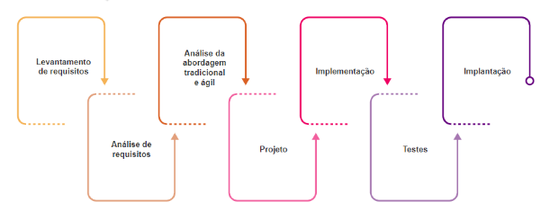

<h1>FASE 1 - DEVELOPMENT ENVIRONMENT</h1>
<h2>Capítulo 2: Mas como um Software é criado?</h2>

## Conceitos 💡:

1. `Software` é um subsistema de um sistema computacional. São os programas de computadores. Muitos entendem software como um programa de computador escrito numa linguagem específica, a fim de produzir a função e o desempenho esperados. É um conjunto composto de instruções de computador, estruturas de dados e documentos.

2. `Sistema` é um conjunto de informações e procedimentos que interagem entre si para que os objetivos sejam alcançados.

3. `Engenharia` é a arte das construções, com base no conhecimento científico e empírico. Arte adequada ao atendimento das  necessidades humanas”. Representa uma metodologia unida ao esforço para empreender resultados, e esses são provenientes de trabalhos focados em diversas áreas, nas quais se possui um amplo conhecimento, a fim de propor soluções às necessidades.

4. `Engenharia de software` envolve um conjunto de tarefas que se iniciam no momento que são registradas as necessidades das partes interessadas e terminam no momento que o software deixa de ser utilizado por seus usuários - é uma engenharia que se ocupa de todos os aspectos da produção de software.
Consiste num conjunto de métodos, ferramentas e procedimentos que têm por objetivo o desenvolvimento do software com qualidade, agregando valor ao seu empreendimento e atendendo às necessidades ou expectativas dos stakeholders. São aplicadas práticas existentes em algumas áreas da engenharia, como:
- Desenvolvimento de softwares com qualidade.
- Trabalho em equipe.
- Gerenciamento do processo de desenvolvimento.
- Custos e prazos admissíveis.

## Evolução do hardware e do software (contexto histórico):

1. Século XVII: calculadora que soma e subtrai, adicionadas operações de multiplicar e dividir à máquina.
2. Século XVIII: tear automatizado, no qual os cartões perfurados controlam o movimento da máquina.
3. 1834: Máquina Analítica, capaz de armazenar informações.
4. 1842: Ada Lovelace escreve instruções para a Máquina Analítica de Babbage, concebida para executar um conjunto de tarefas de cálculo.
5. 1847: George Boole sistematiza a lógica binária para armazenar informações.
6. 1849: balão austríaco, o mais antigo veículo aéreo não tripulado, antepassado dos drones!
7. 1890: primeiro computador mecânico.
8. 1924: International Business Machines Corporation (IBM), nos Estados Unidos.
9. 1938: primeiro computador elétrico usando a teoria binária.
10. 1943: primeira geração de computadores modernos, que utilizavam válvulas!
11. 1944: criação do Mark I, primeiro computador eletromecânico.
12. 1946: Electronic Numerical Integrator and Computer (Eniac), primeiro computador eletrônico, criado nos EUA.
13. 1947: criação do transistor, substituto da válvula, possibilitando a criação de máquinas mais rápidas!
14. 1957: primeiros modelos de computadores com transistor aparecem no mercado, e oferecem mais confiabilidade e velocidade que as válvulas!
15. 1958: é criado o chip, circuito integrado que permite a miniaturização dos equipamentos eletrônicos.
16. 1969: construção da Arpanet, rede de informação do Departamento de Defesa norte-americano que interliga universidades e empresas.**Mais tarde, a Arpanet dará origem à internet!**
17. 1974: a Intel projeta o **microprocessador 8080**, que origina os microcomputadores. Assim, softwares e sistemas se tornaram tão  importantes quanto o hardware!
18. 1975: fundação da Microsoft pelos norte-americanos Bill Gates e Paul Allen!
19. 1976: Apple I, primeiro microcomputador comercial, é lançado por Steve Jobs e Steve Wozniak.
20. 1981: a IBM lança seu microcomputador, o PC, com o sistema operacional MS-DOS elaborado pela Microsoft. O exército da África do Sul utiliza os drones israelenses em combate contra a Angola.
21. 1983: a IBM lança o PC-XT, com disco rígido! Já a Apple lança o Macintosh, o primeiro computador a utilizar ícones e mouse.
22. 1985: a Microsoft lança o Windows para o PC, que só alcança êxito com a versão 3.0, em 1990.
23. 1990: os computadores portáteis (laptops e palmtops) se popularizam.
24. 1992: smartphone torna-se um aparelho prioritário para muita gente. A IBM lança um dos primeiros aparelhos, o Simon.
25. 1996: a inteligência artificial ganha destaque ao estudar métodos de simular o pensamento humano nos computadores.
26. Fim do século 20: Instituto de Tecnologia de Massachusetts (MIT) produz o COG, protótipo de robô cujo sistema nervoso artificial é 64 vezes mais potente do que um Macintosh e simula as fases de crescimento do homem, seus pensamentos e sentimentos.
27. 2000: outros recursos são incluídos nos navegadores graças à evolução da internet, possibilitando desenvolvimento de vários sistemas web que oferecem serviços inovadores e são acessados por meio da internet.
28. 2007: lançado o primeiro iPhone.
29. 2008: HTC lança o G1 com o sistema Android (não é vendido no Brasil). A Samsung foi a primeira a trazer para o Brasil um celular com Android, o Galaxy.
30. 2012: estudantes da Singularity University, do Vale do Silício, criam o protótipo do robô Matternet, capaz de transportar medicamentos e alimentos para regiões de difícil acesso.
31. 2013: Amazon anuncia o seu plano de utilizar drones para enviar mercadorias aos compradores com o objetivo de fazer as entregas apenas meia hora após a ordem de compra.
32. 2016: Fórum Econômico Mundial, em Davos, cujo tema é a 4ª Revolução Industrial. Discute-se a forma de produzir e/ou consumir a informação digital e como se preparar para a era digital.
33. 2019: Google chega à supremacia quântica, lançando um computador quântico capaz de realizar em apenas alguns minutos cálculos que antes levariam anos.

## Tipos de software:

### Classificação:

Podem ser classificados quanto a:

- uso: 
    - sistema (Windows, Mac OS, Linux): controlam as principais funções de um computador.
    - aplicativo (Word, Excel, calculadora).
    - serviço (Google Docs, PDF Convertar): disponibilizados via internet.
    - gestão (SAP, TOTVS).

- licença:
    - livre/aberto: permite acesso e alterações no código, de modo gratuito, com colaboração.
    - proprietário: uso restrito, acesso pago e detalhes pertencem ao fabricante.

### Detalhando:

- `Software de Sistema`: conjunto de instruções que transforma o hardware num sistema com o qual o usuário pode interagir e fazer funcionar os seus programas, como MAC, Linux e Windows.
- `Software de Aplicativo`: programas que permitem aos usuários executar determinadas tarefas. Exemplos: Word, Paint, Excel e calculadora.
- `Software como Serviço`: um modelo de compartilhamento de software, no qual é liberado apenas o acesso ao serviço oferecido, licenciado para uso por meio da internet; não é vendido nem instalado localmente. Exemplos: Google Docs e PDF Converter.
- `Software de Gestão`: auxilia na gestão empresarial; tem como objetivo otimizar a rotina da empresa,fornecendo uma informatização inteligente dos processos, como controle financeiro, compras e estoque. Exemplo: ERP.
- `Software Livre`: está disponível e é distribuído livremente; pode ser executado, adaptado, modificado e redistribuído de acordo  com a necessidade de cada usuário. Ao redistribuir a nova versão, pode ser gratuito ou não.
- `Software Aberto`: código é acessível a qualquer pessoa; pode ser executado, modificado, estudado e distribuído gratuitamente. Sua filosofia é voltada para a colaboração entre usuários.
- `Software Proprietário`: pertence a um fabricante, que detém seus direitos de uso, edição e redistribuição. O usuário deve pagar por uma licença e só pode utilizar o software em um contexto restrito. Exemplo: Office, Photoshop e Winzip.

### Crise do software:

Desde o primeiro computador até os dias de hoje, as técnicas para o desenvolvimento de software têm evoluído a fim de suprir as necessidades das partes interessadas. É essencial compreender o que o cliente quer e quais são suas necessidades, antes de começar a desenvolver.

As falhas VÃO acontecer durante o processo de desenvolvimento de softwre, e destacam-se entre elas:

- falha de comunicação: cliente e equipe dev precisam se comunicar para mapear corretamente os requisitos.
- falta de apoio: gerência precisa atender as demandas do projeto, para que a entrega final seja feita como previsto.
- baixa colaboração: responsabilidade e engajamento são fatores de sucesso.
- envolvimento superficial: stakeholders são fontes importantes de informações/decisões.
- inexperiência: de um gerente de projeto pode resultar em escolhas que comprometerão prazos, custos e qualidade.
- falta de qualificação: conhecimento e domínio são fundamentais.

Podemos citar também como possíveis causas da crise do software: 

- alteração nos requisitos; 
- mudanças nas legislações, normas ou processos aos quais a empresa esteja subordinada;  
- metodologia de desenvolvimento.  

Um `requisito` representa uma característica do sistema ou a descrição de algo que o sistema deve executar para satisfazer as necessidades das partes interessadas.

## Origem da engenharia de software:

Em 2001,o Kent Beck e dezesseis outros desenvolvedores, produtores e consumidores de software, conhecidos como Aliança Ágil, assinaram o `Manifesto para o Desenvolvimento Ágil de Software`,cujo objetivo era apontar novas direções na execução de projetos. A base para a elaboração desse manifesto considera que os requisitos não são estáveis durante todo o projeto, e as mudanças ocorrerão em qualquer cenário, por isso as execuções sequenciais das fases de um projeto não são tão previsíveis como gostaríamos que fossem.

4 fundamentos básicos:
- Indivíduos e interações, em vez de processos e ferramentas.
- Software funcionando, em vez de documentação abrangente.
- Colaboração do cliente, em vez de negociação de contratos.
- Resposta às modificações, em vez de seguir um plano.

>Foco no time, cliente fazendo parte do projeto, entregas durante o ciclo do projeto e mudanças são bem-vindas em qualquer momento do projeto!

## Áreas de conhecimento da Engenharia de Software:

1. Requisitos de software: o Analista de Requisitos faz o mapeamento das necessidades do cliente.
2. Engenharia de software: o Arquiteto de Soluções define uma arquitetura para o software (antes da etapa de desenvolvimento).
3. Construção de software: Analistas de UX/UI e desenvolvedores realizam a construção do produto chamado "Software".
4. Teste de software: Analistas de Testes (QAs) atuam com técnicas e ferramentas em busca de falhas e defeitos.
5. Manutenção de software: Analistas de Requisitos, Arquitetos, Analistas de UX/UI, Desenvolvedores e Analistas de Testes atuam em correções e melhorias no software já implantado.
6. Gerência de configuração e mudança: os mesmos profissionais acima trabalham na integridade dos itens de configuração do projeto (especificações, códigos, planos de testes, etc).
7. Gerência de Engenharia de software: Gerentes de Sistemas e de Projetos conduzem atividades de gerenciamento para garantir organização e disciplina nas etapas do projeto.
8. Processo de Engenharia de software: o Analista de Processos determina os processos que envolvem artefatos, pessoas e recursos para garantir as entregas.
9. Ferramentas e métodos de Engenharia de software: Analistas de Requisitos, Arquitetos, Analistas de UX/UI, Desenvolvedores, Analistas de Testes e Gerentes utilizam ferramentas para execução de tarefas, orientando-se pela ordem indicada nos métodos.
10. Qualidade de software: Analistas de Testes e Analistas de Qualidade realizam verificações e validações durante todas as etapas do projeto, garantindo qualidade dos processos e do software entregue.

### Elementos fundamentais:

Independentemente da área de conhecimento, a engenharia de softwaretem elementos fundamentais, tais como: métodos, ferramentas e processos:

- `processos`: representam as ações realizadas, ou seja, a aplicação de métodos e ferramentas para se obter um resultado específico, e definemba sequência de métodos executados e quais ferramentas serão disponibilizadas.
- `métodos`: maneiras de fazer, quais roteiros serão seguidos. Ex: atividades de planejamento, levantamento de requisitos, design,  definição da arquitetura de software, execução dos testes, entre outros.
- `ferramentas`: meio automatizado para a realização das tarefas; permitemque as atividades sejam executadas de forma mais eficiente e eficaz. Exemplo: softwarede modelagem de dados ou softwares para implementação do software.

### Importante:

> Todo software é construído com base em um modelo de processo, também conhecido como `ciclo de vida`, que compreende um conjunto de etapas que envolvem métodos, ferramentas e procedimentos para a obtenção do produto ou serviço de software desejado.

No manifesto ágil, considera-se que os requisitos não são estáveis durante todo o projeto, que as mudanças vão ocorrer em qualquer cenário e que as execuções sequenciais das fases de um projeto não são tão previsíveis como gostaríamos que fossem! A base detodos os frameworks ágeis é composta de: ***foco no time, cliente fazendo parte do projeto, entregas durante o ciclo do projeto e mudanças bem-vindas em qualquer momento do projeto***!

 
<em>Ciclo de vida do processo de desenvolvimento de software.</em>

## Teste de Proficiência:

1. O principal fator que contribui para o fracasso no desenvolvimento de software são erros na fase de identificação dos problemas, conhecida como análise de requisitos. Como o Manifesto Ágil se relaciona com esse fator?
> A base para elaboração do Manifesto Ágil considera que os requisitos para desenvolvimento de software não são estáveis, corroborando estudos que indicam problemas nos requisitos como principal causa de fracassos.

2. Há vários tipos de software, desenvolvidos no contexto histórico da evolução do hardware e software. Indique a opção que contém exemplo de um software de sistema, um software como serviço e um software proprietário.
> Linux, Google Slides, Adobe Suite.

3. Softwares podem ser definidos como "programas de computador", escritos em uma linguagem específica a fim de produzir a função e desempenho esperados. O qe é engenharia de software?
> É um conjunto de métodos, ferramentas e procedimentos para desenvolvimento de software com objetivo de atender expectativas e necessidades dos stakeholders e entregar com qualidade.

[Voltar ao início!](https://github.com/monicaquintal/fintech)