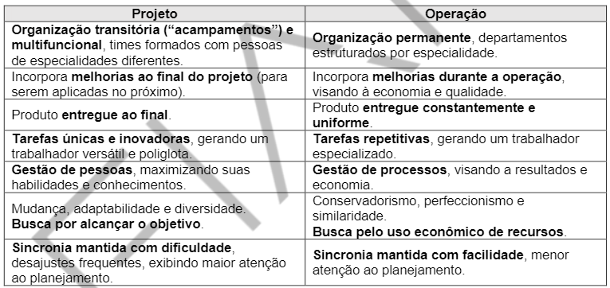
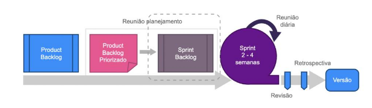
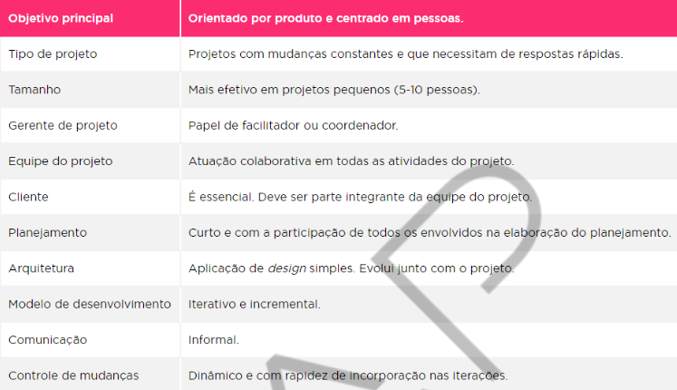

<h1>FASE 1 - DEVELOPMENT ENVIRONMENT</h1>
<h2>Capítulo 3: Por onde começamos?</h2>

## O que é um Projeto?

### Definição:

- É um empreendimento temporário com objetivo de criar um produto ou serviço exclusivo.

- É uma sequência de atividades únicas, complexas e conectadas entre si, com meta ou propósito conhecido que deverá ser completado em um tempo específico, dentro de um orçamento estabelecido e em conformidade com as especificações.

### Características:

- **Duração limitada**: deve ter começo, meio e fim definidos; seu meio pode sofrer mudanças e seu fim é previsto, e, como toda previsão, talvez não se torne realidade!

- **Exclusivo**: produto final deve ser diferente de similares.

- **Progressivamente elaborado**: “proceder por etapas” (incrementado ao longo do tempo).

- **Propósito e objetivos bem definidos**: deve ter  uma meta (produzir um produto/serviço exclusivo),   mas deve ter metas intermediárias ou pode ter objetivos secundários.

- **Interdependentes**: projetos interagem uns com os  outros, podendo ser uma parte de um projeto maior. Em outros casos, o produto terá um ciclo de vida em uma  linha de montagem, gerando diversas unidades, ou seja, o projeto acaba e se torna operação.

- **Conflito**: geralmente compartilham com outras áreas (operacionais) ou outros projetos, recursos (pessoas ou equipamentos) que nem sempre estarão  disponíveis no momento necessário. Além disso, o bem  mais precioso dos projetos são as pessoas, que têm defeitos, limitações e egos diferentes.

- **Sequência de atividades**: um número de atividades ou tarefas conectadas que devem ser completadas em certa ordem e que, ao final, atingem algum objetivo.

### Projetos versus operações:

Enquanto projetos criam um negócio, o objetivo das operações é mantê-lo funcionando da melhor forma possível!

O projeto gera um primeiro exemplar de um produto, geralmente chamado de protótipo, enquanto a operação gera o segundo exemplar em diante, ou seja, uma linha de montagem, tornando-os interdependentes.

 
<em>Diferenças entre projeto e operação.</em>

## Conceitos importantes:

### A) Partes interessadas (Stakeholders):

Partes interessadas são todas as pessoas afetadas pelo projeto, de forma positiva ou negativa (patrocinadores, proprietários, financiadores, governo, vizinhos, clientes, funcionários, fornecedores, incorporadores, gerentes, terceiros,entre outros).

### B) Gerenciamento de projetos:

Para que os projetos terminem no prazo estabelecido, de acordo com gastos previstos e contendo tudo que foi acertado, precisam ser  bem gerenciados; precisam de um bom planejamento e de uma execução bem controlada.

A `gerência de projetos` é constituída de uma série de ferramentas e técnicas utilizadas para descrever, organizar e monitorar o andamento das atividades do projeto. Seus benefícios incluem:

- Propósito bem definido e especificado.
- Escopo delineado com clareza.
- Controle independente, protegendo-o de flutuações operacionais.
- Medições mais fáceis.
- Alocações de recursos humanos mais flexíveis.
- Promove motivação e moral da equipe.
- Favorece a capacitação profissional dos recursos humanos.
- Facilita a discrição e a segurança (quando o projeto as requer).
- Mobilidade – projetos podem ser executados fora do ambiente da empresa.

## Gerente de projetos:

### Quem é?

Sua especialidade é a ***resolução de problemas***, viabilizando o projeto. Embora possa ter habilidades técnicas, não é um pré-requisito: ele contará com especialistas na equipe para quando a necessidade técnica surgir.

### Habilidades necessárias a um gerente de projetos:

- **Liderança**: enquanto gerentes buscam resultados e viabilização do projeto de acordo com as exigências, o líder expressa sua visão, busca o consenso quanto às metas estratégicas, direciona, inspira e motiva sua equipe.

- **Comunicação**: as formas oral e escrita de comunicação constituem o alicerce para um projeto bem-sucedido. Também deve assegurar  que as informações sejam explícitas, claras e completas em todas as atividades de comunicação do projeto.

- **Elaboração de orçamentos**: deve possuir conhecimentos básicos de finanças e contabilidade, pois precisa estabelecer (realizando estimativas de custos) e controlar o orçamento.

- **Planejamento**: importante para que o projeto saia no prazo, dentro do orçamento e de acordo com as especificações, deve-se  estabelecer como serão as atividades, e é essencial definir quem fará o que e quando!

- **Aptidões organizacionais**: manter a organização e fazer um bom gerenciamento de tempo.

- **Negociação e influência**: são necessárias competências de negociação para definição do escopo, orçamentos, alocação de negócios  compartilhados etc. É necessário conhecer muito bemas estruturas formais e informais de todas as organizações relacionadas ao projeto. Poder e política são técnicas usadas na influência.

- **Resolução de conflitos**: identificar sintomas de problemas, identificá-los e, quando necessário, tomar decisões e implementar soluções.

- **Formação e motivação de equipes**: o gerente de projeto define o espírito da equipe e a ajudará em tarefas da sua formação,  tornando-a funcional, além de ser reponsável pela motivação.

## Ativos de processos organizacionais:

Qualquer conhecimento, prática ou artefato de todas as organizações envolvidas que possam ser úteis para executar ou administrar o projeto (planos, processos, políticas, procedimentos e quaisquer bases de conhecimento).

### Categorias:

a) Processos e procedimentos:

- Padrões, políticas (de segurança, por exemplo), ciclos de vida padrão para os produtos ou projetos e políticas e procedimentos de qualidade, como auditorias de processos, listas de verificação, metas, entre outros.
- Diretrizes  padronizadas e critérios de medição de desempenho e de avaliação de propostas.
- Modelos, como de risco, EAP/WBS e diagrama de redes para cronogramas.
- Procedimentos de controles financeiros: relatórios de horas, análises de gastos, entre outros.
- Procedimentos de controle de mudanças de projeto.
- Diretrizes de encerramento de projeto: auditorias finais do projeto, avaliações, validações e critérios de aceitação de produto.

b) Base de conhecimento:

- Arquivos de projetos anteriores: linhas de base para escopo, custo, cronograma e qualidade, cronogramas de projeto e registro de riscos com suas ações de respostas planejadas.
- Bancos de dados de gerenciamento de configuração contendo as linhas de base de todos os padrões, políticas e procedimentos necessários para oficializar um projeto na empresa.
- Bases de conhecimento de informações históricas e lições aprendidas: bancos de dados de medição de processos que podem ser usados  para coletar e disponibilizar dados de medição de processos e produtos.
- Bancos de dados financeiros contendo informações, como: custos homem/hora, custos incorridos, orçamentos e outros dados financeiros.

## Fatores ambientais da empresa:

Condições pertinentes à empresa que influenciam ou restringem o projeto de alguma maneira. Alteram as opções de gerenciamento, influenciando de maneira positiva ou negativa, como:
- Cultura, estrutura e governança organizacional.
- Distribuições geográficas e infraestrutura das instalações da empresa.
- Normas governamentais ou do setor em questão.
- Recursos humanos existentes, com suas habilidades e conhecimentos.
- Administração de pessoal.
- Condições de mercado.
- Sistemas de autorização de trabalho da empresa.
- Clima político.
- Tolerância a risco das partes interessadas.
- Canais de comunicação estabelecidos.
- Bancos de dados comerciais que podem ser usados para estimativa de custos ou estudo de riscos.
- Sistema de informações do gerenciamento de projetos: software para cronograma, sistema de gerenciamento de configuração, coleta e distribuição de informações, como uma intranet etc.

## Processos de gerenciamento de projetos:

`Processo`: conjunto de atividades que, cumpridas na ordem apropriada, atingem um objetivo predefinido. Um projeto tem entradas (artefatos necessários à sua execução), técnicas e ferramentas que são aplicadas na execução e, como resultado, temos como saída os artefato(s) que era(m)o(s) seu(s) respectivo(s) objetivo(s)!

### Classificação:

- Processos de gerenciamento de projetos: focados em gerenciamento, utilizados para conduzir o projeto da maneira eficaz. Será o estudado em aula, pois são **considerados “boa prática”** (a aplicação desses processos pode aumentar as chances de sucesso de um projeto).
- Processos orientados a produtos: definidos pelo ciclo de vida do projeto, variando de acordo com a área de aplicação.

### Grupos de processos de gerenciamento de projeto:

Os processos de gerenciamento de projetos são agrupados em cinco categorias:

- Grupos de processos de iniciação: devem ser executados na definição de um novo projeto.
- Grupos de processos de planejamento: processos necessários para definir o escopo do projeto, refinar os projetos e determinar as ações necessárias para atingir as metas.
- Grupos de processos de execução: necessários para executar o trabalho definido e satisfazer as especificações do projeto.
- Grupos de processos de monitoramento e controle: exigidos para acompanhar e controlar o progresso e o desempenho do projeto.
- Grupos de processos de encerramento: necessários para finalizar o projeto ou fase de projeto.

Raramente são distintos ou ocorrem uma única vez: tratam-se de atividades sobrepostas e podem ocorrer ao longo de todo o projeto.

Há, ainda, um `ciclo  PDCA` definido para o gerenciamento de projetos, que compreende os atos de Planejar (Plan), Fazer (Do), Verificar (Check) e Agir (Act), repetindo diversas vezes durante a execução, dependendo do ciclo de vida. O grupo de processos de monitoramento e controle permeia os projetos do início ao fim.

## Conceitos Ágeis Modernos:

Há quatro `princípios básicos`:

1. Torne as pessoas sensacionais: inclua as pessoas que usam, produzem, compram, vendem e financiam os produtos e serviços.
2. Faça da segurança um pré-requisito: preze a construção de um produto seguro (proteção do tempo, informações, saúde, reputação, relacionamentos e investimentos das pessoas.
3. Erre rápido e aprenda rápido: aprender com o erro e não tornar a repeti-lo. 
4. Entregue valor a todo instante: entregas parciais são um dos pilares da agilidade, e o produto deve ter valor para o cliente.

A `gestão ágil de projetos` surgiu com a criação dos processos ágeis de desenvolvimento de software. O principal ***objetivo*** é permitir o controle das atividades de construção que utilizam técnicas ágeis para gerar informações gerenciais sobre o andamento e a evolução do projeto!

Processos ágeis possuem ***três características principais***:
- Requisitos de um projeto ágil são instáveis por natureza. São incluídos e excluídos requisitos à medida que o projeto evolui,  adequando-o às necessidades imediatas.
- Há uma interposição das fases de projeto e de implementação fazendo com que a arquitetura e os requisitos técnicos sejam tratados à medida que são criados.
- As fases de desenvolvimento do projeto não são sequenciais como de costume - ocorrem de acordo com as condições do projeto!

***Duas técnicas se destacam para gestão de projetos ágeis***: definição da estratégia e a construção incremental do software,  contendo  as  funcionalidades e construídas com a qualidade esperada e o feedback constante do cliente em todas as etapas, proporcionando agilidade na resolução de pendências e na avaliação dos requisitos.

No mercado, destacam-se dois métodos de gestão de projetos ágeis: ***método Extreme Project Management (XPM)*** e ***SCRUM***, processo da indústria automobilística adaptado à construção de software.

## Gestão de projetos com SCRUM:

### O que é SCRUM?

- É um dos frameworks mais utilizados para projetos ágeis.
- Faz uso de um processo incremental e iterativo que produz partes do projeto de forma constante, contendo funções definidas e priorizadas pelo cliente, que faz o aceite de cada entrega produzida em períodos de 1 a 4 semanas (o padrão mais comum de mercado é 2 semanas).
- Fundamentado nas questões ágeis do cliente como parte da equipe, incrementos em período de tempo fixo e aberto às solicitações de mudanças, sendo adaptativo em relação ao ambiente e colaborativo com as partes interessadas.

### Valores:

Está fundamentado em cinco valores:
- Compromisso (em apoiar uns aos outros e buscar atingir os objetivos).
- Foco (em fazer o melhor possível para atingir as metas).
- Abertura (para falar e ouvir membros do time e stakeholders).
- Respeito (entre pessoas, reconhecendo que cada membro do time é capaz e independente).
- Coragem (para fazer a coisa certa e trabalhar em problemas difíceis).

> Para mais informações, acessar [este](www.scrum.org) ou [este](www.scrumalliance.org) links!

### Papéis:

- `Scrum Master (SM)`: líder do processo de gerenciamento de projetos, apoiando tanto gerentes de projeto quanto membros do time de desenvolvimento e áreas de desenvolvimento de produto. Pode incluir também a gestão de projetos e do time, porém este nem sempre é o caso. Suas funções básicas são: proteger relacionamento com o cliente, resolver problemas que ocorrem durante o projeto, manter a equipe focada na execução do sprint e garantir o uso correto das regras SCRUM.

- `Product Owner (PO)`: representa o cliente no projeto. Tem conhecimento e autonomia para decidir e validar os produtos produzidos,  conhecer as necessidades do cliente e convocar outros usuários para ajudar na definição dos requisitos.

- `Time`: pessoas que realizam a construção do software; deve ser multidisciplinar (têm todas as habilidades e permissões necessárias para desenvolver, testar e entregar um incremento de produto) e autogerenciada. São responsáveis por definir o prazo e as metas dos Sprints (as quais tem prazo fixo, acordado por todos do Scrum Team, o que inclui o SM, o PO e os desenvolvedores).

### Características do SCRUM:

 
<em>Processo de gestão com SCRUM.</em>

a. `Product backlog`:

- lista ordenada de necessidades (funcionais e não funcionais) de aprimoramento de produto.
- elaborada pelo Product Owner, que define o escopo inicial do projeto.
- não é um documento estático: é atualizado durante todo o processo de construção pelo PO para incluir mudanças que podem ocorrer no projeto.

b. `Reunião de Planejamento`:

- deve ser realizada no início de cada Sprint.
- objetivos:
    - priorizar o que será construído;
    - estimar o que pode ser realizado no Sprint;
    - detalhar as atividades que precisam ser executadas.
- todos os membros do projeto participam!

c. `Product backlog priorizado`:

- a partir do product backlog pelo PO, com a ajuda do Scrum Master.
- define a prioridade dos requisitos listados.
- é a base para o PO definir quais são as funcionalidades que farão parte dos Sprints.

d. `Sprint backlog`:

- a partir da lista priorizada de funcionalidades e da seleção daquelas que devem fazer parte do Sprint, a equipe deve realizar uma análise do que foi solicitado junto ao PO para estimar o que pode ser realizado no Sprint e definir quais são as atividades necessárias para construir o projeto.  
- com base nesse diálogo entre time e PO que serão definidos os objetivos do Sprint!

e. `Sprint`:

- fase de implementação das funcionalidades previstas no Sprint backlog.
- duração predeterminada de 1 a 4 semanas.
- não pdoe ser estendido ou encurtado.
- ao final, deve ter concluído todo o incremento de produto com qualidade.

f. `Reunião diária`:

- realizada diariamente pelo SM.
- duração máxima de 15 minutos.
- objetivos:
  - acompanhar atividades que estão sendo realizadas;
  - verificar se há problemas ou impedimentos.

g. Reunião de revisão (`Sprint review`):

- realizada após a conclusão de um Sprint.
- apresentar o resultado do trabalho ao PO e demais envolvidos, com o produto funcionando e realizando suas funções.
- ao final, os envolvidos podem fazer avaliação e definir se o incremento de produto será aceito.
- apontamentos de erros e melhorias devem ser inseridos no product backlog.

h. `Reunião de retrospectiva`:

- conduzida pelo Scrum Master.
- são discutidos pontos positivos e negativos durante a execução do Sprint.
- tem o objetivo de melhorar o desempenho dos próximos Sprints.

i. `Versão`:

- ao final do Sprint, o time deve ter produzido uma parte do produto capaz deser entregue, com alta qualidade, testada, completa e pronta. 
- o PO definirá se será uma versão isolada ou se aguardará a produção de novos Sprints para formar uma versão.

## Análise da abordagem tradicional e ágil

Método tradicional | Método ágil
--------------------|------------------------
Processo sequencial e dirigido à qualidade dos artefatos | Foco na rapidez de adequação às mudanças
Falta de flexibilidade em se adaptar à nova realidade | Capacidade de adequação às situações voláteis do ambiente (porém possui  informalidade implícita)

> Processos de gerenciamento ágeis envolvem uma série de quebras de paradigmas: equipe e cliente precisam ser treinados para haver uma melhor compreensão e efetividade.

 
<em>Características do gerenciamento ágil.</em>

## Análise comparativa: Gerenciamento Tradicional x Gerenciamento Ágil

PMBOK® (2012): guia de melhores práticas de gerenciamento de projetos. Os processos de gerenciamento de projetos são divididos em nove áreas de conhecimento que organizam a aplicação das técnicas e ferramentas necessárias: escopo, prazo, custo, qualidade, riscos, comunicação, recursos humanos, aquisição e integração.

Área do processo | Gerenciamento Tradicional | Gerenciamento Ágil
-----------------|---------------------------|-----------------------
Escopo | Bem definido nas fases iniciais, e definido por EAP (Estrutura analítica de projeto) | Escopo definido em alto nível e requisitos priorizados e definidos de forma iterativa; requer maior controle de gold plating
Tempo | Cronograma detalhado para realização de todo o projeto | Uso de controles (como Kanban) e entregas incrementais de 2-4 semanas
Custo | Monitoração das alterações para que não afete o custo | Requer maior controle considerando a rapidez nas alterações
Qualidade | Processos de verificação e validação e plano de testes | Programação em pares, testes incrementais
Riscos | Análise de riscos durante todo o ciclo de vida do projeto | Gestão de impedimentos no projeto
Comunicação | Documentado e formal | Implícita, interpessoal e colaborativa
RH | Papéis claros e bem definidos | Confiança nos membros e ambiente colaborativo
Aquisição | Controle por contrato e escopo bem definido e documentado | Presença do cliente, volatilidade de requisitos e pouca documentação
Integração | Plano de projeto detalhado e controle total pelo gerente | Plano do projeto evolutivo, gerente como facilitador
Partes envolvidas | Processo formal, controlado e atuação pontual | Fazem parte do projeto, interação constante!

Obs: gold plating é um termo que define a aceitação de solicitações do cliente sem análise ou processo formal, incorporadas ao projeto, sem custos e sem prazo adicional.

### Diferenças e similaridades entre abordagens:

1. Gestão do escopo:

a) Modelo tradicional:

- definição do escopo detalhado no início do projeto.
- toda informação levantada é detalhada na documentação.

b) Gerenciamento ágil:

- definir escopo em alto nível para entender o trabalho (visão de produto).
- requisitos priorizados.
- toda a equipe participa da definição, incluindo o cliente.
- há maior possibilidade de gold  plating, devido documentação mínima elaborada e pela interação próxima entre o cliente e a equipe (aumentar monitoração sobre novos requisitos a fim de evitá-lo).

2. Gestão de tempo:

a) Modelo tradicional:

- cronograma DETALHADO de todas as atividades.
- considerando o andamento do projeto, trata-se de uma projeção, estando sujeito à perda de prazo ou inseguranças.

b) Gerenciamento ágil:

- cronograma orientado ao produto.
- planejado de acordo com a prioridade funcional.
- iterações com duração de 1 a 4 semanas.

3. Gestão de custos:

a) Modelo tradicional:

- aterações são críticas e afetam todo o projeto.
- ênfase em controlar, monitorar e documentar essas mudanças.
- foco em controlar os custos contra o planejamento inicial.

b) Gerenciamento ágil:

- alterações são parte do projeto e incorporadas dentro da iteração mais apropriada e de comum acordo com o cliente.
- favorece a flexibilidade em atender ao cliente, porém o custo final pode sofrer grandes variações.

4. Gestão da qualidade:

Ambos os métodos consideram a qualidade essencial, e os padrões a serem seguidos devem ser estabelecidos no início do projeto. A diferença entre eles está na forma de garantir e controlar a qualidade (vide tabela acima).

5. Gestão de riscos:

A identificação, análise e respostas aos riscos do projeto são comuns às duas formas de gerenciamento de projetos.

Nos métodos ágeis, existe a atividade de tratamento e remoção de impedimentos que, de certa forma, pode ser comparada com a análise de riscos. O objetivo dessa remoção de impedimento é evitar que a equipe pare ou que fatores externos inflenciem nas atividades de desenvolvimento do software!

6. Gestão da comunicação:

Vide tabela; independe do método aplicado,decisões e assuntos críticos devem ser documentados e publicados a todos os envolvidos.

7. Gestão de Recursos Humanos:

As premiações e as comemorações pela realização de um projeto são fatores motivacionais comuns aos métodos tradicional e ágil.

8. Gestão da aquisição

9. Gestão da integração

10. Gestão das partes envolvidas:

Para as organizações conservadoras, existe ainda a possibilidade de mesclar as características de ambos os métodos, permitindo uma avaliação gradativa dos pontos fortes e das principais restrições das duas abordagens.

## FAST TEST

### 1. O framework SCRUM é um dos mais utilizados para projetos ágeis. Ele tem uma definição clara de papéis, cerimônias e artefatos. Selecione a alterntiva que descreve corretamente todas as responsabilidades do Product Owner.

> O Product Owner é o representante do cliente no projeto. É quem elabora o Product Backlog e o prioriza. Além disso, participa da definição do Sprint Backlog, da Sprint Review e decide se uma versão será lançada.

### 2. Existem muitas diferenças entre o gerenciamento tradicional e a gestão ágil. Selecione a alternativa que melhor descreve as diferenças entre esses métodos na área do processo de definição do escopo.

> No gerenciamento tradicional, o escopo é definido nas fases iniciais e formalizado por meio de EAP, enquanto na gestão ágil é definido em alto nível e detalhado tecnicamente à medida em que vai sendo priorizado.

### 3. Fatores ambientais são condições da empresa que influenciam ou restringem projetos de alguma maneira, aumentando ou diminuindo opções de gerenciamento. Selecione a alternativa que NÃO É um fator ambiental mas que pode impactar um projeto:

> Metodologia de gerenciamento de projetos, escolhida livremente pelo gerente de projetos.

### 4. De acordo com o PMBOK (2013), um projeto pode ser definido como um empreendimento temporário com o objetivo de criar um produto ou serviço exclusivo. Selecione a alternativa que exemplifica corretamente um projeto:

> Desenvolvimento de uma versão de um software que contém uma nova funcionalidade.

A análise de requisitos é uma fase do gerenciamento de projetos, e não corresponde a um projeto em si porque não cria um produto ou serviço. Apenas ajuda a habilitar que alguém crie o produto ou serviço no futuro.

### 5. A gestão ágil de projetos tem três características principais que a diferenciam da gestão de projetos tradicional. Selecione a alternativa que melhor descreve essas três características:

> Requisitos instáveis, permitindo ao cliente alterá-los à medida que o projeto evolui. Além disso, arquitetura e requisitos não são detalhados no início, mas definidos à medida que o projeto evolui. Assim, as fases do projeto não são necessariamente sequenciais.

### 6. Existem muitas diferenças entre o gerenciamento tradicional e a gestão ágil, porém há também áreas de processo nas quais ambos os métodos convergem. Selecione a alternativa que identifica quais são essas áreas de processo que convergem:

> Gestão de qualidade e de riscos são áreas nas quais as metodologias de gestão convergem. Apesar de haver diferenças nas formas de controle e gestão, elas obedecem aos mesmos princípios.

### 7. O framework SCRUM é um dos mais utilizados para projetos ágeis. Ele tem uma definição clara de papéis, cerimônias e artefatos. Selecione a alternativa que descreve corretamente todas as responsabilidades do Scrum Master:

> O Scrum Master é o líder do processo de gerenciamento de projetos, apoiando o time de desenvolvimento e PO em suas tarefas. Além disso, resolve problemas e conflitos e garante o uso das regras do SCRUM.

O Scrum Master é o faciltador entre a equipe e o cliente, ajudando a definir os processos em conjunto com o time, solucionando problemas e aplicando as regras do SCRUM. Dúvidas técnicas são de responsabilidade do próprio time.

### 8. O gerente de projetos é um profissional generalista, porém proficiente na resolução de problemas para viabilizar um projeto. Selecione a alternativa que descreve corretamente habilidades de um gerente de projetos:

> Viabilização de projeto de acordo com as exigências dos stakeholders, comunicando as ações necessárias a todos os envolvidos e solucionando conflitos por meio de negociação, influência e tomada de decisão.

[Voltar ao início!](https://github.com/monicaquintal/fintech)