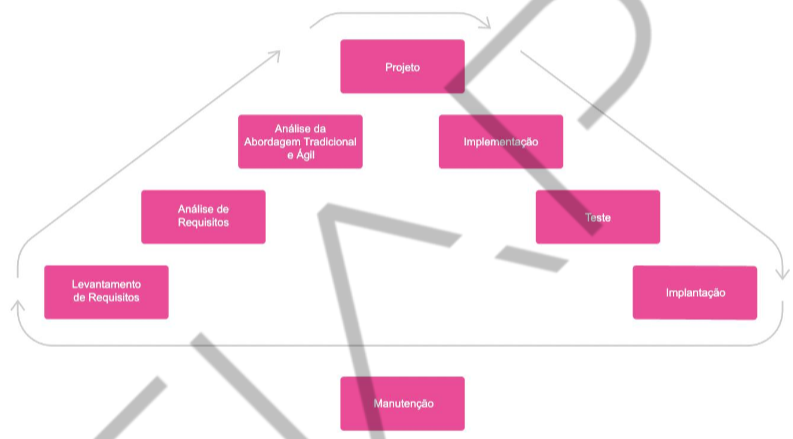

<h1>FASE 1 - DEVELOPMENT ENVIRONMENT</h1>
<h2>Capítulo 04: Primeiros passos na construção de um software.</h2>

## Conceitos:

### 1. Informação:

- conjunto de dados ou um dado, desde que seja contextualizado em determinada realidade.
- organizações executa tarefas com base em um fluxo de informação,através do qual definem o objetivo da área de negócio onde atuam.

### 2. Processo:

- conjunto de ações, etapas ou tarefas sequenciadas para atingir um determinado objetivo.
- outras definições:
  - ordenação específica das atividades de trabalho no tempo e no espaço, com um começo, um fim, inputs e outputs claramente identificados - uma estrutura para ação!
  - grupo de tarefas interligadas logicamente, que utilizam os recursos da organização para gerar resultados definidos, para apoiar os seus objetivos.
  - grupo de atividades realizadas numa sequência lógica para produzir um bem ou serviço que tem valor para um grupo específico de clientes.

> São os processos que recebem, transformam e geram as informações que vamos manipular no software que será desenvolvido.Além disso, o software é construído com base no processo de negócio, que representa a rotina da organização, conforme o fluxo deinformação da área de atuação.

### 3. Sistema de Informação:

<em>"Combinação de recursos humanos e computacionais que inter-relacionam coleta, armazenamento, recuperação, distribuição e uso de dados, visando à eficiência gerencial (planejamento, controle, comunicação e tomada de decisão) nas organizações. Pode também ajudar os gerentes e os usuários a analisar problemas, criar novos produtos e serviços e visualizar questões complexas".</em>

***A) Objetivo***: processar e organizar dados para gerar informação como conhecimento.

***B) Fluxo de SI***:
- input/entrada: captura dados para execução de um processamento.
- processo: ação de conversão dos dados em informações relevantes.
- output/saída: apresentação de resultado conforme objetivo proposto.

***C) Componentes do SI:***
- pessoas: manipulam informações dos processos.
- organizações/procedimentos: moldam SI conforme fluxo de informação.
- tecnologia: computadores e softwares.

***D) Classificação dos SI:***
- SI Operacional: transações rotineiras da organização.
- SI Gerencial: agrupam e sintetizam dados das operações para facilitar tomada de decisão pelos gestores.
- SI Estratégicos: integram e sintetizam dados de fontes  internas e externas, com ferramentas de análise/comparação, simulação, etc para tomada de decisão da cúpula estratégica da organização.

## Processo de desenvolvimento de software:

***No início da computação:***
- ausência de metodologia, baseado na própria experiência.
- "Modelo Balbúrdia".
- informalidade, sem projeto ou documentação.
- SW entra em ciclos de duas fases: implementação e implantação.
- ajustes com urgência e sob estresse.
- baixa qualidade e confiabilidade.
- difícil manutenção.

***Portanto***, é necessário definir quais atividades deverão ser executadas ao longo do projeto, além de quando, como e quem as executará!

 
<em>Etapas do processo de desenvolvimento de software.</em>

> Não existe um processoque seja o melhor, e sim, o que melhor se aplica à situação de desenvolvimento!

## Atuação profissional:

Conceito de times multidisciplinares!

### 1. Time de desenvolvimento:

a) `Desenvolvedor back-end`: 
- trabalha na parte "de trás" da aplicação.
- codificação de grande parte das regras de negócio.
- normalmente atua pouco com a parte visual.
- domina linguagens de programação como java, c#, go, php, python, ruby, etc.

b) `Desenvolvedor front-end`:
- trabalha na parte "da frente" da aplicação.
- desenvolve as telas que vão interagir com o usuário.
- JS, Node, CSS, HTML.

c) `Desenvolvedor full-stack`:
- desempenha funções de front e back-end.
- difícil, considerando a quantidade de tecnologias a serem dominadas.

d) `Analista de Qualidade` (Quality Assurance - QA):
- responsável por realizar testes do SW.
- normalmente domina técnicas de teste unitário, aceitação, integração, carga etc.

e) `Scrum Master/Agile Master`:
- responsável pela cultura ágil no time e disseminar práticas do framework Scrum.
- atua como um líder do processo Scrum e facilitador.
- contribui para resolução de conflitos e remoção de impedimentos.
- Agile Master exerce mesmas atividades do Scrum Master, **a diferença é que também domina outras metodologias de desenvolvimento ágil**, como Kanban ou XP.

### 2. Além do time de desenvolvimento, temos:

`Product Owner` (Dono do Produto):
- decide recursos e funcionalidades do produto, e a prioridade de desenvolvimento.
- intersecção entre área de negócio e de desenvolvimento.

### 3. Profissionais compartilhados entre times:
(também podem fazer parte de um único time de desenvolvimento)

a) `Designer de User Interface (UI)` ou `User Experience (UX)`:
- focos:
  - na experiência do usuário (melhor usabilidade e interação que o software terá) **e** 
  - na interface do software (design que represente identidade visual da empresa e melhores padrões de design que o desenvolver front-end codificará).

b) `Analista de Segurança`:
- garante a segurança no projeto e na organização.
- cultura do DevSecOps.
- identifica, protege, detecta, responde e recupera pontos necessários sobre segurança.

c) `SysAdmin (Administrador de Sistemas)`:
- responsáveis por instalar, dar apoio e manter servidores e sistema da organização.
- função-chave para disseminação da cultura DevOps na empresa.

d) `Analista de Dados (AD)` / `Administrador de Banco de Dados (DBA)`:
- DBA: responsável por gerenciar,  instalar, configurar, atualizar e monitorar BD.
- AD: responsável por coletar, compilar, analisar e interpretar os dados do banco.
- ***DBA atua mais no nível de hardware e software; e o AD, no nível de dados e negócio***.

e) `Especilista`:
- ponto de referência por atuação, contribuindo para formação dos profissionais e resolução de demandas complexas ou que envolvam diversas áreas da organização.

### 4. Gestão da empresa:

a) `Coordenador` e `Gerente`:
- responsáveis por:
  - coordenar e gerenciar atividades das equipes de TI;
  - avaliar e identificar soluções tecnológicas para otimizar os processos;
  - planejar projetos de implantação de sistemas;
  - acompanhar necessidades do negócio  e dos clientes.
- com relação às pessoas:
  - realizar acompanhamento e evolução dos  profissionais;
  - manter a motivação; 
  - realizar feedbacks constantes e mentorias.
- a principal ideia é que o Coordenador consiga escalar o trabalho do Gerente. 
- dependendo da organização, o Gerente possui algumas funções a mais às quais o Coordenador pode não ter acesso.

# Etapas do processo de Desenvolvimento

## Levantamento de requisitos: