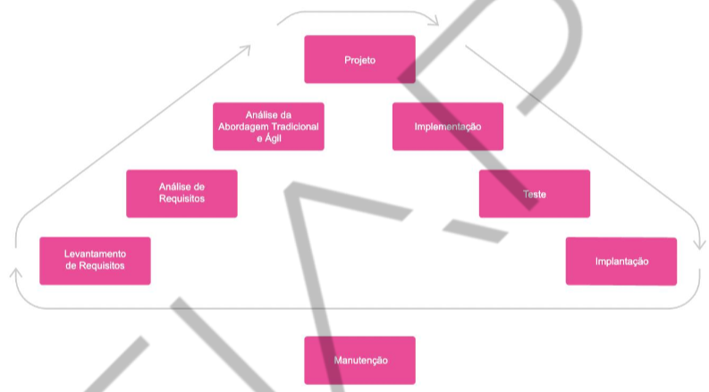
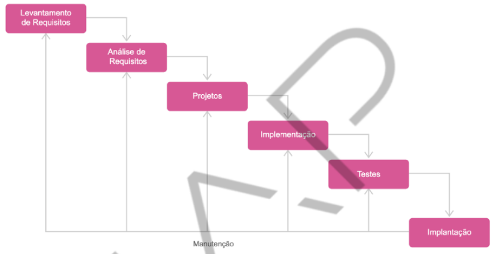
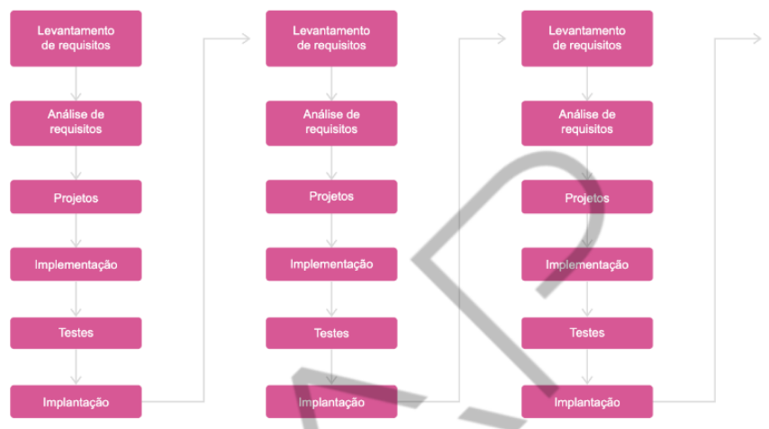
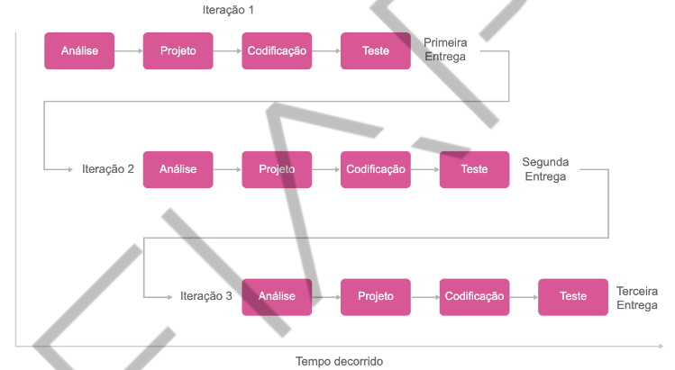
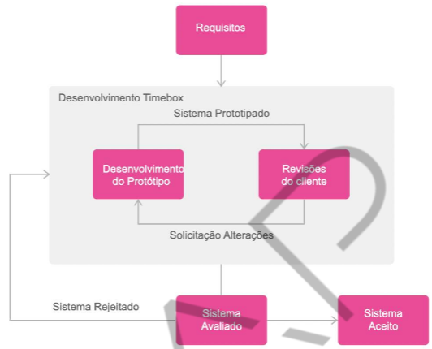

<h1>FASE 1 - DEVELOPMENT ENVIRONMENT</h1>
<h2>Capítulo 04: Primeiros passos na construção de um software.</h2>

## Conceitos:

### 1. Informação:

- conjunto de dados ou um dado, desde que seja contextualizado em determinada realidade.
- organizações executa tarefas com base em um fluxo de informação,através do qual definem o objetivo da área de negócio onde atuam.

### 2. Processo:

- conjunto de ações, etapas ou tarefas sequenciadas para atingir um determinado objetivo.
- outras definições:
  - ordenação específica das atividades de trabalho no tempo e no espaço, com um começo, um fim, inputs e outputs claramente identificados - uma estrutura para ação!
  - grupo de tarefas interligadas logicamente, que utilizam os recursos da organização para gerar resultados definidos, para apoiar os seus objetivos.
  - grupo de atividades realizadas numa sequência lógica para produzir um bem ou serviço que tem valor para um grupo específico de clientes.

> São os processos que recebem, transformam e geram as informações que vamos manipular no software que será desenvolvido.Além disso, o software é construído com base no processo de negócio, que representa a rotina da organização, conforme o fluxo deinformação da área de atuação.

### 3. Sistema de Informação:

<em>"Combinação de recursos humanos e computacionais que inter-relacionam coleta, armazenamento, recuperação, distribuição e uso de dados, visando à eficiência gerencial (planejamento, controle, comunicação e tomada de decisão) nas organizações. Pode também ajudar os gerentes e os usuários a analisar problemas, criar novos produtos e serviços e visualizar questões complexas".</em>

***A) Objetivo***: processar e organizar dados para gerar informação como conhecimento.

***B) Fluxo de SI***:
- input/entrada: captura dados para execução de um processamento.
- processo: ação de conversão dos dados em informações relevantes.
- output/saída: apresentação de resultado conforme objetivo proposto.

***C) Componentes do SI:***
- pessoas: manipulam informações dos processos.
- organizações/procedimentos: moldam SI conforme fluxo de informação.
- tecnologia: computadores e softwares.

***D) Classificação dos SI:***
- SI Operacional: transações rotineiras da organização.
- SI Gerencial: agrupam e sintetizam dados das operações para facilitar tomada de decisão pelos gestores.
- SI Estratégicos: integram e sintetizam dados de fontes  internas e externas, com ferramentas de análise/comparação, simulação, etc para tomada de decisão da cúpula estratégica da organização.

## Processo de desenvolvimento de software:

***No início da computação:***
- ausência de metodologia, baseado na própria experiência.
- "Modelo Balbúrdia".
- informalidade, sem projeto ou documentação.
- SW entra em ciclos de duas fases: implementação e implantação.
- ajustes com urgência e sob estresse.
- baixa qualidade e confiabilidade.
- difícil manutenção.

***Portanto***, é necessário definir quais atividades deverão ser executadas ao longo do projeto, além de quando, como e quem as executará!

 
<em>Etapas do processo de desenvolvimento de software.</em>

> Não existe um processoque seja o melhor, e sim, o que melhor se aplica à situação de desenvolvimento!

## Atuação profissional:

Conceito de times multidisciplinares!

### 1. Time de desenvolvimento:

a) `Desenvolvedor back-end`: 
- trabalha na parte "de trás" da aplicação.
- codificação de grande parte das regras de negócio.
- normalmente atua pouco com a parte visual.
- domina linguagens de programação como java, c#, go, php, python, ruby, etc.

b) `Desenvolvedor front-end`:
- trabalha na parte "da frente" da aplicação.
- desenvolve as telas que vão interagir com o usuário.
- JS, Node, CSS, HTML.

c) `Desenvolvedor full-stack`:
- desempenha funções de front e back-end.
- difícil, considerando a quantidade de tecnologias a serem dominadas.

d) `Analista de Qualidade` (Quality Assurance - QA):
- responsável por realizar testes do SW.
- normalmente domina técnicas de teste unitário, aceitação, integração, carga etc.

e) `Scrum Master/Agile Master`:
- responsável pela cultura ágil no time e disseminar práticas do framework Scrum.
- atua como um líder do processo Scrum e facilitador.
- contribui para resolução de conflitos e remoção de impedimentos.
- Agile Master exerce mesmas atividades do Scrum Master, **a diferença é que também domina outras metodologias de desenvolvimento ágil**, como Kanban ou XP.

### 2. Além do time de desenvolvimento, temos:

`Product Owner` (Dono do Produto):
- decide recursos e funcionalidades do produto, e a prioridade de desenvolvimento.
- intersecção entre área de negócio e de desenvolvimento.

### 3. Profissionais compartilhados entre times:
(também podem fazer parte de um único time de desenvolvimento)

a) `Designer de User Interface (UI)` ou `User Experience (UX)`:
- focos:
  - na experiência do usuário (melhor usabilidade e interação que o software terá) **e** 
  - na interface do software (design que represente identidade visual da empresa e melhores padrões de design que o desenvolver front-end codificará).

b) `Analista de Segurança`:
- garante a segurança no projeto e na organização.
- cultura do DevSecOps.
- identifica, protege, detecta, responde e recupera pontos necessários sobre segurança.

c) `SysAdmin (Administrador de Sistemas)`:
- responsáveis por instalar, dar apoio e manter servidores e sistema da organização.
- função-chave para disseminação da cultura DevOps na empresa.

d) `Analista de Dados (AD)` / `Administrador de Banco de Dados (DBA)`:
- DBA: responsável por gerenciar, instalar, configurar, atualizar e monitorar BD.
- AD: responsável por coletar, compilar, analisar e interpretar os dados do banco.
- ***DBA atua mais no nível de hardware e software; e o AD, no nível de dados e negócio***.

e) `Especilista`:
- ponto de referência por atuação, contribuindo para formação dos profissionais e resolução de demandas complexas ou que envolvam diversas áreas da organização.

### 4. Gestão da empresa:

a) `Coordenador` e `Gerente`:
- responsáveis por:
  - coordenar e gerenciar atividades das equipes de TI;
  - avaliar e identificar soluções tecnológicas para otimizar os processos;
  - planejar projetos de implantação de sistemas;
  - acompanhar necessidades do negócio e dos clientes.
- com relação às pessoas:
  - realizar acompanhamento e evolução dos profissionais;
  - manter a motivação; 
  - realizar feedbacks constantes e mentorias.
- a principal ideia é que o Coordenador consiga escalar o trabalho do Gerente. 
- dependendo da organização, o Gerente possui algumas funções a mais às quais o Coordenador pode não ter acesso.

# Etapas do processo de Desenvolvimento

## Levantamento de requisitos:

- levantamento de dados, onde identificamos as **necessidades e/ou problemas dos usuários**.
- requer **clareza e objetividade** (pode causar maior prazo e custo e falta de credibilidade na equipe, caso algum entendimento seja diferente da necessidade).
- **fontes de informações**: documentação, usuários do sistema, stakeholders e especificações de sistemas.
- interação com os usuários e stakeholders ocorre através de entrevista, observações, brainstorming e workshop, podendo ser usados cenários e protótipos para auxiliar na obtenção de requisitos.
- **"Business value"**: analistas devem verificar o que pode agregar valor ao usuário/cliente no primeiro momento.

### Perfis de usuário:

1. `Estratégico`: visa à informação não estruturada, o entendimento do analista na visão de resultados.

2. `Tático`: informação é semi estruturada e visa ao resultado entre os níveis operacional e estratégico.

3. `Operacional`: conhece e executa as rotinas do processo de negócio.

> O usuário é chamado `Key-User`. Ele carrega conhecimento sobre o processo e as regras de negócio e desenvolve as atividades operacionais.

### Artefatos essenciais:
(que contribuem para o entendimento e os esclarecimentos do processo de negócio)

***A) Especificação de processo de negócio:***
- coletada com participação central do usuário.
- normalmente é realizada em processos de levantamento de dados (por analistas de negócios ou Product Owners).
- a partir de documentos e mapas de fluxo de processo sde negócio, podem surgir definições sobre a concepção e a rotina do processo.
- exemplo: diagrama de atividades da Linguagem de Modelagem Unificada (UML), e entendimento por meio de notação visual.
- `requisitos funcionais` representam as funcionalidades do sistema - é o resultado esperado para o usuário, o **principal artefato da fase de levantamento de requisitos!**

***B) Regras de negócio:***

- definem a estrutura e controlam a operação das empresas.
- representam procedimentos, restrições,normas, cláusulas, critérios, políticas, ou seja, “como” executar o processo de negócio.
- representam a relação da informação para a execução do processo de negócio e determina mas condições para que os fatos sejam válidos.
- estão relacionadas aos requisitos funcionais!
- a notação para definição de Regra de Negócio é `RN`, e requisito funcional, `RF`.

***C) Requisitos que definem as funcionalidades do sistema:***

- um Sistema de Gerenciamento de Regras de Negócios (BRMS) permite que políticas organizacionais e decisões operacionais associadas a essas políticas sejam implementadas, monitoradas e mantidas separadamente do código principal de um ap.
- BRMS possibilita definir e manter as decisões que orientam o comportamento de sistemas, reduzindo a quantidade de tempo e esforço necessários para atualizar os sistemas de produção e aumentar a capacidade da organização de responder às mudanças no ambiente de negócios!

## Análise

- pode ser subdividida em: análise de domínio (ou análise de negócio) e análise da aplicação.
- modela os objetos do mundo real como uma venda que possui um cliente, e o(s) produto(s), que são objetos de negócio, portanto de domínio.
- a modelagem das classes de domínio define a aderência do sistema em relação à necessidade do usuário.
- diagrama e documentação de casos de uso e diagrama de classe de domínio.
- a validação e a verificação dos modelos construídos asseguram que as necessidades do usuário sejam atendidas.
- nessa fase ocorrem as modelagens do sistema e do BD (a princípio devemos desenvolver a modelagem das classes e,posteriormente, a do banco de dado).

## Projeto

- na teoria, há duas atividades: projeto de arquitetura (de alto nível) e projeto detalhado (de baixo nível).
- um dos artefatos é o projeto de arquitetura que, na teoria, é desenvolvido pelo arquiteto de software (ou analista ou programador sênior).
- projeto da arquitetura visa distribuir as classes de objetos relacionados do sistema em subsistemas e componentes, distribuindo esses componentes pelos recursos de hardware disponíveis.
- outro artefato são as interfaces gráficas ou propriamente as telas do sistema!

## Implementação

- fase de desenvolvimento.
- traduz por meio de códigos de programação a modelagem do sistema.
- é o transporte da lógica de funcionamento do sistema para um código de programação.

## Testes

- garantirão qualidade do produto.
- objetivo é assegurar que o software cumpra com as especificações e atenda à necessidade e à realidade do usuário.
- `verificação` consiste em um conjunto de atividades que asseguram que o produto será construído de maneira correta.
- `validação` é o conjunto de atividades que garantem que o produto correto está sendo construído.
- testes são realizados com base no documento de casos de testes, que, por sua vez, utilizam a documentação dos casos de uso desenvolvidos na fase de análise.
- os principais artefatos são os relatórios de testes, com evidências de erros ou que não foram detectados.
- podem ser divididos em:
  - `Teste de Função/Teste Unitário` (verificação da menor unidade do projeto; previne contra bugs quando os códigos foram mal escritos).
  - `Teste de Funcionalidade`.
  - `Teste de Módulos`.
  - `Teste de Integração`.

> Alguns testes são funcionais e operacionais. Os testes operacionais podem ser Alfa (quando ocorrem no ambiente do desenvolvedor) e Beta (quando ocorrem no ambiente do usuário).

Os testes funcionais podem ser de ***caixa branca*** e de ***caixa preta***. 
  - teste caixa branca: os casos de teste devem ser gerados de maneira que, ao serem executados conforme o fluxo, passem por todos os comandos existentes.
  - teste caixa preta: os casos de testes gerados a partir da entrada de dados visa ao resultado com base nessas entradas.

## Implantação

- fase em que o sistema irá para ambiente de produção.
- fase em que a equipe de infraestrutura instala o sistema no ambiente real do usuário, onde ele executa suas atividades rotineiras!
- um artefato criado é o manual do usuário!

## Manutenção:

- com a utilização do sistema, surgem novas necessidades ou detecta-se alguns bugs!

# Modelos de desenvolvimento

## A) Modelo Cascata ou Clássico:

- somente ao final do projeto o sistema será implantado, não existem versões disponibilizadas ao usuário antes da entrega final do projeto!
- define que é possível ter todos os requisitos especificados antes das demais fases do projeto.
- é um dos primeiros modelos de desenvolvimento.
- a espera por um resultado final acabou se tornando inviável!

 
<em>Modelo de desenvolvimento cascata ou clássico.</em>

## B) Modelo Iterativo e Incremental:

- a cada nova entrega, é realizado um incremento do software, ou seja, adquire novas funcionalidades (repetição das etapas em ciclos diferentes e incrementais).
- modelo mais utilizado no mercado, devido necessidade do usuário-cliente de receber porções do software antes de sua entrega por completo.

 
<em>Modelo Iterativo e Incremental.</em>

Vantagens:
- permite flexibilidade em ambientes de projeto onde existem indefinições de requisitos iniciais e a determinação do foco nos pontos mais críticos do projeto.
- detecção com agilidade de inconsistências entre os requisitos e a implementação.
- produção de resultados tangíveis a cada iteração.
- identificação de melhorias contínuas no processo.

> No primeiro ciclo, pode ser entregue o “Business Value” ao usuário-cliente, a funcionalidade que mais agregue valor ao seu negócio!

# Práticas ágeis

No Scrum, as necessidades determinam as prioridades do desenvolvimento de um sistema, e devem ser levantadas pelo Product Owner em conjunto com stakeholders.

Além disso, equipes se auto-organizam para definir a melhor maneira de entregar as funcionalidades de maior prioridade. 

As entregas ocorrem a cada uma ou quatro semanas, permitindo um rápido feedback e decidindo se deve ser liberado ou se precisa continuar a ser aprimorado por mais um ciclo, chamado de Sprint.

## Características do framework

- requisitos formam o Product Backlog (lista do que precisa ser feito no projeto ou produto).
- evolui em ciclos curtos e de duração fixa chamados de Sprints, cujos conceitos de sustentação são o desenvolvimento iterativo-incremental e o timebox (duração fixa).
- cada equipe utiliza a técnica de desenvolvimento que melhor se adapta ao cenário do projeto.
- equipes se auto-organizam. 
- processo de melhoria contínua.

Importante: cerimônias são as reuniões que acontecem durante o ciclo Scrum de desenvolvimento, como as reuniões de planejamento, reuniões diárias, de revisões e de lições aprendidas.

## Desenvolvimento iterativo e incremental

- construção em vários ciclos de entregas constantes de produtos, permitindo identificação de problemas nas fases iniciais e tomadas de ações, para corrigir o curso do desenvolvimento no tempo adequado e de maneira eficiente!
- no Scrum, uma iteração = um Sprint (ciclo de análise, desenvolvimento, teste e entrega, com duração específica).

 
<em>Desenvolvimento iterativo.</em>

- no modelo iterativo, a primeira iteração reúne os requisitos principais do produto,que são validados pelo cliente.
- um plano é desenvolvido para a próxima iteração, para satisfazer as necessidades do cliente. 
- esse processo é repetido após cada iteração até que o produto completo seja produzido. 

> O modelo iterativo objetiva a elaboração de um produto a cada iteração!

***Vantagens:***

- flexibilidade em ambientes de projeto nos quais há indefinições de requisitos iniciais e a determinação do foco nos pontos mais críticos do projeto.
- detecção rápida de inconsistências entre requisitos e a implementação.
- produção de resultados a cada iteração.
- identificação de melhorias contínuas no processo.

> Não é obrigatório que, ao fim de cada iteração, o software produzido já seja colocado em produção. Porém, a melhor prática é realizar entregas frequentes para que os usuários já possam ter o benefício de usar o software e validá-lo na prática.

## Desenvolvimento timebox

- ***auxilia a manter o foco nas principais características do produto, evidencia o senso de restrição de tempo à equipe do projeto e reduz o tempo de construção***!
- ***ponto central***: enquadrar principais requisitos (definidos pelo cliente e pela equipe do projeto) ao tempo disponível, enquanto demais requisitos são incorporados em outros timeboxes com menor prioridade. 
- requer utilização conjunta com a prática de prototipação.
- ***condições de sucesso dessa prática***:
  - data final estabelecida para cada timebox não seja alterada.
  - cliente esteja de acordo com os requisitos definidos.
  - limitação rígida do escopo seja atendida.

 
<em>Desenvolvimento timebox.</em>

> No Scrum, o Sprint representa tanto as iterações quanto define o seu timebox, pois tem duração fixa e determina quando deve haver planejamento, desenvolvimento e entrega de um incremento!

## FAST TEST

### 1. Considere os seguintes requisitos de uma funcionalidade de software: permitir anexar arquivos; usuário precisa estar logado para anexar arquivos. Qual destes requisitos é funcional e qual é regra de negócio?

> Permitir anexar arquivos é requisito funcional, e necessidade do usuário estar logado para acessar funcionalidade é regra de negócio.

### 2. Qual é o papel responsável por planejar projetos de implantação de sistemas e acompanhar as necessidades do negócio e dos clientes?

> Coordenador e/ou gerente.

### 3. De acordo com boas práticas de gestão ágil (XP), durante o levantamento de requisitos, o que precisa ser identificado inicialmente?

> Business value, ou seja, o que pode agregar valor ao usuário/cliente no primeiro momento.

### 4. Quais são os componentes de um SI?

> Pessoas, organizações ou procedimentos, tecnologia.

### 5. Selecione a alternativa que melhor descreve um modelo de desenvolvimento iterativo e incremental de um projeto de software:

> Usuário recebe novas versões do produto a cada período. Cada nova versão tem novas funcionalidades, ou melhora funcionalidades já existentes.

[Voltar ao início!](https://github.com/monicaquintal/fintech)