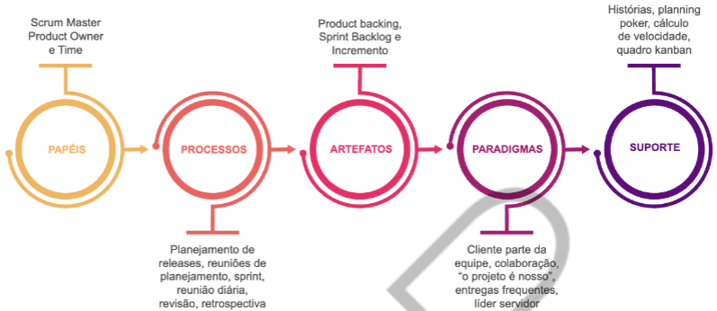
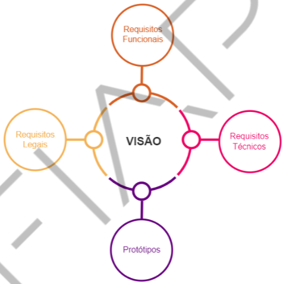
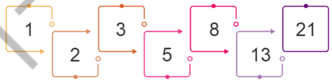

<h1>FASE 1 - DEVELOPMENT ENVIRONMENT</h1>
<h2>Capítulo 05: Atendendo a pedidos!</h2>

 

SCRUM não é método nem metodologia, é um framework!

## Pilares do SCRUM

Pilar | Drescrição
-------|----------
***Transparência*** | Foco na definição do produto (pronto), alinhar expectativas, feedback
***Inspeção*** | Inspeção de tudo que é produzido (qualidade do produto), e exercitado em cada um dos 5 eventos ou cerimônias (*)
***Adaptação*** | Diversas reuniões que ocorrem durante o ciclo Scrum (Sprint Plan, reunião diária, reunião revisão, retrospectiva), realizar melhorias identificadas

(*) antes do Sprint se inspeciona o Product Backlog e o Sprint Backlog no Planejamento; durante o Sprint se inspeciona o andamento do trabalho nas diárias; ao fim do Sprint se inspeciona na Review o incremento sendo entregue e na Retrospectiva se inspeciona a dinãmica interacional e de processos do time. O próprio Sprint é o 5º evento, no qual se passam todas estas oportunidades de inspeção.

## Valores do SCRUM

Valor | Visão tradicional | Visão SCRUM
------|-------------------|-------------
Compromisso | Comprometer-se só porque o chefe ordenou | Comprometimento com o time e a meta do Sprint
Foco | Manter o cliente satisfeito | Entregar o combinado no prazo
Abertura | Falar bem do que você faz | Destacar o sucesso de todos e alertar para os impedimentos
Respeito | Você como herói para resolver os problemas | Auxiliar o time a fazer o melhor e não julgar os outros
Coragem | Culpar a tudo/todos pelos problemas | Aceitar opiniões dos outros, críticas e assumir seus erros

## Papéis no SCRUM

Bem definidos e reduzidos, minimizando conflitos e aumentando o grau de comunicação entre todos os envolvidos.

### 1. Product Owner:

Representante do cliente no projeto, deve ter autonomia e autoridade para tomada de decisões e validações necessárias no projeto.

- Define as funcionalidades do produto, mantendo o Product Backlog atualizado;
- Decide datas de lançamento e conteúdo dos releases;
- Responsável pela rentabilidade (ROI);
- Prioriza funcionalidades de acordo com o valor;
- Ajusta funcionalidades e prioridades;
- Apresenta ao time os requisitos necessários para a entrega do produto;
- Aceita ou rejeita o incremento de software entregue ao fim do Sprint;
- Atua como facilitador quando há mais clientes envolvidos;
- Garante que especialistas estejam disponíveis para o time;
- Desenvolve e comunica a visão de produto.
- Cria e define itens do Product Backlog;
- Garante que o Product Backlog é transparente, visível e compressível para todos do time.

### 2. Scrum Master:

Trabalha para garantir eficiência de trabalho do time; atua como facilitador, removendo impedimentos, organizando o Scrum e auxiliando a organização, time e cliente a trabalharem juntos; é um dos principais elos dos times com o Product Owner, protegendo o time para que esse não perca o foco na construção do produto.

- Pode representar a gerência para o projeto (ou serem papéis separados);
- Responsável pela aplicação dos valores e práticas do Scrum;
- Remove os impedimentos;
- Garante a plena função e produtividade da equipe;
- Garante a colaboração entre os envolvidos;
- Escudo para interferências externas;
- Responsável por garantir que o produto atenda às necessidades definidas pelo Product Owner;
- Auxilia o Product Owner com o Product Backlog;
- Facilita as reuniões.

### 3. Time (Scrum Team Members):

Auto-organizado e autogerenciado; sua responsabilidade é a execução dos trabalhos acordados nos planejamentos com PO e SM. 

As equipes SCRUM devem ser pequenas o suficiente para permanecerem ágeis e grandes o suficiente para conseguirem desenvolver um trabalho significativo ao fim do Sprint. Possuem ***10 (dez) membros ou menos***, incluindo Team Members, SM e PO. 

Palavra chave = comprometimento.

- O trabalho entregue ao cliente é gerado por um “Time Scrum” dedicado;
- Times Scrum são auto-organizados, multidisciplinares e comprometidos;
- Responsáveis por entregar o que foi acordado como meta do Sprint;
- O próprio time estipula como as tarefas devem ser divididas para gerar o resultado esperado;
- O próprio time define quem irá executar as tarefas e em que ordem serão realizadas.

# Framework SCRUM

- define papéis claros com times reduzidos;
- descreve um conjunto de processos básicos que estabelecem:
  - o que deve ser feito (o “como” fica a critério de cada time).
  - um conjunto mínimo de artefatos que devem ser produzidos durante o ciclo.
- faz uso de ferramentas ágeis (outras que acredite precisar para facilitar a execução e o acompanhamento dos trabalhos);
- parte da premissa que os envolvidos já se desvencilharam de paradigmas tradicionais.
- cliente é uma parte presente e colaborativa no projeto.

 
<em>Resumo do framework.</em>

 

 
<em>O framework Scrum.</em>

## Terminologias:

### 1. Product Backlog:
- lista ordenada de necessidades de aprimoramento de produto, elaborada pelo Product Owner a partir dos requisitos iniciais.
- tarefas que o compõem devem ser organizadas em ordem de importância.

### 2. Reunião de planejamento:
- realizada no início de cada Sprint.
- objetivo: definir o que será feito no Sprint.
- todos os membros do projeto participam.

### 3. Sprint Backlog:
- lista detalhada de atividades que precisam ser executadas durante o Sprint
- deve ser elaborada e estimada pelo time do projeto.

### 4. Sprint:
- duração predeterminada de 1 a 4 semanas (não pode ser estendido nem reduzido.
- é no Sprint que o produto é elaborado e entregue com qualidade.

### 5. Reunião diária:
- breve, muitas vezes realizada em pé e no local de trabalho, com duração máxima de 15 minutos.
- objetivo: acompanhar atividades que estão sendo realizadas e melhorar a comunicação do time.

### 6. Reunião de revisão:
- o time apresenta o resultado do trabalho ao Product Owner e convidados(clientes, gestores e outros stakeholders).
- objetivo: fazer uma avaliação e definir se o incremento de software produzido será aceito.
- eventuais apontamentos de erros e melhorias devem ser inseridos no Product Backlog.

### 7. Reunião de retrospectiva:
- discutidos os pontos positivos e negativos da execução de cada Sprint.
- objetivo: melhorar o desempenho dos próximos Sprints.

### 8. Versão:
- nem todo Sprint gera um produto final a ser utilizado pelo cliente.
- às vezes são necessários mais Sprints para produzir uma versão fechada para utilização.

# A) Iniciando o projeto

Um projeto SCRUM começa a partir de um documento apresentado pelo Product Owner chamado `Visão do Produto`.
- contém todas as necessidades que devem ser atendidas.
- junta informações fornecidas pelos principais clientes, usuários, patrocinadores, entre outros.

 
<em>Documento visão.</em>

## Elevator pitch:

Modelo de declaração de visão, de estrutura padronizada.

1. **Para** (clientes-alvo).
2. **Que estão insatisfeitos com** (a atual alternativa de mercado).
3. **Nosso produto** (nome do produto) **é uma** (proposta do nosso produto).
4. **Que fornece** (capacidade-chave de resolução de problemas).
5. **Ao contrário de** (a melhor alternativa do produto).
6. **Nosso produto** (proposta de valor, nosso diferencial).

## B) Criando o Product Backlog

Na definição mais simples, o Product Backlog é uma lista de todas as coisas que precisam ser feitas dentro do projeto,elaborada a partir da Visão do Produto (**e de responsabilidade do Product Owner**).

Reflete o conteúdo macro do que será executado!

Por não ser um documento detalhado, pode ser completado por outros documentos, como: memorial descritivo, resumo das várias funções de usuário, descrições de fluxo de trabalho, diretrizes de interface de usuário, storyboards, requisitos técnicos, bugs identificados previamente, melhorias,casos de uso ou protótipos de interface de usuário.

Não é um documento estático, vai existir durante todo o ciclo de vida do projeto.

> `Cartões de histórias` não fazem parte do framework SCRUM, mas é a técnica mais utilizada para descrever o Product Backlog!

A montagem do Product Backlog comumente é uma lista de histórias representando cada item que precisa ser realizado no projeto!

### Priorizando as histórias:

Após listar todas as histórias, o Product Owner deve priorizá-las em ordem de importância, para criar uma sequência que gere valor para o negócio e faça sentido como um Sprint ou uma versão.

Técnicas:

***A) Técnica MoSCoW:***
- muito utilizada para priorização de escopo, priorização de requisitos e para classificação de mudanças.
- o objetivo é classificar as funcionalidades com base no seu valor de negócio. 

&#35; | Significado | Tradução | O requisito é:
------|-------------|----------|---------
M | Must have | Deve ter | Essencial para o negócio
O | - | - | - 
S | Should have | Deveria ter | Importante, mas não essencial
C | Could have | Poderia ter | Seria bom ter, mas não é importante
O | - | - | -
W | Won't have | Não precisa agora | Não gera valor para o negócio agora

***B) Matriz GUT:***
- muito utilizada para priorização de tomada de decisões e de ações corretivas.
- leva em consideração a gravidade da falta de um requisito, a urgência para se resolver o problema e a tendência, caso o problema não se resolva.

&#35; | Significado | Descrição
------|-------------|----------
G | Gravidade | Impacto do problema sobre coisas, pessoas, resultados etc
U | Urgência | Relação com o tempo disponível ou necessário para resolver o problema
T | Tendência | Avaliação de tendência de crescimento, redução ou desaparecimento do problema

Para cada uma das variáveis, são atribuídos pesos de acordo com critérios preestabelecidos que vão direcionar a categorização:

Pontos | Gravidade | Urgência | Tendência
-------|-----------|-----------|----------
5 | Os prejuízos ou dificuldades são extremamente graves | É necessária uma ação imediata | Se nada for feito, o agravamento será imediato
4 | Muito grave | Com alguma urgência | Vai piorar em curto prazo
3 | Grave | O mais cedo possível | Vai piorar em médio prazo
2 | Pouco grave | Pode esperar um pouco | Vai piorar em longo prazo
1 | Sem gravidade | Não tem pressa | Não vai piorar ou pode até melhorar

Após isso, multiplicam-se os pesos de cada variável para se obter um número que, quanto maior, maior a prioridade!

***C) Importância subjetiva:***
- Product Owner avalia onde a empresa se encontra e define o que é mais importante a ser feito a fim de atender às necessidades do negócio.

## C) Estimativas

- as histórias precisam ter seu tamanho estimado para que possa ser avaliado quantas histórias cabem num Sprint (ou se serão fracionadas em histórias menores para melhor compreensão do time).
- o time é o responsável pelas estimativas, mas a presença do Product Owner é essencial para detalhar ou esclarecer cada história.
- A técnica de estimativa mais utilizada em projetos Scrum é o `Planning Poker`.
  - consiste em cartas com numeração seguindo a tabela de Fibonacci;
  - os membros do time avaliam um tamanho para cada um dos itens do Product Backlog.

> o tamanho de uma história não é estimado em dias ou em horas, e sim à complexidade de cada história, e serve de comparação entre elas. Essa numeração atribuída a cada item é chamadade **pontos de complexidade**.

 
<em>Sequência de Fibonacci.</em>

Passo a passo para jogar o Planning Poker:
- Cada membro do time tem a capacidade de votar em quaisquer dos valores secretamente uma única vez. Isso pode ser feito por meiode uma ferramenta ou como uso de um baralho com as cartas numeradas na sequência de Fibonacci;
- Escolhe-se uma história do Product Backlog;
- O Product Owner detalha o que espera dessa história, mas não participa da estimativa;
- O time compreende e tira suas dúvidas;
- Os membros do time votam secretamente nos valores que acreditam representar melhor o tamanho da tarefa. O voto de cada membro do time é revelado simultaneamente. Se usado um baralho, cada membro do time apresenta a carta que representa seu voto ao mesmo tempo;
- O time compara e discute suas estimativas;
- Em caso de divergências, a história é rediscutida e uma nova rodada de votação acontece;
- O ciclo se repete até que todos tenham jogado a mesma cartaou quando o time entra em consenso, ou seja, quando há concordância sobre o tamanho.

> O objetivo da estimativa é obter o comprometimento de todos com o prazo que será utilizado nos Sprints!

## D) Planejamento de releases

- plano de muito alto nível para determinar o tempo total do projeto, o ciclo de versões que serão geradas e definir quais funcionalidades serão construídas, sua prioridade e quando serão feitas.
- o objetivo é proporcionar o entendimento claro do projeto, sua estratégia de entrega e, com isso, a melhoria da comunicação entre todos os envolvidos.

> A primeira atividade do planejamento de um release é determinar sua `META` a ser definida pelo Product Owner com a ajuda do Scrum Master. Seu objetivo deve estar alinhado com as necessidades do negócio. A meta serve para guiar o time na realização das atividades e no cumprimento dos Sprints planejados.

PÁGINA 32