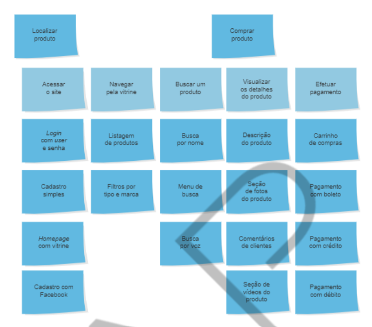

<h1>FASE 1 - DEVELOPMENT ENVIRONMENT</h1>
<h2>Capítulo 06: Desvendando a cabeça do usuário.</h2>

 

## Importância do levantamento de requisitos

## Levantamento de requisitos

### 1. O que é?

É o processo que reunirá informações sobre o software proposto!

Alguns fatores devem ser levados em consideração:
- domínio do negócio (representa a área de atuação).
- número de pessoas.
- metodologia de desenvolvimento.

É complexo detectar qual a melhor técnica, podendo utilizar uma combinação entre elas. 

### 2. Objetivo:

Que usuários e desenvolvedores tenham a mesma visão do problema a ser resolvido. Os desenvolvedores, juntamente com os clientes, tentam levantar e definir as necessidades dos futuros usuários do sistema a ser desenvolvido (requisitos).

### 3. Questões a serem levantadas...

Algumas questões são levantadas:
- Quais pessoas devem ser entrevistadas?
- Como devemos entender o processo? É melhor observar?
- Qual o número de stakeholders envolvidos com o processo de negócio?
- É melhor marcar uma entrevista?
- Com quantas pessoas devemos fazer um workshop?
- A metodologia de desenvolvimento é ágil?
- Quais são as melhores técnicas?

É necessário avaliar quem é a parte interessada dentro da estrutura organizacional, seja operacional, tático ou estratégico.

### 4. Possíveis problemas

Alguns problemas no levantamento de requisitos:
- Problemas de escopo: fronteiras do sistema mal definidas ou clientes/usuários especificam detalhes técnicos desnecessários.
- Problemas de entendimento: Os clientes/usuários não estão completamente certos do que é necessário, têm pouca compreensão das capacidades e limitações de um ambiente computacional, não possuem pleno entendimento do domínio do problema, têm dificuldade de comunicar suas necessidades, omitem informação que acreditam ser óbvia, especificam requisitos que conflitam com as necessidades de outros clientes/usuários ou especificam requisitos que são ambíguos ou impossíveis de testar. 
- Problemas de volatilidade: requisitos mudam ao longo do tempo.

## Técnicas de levamento de requisitos

- Brainstorming.
- Workshop.
- Entrevista informal.
- Entrevista formal questionário.
- Observação.
- Prototipação.
- Cenários.
- História de usuários (user stories).
- Casos de uso (use cases).

---

### 1. `Brainstorming`:

***O que é?***

Consiste em uma ou várias sessões, nas quais as pessoas podem compartilhar e explorar ideias! A técnica levanta e gera ideias por meio do pensamento criativo dentro de uma organização ou em atividades informais. Deve trazer as ideias das partes interessadas que têm expertise ou de analistas!

As quatro regras básicas são:
1) Não permita críticas. 
2) Incentive ideias criativas e inusitadas. 
3) Quantidade é importante. 
4) Combine e/ou melhore a ideia dos outros.

***Objetivo:*** identificar necessidades específicas ou desenvolver novas ideias para o projeto. A construção do software baseado nas ideias do grupo favorecerá definições e os entendimentos comuns das pessoas interessadas!

***Como estruturar?***

- Identificar o líder da sessão: responsável por esclarecer o objetivo, as etapas e regras.
- Estabelecer tempo limite para a duração da sessão.
- Identificar e selecionar os participantes: pessoas bem informadas que tragam contribuições diretas e necessárias.
- Enviar antecipadamente o tema ou foco da reunião.
- Eleger uma pessoa neutra: será um facilitador caso a sessão se desvirtue por alguém ou alguma ideia.
- Esclarecer a técnica e as regra sda sessão: antes de iniciar a sessão.
- Produzir uma boa quantidade de ideias: limitadas ao propósito do levantamento.
- Registrar todas as ideias.
- Analisar as ideias: fase final de revisão das ideias; as mais importantes são listadas em ordem de prioridade.

***Vantagens e desvantagens:***

Vantagens | Desvantagens
----------|-------------
Grande quantidade de ideias | Pode levar muito tempo par realização das sessões
Pessoas que ocupam papéis diferentes no negócio contribuem com suas ideias | Muitas ideias podem distorcer o propósito, caso não seja direcionado
&#45; | Processo de definição das melhores ideias pode ser longo

---

### 2. `Workshop`:

***O que é?***

São reuniões organizadas das quais participam os analistas e as partes interessadas envolvidas no projeto. Podem ser divididas em várias reuniões de curta duração.

***Objetivo:*** grande interação entre os participantes e o líder que conduz. 

Em um workshop, o líder pode ser um analista apresentando o entendimento de um requisito, e as partes interessadas colaboram em discussão sobre o esclarecimento de requisitos ou expõem suas ideias.

***Importante!***

A diferença entre palestra e workshop é que, em uma palestra, os ouvintes não fazem intervenções durante a reunião. Já em um workshop o objetivo é que as intervenções esclareçam requisitos.

***Vantagens e desvantagens:***

Vantagens | Desvantagens
----------|-------------
Respostas conduzidas por grupo de pessoas | Alguns assuntos podem ser perdidos ou não abordados
Reunião de objetivos comuns rm relação ao sistema | Mais difícil chegar a um consenso, pois envolve um grupo de pessoas
Pode ser usada como complemento de técnica ou como validação de requisitos | Pode haver divergências

---

### 3. `Entrevista informal`:

***O que é?***

Técnica simples e tradicional, é uma conversa com objetivo específico. Utiliza “pergunta-resposta” e traz bons resultados na obtenção de requisitos. As perguntas são direcionadas para as partes interessadas relacionadas às suas atividades na organização.

***Objetivos:***

- Levantar as necessidades e/ou os problemas envolvidos.
- Identificar a rotina da parte interessada, entender o fluxode informação e regras de negócio que são atividades do entrevistado.
- Conhecer as atividadesdo entrevistado sobre os sistemas atuais.
- Levantar procedimentos da empresa que não estão formalizados.

***Dicas para a entrevista se bem sucedida:***

É importante que o analista:
- Tenha o controle da entrevista.
- Evite induzir as repostas.
- Compreenda a “ideia do processo de negócio e do sistema”, deixando claro o propósito para o entrevistado.
- Faça anotações.
- Deixe a parte interessada à vontade, desde que seja dado direcionamento ao assunto abordado. 
- Observe se há algum tipo de resistência.

***Etapas:***

a) Planejamento:

- o Analista estará preparado e contextualizado em relação ao negócio pertinente às atividades do entrevistado. 

b) Ações do planejamento:

- Definir o objetivo da entrevista.
- Definir quem será entrevistado (parte interessada ou usuário-chave). O entrevistado deve ter expertise do negócio.
- Pesquisar documentos, formulários e relatórios que são utilizados pelo entrevistado.
- Levantar terminologia existente no negócio para que seja utilizada.
- Agendar entrevista com antecedência; não deve ser muito longa, para evitar a falta de motivação da parte interessada.
- Elaborar as questões é o ponto fundamental do planejamento!!!

***Quais tipos de questões podem ser elaborados?***

### A) QUESTÕES SUJBETIVAS:

As “questões subjetivas” geram respostas “abertas”, dão uma visão global.

***Vantagens e desvantagens:***

Vantagens | Desvantagens
----------|-------------
Informações abrangentes | Podem levantar muitas informações irrelevantes
Entrevistado fica mais descontraído e espontâneo | O analista pode perder controle da entrevista
&#45; | Respostas muito longas podem ser perdidas durante a entrevista

### B) QUESTÕES OBJETIVAS:

As “questões objetivas” geram respostas “direcionadas” a um resultado específico.

***Vantagens e desvantagens:***

Vantagens | Desvantagens
----------|-------------
Vai direto ao resultado esperado | As respostas podem ser relacionadas a outro processo, mas para o entrevistado pode parecer que é óbvio
Permite o controle da entrevista | Geram somente dados quantitativos
Geram dados significativos para o sistema | &#45;
Facilitam identificação de regras, normas e políticas do negócio | &#45;

### C) CONFIABILIDADE:

Tópico | Questões subjetivas | Questões objetivas
-------|---------------------|--------------------
Confiabilidade das informações | Baixa | Alta
Uso eficiente do tempo | Baixo | Alto
Precisão das informações | Baixa | Alta
Amplitude | Alta | Baixa
Habilidade requerida do analista | Alta | Baixa 
Profundidade | Alta | Baixa

> Complementar a entrevista com perguntas objetivas elaboradas a partir da resposta de uma pergunta subjetiva é uma ótima maneira de aumentar a confiabilidade das informações!

### Estrutura da entrevista

a. Abordagem dedutiva: a entrevista começa com questões subjetivas e, conforme o andamento, passa-se para as questões objetivas. 
b. Abordagem indutiva: começa com questões objetivas e, conforme o andamento, passa-se para as questões subjetivas. 
c. Entrevista não estruturada: questões elaboradas aleatoriamente, conforme necessidade do analista.

### Cuidados ao elaborar as questões para entrevista

- Evite questões indiscretas que estejam relacionadas a situações específicas da empresa ou que relacionem opiniões do entrevistado.
- Evite elaborar muitas questões em uma só, separe as questões por assunto.

### Como documentar a entrevista?

1. Anotações: no formato de palavras-chave, diagramas ou símbolos.
- vantagens:
    - analista se concentra na fala da parte interessada.
    - histórico da entrevista.
    - pode utilizar símbolos para facilitar o entendimento.
- desvantagens:
    - pode ser difícil compreender o raciocínio da parte interessada.

2. Gravação: acordar antecipadamente com os envolvidos.
- vantagens:
    - todos envolvidos no projeto podem escutar.
    - registro mais rápido.
- desvantagens:
    - constranger o usuário.
    - posteriormente será necessário transcrever.
    - partre interessada pode abordar questões não pertinentes.

### Concluindo a entrevista:

- Fazer um relatório da entrevista e registrar em uma ata (com data da ocorrência e assuntos abordados). 
- Registrar solicitações da parte interessada.
- Identificar necessidades pontualmente. 
- Enviar para a parte interessada e solicitar a confirmação sobre o que foi falado.

### Em resumo... 

Vantagens | Desvantagens
----------|-------------
Respostas e validação imediatas para dúvidas | Pode consumir muito tempo
Planejamento pode contribuir para esclarecer levantamento de requisitos | Podem ocorrer desvios de assunto
Questões planejadas podem ser alteradas no andamento | A parte interessada pode ter dificuldades para se concentrar
Questões desnecessárias podem ser identificadas e eliminadas | Difícil comparar respostas
Questões podem ser criadas | &#45;
Ordem das questões pode ser alterada | &#45;
Analista pode ser facilitador motivacional | &#45;

Portanto, para que a entrevista seja bem sucedida:

- bom planejamento;
- identificar a parte interessada (usuário-chave) com expertise;
- deixar claro o objetivo;
- ser ético;
- identificar fatos e necessidades objetivamente;
- não utilizar muito tempo nas reuniões;
- saber ouvir;
- mostrar comprometimento em relação à expectativa da parte interessada;
- evitar terminologias técnicas;
- quando não entender determinado assunto, questionar e solicitar esclarecimentos;
- expor o entendimento para a parte interessada e perguntar se está de acordo;
- registrar tudo que foi falado e solicitar a validação da parte interessada.

---

### 4. `Entrevista formal –JAD (Joint Application Design)`

- técnica que relaciona formalidade e visão compartilhada em suas ações.
- objetivo: levantamento de requisitos em grupo,envolvendo partes interessadas e analistas.

***É uma sessão formal que:***
- tem como objetivo identificar problemas e soluções;
- tem uma agenda organizada e estruturada;
- tem uma equipe definida com papéis e responsabilidades;
- analisa o processo de negócio top down (começa com aspectos gerais e depois considera os detalhes);
- utiliza workshop na condução das sessões;
- utiliza documentação padrão;
- todos os participantes têm a mesma importância;
- a decisão é do grupo por consenso;
- cada participante tem seu momento de falar;
- utiliza recursos visuais.

***Pessoas envolvidas:***
- Patrocinador (sponsor): executivo do negócio, determina as estratégias/diretrizes. Não participa obrigatoriamente de todas as sessões.
- Partes interessadas (stakeholders) ou usuários que devem ser especialistas.
- Líder da sessão.
- Engenheiro de requisitos ou documentador: registra todas as decisões em uma documentação padrão.
- Escriba: anota as discussões em uma ferramenta que facilite a visualização das decisões.
- Observador(es): não podem fazer intervenções.

***Fasessintetizadas de uma sessão JAD:***

a) Adaptação ou planejamento:

- Definir o objetivo do projeto.
- Escolher e preparar participantes.
- Definir os documentos e as ferramentas padrões.
- Definir quantas sessões e qual a finalidade de cada uma.
- Identificar as diretrizes do patrocinador (sponsor).
- Analistas devem familiarizar-se com a área de negócio.
- Preparar a agenda da sessão.

b) Sessão (reunião):

- Preparar o ambiente físico com equipamentos e materiais necessários.
- Todos devem ser apresentados(participantes e agenda)
- Gerar os documentos conforme padrão inicial.
- Realizar a reunião para identificar os requisitos.
- Ao finalizar a sessão,identificar se os resultados foram satisfatórios em relação os objetivos iniciais.

c) Finalização:
- Rever o documento que foi construído durante a sessão.
- Verificar se as informações estão completas e de acordo com os objetivos.
- Especificar o documento de requisitos.
- Preparar a pasta JAD para uso nas próximas sessões.
- Elaborar as avaliações dos participantes referentes à sessão.

***Em resumo...***

Vantagens | Desvantagens
----------|-------------
Qualidade e padrão de documentação | Envolver um grupo de pessoas
Organização das reuniões | Processo burocrático
Maior comprometimento dos envolvidos | Requer recursos visuais
Esclarecimento e trabalho em equipe | Requer espaço físico estruturado
Histórico das reuniões | &#45;

---

### 5. `Questionário`

***Recomendações***:

- Criar um roteiro com as orientações para preenchimento.
- As questões devem ser ordenadas conforme o objetivo que se pretende atingir.
- Questões relacionadas ao mesmo propósito devem estar agrupadas. 
- A estrutura do questionário deve seguir os mesmos conceitos relacionados às perguntas subjetivas e objetivas utilizadas no planejamento. 
- Vocabulário deve ser simples e de acordo com os envolvidos.
- As questões objetivas geram resultados quantitativos e estatísticos.
- As questões subjetivas, quando respondidas porum grupo muito grande de usuários, tornam-se difíceis de analisar, e a consolidação das respostas é muito difícil.
- Pensar em perguntas cuja elaboração das respostas leve menos tempo.
- Ao concluir recebimento dos questionários,devem ser feitas as consolidações das informações; validar as respostas.

Vantagens | Desvantagens
----------|-------------
Resultados rápidos | Não é possível observar as expectativas das partes interessadas
Não requer espaço físico | Respostas podem ser geradas sem conscientização
Podem ser utilizados questionários on-line | Falta de interação com a parte interessada
Gera dados estatísticos | Não é possível verificar se a parte interessada está segura em suas respostas

### `Mapeamento do produto`

`Analista de negócios`: faz levantamento e detalhamento de requisitos. No SCRUM, costuma ser o PO.

`Story mapping`: técnica de mapeamento de funcionalidades de um produto de forma colaborativa.

***Passo 1:*** definir os objetivos do usuário final do produto. 
***Passo 2:*** identificar atividades/tarefas que o usuário realiza ao utilizá-lo, de modo que atenda aos objetivos selecionados.
- Devemos realizar o mapeamento para cada tipo de usuário, chamados **personas**.
- A sequência de atividades é conhecida também como **jornada do usuário**.
- Os passos são descritos com verbos no infinitivo. 
***Passo 3:*** Uma vez traçada a jornada, explorar os detalhes sobre cada atividade, fornecendo informações a respeito do que deve ser construído para atender a cada passo.
- `Mínimo produto viável (MVP)`: quais são as funcionalidades mínimas necessárias para gerar o maior valor possível no menor tempo possível.
    - não é o produto mais simples possível a ser entregue!!!
    - **é a menor versão de um produto entregue, a qual atinge com sucesso os resultados desejados**!!!

Exemplo:

~~~
Caso: empresa que deseja criar a primeira versão de seu comércio eletrônico a fim de vender produtos pela internet.

1. Objetivos do usuário:
- localizar produto.
- comprar produto.

2. Identificar atividades/tarefas:
  a) com objetivo de visualizar o produto:
    - acessar o site.
    - navegar pela vitrine de produtos.
    - buscar um produto.
    - visualizar detalhes do produto.
  b) com objetivo de comprar o produto:
    - adicionar ao carrinho.
    - efetuar pagamento.

3. Mapear as funcionalidades necessárias para atender a cada passo. Exemplos:
- para acessar o site: login com user e senha, cadastro simples, homepage com vitrine, etc.
- para navegar pela vitrine: listagem de produtos, filtros por tipo e marca.
(exemplos na imagem abaixo)
~~~

 
<em>Exemplo de Story map.</em>

---

## FAST TEST

### 1. Qual é a vantagem do levantamento de requisitos por Workshop em comparação com Brainstorming? 
Tanto Workshop quanto Brainstorm podem ser usados para discussões técnicas ou de negócio. Não é a técnica de levantamento de requisitos que determina o assunto a ser discutido.
> Workshops funcionam a partir da apresentação de um requisito, software ou solução, e a discussão é direcionada pelo que foi apresentado. Brainstorming direciona a discussão apenas definindo um propósito, o que pode dar abertura a ideias pouco úteis.

### 2. (QUESTÃO ANULADA) Qual é a vantagem do levantamento de requisitos por Brainstorming e comparação com Workshop?
> Brainstorming tem por objetivo produzir uma grande quantidade de ideias voltadas ao propósito do levantamento de dados. O Workshop produz menor quantidade de ideias e tem foco mais restritivo.

### 3. Quais são as vantagens de levantamento de requisitos por entrevista informal em relação a outras técnicas de levantamento de requisitos?
> Entrevista informal permite validação imediata de dúvidas objetivas do entrevistador e tem flexibilidade para ouvir percepções subjetivas dos entrevistados.

### 4. Qual é a relação entre o Product Backlog e as técnicas do Story Map e jornada do usuário?
O Story Map e a jornada do usuário são técnicas de levantamento de requisitos que, após análise, ajudarão a compor a lista e itens a serem desenvolvidas em projeto denominado Product Backlog.
> O Story Map e a jornada do usuário permitem a visualização do que o software deve fazer da perspectiva do usuário, e ao separarem cada etapa, ajudam na identificação de tarefas e na montagem do Product Backlog.

### 5. Quais são as vantagens da entrevista formal JAD em comparação com outras técnicas de levantamento de requisitos?
> Entrevistas formais JAD tem excelente padrão de documentação, alto comprometimento dos envolvidos, permite colaboração de todos os stakeholders e favorece o consenso.

[Voltar ao início!](https://github.com/monicaquintal/fintech)