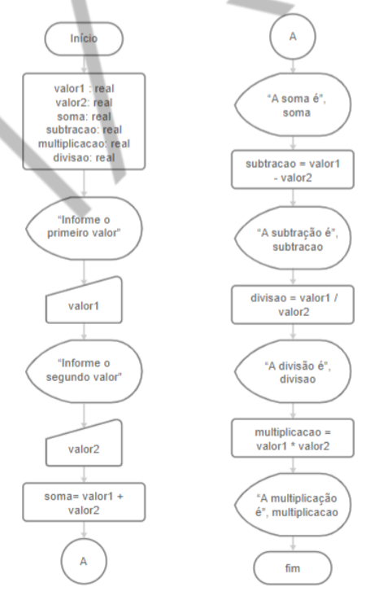

<h1>FASE 1 - DEVELOPMENT ENVIRONMENT</h1>
<h2>Capítulo 10: Vamos aprender a programar?</h2>

 

## Algoritmo

- é uma sequência ordenada de instruções que visa resolver determinado problema.
- algoritmos e programas não são sinônimos.
- formas mais comuns de representação algorítmica na computação:
  - fluxogramas (diagramas de blocos).
  - pseudocódigos (através de texto, com uma linguagem que apresenta estrutura formasl).

## Mão na massa

### Ambiente para programação:

É composto de ao menos duas partes: IDE e interpretador (ou compilador, dependendo da linguagem).

### Tipos de linguagem:

a. `Compilada`: o código é transformado em um arquivo executável que está em código de máquina e pode ser executado por ela. Ou seja, precisamos gerar um código de máquina para cada arquitetura em que quisermo rodar nosso software (Windows, MacOS, Linux).

b.`Interpretada`: o código original não é transformado em código de máquina; é interpretado, ou seja, qualquer máquina que tiver um interpretador instalado conseguirá rodar o código original!

## Etapa 1: Instalando o Python

No caso do Python, há duas versões da linguagem: Python 2.x e Python 3.x. Será utilizada a **versão 3**.

O download pode ser realizado [aqui](https://www.python.org).

## Etapa 2: Conhecendo alguns comandos

Toda linguagem de programação possui algumas `palavras reservadas`, que têm algum significado dentro daquela linguagem (podem ser comandos, por exemplo, que realizam tarefas específicas).

Outro conceito importante é o de `variável`, que comsiste em um espaço que um programa pode reservar na memória RAM do computador, para armazenar temporariamente alguns dados. O Python entende que uma palavra escrita do lado esquerdo do sinal de igual é uma variável, e cria automaticamente!

> `Comentários`: não serão executados, mas facilitam a compreensão/organização do código. Podemos utilizar o sinal # (cerquilha) e, para comentários com mais de uma linha, aspas triplas:"""texto""".

### Comando `print()`

Usado para exibir uma mensagem na tela do computador.

~~~python
print ("Olá, mundo!")
~~~

### Comando `input()`

Utilizado para para permitir que os usuários digitem informações dentro de variáveis.

Sintaxe:

~~~python
nome_variavel = input (“Mensagem de texto :”)
~~~

Exemplo:

~~~python
nome = input("Por favor, digite seu nome: ")
print(nome + "é um programador incrível!")
~~~

### Comando type()

Exibe os tipos das variáveis indicadas.

Exemplo:

~~~python
valor1 = input("Por favor, digite o primeiro valor: ")
valor2 = input("Por favor, digite o segundo valor: ")

soma = valor1 + valor2
print("A soma entre os valores é " + soma)
print(type(valor1))
print(type(valor2))

# nesse caso, a execução do script indica que as variáveis estão sendo tratadas como strings!
~~~

## Etapa 2: Instalando PyCharm

IDEs (Integrated Development Environment): 
- ferramentas usadas para escrever programas em uma linguagem de programação específica. 
- não contêm apenas os editores de texto, mas ferramentas que permitem verificar erros no código, executar o programa diretamente no interpretador ou compilador e, em alguns casos, montar interfaces gráficas.

### Criando o arquivo nome_sobrenome.py

~~~python
print("Esse programa exibirá seu nome completo. ")
nome = input("Por favor, digite seu primeiro nome: ")
sobrenome = input("Por favor, digite seu sobrenome: ")
nome_completo = nome + " " + sobrenome
print("Seu nome completo é: " + nome_completo)
~~~

> diretório fase01 > projetos > PrimeiroProjeto, arquivo nome_sobrenome.py

## Operadores

Em Python, os principais são: de atribuição, aritméticos, relacionais, lógicos, de identidade e de associação.

## Operadores de atribuição

Utilizados para incluir/associar valores a uma variável ou objeto.

Operador | Exemplo | Equivalência
--------|----------|--------------
= | x = 3 | x = 3
+= | x += 1 | x = x + 1
-= | x -= 1 | x = x - 1
*= | x *= 2 | x = x * 2
/= | x /= 2 | x = x / 2
%= | x %= 2 | x = x % 2

Exemplos:

~~~python
# Atribuição da soma de dois números inteiros:
resultado = 2 + 3
print("Resultado:", resultado)

# Somando dois ao valor anterior da variável
resultado += 2
print("Resultado:", resultado)

# Atribuição de um texto (string)
nome = "Pedro"
print("Olá,", nome, ", tudo bem?")

# Saída f"string" com a variável entre chaves
nome2= "Maria"
print(f"Olá, {nome2}. Tudo bem?")
~~~

> diretório fase01 > projetos > Operadores, arquivo operadores_de_atribuicao.py

## Operadores aritméticos

Utilizados quando precisamos realizar cálculos aritméticos.

Operador | Operação | Precedência
---------|-----------|------------
&#43; | Adição | Menor prioridade
&#45; | Subtração | &#45; 
&#42; | Multiplicação | &#45; 
/ | Divisão | &#45; 
// | Divisão inteira | &#45; 
% | Resto da divisão ou módulo | &#45; 
&#42;&#42; | Exponenciação ou potenciação | Maior prioridade

Observações:
- Quando utilizados operadores aritméticos de mesma prioridade, as operações são realizadas da esquerda para direita.
- Parênteses podem ser utilizados para priorizar uma operação.
- A linguagem utiliza ponto (e não vírgula) para representar a parte fracionária de um número do tipo real.

~~~python
# Sem parênteses, operações por ordem de prioridade:
resultado = 2 + 3 / 2
print("Resultado: ", resultado)

# Utilizando parênteses:
resultado = (2 + 3) / 2
print("Resultado: ", resultado)
~~~

> diretório fase01 > projetos > Operadores, arquivo operadores_aritmeticos.py

## Operadores relacionais (ou de comparações)

Utilizados quando precisamos realizar comparações.

O resultado de uma comparação será True ou False. Na linguagem Python, são utilizadas as palavras-chaves True e False, que são objetos que armazenam, respectivamente, os valores 1 e 0.

Operador | Função | Exemplo
---------|-------|---------
== | Igual | 5 == 5
!= | Diferente | 5 != 5
&gt; | Maior que | 5 > 5
&lt; | Menor que | 5 < 5
&gt;= | Maior igual | 5 >= 5
&lt;= | Menor igual | 5 <= 5

~~~python
print(1 == 5)
print(1 != 5)
print(1 > 2)
print(1 < 2)
print(1 >= 2)
print(2 <= 2)
print(1 == True)
print(0 == False)
~~~

> diretório fase01 > projetos > Operadores, arquivo operadores_relacionais.py

## Operadores lógicos (ou booleanos)

Operador | Exemplo | Equivalência
---------|---------|--------------
or | A or B | ou
and | A and B | e
not | not A | não

~~~python
A = 1 == 2
B = 2 > 3
print(A)
print(B)

#Operações

print(A and B)
print(A or B)
print(not A)
print(not B)
print(8 >= 5 and 8 <= 10)
~~~

> diretório fase01 > projetos > Operadores, arquivo operadores_logicos.py

### 1. Operador `not`:
- conhecido como inversor.
- representa a negação do valor de entrada (inverso). 
- se a entrada for True, a saída será False, e vice-versa.

A | not A
--|------
True | False
False | True

### 2. Operador `and`:
- conhecido como conjunção.
- terá como saída o valor True apenas se ambos os operandos forem True.

A | B | A and B
---|---|-------
False | False | False
False | True | False
True | False | False
True | True | True

### 3. Operador `or`:
- conhecido como disjunção.
- a saída será False apenas se ambos os operandos forem False. Nos demais casos, a saída será True.

A | B | A or B
---|---|-------
False | False | False
False | True | True
True | False | True
True | True | True

## Operadores de associação

Utilizados para averiguarse um objeto está contido em uma sequência.

Operador | Exemplo
---------|---------
in | "s" in resposta
not in | "s" not in resposta

Exemplo:

~~~python
resposta = "sim"
texto = "Brasil"
print("s" in resposta)
print("n" not in resposta)
print("b" in texto)
print("B" in texto)
~~~

> diretório fase01 > projetos > Operadores, arquivo operadores_de_associacao.py

## Operadores de identidade

Utilizados quando precisamos comparar se dois objetos utilizam a mesma posição de memória no Python.

Operador | Exemplo
---------|---------
is | n1 is n2
is not | n1 is not n2

O `método id()` retorna o endereço de memória de um objeto, portanto podemos utilizá-lo em conjunto com o comando print para exibir este endereço em tela!

Exemplo:

~~~python
cidade_p1 = "São Paulo"
cidade_p2 = "São Paulo"
cidade_p3 = "Rio de Janeiro"

print(id(cidade_p1))
print(id(cidade_p2))
print(id(cidade_p3))
print(cidade_p1 is cidade_p2)
print(cidade_p1 is not cidade_p3)
print(cidade_p1 is cidade_p3)
~~~

## Precedência dos operadores

Operador | Função | Precedência
:---------:|--------|-------------
&lpar; &rpar; | Parênteses | Maior prioridade
&#42;&#42; | Exponenciação | &#45;
&#43;x, &#45;x | Sinal | &#45;
&#42;, /, //, % | Multiplicação, divisão, divisão inteira e módulo | &#45;
&#43;, &#45; | Soma e subtração | &#45;
&lt;, &lt;=, &gt;, &gt;= | Relacionais | &#45;
==, != | Igual e diferente | &#45;
is, is not | Identidade | &#45;
in, not in | Associação | &#45;
not | não | &#45;
and | e | &#45;
or | ou | &#45;
=, +=, -=, *=. /=, %= | Atribuição | Menor prioridade

### Convertendo tipos de variáveis

Tipos básicos | Descrição | Exemplo
---------------|----------|---------
int | Números inteiros | 1, 2, 100
float | Números reais (ponto flutuante) | 1.5, 2.07, 50.29
complex | Números complexos | 4j, 5+2j, 15j
bool | Valores lógicos | True, False, 1, 0
string | Textos | "a", "texto", "10"

--- 

## Exercícios

## Calculadora

### Requisitos funcionais:
- receber dois valores do usuário;
- realizar as 4 operações básicas: soma, subtração, divisão e multiplicação.

### Fluxograma:

 
<em>Fluxograma para o algoritmo da calculadora.</em>

### Algoritmo:

~~~
Algoritmo "Soma"
Variáveis
  valor1, valor2, soma, divisao, subtracao, multiplicacao: real
Início
  Escreva "Digite o primeiro valor"
  Leia valor1
  Escreva "Digite o segundo valor"
  Leia valor2
  soma = valor1 + valor2
  Escreva "A soma é ", soma
  subtracao = valor1 -valor2
  Escreva "A subtração é ", subtracao
  divisao = valor1 / valor2
  Escreva "A divisão é ", divisao
  multiplicacao = valor1 * valor2
  Escreva "A multiplicação é ", multiplicacao
Fim
~~~

### Código:

~~~python
valor1 = input("Digite o primeiro número: ")
valor2 = input("Digite o segundo número: ")

# print(type(valor1))
# print(type(valor2))
# indicam que as variáveis são strings
# portanto, convertê-las para float:

soma = float(valor1) + float(valor2)
print("A soma entre os dois valores é igual a {}".format(soma))
# .format() é um recurso do Python que permite escrever um texto,
# indicando os locais onde serão incluídos valores de variáveis!

subtracao = float(valor1) - float(valor2)
print("A subtração entre os dois valores é igual a {}".format(subtracao))

multiplicacao = float(valor1) * float(valor2)
print("A multiplicação entre os dois valores é igual a {}".format(multiplicacao))

divisao = float(valor1) / float(valor2)
print("A divisão entre os dois valores é igual a {}".format(divisao))
~~~

> diretório fase01 > projetos > calculadora, arquivo calculadora.py

--- 

## O Patinete Elétrico

### Objetivo:

Criar um algoritmo que calcule a velocidade média, a partir de duas informações: a distância que o patinete percorreu e o tempo que demorou.

### Código:

~~~python
print("Este programa calcula a velocidade média de um patinete elético!")

distancia = input("Informe a distância percorrida pelo patinete (em metros): ")
tempo = input("Quantos minutos demorou para percorrer essa distância? ")

velocidade_media = float(distancia) / float(tempo)

# print("O patinete atingiu uma velocidade média de {} m/min".format(velocidade_media))

# para limitar a quantidade de casas decimais da variável velocidade_media:
# para exibir 2 casas, indicar {0:.2f}, para exibir 1 casa {0:.1f}, etc

print("O patinete atingiu uma velocidade de {0:.2f} m/min".format(velocidade_media))
~~~

> diretório fase01 > projetos > patineteEletrico, arquivo patinete.py

--- 

## FAST TEST

### 1. Qual é a diferença entre a execução da linguagem compilada e a linguagem interpretada?
> A linguagem compilada gera um executável que está em linguagem de máquina e precisa ser gerado de acordo com a arquitetura em que quisermos rodar o software. A linguagem interpretada não altera o código-fonte e necessita de um interpretador instalado para que possa executar o software.

### 2. A palavra "algoritmo" é muito utilizada no meio tecnológico. Assinale a alternativa que melhor define a palavra "algoritmo".
> Algoritmo é qualquer sequência de instruções para atingir um objetivo, por exemplo: Cálculo do Máximo Divisor Comum.

### 3. Assinale a alternativa que define Operadores Relacionais.
> Operadores relacionais são utilizados quando precisamos realizar comparações.

### 4. As linguagens de programação possuem algumas palavras reservadas. Selecione a alternativa que define melhor o conceito.
> Palavras reservadas são palavras que possuem algum significado dentro de uma linguagem de programação. Por exemplo, comandos.

### 5. Assinale a alternativa que define Operadores de Associação.
> Os operadores de associação são utilizados para verificar se um objeto está contido em uma sequència.

---

[Voltar ao início!](https://github.com/monicaquintal/fintech)