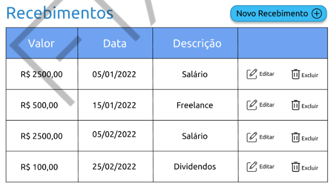

<h1>FASE 2 - PROTOTYPING</h1>
<h2>Capítulo 1: E que comecem os preparativos! 🎉</h2>

## Introdução! 

## Objetivo dessa fase:

***Prototipar o sistema!***

- Avançar com a documentação do projeto do sistema (através de diagramas de casos de uso).
- Mais conteúso sobre gerenciamento de tempo e custos.
- Realizar o protótipo do sistema Fintech, na forma de wireframes ou desenhos para definir como as telas do sistema serão!

## Mais funcionalidades para a Fintech:

Até o momento, temos as informações:

Requisitos funcionais | Requisitos não funcionais 
----------------------|----------------------------
Alterar dados do usuário | A aplicação deve ser construída utilizando uma API Rest
Adicionar valor das receitas do usuário | A interface deve ser uma aplicação Web que consome a API desenvolvida
Adicionar valor de um gasto efetuado | O sistema deve ser desenvolvido utilizando as linguagens HTML, CSS, JavaScript, JQuery, Bootstrap, ReactJS e Java
Adicionar um valor investido | O sistema deve armazenar as informações em um banco de dados relacional Oracle
Adicionar um objetivo financeiro | O sistema deve funcionar adequadamente nas versões atualizadas dos navegadores web Google Chrome, Mozilla Firefox e Microsoft Edge

Novas funcionalidades requeridas a partir de agora:

- “O usuário precisa ter uma maneira de se **cadastrar** no sistema."
- "Além disso, não convém que outros usuários enxerguem suas informações, não é mesmo? Sendo assim, ele deve **se identificar** no sistema em todas as ocasiões que quiser utilizá-lo." (para autenticação, endereço de e-mail do usuário e senha)
- “Além de **adicionar** receitas, gastos efetuados, investimentos e objetivos financeiros, o usuário precisa ter a possibilidade de **alterar** essas informações. E se ele as insere errado por alguma razão? Além disso, ele precisa ter a opção de **removê-las** do sistema por alguma razão."
- "Precisamos de uma forma para **exibir** no sistema os dados desse usuário,todas as receitas recebidas, todos os gastos efetuados e os investimentos realizados."

Portanto, teremos:

Requisitos funcionais | Requisitos não funcionais 
----------------------|----------------------------
Cadastrar usuário no sistema | A aplicação deve ser construída utilizando uma API Rest
Exibir dados do usuário | A interface deve ser uma aplicação Web que consome a API desenvolvida
Alterar dados do usuário | O sistema deve ser desenvolvido utilizando as linguagens HTML, CSS, JavaScript, JQuery, Bootstrap, ReactJS e Java
Alterar senha do usuário | O sistema deve armazenar as informações em um banco de dados relacional Oracle
Relembrar senha do usuário | O sistema deve funcionar adequadamente nas versões atualizadas dos navegadores web Google Chrome, Mozilla Firefox e Microsoft Edge
Identificar-se no sistema | &#32;
Exibis ***Dashboard*** (painel de controle) do sistema | &#32;
Sair do sistema | &#32;
Exibir lista de valores das receitas do usuário | &#32;
Adicionar valor das receitas do usuário | &#32;
Alterar valores das receitas do usuário | &#32;
Remover valor das receitas do usuário | &#32;
Listar os valores gastos pelo usuário | &#32;
Adicionar valor de um gasto efetuado | &#32;
Alterar valor de um gasto efetuado | &#32;
Remover valor de um gasto efetuado | &#32;
Lisras os valores investidos pelo usuário | &#32;
Adicionar um valor investivo | &#32;
ALterar um valor investido | &#32;
Remover um valor investido | &#32;
Listar os objetivos financeiros | &#32;
Adicionar um objetivo financeiro | &#32;
Alterar um objetivo financeiro | &#32;
Remover um objetivo financeiro | &#32;

### Importante

Esse conjunto de funcionalidades (cadastrar, exibir dados, alterar e remover) é chamado de `CRUD` (Create, Retrieve, Update and Delete).

## Detalhando as funcionalidades para o sistema Fintech

## Detalhando sobre dados do usuário

As informações solicitadas para cadastrar o usuário, as quais serão exibidas (em uma página de perfil) e poderão ser alteradas, devem ser:

- Nome completo. 
- Data de nascimento. 
- Gênero (masculino/feminino). 
- E-mail de contato. 
- Senha.

## Detalhes sobre "Alterar senha do usuário"

Quando o usuário deseja alterar sua senha, o sistema deverá solicitar a antiga senha e a nova, duas vezes. A senha só será alterada caso o usuário acertea senha antiga.

Tanto para o cadastro inicial quanto para a alteração, a senha do usuário deverá ter no mínimo seis caracteres, combinando letras e números.

## Detalhes sobre "Exibir Dashboard do usuário"

A tela inicial de dashboard (logo após a autenticação com sucesso do usuário) terá as seguintes informações:

- Nome do usuário. 
- Valor total dos recebimentos do usuário do mês corrente.
- Valor total dos gastos do usuário do mês corrente.
- Último valor gasto com a descrição e data em que isso aconteceu.
- Valor total dos investimentos do usuário.
- Saldo do mês corrente (valor total dos recebimentos menos o valor total dos gastos).

## Detalhes sobre os recebimentos do usuário

Ao inserir ou alterar essa informação, o usuário deverá informar o valor(em reais), a data em que o valor foi recebido e uma descrição. O sistema pode trazer a data atual previamente preenchida para a comodidade do usuário, embora possa alterá-la e registrar um valor de receita retroativo.

A partir da lista de recebimentos (que deve ser classificada dos valores com datas mais recentes para as datas mais antigas), têm-se as possibilidades de cadastrar, alterar e remover a informação. Cada informação deverá vir acompanhada de seu próprio botão/hyperlink de alteração e remoção, como você pode ver na imagem abaixo:

> O padrão de navegação CRUD é válido para qualquer informação do sistema.

## Detalhes sobre um valor gasto

Sobre um valor gasto, haverá uma listagem similar à de receitas do usuário,que administrará as seguintes informações:
- Categoria: valor predefinido (aluguel, alimentação, academia, transporte, educação etc.). 
- Descrição: uma breve descrição opcional do que foi gasto. 
- Valor: valor em reais do gasto efetuado.
- Data e horário de quando o gasto foi realizado.

## Detalhes sobre investimentos

Sobre os investimentos do usuário, haverá uma listagem similar à de receitas, que conterá:

- Tipo: valor predefinido (CDB, Tesouro Direto, Poupança, FIIs, Ações etc.).
- Nome da aplicação financeira.
- Nome do banco ou da corretora de valores, valor predefinido.
- Valor da aplicação.
- Data de quando o investimento foi realizado.
- Data do vencimento do investimento, se aplicável.

## Detalhes sobre objetivo financeiro

Os objetivos financeiros também deverão ser listados, sendo necessárias as seguintes informações:

- Nome do objetivo: um valor para nomear o objetivo (por exemplo: casa própria, próxima viagem, carro novo etc.).
- Descrição: uma breve descrição opcional do objetivo financeiro.
- Valor: quantidade de dinheiro necessária para atingir o objetivo financeiro.
- Data em que deseja atingir o objetivo financeiro.

---

[Voltar ao início!](https://github.com/monicaquintal/fintech)