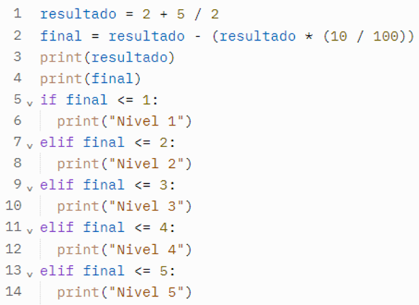
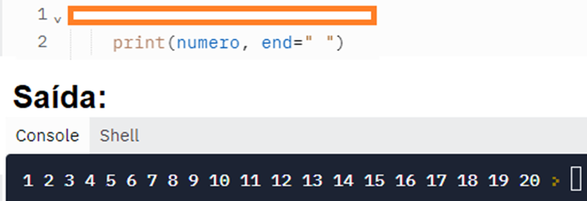
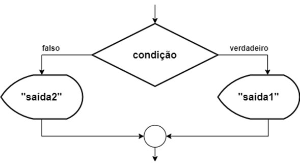
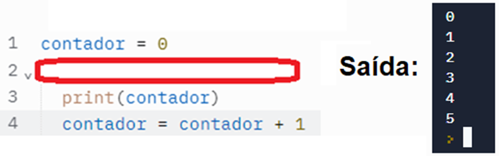
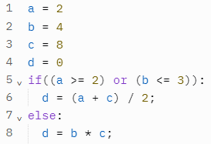
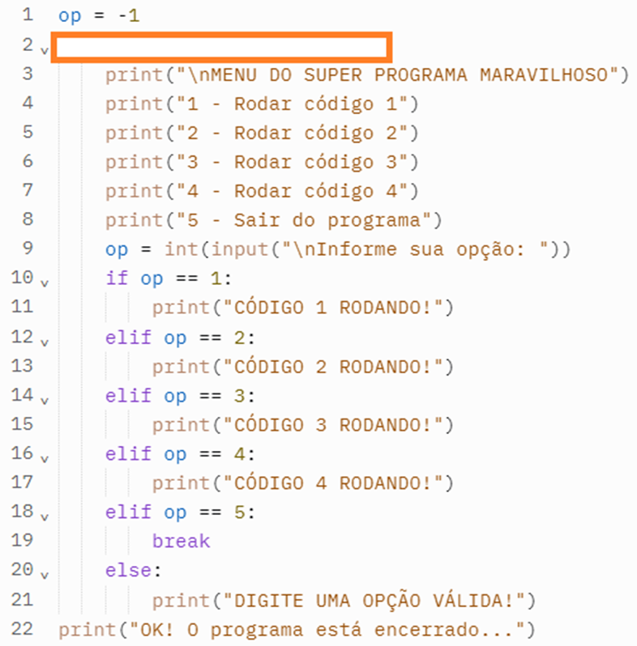
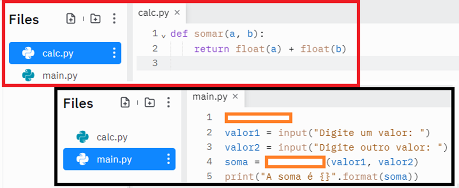
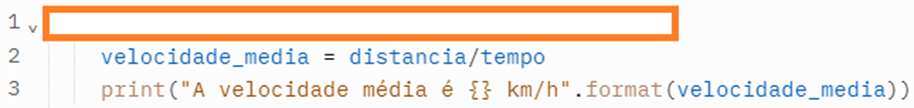
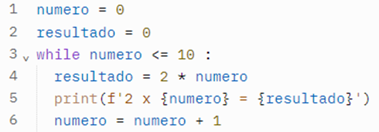

<h1>FASE 2 - PROTOTYPING</h1>
<h2>Capítulo 04: Quem tem o nome na lista? 📋</h2>

## `Listas`

Trata-se de uma estrutura de ***conteúdo mutável*** (podemos alterar os valores ao longo do código) ***e tamanho variável*** (podemos incluir novos ou excluir valores antigos) que ***pode armazenar diversos valores***.

> Exemplo em [exemplo_array_star_wars.py](./scripts/scripts-cap04/exemplo_array_star_wars.py).

Sintaxe:

~~~python
# Criação de uma lista
lista = ["Item 1", "Item 2", "Item 3", "Item 4"]
~~~

Há duas formas principais de exibir os valores de uma lista:

### 1. Exibindo um valor específico:
- utilizar seu índice! 
- cada valor que está presente na lista pode ser identificado por um número inteiro (índice), que ***inicia por 0***.

~~~python
print(item[2])
~~~

### 2. Exibindo a lista completa:
- utilizar o loop for. 
- informar a lista, e não a função range, como os valores que a variável pode assumir.

~~~python
for item in lista:
  # Para cada volta do loop, exibir o valor assumido
  print(item)
~~~

## Adicionando valores à lista

### 1. Método `append()`:
- é a solução mais simples.
- permite que um valor seja inserido ao final da lista.

~~~python
lista.append("novo item")
~~~

- se quisermos que o usuário digite o valor que será colocado no fim da lista, basta substituir o valor que está entre parênteses por um comando de input.

~~~python
lista.append(input("Digite um novo item: "))
~~~

### 2. Método `insert()`:
- permite incluir um valor em uma posição específica de sua lista.
- exige que o programador informe o índice em que o valor deve ser inserido.

~~~python
lista.insert(1, "novo item")
~~~

- ou seja, ao utilizar esse método, os índices dos outros valores são modificados para que a sequência se mantenha.
- para permitir que o usuário digite o valor, seguimos a mesma lógica acima.

~~~python
lista.insert(2, input("Digite um novo item: "))
~~~

## Removendo itens da lista

### Método `pop()`:
- remove o último valor inserido.

~~~python
lista.pop()
~~~

- para remover um item de uma ***posição específica***, indicar um índice entre parênteses.

~~~python
lista.pop(3)
~~~

### Método `remove()`:
- permite que indiquemos qual valor deve ser localizado e removido de qualquer posição da lista.

~~~python
lista.remove("item")
~~~

## Outros métodos importantes:

> arquivos [outros_metodos.py](./scripts/scripts-cap04/outros_metodos.py) e [media_notas.py](./scripts/scripts-cap04/media_notas.py).

### 1. `count()`:
- retorna a quantidade de vezes que um elemento aparece na lista.

### 2. `sort()`:
- organiza a lista em ordem crescente/alfabética.

### 3. `reverse()`:
- inverte a ordem dos elementos de uma lista.

Há, ainda, algumas ***funções*** importantes, como:

### 1. len:
- retorna o tamanho de um objeto.

### 2. sum:
- realiza a soma dos elementos presentes em um objeto.

---

## Funções

> arquivo [velocidade_media.py](./scripts/scripts-cap04/velocidade_media.py).

- consideradas “microprogramas”, que têm uma função específica, e podem ser convocadas quando necessárias.
- para indicar ao Python que uma nova função está sendo criada, utilizar a ***palavra reservada*** `def`, seguida do nome da função.
- uma função só entra em funcionamento quando ela é convocada.

~~~python
def nomeDaFuncao():
~~~

- não é uma boa prática fazer com que a função solicite valores durante seu funcionamento.
- ***solicitar valores (inputs) fora da função e passar para ela por meio de `argumentos ou parâmetros`***.
  - são informações que existem antes de a função ser executada.

> arquivo [somar.py](./scripts/scripts-cap04/somar.py).

- quando a função tiver o objetivo de retornar um dado, utilizar o comando `return` (ao invés de "print").
  - o comando return faz com que uma função seja encerrada e um determinado valor seja devolvido para o local onde ocorreu a chamada da função.

--- 

## Módulos

- são scripts Python que contêm funções e estruturas que podem ser incorporadas em outros scripts!
- ou seja, é possível utilizar as funções não apenas dentro de um mesmo script, mas entre diversos scripts que compõem um único sistema.

## Aplicando

> scripts [calc.py](./scripts/scripts-cap04/calc.py) (que contém apenas as funções necessárias para as quatro operações básicas) e [teste.py](./scripts/scripts-cap04/teste.py) (utilizado para testar o uso de módulos), ambos criados dentro de um mesmo projeto.

- para utilizar um módulo que foi criado, usar o comando `import`, que indica o arquivo ao qual queremos incorporar funções e estruturas.
- é possível, inclusive, importar funções específicas, como:

~~~python
from calc import somar, subtrair
~~~

- podemos também importar todas as funções de uma só vez, mas esse recurso deve ser usado com cautela,para que não tenhamos um programa desnecessariamente lento.

~~~python
from calc import *
~~~

> Outro exemplo em [calculadora.py](./scripts/scripts-cap04/calculadora.py) e [funcoes_calculadora.py](./scripts/scripts-cap04/funcoes_calculadora.py).

---

## FAST TEST

### 1. Selecione o comando correto para excluir o primeiro item da lista: numeros = [1, 4, 5, 8].
> numeros.pop(0)

### 2. Selecione a alternativa que contém o comando que exibe em tela apenas o nome "Luke" a partir da lista a seguir: jedi = ["Yoda", "Luke", "obi-Wan", "Anakin"].
> print(jedi[ 1 ]).

### 3. Selecione o comando para inserir um número no final da lista": numeros = [1, 4, 5, 8].
> numeros.append(10)

### 4. Escolha a alternativa que apresenta a sintaxe correta para a criaçãod e uma função com dois parâmetros em Python.
> def calculaValor(n1, n2).

--- 

## QUESTIONÁRIO INDIVIDUAL
### Cap 4 - Quem tem o nome na lista? - Lista de exercícios com loops

1. Avalie as afirmações a seguir:
- I - A estrutura for repete um bloco enquanto a condição for verdadeira. Um exemplo do seu formato é: for x <= 10:  
- II - No Python a função range() retorna uma lista de números inteiros em um determinado intervalo. Nesta função podemos especificar o início da sequência, o passo, e o valor final.
- III - A estrutura while é a ideal para fazer interações com listas e objetos do tipo iterable ou quando temos um número determinado de repetições. Um iterable é um objeto que o programador pode percorrer em um container. Um exemplo do seu formato é: while i in range(5,10): 
É correto o que se afirma em:
> II, apenas.

2. Analise o código Python a seguir:

Escolha a alternativa que apresenta a saída após a execução do código apresentado:
> Nível 5.

3. O código-fonte exibido parcialmente na imagem utiliza o comando for que é ideal para fazermos interações com listas e objetos. O laço for é utilizado também quando estamos diante de um problema que exige um número determinado de repetições.

Selecione a alternativa que apresenta corretamente este laço para obtermos a saída da imagem apresentada.
> for numero in range (1,21).

4. Selecione a alternativa que apresenta o comando para receber, converter e atribuir um dado do tipo real a uma variável em Python. 
> salario = float(input("Digite o salário R$ "))

5. Avalie o código Python a seguir:
~~~python
lista = [0,2,4,8,16,32,64,128]  
print(len(lista))
~~~
Selecione a alternativa que apresenta o resultado que será apresentado em tela após a execução deste código.
> 8

6. Escolha a alternativa que apresenta a estrutura if correta em Python para verificar se um valor está entre o intervalo de 20 a 25 inclusive.
> if (valor >= 20 and valor <= 25):

7. Escolha a alternativa que representa a estrutura representada pela figura a seguir.

> Estrutura de decisão composta.

8. Avalie o código Python a seguir:
~~~python
lista = [0,5,10,15,5,10,20]  
print(lista.count(5))
~~~
Selecione a alternativa que apresenta o resultado que será apresentado em tela após a execução deste código.
> 2

9. Avalie as afirmações a seguir sobre listas em Python:
- I - O método append() inclui um novo elemento no início de uma lista. 
- II - O método insert() inclui um novo elemento em uma posição específica da lista.
- III - O método pop() retira por padrão o último elemento de uma lista. Ele pode ser utilizado também para remover um elemento a partir do índice. 
É correto o que se afirma em:
> II e III, apenas.

10. A estrutura de repetição while (enquanto) executa a repetição de um bloco de instruções enquanto uma condição é verdadeira. A condição é verificada no começo da estrutura. Analise o código e a saída esperada:

Selecione as alternativas que podem completar corretamente o código-fonte e resultar na saída apresentada:
> while(contador<6): OU while(contador<=5): OU while(contador!=6):

11. Qual o valor da variável d após a execução do código Python abaixo?

> 5.0

12. Analise o código-fonte em Python a seguir:

Selecione a alternativa com a estrutura correta para que o código seja finalizado apenas quando for digitado o número cinco:
> while op != 5:

13. Módulos são scripts Python que contêm funções e estruturas que podem ser incorporadas em outros scripts. Pensando em um cenário onde criamos o nosso código-fonte em um arquivo chamado calc.py e dentro do mesmo a função chamada somar. Em seguida, dentro do mesmo projeto criamos o arquivo main.py que irá realizar a importação do calc.py e utilizará a função somar. Analise os códigos da imagem a seguir:

Selecione a alternativa que apresenta os trechos de comandos que preencham as lacunas da linha 1 e 4 respectivamente. Linha 1 = importar o módulo. Linha 4 = Utilizar a função do módulo.
> import calc e calc.somar

14. Uma função é uma sequência de comandos que executa alguma tarefa e que tem um nome. A função pode conter parâmetros que podem ser passados na chamada da função. Selecione a alternativa que apresenta um comando correto para a criação de uma função no Python.

> def calcularVelocidadeMedia(distancia, tempo):

15. Analise o código a seguir:

Selecione a alternativa que melhor representa a saída do código apresentado:
> Apresenta a tabuada de um número.

Arquivo contendo perguntas e respostas [aqui.](./outros/cap4_questionario.pdf)

--- 

[Voltar ao início!](https://github.com/monicaquintal/fintech)
