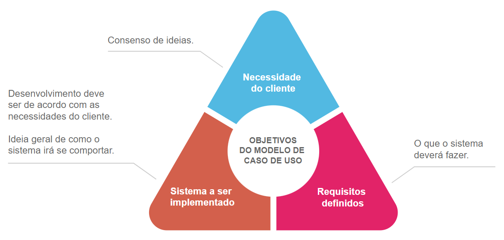
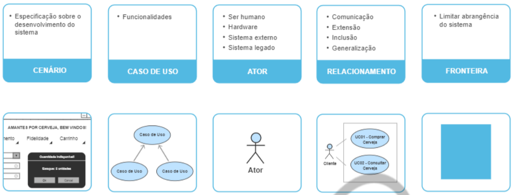
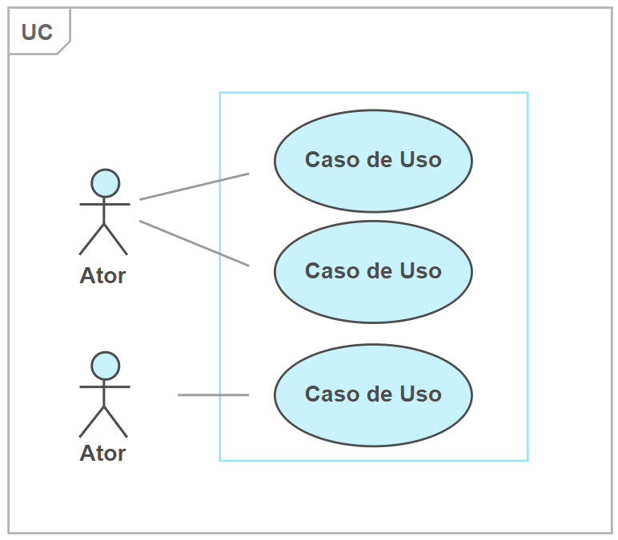
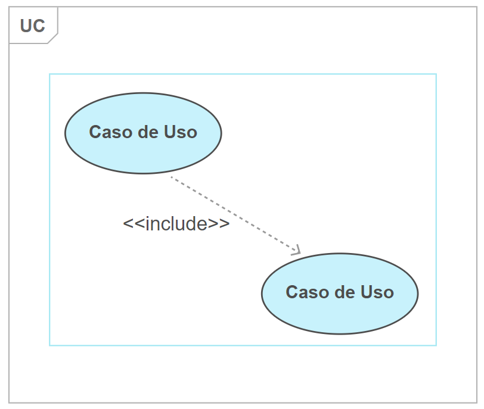
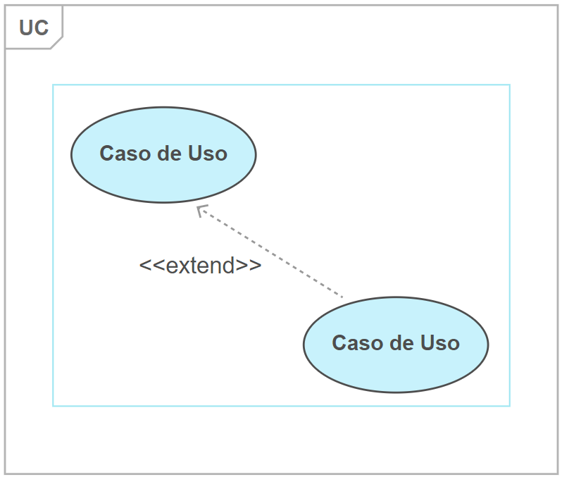
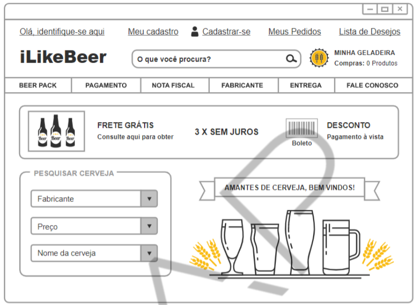
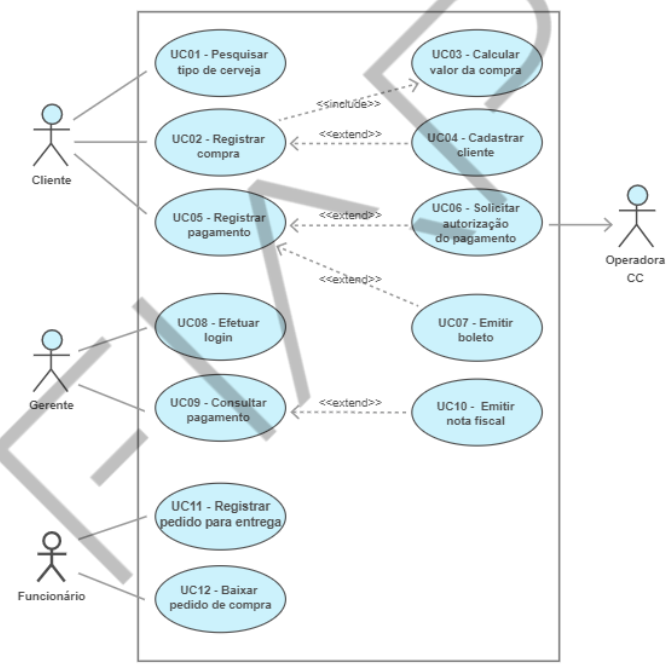
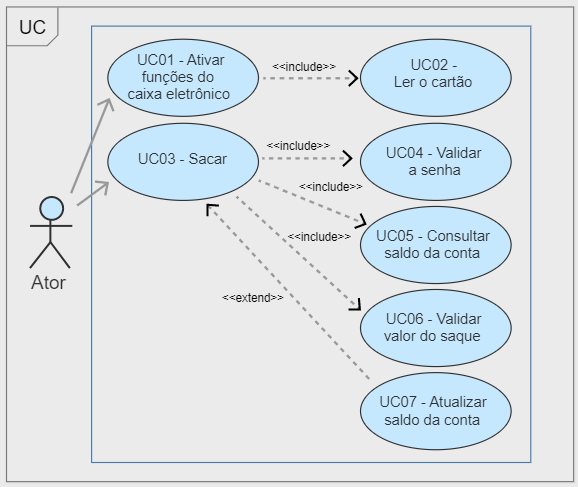

<h1>FASE 2 - PROTOTYPING</h1>
<h2>Capítulo 05: Entendendo o ponto de vista do usuário. 👤</h2>

## UML

## O que é `UML`?

- Linguagem de modelagem unificada.
- é uma linguagem visual para modelagem de sistemas.
- o aprendizado em UML começa com um diagrama essencial: o `Diagrama de Casos de Uso`:
  - utilizado para documentar o sistema sob o ponto de vista do usuário, formalizando o que ele pode ou não fazer. 

## `Modelo de Caso de Uso`

- possui três objetivos: 
  - descrever as necessidades do cliente.
  - definir a base do sistema a ser implementado.
  - estabelecer um conjunto de requisitos que serão validados quando o projeto for construído.
- é composto pelo Diagrama de Caso de Uso e suas documentações (descrições textuais).
- a técnica de modelagem de caso de uso que representam graficamente os Requisitos Funcionais do sistema são os Diagramas de Caso de Uso.

 

 
<em>Objetivos do modelo de caso de uso.</em>

- o modelo de caso de uso é elaborado durante as reuniões entre a equipe de desenvolvimento do sistema e as partes interessadas(stakeholders).
- tem como ***objetivo*** especificar os requisitos.
- composto do Diagrama de Caso de Uso e da descrição dos casos de uso (usualmente, uma descrição textual).
- a técnica de modelagem de caso de uso é a representação gráfica utilizada para descrever os requisitos de um sistema (conhecida como Diagrama de Caso de Uso).

## Conceito do modelo de caso de uso

- representação das funcionalidades externamente perceptíveis do sistema e dos elementos externos que trocam informações com ele.
- descreve os requisitos funcionais de um sistema sob o ponto de vista do usuário.
- a construção desse modelo associa:
  - funcionalidades do sistema (casos de uso),
  - seu ambiente operacional (atores) e
  - relacionamento entre eles (comunicação entre os atores e os casos de uso).
- ***objetivos***: especificar,construir e documentar o comportamento de cada parte que o sistema deve possuir.

## Elementos do modelo de caso de uso

- a construção desse modelo implicaa definição de diversos elementos relevantes ao sistema que será desenvolvido: cenário, caso de uso, ator, fronteira e os relacionamentos.

 

 
<em>Elementos de caso de uso.</em>

### 1. Cenário:

- um cenário é a descrição de uma das maneiras pelas quais um caso de uso pode ser executado ou realizado, também conhecido como ***instância de um caso de uso***.
- representa uma sequência de passos que descrevem uma interação entre um usuário e um sistema, detalhando o caminho do ponto inicial até o ponto final de um fluxo de eventos.
- fluxos:
  - pode envolver o Fluxo Principal e os Fluxos Alternativos ou de Exceção em qualquer combinação. Contudo, ***sempre começa pelo Fluxo Principal***!
  - **fluxo principal** trata-se do caminho perfeiro, onde o ator consegue obter exatamente o resultado esperado.
  - **fluxos alternativos** são as “opções” de ações que um ator pode realizar.
  - **fluxos de exceção** são indicações de como um dos atores (cliente ou sistema) reagirá caso encontre uma situação excepcional.
- exemplo:

Item | Valor
------|-------------
Caso de Uso | UC01 - Comprar cerveja
Sumário | Permite que o usuário efetue a compra de cerveja
Ator | Cliente
Precondição | Ter estoque disponível
Pós-condição | Registrar a compra e o pagamento
Fluxo principal | FP01 - O cliente seleciona a cerveja que deseja comprar. FP02 - O cliente informa a quantidade desejada. FP03 - O sistema verifica se há estoque disponível. FP04 - O sistema calcula o valor total da compra.
Fluxo(s) alternativo(s) | FAO01 - O cliente pode alterar a quantidade desejada. O sistgema retorna ao FP03.
Fluxo(s) de exceção | FE01 - O sistema exibe a mensagem "cerveja indisponível". Encerra o caso de uso.

### 2. Caso de Uso:

- o caso de uso especifica uma sequência de ações realizadas pelo sistema que produzem um resultado perceptível e de valor para o ator.
- caso de serviço interrompido: é uma história que descreve um serviço interrompido.
- portanto, caso de uso descreve uma sequência completa de interações, ou seja, como se relacionarão as funcionalidades umas com as outras e como serão utilizadas pelo usuário (ator) durante o funcionamento do sistema.
  - para descrever essa interação, utiliza-se uma metodologia que serve para padronizar a descrição da funcionalidade.
  - o desenvolvedor utilizará o caso de uso para implementar o sistema, ou o analista validará o desenvolvimento ou fará os testes, e entenderão a funcionalidade de uma maneira única!
- o caso de uso não representa um passo ou uma etapa em uma funcionalidade do sistema; é a especificação detalhada de uma das funcionalidades!
- ***como identificá-los***:
  - O que o ator pode fazer ao utilizar o sistema?
  - O ator precisa registrar, consultar, alterar ou excluir dados ou informações do sistema?
  - O ator será notificado sobre eventos do sistema?
  - O ator precisa informar o sistema sobre algum evento?
  - Há comunicação com outros dispositivos?
  - Há comunicação com outros sistemas?

### 3. Ator:

- corresponde a um papel representado por algo ou alguém, sendo qualquer elemento externo ao sistema (humano, hardware, dispositivo ou sistema externo que interage com o sistema em questão).
- é quem interagirá (trocará informações) com o sistema.
- sua representação é feita por um boneco e um rótulo com o nome.
  - quando o ator é humano: identificar com o nome do papel que executa, como funcionário, usuário, cliente ou atendente.
  - para representar um sistema, um módulo ou componente de outro sistema (externo ao que está sendo documentado; a equipe desconhece seu escopo e é alheia a qualquer responsabilidade), utiliza-se um ator sistêmico.
    - o sistema documentado é usuário desse sistema externo ou serve a ele, e o sistema externo torna-se, portanto, usuário dele.
    - no diagrama, deve possuir seu nome de fato (se o ator é o sistema “legado”, esse deve ser o seu nome).
- interage com o sistema, dando estímulos necessários para que ocorra troca de informações com as funcionalidades.
- externo ao sistema, ficam fora da fronteira.
- ***como identificar os atores:***
  - Quem usa o sistema?
  - Quem inicializa o sistema?
  - Quem fornece os dados?
  - Quem remove os dados?
  - Quem usa as informações?

### 4. Fronteira:

- delimita o limite do nosso sistema, compreendendo todos os seus casos de uso.
- constitui-se dos casos de uso que compõem o sistema, ou seja, é o limite do sistema.
- representada por um retângulo.
- a sigla UC no canto superior do retângulo identifica que cada um deles é um caso de uso (user case) diferente.

### 5. Relacionamento:

- a estruturação do modelo de caso de uso envolve a utilização dos seguintes tipos de relacionamento:
  - comunicação: indica qual caso de uso o ator vai interagir (linha sólida).
  - inclusão: apenas casos de uso (linha tracejada, a ponta da seta aponta o caso de uso incluido), relação de obrigação.
  - extensão: apenas em casos de uso, indica condição (linha tracejada, apontada para o caso de uso que solicita a extensão).
  - generalização: ocorre somente entre atores OU entre casos de uso. Associa características semelhantes, e permite concentrar-se às diferenças.
- no modelo de caso de uso, pode haver relacionamentos entre:
  - o ator e o caso de uso;
  - atores (um ator e outro ator);
  - casos de uso (um caso de uso e outro caso de uso).
 

***a. Associação por comunicação:*** 
 

- o relacionamento mais utilizado de um ator para com um caso de uso é a associação por comunicação (o ator executa a funcionalidade especificada no caso de uso).
- também conhecido como associação por comunicação.
- indica com qual caso de uso um determinado ator troca informações. 
- um ator pode interagir com mais de um caso de uso do sistema.
- é representada por uma linha sólida:
  - se a linha sólida contém a cabeça de flecha: somente o elemento que está no fim da flecha pode iniciar a comunicação.
  - caso a linha sólida não tenha a cabeça de flecha, então, quaisquer dos dois elementos, o caso de uso ou o ator, podem iniciar a interação.

 

 
<em>Associação por comunicação.</em>

 

***b. Associação por inclusão:*** 
 

- conecta o caso de uso base ao caso de uso incluído.
- esse tipo de relacionamento existe somente entre casos de uso.
- identifica um processo obrigatório (o caso de uso incluído será executado sempre que o caso de uso base for executado).
- o caso de uso base pode ter sua execução dependente do resultado do caso de uso incluído.
- quando dois ou mais casos de uso incluam uma sequência comum de interações, descrevê-la em outro caso de uso (vários casos de uso do sistema poderão incluir o comportamento desse caso de uso comum). 
  - abstém a repetição da descrição de uma mesma sequência de interações e 
  - transforma a descrição dos casos de uso mais simples e de manutenção mais facilitada.
- representadas por uma linha tracejada e a seta aponta para o caso de uso incluído e o estereótipo `<<INCLUDE>>`.

 

 
<em>Associação por inclusão.</em>

 

***c. Associação por extensão:*** 
 

- identifica um processo que pode ou não ser executado.
- ocorre em uma situação específica, na qual uma condição é satisfeita.
- esse relacionamento só aconteceentre casos de uso.
- utilizado para modelar situações em que diferentes sequências de interações podem ser inseridas em um mesmo caso de uso.
- não há como existir um relacionamento de associação de comunicação entre um ator solicitante e um caso de uso estendido.
- representadas por uma linha tracejada e a seta aponta para o caso de uso que utiliza o caso de uso estendido e o estereótipo `<<EXTEND>>`.

 

 
<em>Associação por extensão.</em>

 

***d. Associação por generalização:*** 
 

- permite que um caso de uso ou ator herde características de outro mais genérico, chamado de caso de uso ou ator-base.
- objetivo: indicar que dois ou mais casos de uso ou atores têm comportamentos semelhantes.
- o caso de uso abstrato é utilizado apenas para capturar a natureza semelhante entre os casos de usos filho, conhecidos como concretos.
- relaciona dois ou mais casos de uso com características semelhantes, apresentando pequenas diferenças entre si.
  - define-se um caso de uso geral e casos de uso que são especializações dele.
  - evita-se a redação das partes genéricas em mais de um caso de uso e
  - a redação dos casos de uso especializados se concentra nas diferenças.
- pode existir entre dois casos de uso ou entre dois atores.

 

 
<em>Associação por generalização.</em>

 

---

<h2>Diagrama de Caso de Uso</h2>

O Diagrama de Caso de Uso apresenta o comportamento externo do sistema, como os casos de uso interagem entre si e com os atores; como as funcionalidades se relacionarão umas com as outras; e como serão utilizadas pelo usuário durante o funcionamento do sistema.

## Construção do DCU

- pode ser elaborado na fase de planejamento e análise com o auxílio de ferramentas específicas para modelagem UML, como o "Astah".
- porém, também auxilia nas demais fases: projeto, implementação e testes.

## Passos para elaborar o DCU

1. Identifique o(s) ator(es).
2. Identifique o(s) caso(s) de uso.
3. Identifique o(s) relacionamento(s) entre o(s) ator(es) e o(s) caso(s) de uso.
4. Identifique o(s) relacionamento(s) entre o(s) caso(s) de uso, se houver.
5. Identifique o(s) relacionamento(s) entre o(s) ator(es), se houver.

## Descrição do Caso de Uso

***Documentação de caso de uso***: além da modelagem gráfica, o Diagrama de Caso de Uso deve apresentar a especificação de detalhamento do Diagrama de Caso de Uso!

--- 

## Estudo de caso

***Cenário:*** e-commerce de cerveja.

Um cliente entra no site da loja Amantes das Cervejas e pesquisa os tipos de cerveja desejadas; seleciona o fabricante e/ou o nome da cerveja, ou a faixa de preço. O sistema deve exibir os dados da pesquisa em até 3 segundos. 
Para efetuar o pedido, o cliente seleciona a cerveja e informa a quantidade desejada. O sistema calcula o preço total. 
Para finalizar a compra, o cliente preenche o cadastro, caso não o possua. Preenche o campo “Dados do cliente”, informando nome, endereço de entrega, telefone e CPF.  
Os dados devem ser armazenados em banco de dados Oracle 11g. 
O cliente efetua o pagamento. Para isso, seleciona a forma de pagamento. Se for por cartão de crédito, o cliente informa os dados do cartão: número, data de validade, nome, nome da operadora do cartão de crédito e o código de segurança. O sistema deve solicitar a autorização do pagamento para a operadora do cartão de crédito. Se o pagamento for por boleto, o sistema emite o boleto. 
O funcionário, gerente do setor financeiro, efetua o login com a senha de administrador e consulta os pagamentos. Se confirmar o pagamento, emite a nota fiscal. 
O funcionário separa e envia os produtos para a transportadora que fará a entrega. Ao encaminhá-los, o funcionário registra o envio do pedido para entrega, informa o status do pedido, por exemplo, “enviado para entrega”. 
Ao receber os produtos, o cliente assina a nota de entrega, que possui um QR code que identifica o pedido efetuado pelo cliente. Por meio do QR code, o funcionário efetua a baixa do pedido caso haja a assinatura do cliente e a data de entrega. 

***Pede-se:*** elaborar o Diagrama de Caso de Uso.

 

 
<em>Protótipo de e-commercede cerveja.</em>

 

> Para elaborar o Diagrama de Caso de Uso, seguir os cinco passos descritos na seção “Construção do Diagrama de Caso de Uso”.

### Passo 1: Identificar o(s) ator(es)!

- o ator representa o papel que os usuários, o sistema externo, o hardware ou o(s) dispositivo(s) desempenham, a medida que interagem com o sistema.
- **nesse caso**, os atores são: 
  - cliente, 
  - gerente, 
  - funcionário e 
  - operadora de cartão de crédito.

### Passo 2: Identificar o(s) caso(s) de uso.

- o caso de uso representa a especificação detalhada de uma das funcionalidades do sistema, ou seja, executa a tarefa solicitada pelo ator, demonstrando todos os passos necessários para a conclusão do processo.
- são eles:

Caso de uso | Ator | Objetivo
------------|------|---------
Pesquisar tipo de cerveja | Cliente | Pesquisar os tipos de cerveja desejados
Efetuar compra | Cliente | Registrar o pedido de compra
Calcular o valor da compra | Ação executada pelo sistema, desencadeada pelo usuário | Ativar o sistema para calcular o preço total da compra quando o cliente seleciona a cerveja e informa a quantidade
Cadastrar cliente | Cliente | Efetuar o cadastro dos dados do cliente na base de dados
Registrar o pagamento | Cliente | Registrar o pagamento da compra
Solicitar a autorização do pagamento | Sistema e sistema externo da operadora do cartão de crédito | Solicitar a autorização do pagamento para a operadora do cartão de crédito quando o cliente informa os dados do cartão
Emitir o boleto | Ação executada pelo sistema, desencadeada pelo usuário | Ativar o sistema para emitir o boleto quando o cliente seleciona a forma de pagamento "boleto"
Efetuar login | Gerente financeiro | Validar a senha para efetuar login
Consultar pagamento | Gerente financeiro | Consultar os pagamentos
Emitir nota fiscal | Gerente financeiro | Emitir o boleto após o gerente financeiro consultar o registro do pagamento
Registrar pedido para entrega | Funcionário | Registrar o pedido de entrega afim de atualizar o status do pedido
Dar baixa no pedido de compra | Funcionário | Dar baixa no pedido de compra após a confirmação de entrega

### Passo 3: Identificar o(s) relacionamento(s) envolvidos nesse cenário

- o relacionamento indica quem solicita, quem realizae como será executada uma funcionalidade.
- **nesse exemplo**, deve-se analisar se todo ator tem, no mínimo, uma associação com um caso de uso; e se todo caso de uso interage com algum ator ou com outro caso de uso.

### Passo 4: Identificar o(s) relacionamento(s) entre o(s) caso(s) de uso, se houver.

- verificar se existe a necessidade do relacionamento de inclusão, extensão ou generalização.

### Passo 4: Identificar o(s) relacionamento(s) entre o(s) ator(es), se houver.

- deve-se verificar se existe a necessidade do relacionamento generalização entre os atores.

 

 
<em>Diagrama de Caso de Uso.</em>

 

---

## Exercício proposto

Considere a especificação sobre os caixas eletrônicos de uma instituição financeira descrita a seguir. 
A população enfrenta grandes filas nos bancos. Isso ainda ocorre porque os usuários do nosso sistema financeiro não conhecem totalmente as funções dos caixas eletrônicos que evitariam as filas no caixa do banco. Porém, o que exatamente os usuários podem fazer nos caixas eletrônicos? 
O usuário insere o cartão, o sistema lê e faz a validação dos dados: agência, número da conta e tipo de operação do usuário. Se o cartão for inválido, o sistema exibe a mensagem “Cartão Inválido”, caso contrário, deve ativar as funções do caixa eletrônico. O sistema exibe as funções: Pagamento, Saque, Saldo, Depósito e Investimento. 
O usuário seleciona a função desejada, o sistema solicita a senha. O usuário informa a senha, o sistema valida a senha. Se for inválida, o sistema exibe a mensagem “Senha Inválida”; se for válida, solicita o valor do saque, por exemplo. 
O usuário informa o valor do saque, o sistema valida se há saldo suficiente na conta. Caso não tenha saldo, o sistema exibe a mensagem “Saldo Insuficiente”. Se tiver saldo, o sistema valida o valor do limite diário para saque. Se o valor estiver dentro do limite, registra o valor do saque e atualiza o saldo. No momento do registro do saque, instancia o objeto saque; senão, o sistema exibe a mensagem "Valor Excede o Limite". 
 
Pede-se: 

1. Listar o(s) ator(es)desse cenário.

- usuário.

2. Listar os requisitos funcionais.

Caso de uso | Ator | Objetivo
-----------|-------|------------
Ativar as funções do caixa eletrônico | Usuário | Acessar as funções do caixa eletrônico
Ler os dados do cartão | Ator secundário: ação executada pelo sistema, desencadeada pelo usuário | Validar os dados do cartão
Validar a senha | Ator secundário: ação executada pelo sistema, desencadeada pelo usuário | Validar a senha do usuário
Sacar | Usuário | Registrar o valor do saque
Consultar o saldo da conta | Ator secundário: ação executada pelo sistema, desencadeada pelo usuário | Consultar se há saldo suficiente para registrar o saque
Validar o valor do saque | Ator secundário: ação executada pelo sistema, desencadeada pelo usuário | Validar se o valor do saque está dentro do limite diário para saque
Atualizar o saldo da conta | Ator secundário: ação executada pelo sistema, desencadeada pelo usuário | Atualizar o saldo da conta

3. Elaborar o Diagrama de Caso de Uso

 

 
<em>Diagrama de Caso de Uso.</em>

 

---

## FAST TEST

### 1. Selecione a alternativa correta sobre relacionamentos do tipo associação por comunicação:
> Associação por comunicação indica caso no qual um ator troca informações. É representada por uma linha sólida no Diagrama.

### 2. Selecione a alternativa correta sobre relacionamentos do tipo associação por inclusão:
> Associação por inclusão pressupõe que exista um caso de uso base. O caso base inclui o caso específico, por isso a associação entre eles.

### 3. Selecione a alternativa INCORRETA sobre a elaboração do Diagrama de Caso de Uso:
> O Diagrama de Caso de Uso é usado apenas na fase de implementação de projeto de desenvolvimento de software,

### 4. Selecione a alternativa correta sobre os casos de uso:
> Caso de uso representa uma especificação detalhada de uma funcionalidade do sistema, ou seja, como o sistema executa a tarefa solicitada pelo ator.

### 5. Selecione a alternativa correta sobre os atores do Diagrama de Caso de Uso:
> Ator é um papel representado por algo ou alguém, sendo qualquer elemento externo ao sistema.

--- 

[Voltar ao início!](https://github.com/monicaquintal/fintech)