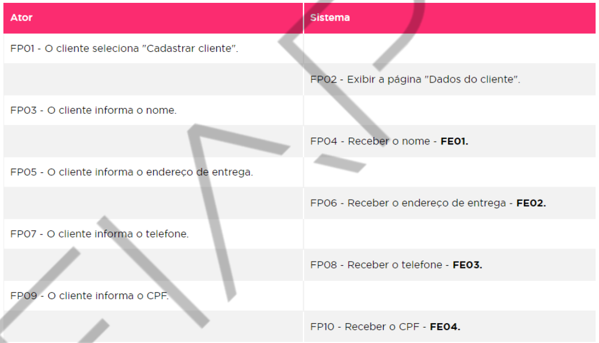
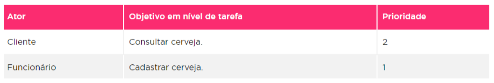
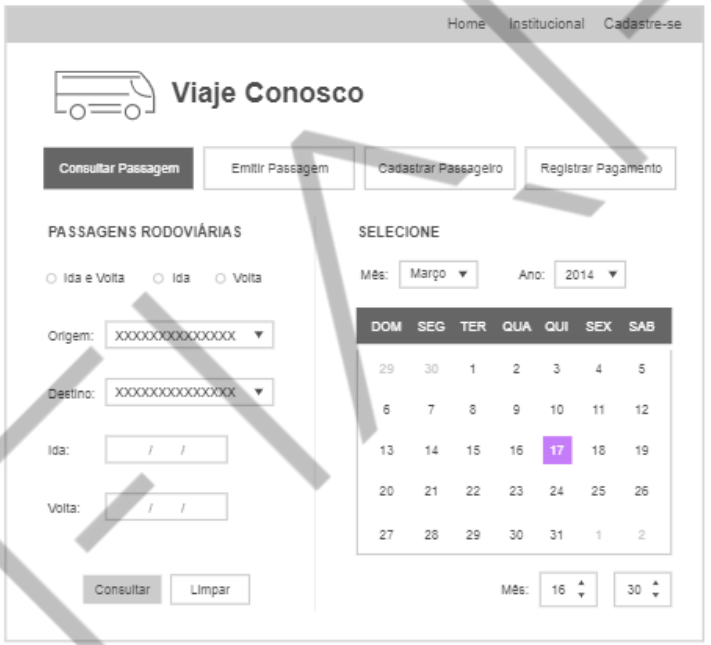
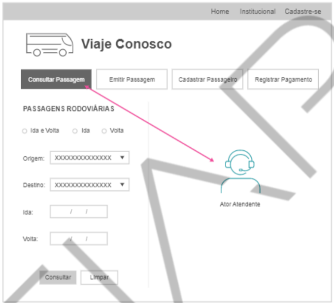
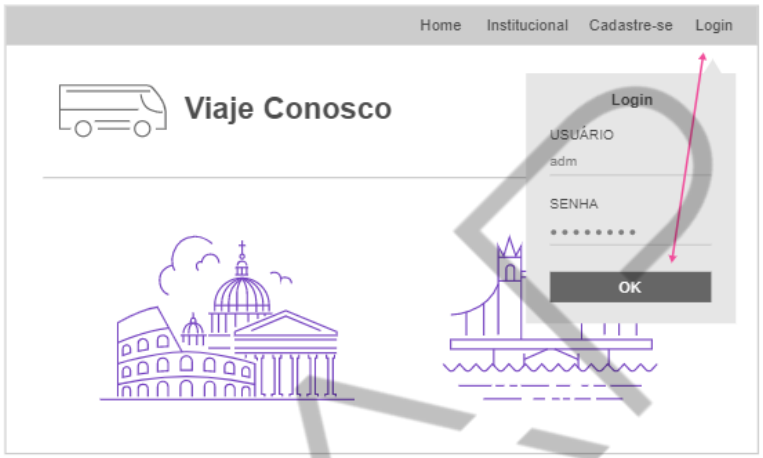
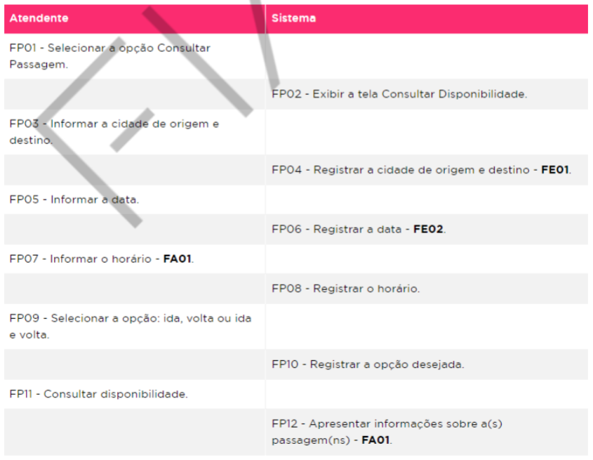
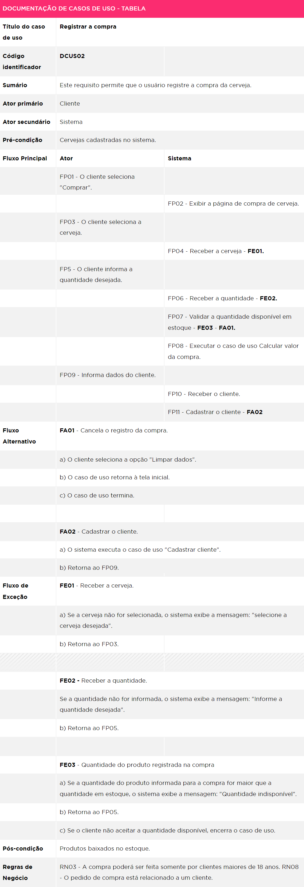
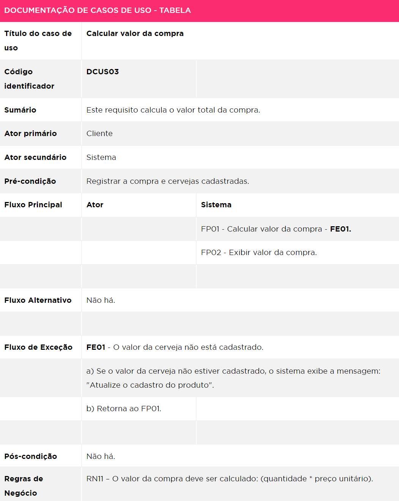
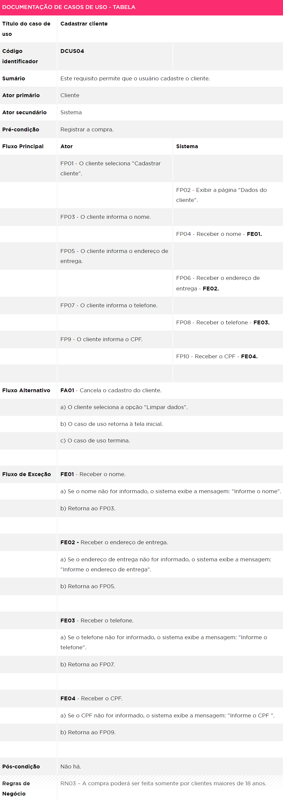
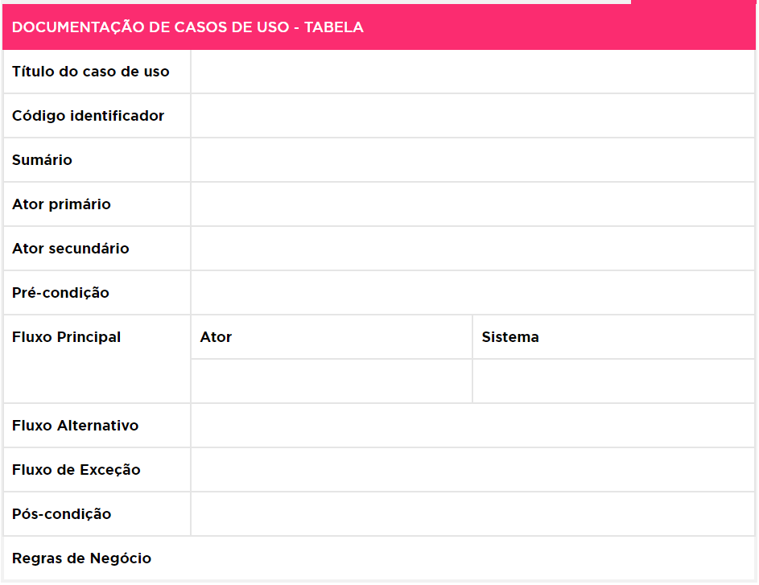

<h1>FASE 2 - PROTOTYPING</h1>
<h2>Capítulo 06: Infelizmente, diagramas não são o suficiente... 😢</h2>

## Conceito das especificações de casos de uso

- um caso de uso é realizado por meio de cenários:
  - cenário = descrição de uma das maneiras pelas quais um caso de uso pode ser executado ou realizado.
  - cada cenário possui um conjunto de passos,mostrando como um caso de uso é executado.
- a realização do caso de uso permite:
  - organizar os artefatos relacionados ao caso de uso e 
  - elaborar os diagramas de classes e de sequência que expressam o comportamento do caso de uso em termos de objeto.
- as especificações dos casos de uso são narram situações de como o sistema irá se comportar.

## Documentação de caso de uso

- cada caso de uso se define pela descrição narrativa (textual) das interações que ocorrem entre o(s) elemento(s) e o sistema.
- além da modelagem gráfica, o Diagrama de Caso de Uso deve possuir a descrição textual (documentação de caso de uso).
- deve ser escrita em forma funcional, objetiva e clara.

## Objetivos

- Permitir especificar o comportamento do sistema.
- Fazer descrição textual do caso de uso e narrar o cenário do requisito funcional.
- Oferecer detalhes ao leitor sem minúcias técnicas e detalhar a visão do sistema sobre o negócio.
- Auxiliar na validação do protótipo.
- Esclarecer a interação existente entre os atores e as funcionalidades do sistema.

## Grau de detalhamento do caso de uso

- pode variar desde o mais resumido até a narração com muitos detalhes.
- depende da complexidade da interação entre os atores e o sistema.

## Modelo da documentação de caso de uso

- refere-se à estrutura empregada.
- não há um modelo específico, existindo vários templates possíveis.
  - os mais usados são: tabular (colunas) e sequancial (descritivo corrido).
- nesta disciplina, utilizaremos o `modelo tabular`:
  - a sequência de interações entre ator e sistema é dividida em duas colunas de uma tabela.
  - tem objetivo de desmembrar as ações entre os atores e o sistema.

 

 
<em>Exemplo de aplicação do modelo tabular de documentação de caso de uso.</em>

 

## Itens que auxiliam a elaboração da documentação de caso de uso:

### 1. Lista por objetivo:

- pode ser elaborada ao se enumerar todos os casos de uso, expondo o conteúdo funcional do sistema, e inserindo apenas as funcionalidades que realmente serão implementadas pelo sistema.
- garante uma visão geral do sistema.
- é possível utilizar uma tabela para ajudar na elaboração da lista.

 

 
<em>Lista por objetivo.</em>

 

### 2. Condições de falha:

- identificar as possibilidades de erros que podem ocorrer em cada caso de uso sendo documentado.
- especificar as falhas antes de detalhar como o sistema deverá tratá-las.

### 3. Tratamento de falha:

- descrever como o sistema deve responder a cada falha. 
- verificar se há alguma regra de negócio relacionada ao assunto (em caso de falha, o que o sistema deve fazer?).

## Template da documentação de caso de uso

## Título do caso de uso

- o nome do caso de uso deve ser o mesmo utilizado no Diagrama de Caso de Uso!!!

## Identificador

- é um código único, utilizado para identificar a descrição de um cenário do caso de uso.
- o identificador deixa claro que cada caso de uso é único.

## Sumário

- breve descrição sobre a funcionalidade (caso de uso).

## Ator

- lista o(s) ator(es) envolvido(s) no caso de uso.

## Ator primário

- ator que inicia a interação com o sistema para alcançar um objetivo.

## Ator secundário

- demais participantes do caso de uso, se houver.
- muitos atores podem entrar nesta categoria, ou até mesmo nenhum.

## Pré-condição

- identifica outro caso de uso que deve ocorrer antes desse; hipótese que deve ser verdadeira antes da execução deste caso de uso. P
- pode conter nenhuma ou mais pré-condições.

## Fluxo Principal

- descreve o passo a passo da interação entre o ator e o sistema na execução do caso de uso (o que normalmente acontece quando um caso de uso é executado).

## Fluxo Alternativo

- descreve o que ocorre quando o ator faz uma escolha alternativa, diferente da citada no Fluxo Principal.
- um Fluxo Alternativo descreve um comportamento alternativo para a execução do Fluxo Principal, que substitui parte do comportamento do Fluxo Principal.

## Fluxo de Exceção

- um evento que impede que o caso de uso seja concluído, ou seja, o que pode ocorrer de excepcional durante aquele cenário.
- complementa o comportamento do Fluxo Principal do caso de uso base, porém não substitui parte do comportamento do Fluxo Principal.
- as exceções indicam as situações que devem ser tratadas pelo sistema, como:
  - comportamentos indesejados.
  - algo que possa interromper o funcionamento do sistema.
  - situação de inconsistência.
  - violações às regras de negócio.
  - algo inesperado.
  - falha.

## Pós-condição

- identifica um cenário ou uma situação gerada após o caso de uso ser realizado.

## Regras de Negócio

- uma ou mais.

> Observação: Números nos Fluxos de Exceção ou Alternativos referem-se aos números dos passos no cenário do Fluxo Principal (FP), nos quais cada situação diferente é detectada (por exemplo, os passos 2ae 3b indicam condições diferentes que podem aparecer no passo 2).

---

## Estudo de caso

## ***Cenário:*** Sistema de venda de passagens rodoviárias da companhia Viaje Conosco.

"No caso de o passageiro não possuir reserva da passagem, ele pode comprá-la no balcão de atendimento da companhia de ônibus. Para isso, o atendente consulta a disponibilidade da passagem, informa a cidade de destino, a cidade de origem, o dia e horário que deseja embarcar ou desembarcar e seleciona a opção: ida, volta ou ida e volta. 
Caso exista disponibilidade, o atendente emite a passagem. Nesse momento, deve cadastrar o passageiro, informando o nome, a data de nascimento, a idade, telefone, RG e CPF. Se o passageiro for menor de idade, o atendente deve emitir o formulário de autorização de embarque para que o responsável preencha e assine. 
O passageiro realiza o pagamento ao atendente no balcão da companhia. O atendente registra o valor recebido. Se o passageiro desejar trocar a passagem já comprada, o funcionário consulta a disponibilidade da passagem. Se houver disponibilidade, o atendente registra a troca da passagem. 

## ***Regras de Negócio***
- RN01 – Um passageiro pode comprar uma ou várias passagens.
- RN02 – Cada passagem se refere exclusivamente a um destino específico.
- RN03 – A passagem pode ser trocada caso haja disponibilidade na data e horário desejados.
- RN04 – A passagem pode ser trocada com antecedência de 24 horas da data de embarque.
- RN05 – O passageiro menor de idade poderá embarcar desde que apresente o formulário de autorização de embarque preenchido e assinado pelo responsável.
- RN06 – Para interagir com o sistema, o usuário deve estar logado.

> Importante: CASOS DE USO DEVEM SER DPCUMENTADOS INDIVIDUALMENTE! Jamais documentar, de modo geral, o Sistema da "Viaje Conosco", por exemplo.

## ***Documentação do caso de uso:*** Consultar passagem.

### UC – Consultar disponibilidade da passagem

### Título do caso de uso: UC – Consultar passagem

 

 
<em>Protótipo do Consultar passagem.</em>

 

### Código identificador: UCXX – Consultar passagem.
- onde “XX” = número do caso de uso.

### Sumário: o atendente utiliza o sistema para consultara disponibilidade das passagens.

### Ator primário: atendente.

### Ator secundário: sistema.

 

 
<em>Ator do Consultar passagem.</em>

 

### Pré-condição: o usuário deve estar logado no sistema.

 

 
<em>Protótipo de Pré-condição.</em>

 

### Fluxo Principal: 
- descrevemos o caminho ideal na forma de uma lista numerada em que uma ou mais linhas apresentam a ação do ator e, na seguinte, aparece a resposta do sistema, ou vice-versa.

 

 
<em>Fluxo Principal – Consultar passagem.</em>

 

- importante: informar origem, destino, data e hora ***não são RF!*** São campos/atributos contidos no RF Consultar Disponibilidade de Passagem.

### Fluxo Alternativo:

***FA – Exibir outras datas, horários e vagas disponíveis:***
- FA01 -Se não houver vaga disponível para o destino consultado, o sistema emite a mensagem "Não existem vagas para os dados informados" e exibe a lista com outros horários, datas e vagas disponíveis. 
a) Se o cliente aceitar, o atendente executa o caso de uso Emitir passagem.  
b) Se o cliente não aceitar, poderá executar Nova consulta de passagem.  
c) Ou encerra o caso de uso. 

### Fluxo de Exceção:

***FE01 - O destino desejado (consultado) não é operado pela companhia:*** 
a)O sistema emite a mensagem "Não existem corridas para os dados informados".  
b)Encerra o caso de uso. 
 

***FE02 - Dados de consulta não foram preenchidos:*** 
a) Caso o atendente não preencha a cidade de destino, origem, o horário ou a data, o sistema emite a mensagem "Informe os dados obrigatórios". 
b)O caso de uso retorna para o Fluxo Principal (FPXX). 

### Pós-condição: após a consulta da passagem, o atendente emitirá a passagem.

### Regras de Negócio: 
- RN07 – Cada passagem se refere exclusivamente a um destino específico.

---

## Cenário: e-commerce de cerveja

"Um cliente entra no site da loja Amantes das Cervejas e pesquisa os tipos de cerveja desejados; seleciona o fabricante e/ou o nome da cerveja ou a faixa de preço. O sistema deve exibir os dados da pesquisa em até 3 segundos. 
Para efetuar o pedido de compra, o cliente seleciona a cerveja e informa a quantidade desejada. O sistema calcula o preço total.  
Para finalizar a compra, o cliente preenche o cadastro, caso não o possua. Preenche o campo “Dados do cliente”. O cliente informa nome, endereço de entrega, telefone e CPF. 
Os dados devem ser armazenados em banco de dados Oracle 11g. 
O cliente efetua o pagamento; para isso, seleciona a forma de pagamento. Se o pagamento for via cartão de crédito, o cliente informa os dados do cartão: número, data de validade, nome, nome da operadora do cartão de crédito e o código de segurança. O sistema deve solicitar a autorização do pagamento para a operadora do cartão de crédito. Se o pagamento for por boleto, o sistema emite o boleto. 
O funcionário, gerente do setor financeiro, efetua o login com a senha de administrador. Consulta os pagamentos, se confirmar o pagamento, emite a nota fiscal. 
O funcionário separa e envia os produtos para a transportadora que fará a entrega. Ao encaminhá-los, o funcionário registra o envio do pedido para entrega, informa o statusdo pedido, por exemplo, enviado para entrega. 
Ao receber os produtos, o cliente assina a nota de entrega que possui um QR code que identifica o pedido feito pelo cliente. Por meio do QR code, o funcionário efetua a baixa do pedido, caso haja a assinatura do cliente e a data de entrega." 

## Regras de Negócio:

- RN01 – A consulta da cerveja pode ser filtrada por fabricante, nome ou faixa de preço.
- RN02 – O pagamento pode ser efetuado via cartão de crédito ou boleto bancário.
- RN03 – A compra poderá ser feita somente por clientes maiores de 18 anos.
- RN04 – Vendas com valor acima de R$200,00 ganham frete grátis.
- RN05 – Após a confirmação do pagamento, os pedidos concluídos até as 18 horas serão entregues em até 12 horas.
- RN06 – Após a confirmação do pagamento, os pedidos concluídos entre 18h01 e 6 horas serão entregues em até 24 horas.
- RN07 – Após a confirmação do pagamento, deve ser emitida a nota fiscal eletrônica.
- RN08 – O pedido de compra está relacionado a um cliente.
- RN09 – O pagamento está relacionado a um pedido de compra.
- RN10 – O pedido está relacionado a um QR Code.
- RN11 – O valor da compra deve ser calculado: (quantidade * preço unitário).

## Documentação de Casos de Uso

Campo | Correspondência
------|----------------
Título do caso de uso | Pesquisar tipo de cerveja
Código identificador | DCUS01
Sumário | Este requisito permite que o usuário consulte a cerveja desejada, obtendo informações sobre o nome, o fabricante e o preço da cerveja
Ator primário | Cliente
Ator secundário | Sistema
Pré-condição | Cervejas cadastradas no sistema
Fluxo principal | Ator: FP01 - O cliente seleciona Consultar cerveja  Sistema: FP02 - Exibir a página de consulta de cerveja Ator: FP01 - Seleciona o fabricante ou o nome ou a faixa de preço da cerveja - ***FA01***. Sistema: FP02 - Receber o fabricante, nome ou a faixa de preço - ***FE01***. Sistema: FP03 - Exibir dados: nome, fabricante e preço da cerveja - ***FE02***.
Fluxo Alternativo | ***FA01*** - Cancela a consulta a) O cliente seleciona a opção "Limpar dados" b) O caso de uso retorna à tela inicial c) O caso de uso termina
Fluxo de Exceção | ***FE01*** - Receber o fabricante, nome ou a faixa de preço da cerveja. - ***RN01*** Se o fabricante, nome ou faixa de preço da cerveja não for selecionado, o sistema exibe a mensagem: "Selecione uma opção: fabricante, nome ou faixa de preço" Retorna ao FP01 ***FE02*** - Nenhuma cerveja encontrada a) Se não houver nenhuma cerveja cadastrada com o nome, fabricante ou faixa de preço será apresentada a mensagem “Nenhuma cerveja cadastrada" b) Encerra o caso de uso
Pós-condição | Não há
Regras de negócio | RN01 - A consulta da cerveja pode ser pelo fabricante, nome ou faixa de preço

UC02 – Registrar a compra

 
<em>UC02 – Registrar a compra.</em>

 

UC03 – Calcular valor da compra

 
<em>UC03 – Calcular valor da compra.</em>

 

UC04 – Cadastrar cliente

 
<em>UC04 – Cadastrar cliente.</em>

---

## Template de Tabela para Documentação de Casos de Uso

 

 
<em>Template de documentação de caso de uso.</em>

--- 

## FAST TEST

### 1. Selecione a alternativa correta sobre Fluxo Alternativo de um Caso de Uso:
> O Fluxo Alternativo descreve o comportamento alternativo para execução do fluxo principal. Ou seja, descreve alternativas que o usuário do sistema tem ao realizar o sluxo principal.

### 2. Selecione a alternativa correta sobre Fluxo de Exceção de um caso de uso:
> O fluxo de exceção descreve o que acontece quando um fluxo principal ou alternativo é impedido de prosseguir, como quando há inconsistência ou falha.

### 3. Selecione a alternativa correta sobre pré-condições de um caso de uso:
> Identifica outro caso de uso que deve ocorrer antes ou a hipótese que deve ser verdadeira antes da execução do caso de uso sendo descrito.

### 4. Selecione a alternativa correta sobre Fluxo Principal de um caso de uso:
> O fluxo principal descreve o passo a passo da interação entre ator(es) e sistema na execução de um caso de uso.

--- 

[Voltar ao início!](https://github.com/monicaquintal/fintech)