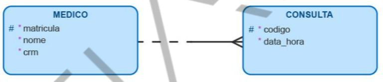

<h1>FASE 3 - MODELING</h1>
<h2>Capítulo 03: Como guardar as informações?</h2>

<h2>Ciclo de vida de um banco de dados</h2>

O ciclo de vida de um banco de dados é composto pelas fases de:
- “Requisitos de Informação”, 
- “Projeto Lógico”, 
- “Projeto Físico” e 
- “Implementação”.

 

 
<em>Ciclo de vida de um banco de dados.</em>

 

### A) Análise de Requisitos (Requisitos de Informação): 
- determinados a partir da entrevista com os usuários do banco de dados, que envolve a obtenção das seguintes informações: 
  - dados exigidos para o processamento,
  - relacionamentos dos dados e 
  - plataforma de software para implementação do banco de dados.

### B) Projeto Lógico:
- representado por um modelo de dados conceitual que mostra todos os dados e seus relacionamentos e realiza a normalização dos dados.
- dentro do Projeto Lógico, temos:
  - **Modelo de dados conceitual:** requisitos são modelados por meio de um Diagrama ER (Entidade-Relacionamento).
  - **Integração da visão:** quando temos projetos grandes com vários envolvidos na análise de requisitos, existem várias visões dos dados e relacionamento.
  - **Transformação do modelo de dados em tabelas:** entidades e relacionamentos do modelo são transformados em tabelas relacionais.
  - **Normalização:** técnicas padronizadas, eliminação de redundâncias e preservação da integridade.

### C) Projeto Físico: 
- envolve a seleção de índices (métodos de acesso) e eventuais desnormalizações de dados, quando couberem.

### D) Implementação, monitoração e modificação de banco de dados: 
- após finalização do projeto, o banco de dados é implementado usando a linguagem de definição de dados de um SGBD.
- a monitoração envolve indicar se os requisitos de desempenho estão sendo atendidos e mudanças podem ser feitas para melhor desempenho. 
- Outras alterações podem ocorrer quando os requisitos mudam ou são inseridos novos requisitos!

---

<h2>Modelagem de dados</h2>

## 1. Introdução a modelagem de dados

- modelagem de dados permite que as informações coletadas na fase de análise de requisitos possam ser estudadas e analisadas dentro de seu contexto, permitindo decidir a melhor maneira de armazená-las.
- nesse momento, não há preocupação com qual SGBD será utilizado, pois possuem particularidades inerentes às suas estruturas físicas. 
- na modelagem lógica, o foco são os dados que precisam ser armazenados e suas relações!
- ***o estudo do modelo lógico é tão independente do SGBD que pode ser feito antes mesmo de decidir qual deles usar.***

## 2. Níveis de abstração da modelagem de dados

- é um método de análise que, a partir das necessidades apontadas pelos usuários dentro de um contexto, apresenta os dados de uma estrutura de armazenamento, organizada e inter-relacionada, expressa por meio de uma representação gráfica.
- a modelagem de dados permite que o analista/desenvolvedor conheça melhor o contexto de negócio, facilitando a criação de uma estrutura de armazenamento que descreva mais adequadamente as necessidades.
  - Isso possibilita compartilhar e unificaros dados, além de propiciaruma integração mais eficiente dos sistemas envolvidos.

## 3. Tipos de modelos de dados

### A) Modelo conceitual:

- primeira etapa do projeto.
- representa a realidade (contexto de negócio) de uma visão global e genérica dos dados e seus relacionamentos.
- **objetivo:** 
  - englobar todas as informações dentro do contexto de negócio que ficarão armazenadas no banco de dados, sem que se retratem aspectos relativos ao SGBD que será utilizado.
- **foco:** 
  - entidades de sistema e como as entidades se relacionam.
- **funções:**
  - Entender os processos e regras de negócio.
  - Expressar as necessidades de informação da organização.
  - Apoiar a definição da abrangência do sistema, delimitando seu escopo.
  - Estabelecer as necessidades, possibilitando uma melhor definição da estrutura de armazenamento, de modo que seja apresentada uma estrutura de armazenamento flexível, facilitando sua manutenção.
- apresenta, por meio de uma visão global, as principais necessidades de armazenamento dentro de um contexto de negócio, ou seja, sem detalhamento e seus relacionamentos!
- a técnica de modelagem conceitual mais difundida é a ***Entidade-Relacionamento (ER)***.
  - O modelo conceitual é representado por um diagrama, **denominado Diagrama Entidade-Relacionamento (DER)**.
- é uma macrodefinição/descrição de alto nível, que retrata a realidade de um processo de negócio. O foco é a representação de uma realidade de forma simples e de fácil compreensão.
- exemplo:

 

 
<em>Exemplo de modelo conceitual usando a técnica de Entidade-Relacionamento, que retrata necessidade de armazenar dados dos médicos e consultas realizadas.</em>

 

### B) Modelo lógico de dados:

- logo após o modelo conceitual.
- nível de detalhamento maior.
- descreve as estruturas que serão armazenadas no banco de dados, resultando numa representação gráfica dos dados de maneira lógica.
- nomeia componentes e ações que exercem de um para o outro, mas sem características específicas de um SGBD.
- ***objetivo:***
  - descrição dos elementos (como o detalhamento de atributos, chaves de identificação, integridade referencial e a normalização).
- exemplo:

 

 
<em>Exemplo de modelo lógico de dados.</em>

 

- sobre o exemplo acima:
  - é possível identificar entidades, atributos, relacionamentos e restrições, como a obrigatoriedade de atributos, representada com os asteriscos vermelhos.
  - há detalhamento das entidades “MÉDICO” e “CONSULTA”, pelo detalhamento dos atributos (matrícula do médico, CRM, nome, código da consulta, data e hora da consulta) e da ação entre as entidades.
  - o padrão de relacionamento, conhecido vulgarmente como “pédegalinha”,indica que um médico poderá realizar várias consultas (quando o relacionamento é “lido” da esquerda para a direita, ou seja, da entidade MÉDICO para a entidade CONSULTA). Ao mesmo tempo, uma consulta deverá ser realizada por um único médico (quando a “leitura” é feita da direita para esquerda, da entidade CONSULTA para a entidade MÉDICO). 
  - para elaboração, foi utilizada a `ferramenta Oracle SQL Developer Data Modeler`, com a notação de Barker.

### C) Modelo físico de dados (ou modelo relacional):

- derivado do modelo lógico.
- última etapa do projeto de banco de dados.
- são detalhados os componentes de estrutura física do banco de dados, como tabelas, campos, tipos de dados, índices, nomenclaturas, exigências (restrições) relativas a conteúdo, domínio dos campos, etc.
- **utiliza-se o SGB** (como Oracle, SQL Server, DB2, MySQL, PostgreSQL, etc).
- após a concepção do modelo físico, um **SCRIPT**, composto por comandos SQL do tipo DDL (Data Definition Language ou Linguagem de Definição de Dados), é gerado.T
  - trata-se de comandos específicos para a criação das estruturas necessárias ao armazenado de dados, como as tabelas!
- exemplo:

 

 
<em>Exemplo de modelo físico de dados.</em>

 

- no exemplo acima:
  - utilizado o SGCB Oracle Database 11g.
  - o exemplo detalha entidades MÉDICO e CONSULTA, considerando tipos de dados necessários para armazenar o conteúdo de cada atributo descrito no modelo lógico. Entre eles, a identificação, as Chaves Primárias e Estrangeiras, restrições do tipo NOT NULL/NULL, UNIQUE e demais detalhes físicos.

---

<h2>Abordagem Relacional</h2>

> Um banco de dados relacional (ou base de dados relacional) é um sistema de armazenamento de dados, baseado nos relacionamentos entre elementos de dados, buscando uma normalização (não redundância) dos dados!

## 1. Modelo Entidade x Relacionamento (MER):

- a abordagem ER é considerada padrão para a modelagem de dados!
- o modelo ER unifica as visões de um modelo relacional.
- seu **objetivo** é desenvolver um modelo que represente as necessidades do negócio!

 

 
<em>Exemplo de Diagrama Entidade-Relacionamento (DER).</em>

 

## 2. Entidade:

- representa uma necessidade de armazenamento.
- é um objeto ou elemento que existe no mundo real, com uma identificação distinta e um significado próprio.
- sua existência pode ser:
  - ***física e tangível***, como pessoas, casa, relógio, computadores, funcionários.O
  - ou ***conceitual e intangível***, como serviços, disciplina escolar, consulta médica.
    - ou seja, a entidade pode ser um evento ou fenômeno!

### ***Como identificar uma entidade?***

- focar no problema em pauta e perguntar-se: "Quais são as ‘coisas’ nesse problema?".
- a maioria delas cairá em uma das seguintes categorias:

  - `Coisas tangíveis`:
    - são os objetos mais fáceis de serem achados.
    - exemplos: livro, avião, veículo...

  - `Funções`:
    - exemplos: médico, paciente, cliente, empregado, supervisor, proprietário, ...
    - funções podem possuir atributos específicos: um médico, por exemplo, possui seu número CRM, que pode ser pertinente no sistema computacional.

  - `Incidentes`:
    - objetos-incidentes são usados para representar uma ocorrência ou um fato, algo que acontece em um determinado período.
    - exemplos: voo, acidente, chamada.

  - `Interações`:
    - objetos-interações geralmente possuem uma qualidade de "transação" ou de "contrato".
    - referem-se a dois ou mais objetos do modelo.
    - exemplos: compra, casamento.

### ***Como representar uma entidade?***

- em um Diagrama de Modelagem de Dados, podemos representar uma ENTIDADE por meiode um retângulo com o nome dela.
- recomendado que o nome da entidade seja representado por uma palavra no singular, com letras maiúsculas.
- não são utilizados acentos ou caracteres especiais, exceto o underline“_”, para separar as palavras, ou seja, **o nome da entidade precisa ser um termo único**.

## 3. Atributos:

- são informações que qualificam e caracterizam uma entidade.
- são tão inerentes a uma entidade que, para serem consideradas únicas,precisam possuir no mínimo dois atributos.
- uma entidade com um único atributo normalmente é agregada a outra entidade!
- é recomendado que o nome do atributo seja representado por uma palavra no singular, com letras minúsculas.
- não são utilizados acentos ou caracteres especiais, exceto o underline“_”, para separar as palavras, ou seja, usar um termo único.

### ***Análise de um atributo:***

- durante o refinamento do modelo de dados, analisar o atributo em relação ao conteúdo que será armazenado. 
- **quanto ao conteúdo armazenado**, podem-se classificar os atributos de acordo com seus **tipos**:

  - `atributo simples`:
    - guarda em si um único valor indivisível.
    - exemplos: nome, código, descrição do produto, data de emissão, data e hora da consulta.

  - `atributo composto`:
    - resultado da soma de vários atributos.
    - exemplos: telefone (DDI + DDD + prefixo + sufixo), endereço (tipo logradouro + logradouro + numero + complemento + CEP + bairro + cidade + estado).

  - `atributo multivalorado`:
    - pode ter várias ocorrências, ou seja, valores associados a ele.
    - exemplo: telefone (uma única pessoa pode ter telefones: residencial, comercial, celular e de recados).
    - no modelo relacional será preciso decompor esse atributo em tabelas (entidades) e campos (atributos).
    - para cada Atributo Multivalorado, criar uma tabela contendo:
      - como Chave Estrangeira, a Chave Primária da tabela que representa o conjunto de entidades que têm o Atributo Multivalorado.
      - o valor do atributo.
    - a Chave Primária da nova tabela é a combinação da Chave Estrangeira e do valor do atributo.

  - `atributo determinante`: 
    - sua característica é garantir a unicidade de cada ocorrência da entidade.
    - o conteúdo normalmente identifica um objeto, uma pessoa, um produto, individualmente.
    - exemplos: matrícula de um aluno, número de uma nota fiscal, código de um produto, número de uma conta corrente, código do RENAVAM.

## 4. Instâncias ou ocorrências de uma entidade

- é cada existência ou ocorrência de um objeto na entidade.
- representa um conjunto de valores que serão armazenados após a implementação da estrutura de armazenamento a partir de um SGBD.

> é importante não confundir a entidade ou seus atributos com o **conteúdo** que será armazenado após a implementação do banco de dados por meio de um SGBD!

### ***a) Tupla:***

- é uma estrutura de atributos relacionados e interdependentes que residem em uma entidade.
- uma ocorrência também é conhecida como instância, tupla ou registro. No Projeto Lógico, equivale a uma instância ou ocorrência da entidade. No Projeto Físico, equivale a um registro ou linha da tabela.

### ***b) Identificação-Chave:***