

<h1>FASE 3 - MODELING</h1>
<h2>Capítulo 04: O Modelo de Entidade-Relacionamento.</h2>

<h2>1. O MODELO DE ENTIDADE-RELACIONAMENTO (MER)</h2>

 

- conjunto de objetos (entidades e relacionamentos), obtidos a partir da análise das necessidades de armazenamento de um determinado negócio (perspectiva do mundo real).
- representado pelo Diagrama Entidade-Relacionamento (DER).
- o `DER` é um artefato essencial na definição de uma forma organizada para o armazenamento de dados!

## 1.1 Cardinalidade dos atributos

- indica quantidade de valores que um atributo pode ter.
- a cardinalidade de um atributo define quantos valores desse atributo podem estar associados a uma ocorrência da entidade/relacionamento a qual ele pertence.
- todo atributo possui cardinalidade mínima e cardinalidade máxima:

  - `cardinalidade mínima`:
    - indica quantos valores, no mínimo, um atributo pode possuir;
    - pode ter dois valores válidos: 
      - `0` (no diagrama,será representado graficamente pelo sinal O), que indica que um atributo não terá nenhum valor preenchido em cada ocorrência da entidade, ou seja, será um ***atributo opcional***!
      - `1` (no diagrama, será representado graficamente pelo sinal &lowast;), que indica que um atributo terá um valor preenchido obrigatoriamente em cada ocorrência da entidade, ou seja, será um ***atributo mandatório (obrigatório)***.

  - `cardinalidade máxima`:
    - aponta quantos valores, no máximo, um atributo pode ter.
    - poderá ter dois valores válidos: 
      - `1`, o qual mostra que um atributo terá no máximo um único valor preenchido em cada ocorrência da entidade, ou seja, será um ***atributo monovalorado (único valor)***!
      - `N`, o qual representa que um atributo terá no máximo vários valores (dois ou mais) para cada ocorrência da entidade, ou seja, será um ***atributo multivalorado (vários valores)***!

Cardinalidade | Valores
:--------------:|------------
Mínima | MIN = 0 -> atributo opcional MIN = 1 -> atributo mandatório (obrigatório)
Máxima | MAX = 1 -> atributo monovalorado MAX = N -> atributo multivalorado

Exemplos: 

a) Nome do aluno (todo aluno possui um e apenas um nome):
  - Cardinalidade mínima = 1 ⟶ atributo mandatório (obrigatório).
  - Cardinalidade máxima = 1 ⟶ atributo monovalorado.

b) Telefone (nem todas as pessoas tem telefone e, se tiver, pode ser residencial, comercial e/ou celular):
  - Cardinalidade mínima = 0 → atributo opcional.
  - Cardinalidade máxima = N → atributo multivalorado.

c) Nota (nem todos os alunos realizam avaliação na data marcada, podendo ter notas não informadas):
  - Cardinalidade mínima = 0 → atributo opcional.
  - Cardinalidade máxima = 1 → atributo monovalorado.

## 1.2 Decomposição de atributos

- atributos compostos: 
  - possuem muitos dados agrupados para formar a informação.
  - exemplos: telefone (DDI + DDD + telefone + ramal + nome) e endereço (tipo logradouro, nome, número, complemento, bairro, cep, cidade, estado).
- o nível de decomposição de um atributo depende dos requerimentos do negócio.
  - alguns atributos nunca são decompostos, como data e hora.

## 1.3 Convenção de nomenclatura para atributos e entidades

- é considerado boa prática utilizar uma nomenclatura padronizada para os atributos e entidades.
- normalmente, cada empresa cria um padrão a ser seguido. 
- neste caso, será utilizada a padronização considerando o SGBD Oracle.

### 1.3.1 Nomenclatura de tabelas e campos

- bancos de dados modernos permitem tamanhos maiores, porém convencionou-se (padrão SQL-ANSI) tamanho máximo do nome da tabela (por enquanto, conhecido como entidade) e do nome de um campo (no momento, conhecido como atributo) em, `no máximo, 30 caracteres`.

### 1.3.2 Caracteres permitidos

- letras.
- números.
- underline (_).
- cifrão ($) e cerquilha (#).

Embora números sejam permitidos, não podem iniciar o nome da entidade ou atributo, que geralmente começa com uma letra.

### 1.3.3 Padrão recomendado

Tabela (Entidade) | Campos (atributos)
------------------|--------------------
SINGULAR | SINGULAR
Primeiro caractere deve ser uma letra | Primeiro caractere deve ser uma letra
***Letras maiúsculas*** | ***Letras minúsculas***

### 1.3.3.1 Nomenclatura para nomes de TABELAS (ENTIDADES)

- inicializar o nome com a letra `T`.
- utilizar 3 caracteres como prefixo para indicar a sigla do sistema.
- nome atribuído à tabela.
- utilize o underline (_) como separador.
- nomes compostos separar com o underline (_).

Exemplo de convenção de nomes de Tabelas (Entidades):
- Entidade: Funcionário
- Sistema: Sistema de Controle de Implantação de Projetos – Sigla: SIP
- Exemplo: T_SIP_FUNCIONARIO
  - T → Indica tabela
  - SIP → Nome do sistema
  - FUNCIONARIO → Nome da tabela

### 1.3.3.2 Nomenclatura para nomes de CAMPOS(ATRIBUTOS)

- utilizar 2 ou 3 caracteres como prefixo para indicar o significado da coluna.
- utilizar o underline (_) como separador.
- nome atribuído à coluna (sufixo).
- nomes compostos separar com o underline (_).

Exemplo de convenção de nomes de Campos (Atributos):
- Entidade: Funcionario
- Exemplo: nr_matricula
  - nr → indica o prefixo do nome
  - matricula → indica o nome da coluna

T_SIP_FUNCIONARIO atributos | Nome dos atributos (convenção)
----------------------------|-------------------
matrícula funcionario | nr_matricula
nome | nm_nome
data nascimento | dt_nascimento
data admissão | dt_admissao
endereço | ds_endereco
salário | vl_salario
código departamento | cd_departamento

### 1.3.3.3 Lista de prefixos comumente utilizados

Prefixo (2 caracteres) | Prefixo (3 caracteres) | Significado
-----------------------|------------------------|-----------------
Nr | Num | Número (pode identificar exclusivamente)
Cd | cod | Código (assinala esclusivamente uma ocorrência)
Id | Idt | Identificador (aponta excluivamente uma ocorrênca)
Ds | Des | Descrição
Nm | Nom | Nome
Dt | Dat | Data
Vl | Val | Valor
Qt | Qtd | Quantidade
Sq | Seq | Número sequencial que reconhece algo do mundo real
In | Ind | Indicador
St | Sta | Status
Ob | Obs | Observação
Tx | Txt | Texto extenso

## 1.4 Representação gráfica de entidades e atributos

### 1.4.1 Visão Lógica

- utilizamos `#` para identificar a `chave primária` ou atributo identificador na representação gráfica da entidade. 
- há diversas notações (formas de retratar ou expressar informações de forma gráfica ou por sinais, a fim de simplificar a representação de ideias, problemas e soluções). 
- as mais utilizadas são as notações de Barker e da Engenharia da Informação (a seguir).

 

 
<em>Exemplo de notação de Barker.</em>

 

 
<em>Exemplo de notação da Engenharia da Informação.</em>

 

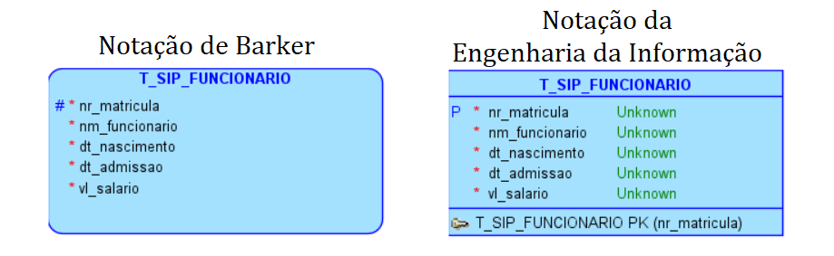 
<em>Exemplo de aplicação das notações, utilizando Oracle SQL Developer Data Modeler.</em>

 

### 1.4.2 Visão Física ou Relacional

 
<em>Exemplo de visão física ou relacional.</em>

 

### 1.4.3 Notação de Peter Chen

 
<em>Exemplo de notação de Peter Chen.</em>

 

---

<h2>2. RELACIONAMENTOS</h2>

- um relacionamento é a representação de uma ação ou fato que associa as ocorrências de uma entidade com as de outra entidade.
- ou seja, é o conjunto de associações entre ocorrências de entidades!
- ***identificação dos relacionamentos***:
  - analisar as entidades sempre aos pares.
  - todo relacionamento tem:
    - ***Nome***: normalmente um verbo: gravar, escrever, indicar etc.
    - ***Opcionalidade***> deve ou pode.
    - ***Cardinalidade***: nenhuma, uma única, uma ou mais ocorrências associadas.

## 2.1 Cardinalidade do relacionamento

- indica a quantidade de ocorrências de uma entidade A relacionadas com as de uma entidade B (é sempre colocada no lado oposto à entidade, quando fazemos o diagrama).
- há ***três tipos de relacionamentos***:
  - Relacionamento Um-para-Um (1:1). 
  - Relacionamento Um-para-Muitos (1:n).
  - Relacionamento Muitos-para-Muitos (m:n).
- todo relacionamento possui cardinalidade mínima e cardinalidade máxima:
  - mínima: indica com quantas ocorrências no mínimo uma entidade irá se associar com outra entidade.
  - cardinalidade máxima: aponta com quantas ocorrências no máximo uma entidade irá se associar com outra entidade.

Cardinalidade | Significado
--------------|---------------
Mínima | min = 0 → pode (condicional) min = 1 → deve (incondicional)
Máxima | 1 : 1 1 : N M : N

- ***importante***:
  - **linha tracejada** indica um **relacionamento opcional** (Condicional – cardinalidade mínima igual a zero).
  - **linha contínua** aponta um **relacionamento obrigatório** (Incondicional – cardinalidade mínima igual a um).

> Durante a análise de uma associação, a ***Chave Estrangeira deve ficar na entidade em que a cardinalidade máxima desse atributo (Chave Estrangeira) for igual a 1***, ou seja, a Chave Estrangeira é sempre um atributo MONOVALORADO!

## 2.2 Caracterização dos relacionamentos

### 2.2.1 Relacionamento 1:1

- quando cada ocorrência da entidade (A) se associa,no máximo, a uma ocorrência da entidade (B).
- e cada ocorrência da entidade (B) associa-se, no máximo, com uma ocorrência da entidade (A).
(É necessário analisar sempre os dois sentidos do relacionamento)

<strong>Exemplo 1 💭</strong>

<em>
Dada a situação de um homem ser casado com uma mulher e uma mulher ser casada com um homem. Lembrando que nem todas as pessoas são casadas. 
E considerando a regra:

- No Brasil, o casamento é monogâmico, portanto, um homem só pode ser casado com uma mulher e uma mulher só pode ser casada com um único homem.
</em>

### Temos:

- associação “RELACIONAMENTO” é **CONDICIONAL** (só haverá ocorrências associadas para os indivíduos que forem casados).

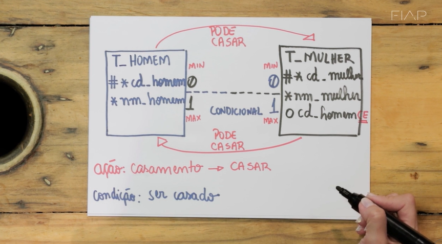 
<em>Exemplo de diagrama de relacionamento entre as entidades homem e mulher.</em>

 

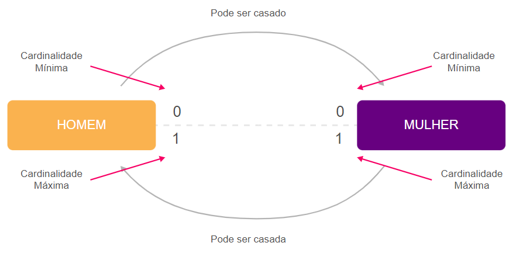 
<em>Exemplo de relacionamento entre as entidades homem e mulher.</em>

 

- representação gráfica por meio da ferramenta SQL Developer Data Modeler (notação de Barker).

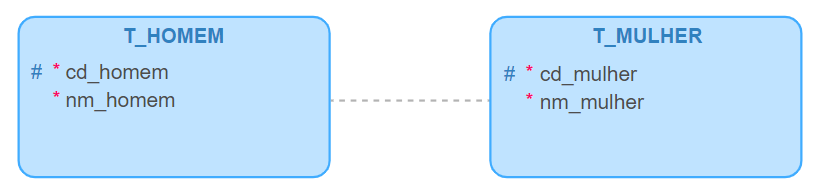 
<em>Exemplo de relacionamento entre as entidades homem e mulher.</em>

 

- exemplo da relação entre ocorrências nas tabelas:

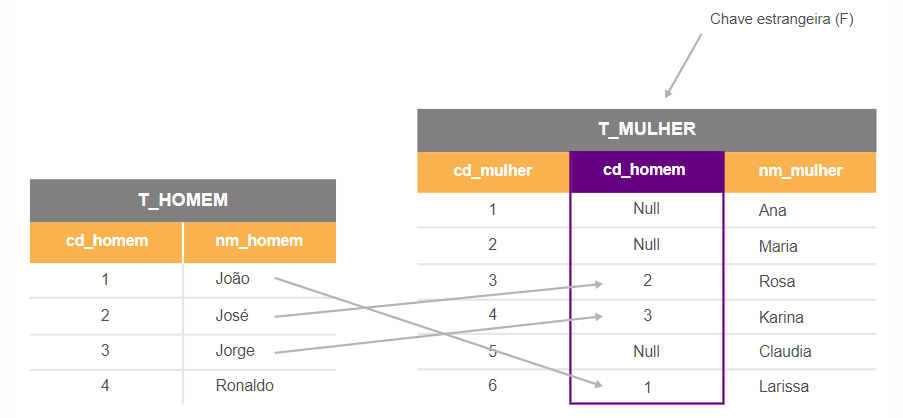 
<em>Exemplo das tabelas homem e mulher com registros.</em>

 

- Nota: exemplo de Relacionamento 1:1 – Não obrigatório (CONDICIONAL), cardinalidade mínima igual a zero.
- Leia-se: um homem pode ser casado, se casado será com uma única mulher. Uma mulher pode ser casada, se casada será com um único homem.
  - cada ocorrência da entidade “T_HOMEM” se associa,no máximo, com uma ocorrência da entidade “T_MULHER”.
  - cada ocorrência da entidade “T_MULHER” se associa, no máximo, com uma ocorrência da entidade “T_HOMEM”.
- Atenção: em toda a associação 1:1, deve-se indicar a entidade DOMINANTE, a entidade dominada ou filha receberá a Chave Estrangeira. 
  - Lembrando que a Chave Estrangeira ficará na entidade em que a cardinalidade máxima do relacionamento é igual a 1, nesse caso, pode ser qualquer uma das entidades. 
  - A Chave Estrangeira é sempre um atributo monovalorado.

<strong>Exemplo 2 💭</strong>

<em>Dada a situação hipotética de um departamento possuir um único gerente e um gerente gerenciar um único departamento. 
Lembrando que nem todos os funcionários gerenciam departamentos. 
Considerando a regra abaixo:

- Levando em conta um momento no tempo e não um histórico de possíveis alterações no quadro funcional ou na divisão de departamentos, períodos de férias etc.
</em>

### Temos:

- associação “RELACIONAMENTO” é **INCONDICIONAL**, pois todas as ocorrências serão associadas entre as entidades.

 
<em>Exemplo de diagrama de relacionamento entre as entidades Departamento e Gerente.</em>

 

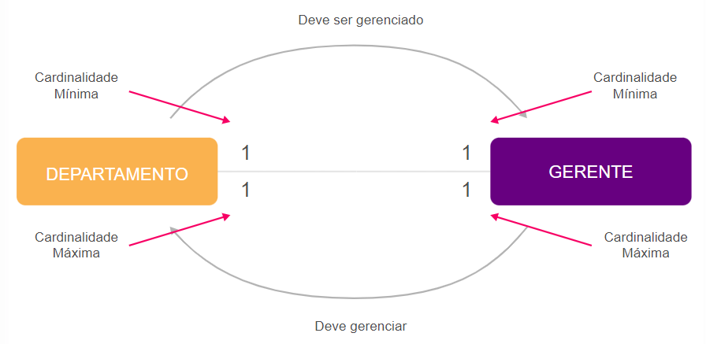 
<em>Exemplo de relacionamento entre entidades departamento e gerente.</em>

 

- representação gráfica por meio da ferramenta SQL Developer Data Modeler (notação de Barker).

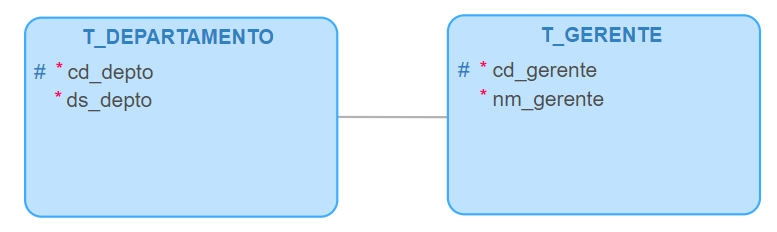 
<em>Exemplo de modelo lógico entre departamento e gerente.</em>

- exemplo da relação entre ocorrências nas tabelas:

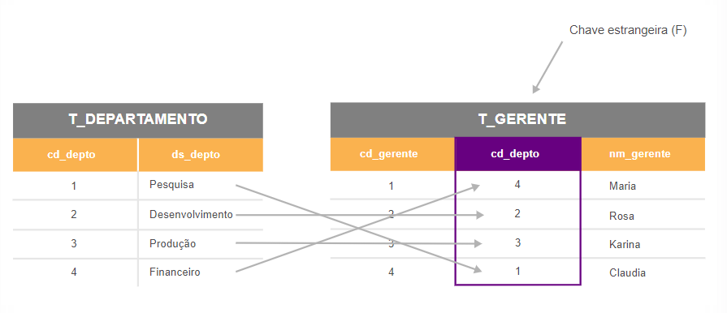 
<em>Exemplo das tabelas Departamento e Gerente com registros.</em>

 

- Nota: 
  - exemplo de Relacionamento 1:1 
  - Obrigatório (INCONDICIONAL)
  - Cardinalidade mínima igual a um, dos dois lados
- Leia-se: 
  - um gerente deve gerenciar um único departamento 
  - e um departamento é gerenciado por um único gerente.
- Atenção:
  - em toda associação 1:1, deve-se indicar a entidade DOMINANTE, a entidade dominada ou filha receberá a Chave Estrangeira. 
  - Lembrando que a Chave Estrangeira ficará na entidade em quea cardinalidade máxima do relacionamento é igual a 1.
    - neste caso, pode ser qualquer uma das entidades. 
  - A Chave Estrangeira é sempre um atributo monovalorado.

> Cada ocorrência da entidade “T_DEPARTAMENTO” se associa, no máximo, com uma ocorrência da entidade “T_GERENTE”. Cada ocorrência de “T_GERENTE” se associa, no máximo, com uma ocorrência de “T_DEPARTAMENTO”.

***Importante:***

> `Apenas no relacionamento 1:1 podemos escolher a entidade em que a Chave Estrangeira deverá ficar` (é a única situação em que a cardinalidade máxima é igual a 1 em ambos os lados do relacionamento).

### 2.2.2 Relacionamento 1:N

- quando cada ocorrência da entidade (A) associa-se, no máximo, com várias ocorrências da entidade (B).Cada ocorrência da entidade (B) associa-se, no máximo, com uma ocorrência da entidade (A).
- analisar sempre os dois sentidos do relacionamento.

<strong>Exemplo 1 💭</strong>

<em>
"Dada a situação de um funcionário ter dependentes(marido, esposa e filhos). 
Lembrando que nem todas as pessoas possuem dependentes, ou seja, nem todas as pessoas são casadas ou têm filhos. 
Considerando as regras abaixo:
- Neste exemplo, descartamos a possibilidade de um casal trabalhar na mesma empresa, portanto, não haverá dependentes (filhos) em comum
- Todo dependente pertence a um único funcionário.
</em>

### Temos:

> Importante: a entidade “DEPENDENTE” é uma entidade FRACA, portanto, precisa da entidade “FUNCIONÁRIO” para existir.

- a CHAVE PRIMÁRIA da entidade “DEPENDENTE” é composta pela Chave Estrangeira mais um atributo da entidade FRACA, que juntos garantem unicidade de cada ocorrência da entidade “DEPENDENTE”. 
  - ou seja, há um relacionamento `“CONDICIONAL”`.

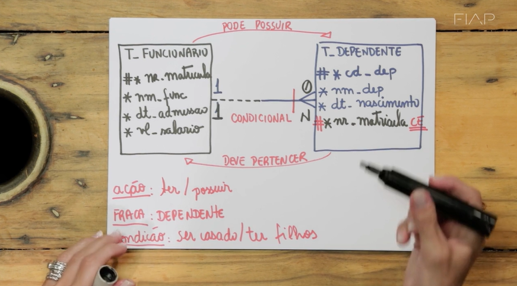 
<em>Exemplo de diagrama de relacionamento entre as entidades Funcionário e Dependente.</em>

 

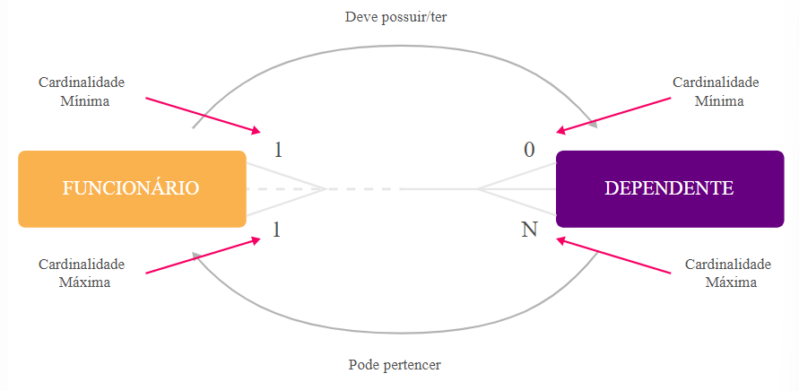 
<em>Exemplo de relacionamento entre entidades funcionário e dependente.</em>

 

- representação gráfica por meio da ferramenta SQL Developer Data Modeler (notação de Barker).

 
<em>Exemplo de modelo lógico entre funcionário e dependente.</em>

- Nota:
  - exemplo de Relacionamento 1:N
  - não obrigatório (CONDICIONAL)
  - cardinalidade mínima igual a zero.
- Leia-se:
  - um funcionário pode ter um ou vários dependentes e um dependente deve estar associado (pertencer) a um único funcionário.
- Atenção:
  - a associação é feita de funcionário para dependente, portanto, a entidade “FUNCIONÁRIO” é a principal (pai ou dominante) e a entidade “DEPENDENTE” é a filha (dominada).0
  - Lembrando que `a Chave Estrangeira ficará na entidade em que a cardinalidade máxima do relacionamento é igual a 1`. 
    - Considerando essa definição, podemos avaliar que cada funcionário estará associado a, no máximo, muitos dependentes.E cada dependente estará associado a, no máximo, um funcionário.
    - Por esse motivo, a Chave Estrangeira ficará na entidade “DEPENDENTE”. 
    - `A Chave Estrangeira é sempre um atributo monovalorado`.

- `Chave Primária de uma entidade FRACA:`
  - a entidade “DEPENDENTE” é FRACA
  - ou seja, sua existência está vinculada do funcionário, pois não existe dependente sem funcionário. 

> A Chave Primária de uma entidade FRACA deve ser composta pela Chave Estrangeira mais um atributo da própria entidade que, juntos, garantam a unicidade de cada ocorrência.

- exemplo da relação entre ocorrências nas tabelas:

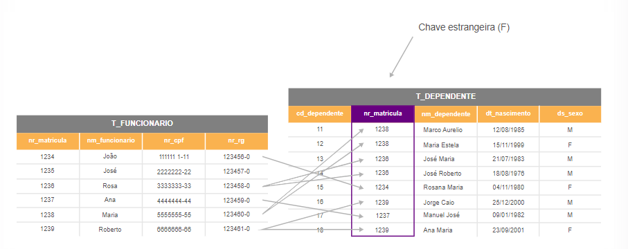 
<em>Exemplo das tabelas Funcionário e Dependentes com registros.</em>

 

<strong>Exemplo 2 💭</strong>

<em>
"Dada a situação de um cliente realizar pedidos. 
Considerando as regras:

- Cliente é toda pessoa que realizou ao menos um pedido na loja.
- Cada cliente deve ter realizado pelo menos um pedido.
- Cada pedido pertence a um único cliente.
</em>

- Trata-se de associação de “RELACIONAMENTO” `INCONDICIONAL` (todas as ocorrências serão associadas entre as entidades).

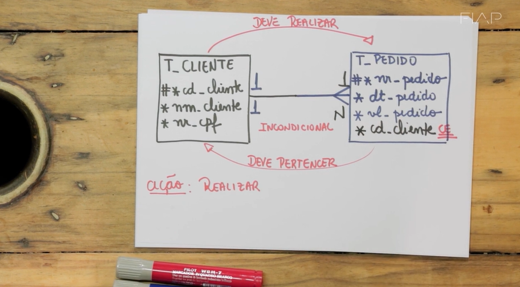 
<em>Exemplo de diagrama de relacionamento entre as entidades Cliente e Pedido.</em>

 

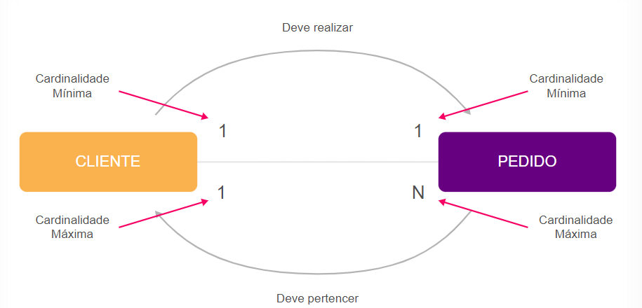 
<em>Exemplo de relacionamento entre entidades Cliente e Pedido.</em>

 

- representação gráfica por meio da ferramenta SQL Developer Data Modeler (notação de Barker).

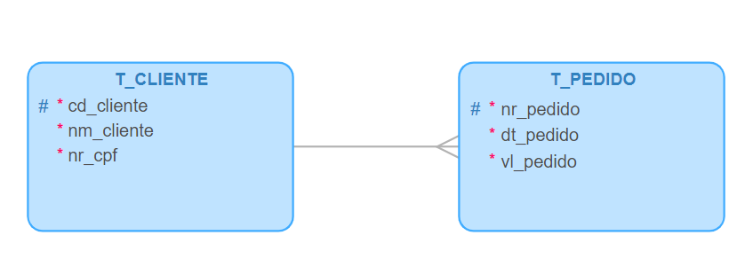 
<em>Exemplo de modelo lógico entre Cliente e Pedido.</em>

- Nota: 
  - exemplo de Relacionamento 1:N 
  - Obrigatório (INCONDICIONAL)
  - cardinalidade mínima igual a um, dos dois lados

- Leia-se:
  - um cliente deve ter realizado um ou mais pedidos e um pedido deve estar associado (pertencer) a um único cliente.

- Atenção:
  - a associação é feita de cliente para pedido, portanto, a entidade “CLIENTE” é a principal (pai  ou dominante) e a entidade “PEDIDO” é a filha (dominada). 
  - Lembrando que a Chave Estrangeira ficará na entidade em que a cardinalidade máxima do relacionamento é igual a 1. 
    - nesse caso, cada cliente estará associado a, no máximo, muitos pedidos e cada pedido estará associado a, no máximo, um cliente.
    - portanto, a Chave Estrangeira ficará na entidade “PEDIDO”. 
    - A Chave Estrangeira é sempre um atributo monovalorado.

- exemplo da relação entre ocorrências nas tabelas:

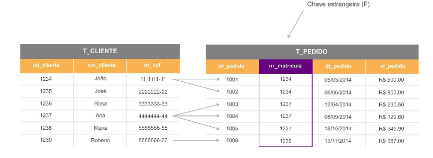 
<em>Exemplo das tabelas Cliente e Pedido com registros.</em>

 

### 2.3 Relacionamento M:N

- cada ocorrência da entidade (A) se associa com qualquer número de ocorrênciasda entidade (B).
- cada ocorrência da entidade (B) se associa com qualquer número de ocorrências da entidade (A).

<strong>Exemplo 1 💭</strong>

<em>
"Dada a situação de um estudante matricular-se em várias disciplinas. Uma disciplina possuir vários alunos matriculados. 
Considerando as regras:

- Um estudante pode trancar a matrícula, portanto,não estará cursando nenhuma disciplina.
- Um estudante pode matricular-se em várias disciplinas dentro de um curso.
- Uma escola pode oferecer várias disciplinas aos seus estudantes.
- Uma disciplina pode não ter nenhum aluno matriculado.
- Uma disciplina pode ter vários estudantes matriculados."
</em>

### Temos:

- associação `“RELACIONAMENTO” é CONDICIONAL`
  - só haverá ocorrências associadas se tiver alunos matriculados em disciplinas (existe uma condição para determinar as associações).

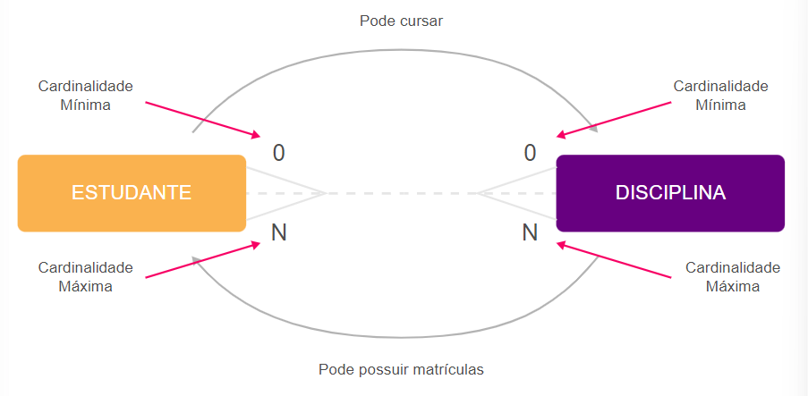 
<em>Exemplo de relacionamento entre entidades Estudante e Disciplina.</em>

 

- representação gráfica por meio da ferramenta SQL Developer Data Modeler (notação de Barker).

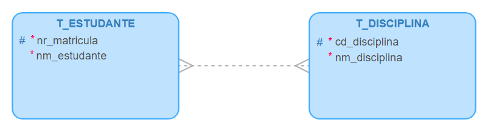 
<em>Exemplo de modelo lógico entre Estudante e Disciplina.</em>

- Nota: 
  - exemplo de Relacionamento M:N
  - Não obrigatório (CONDICIONAL)
  - cardinalidade mínima igual a zero, dos dois lados.
- Leia-se:
  - um estudante pode matricular-se em várias disciplinas e uma disciplina pode ter vários alunos matriculados (associados) a ela.
- Atenção:
  - ***neste caso, a Chave Estrangeira não será inserida em nenhuma entidade, pois seria multivalorada (cardinalidade máxima N).*** 
  - Esse relacionamento refletirá uma situação especial na modelagem de dados que trataremos nos próximos capítulos.

> cada ocorrência da entidade “T_ESTUDANTE” se associa,no máximo,com qualquer número de ocorrências da entidade “T_DISCIPLINA”. Cada ocorrência da entidade “T_DISCIPLINA” se associa,no máximo,a qualquer número de ocorrências da entidade “T_ESTUDANTE”.

- exemplo da relação entre ocorrências nas tabelas:

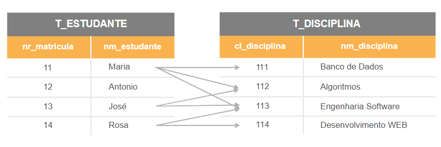 
<em>Exemplo das tabelas Estudante e Disciplina com registros.</em>

 

> não podemos colocar a Chave Estrangeira na entidade “DISCIPLINA”, pois cada disciplina teria vários alunos (atributo nr_matricula multivalorado).Também não podemos colocar a Chave Estrangeira na entidade “ESTUDANTE”, pois cada estudante poderia se matricular em várias disciplinas (atributo cd_disciplina multivalorado)!

<strong>Exemplo 2 💭</strong>

<em>
"Dada a situação em que um pedido possui vários produtos, ao menos um. Um produto pode ser comercializado em vários pedidos. 
Considerando as regras:

- Um pedido deve possuir ao menos um produto e, no máximo, vários produtos.
- Uma empresa possui vários produtos, mas nem todos os produtos são comercializados.
- Nem todo produto é comercializado em um pedido.
</em>

### Temos:

- associação `“RELACIONAMENTO” é CONDICIONAL`
  - só haverá ocorrências associadas se tiver produtos comercializados (existe uma condição para determinar as associações).

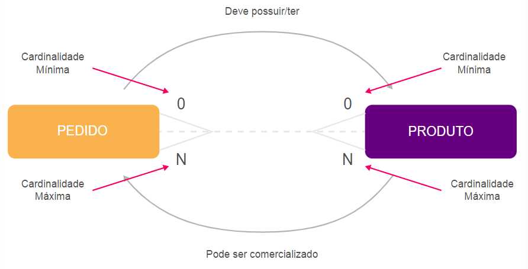 
<em>Exemplo de relacionamento entre entidades Pedido e Produto.</em>

 

- representação gráfica por meio da ferramenta SQL Developer Data Modeler (notação de Barker).

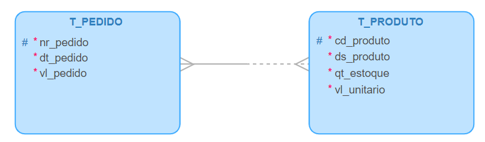 
<em>Exemplo de modelo lógico entre Pedido e Produto.</em>

- Nota: 
  - exemplo de Relacionamento N:N
  - Não obrigatório (CONDICIONAL)
  - cardinalidade mínima igual a zero, dos dois lados.
- Leia-se:
  - um pedido deve conter um ou mais produtos e um produto pode ser comercializado em vários pedidos.
- Atenção:
  - ***neste caso, a Chave Estrangeira não será inserida em nenhuma entidade, pois seria multivalorada (cardinalidade máxima N).*** 
  - Esse relacionamento refletirá uma situação especial na modelagem de dados que trataremos nos próximos capítulos.

> cada ocorrência da entidade “T_PEDIDO” se associa,no máximo,com qualquer número de ocorrências da entidade “T_PRODUTO”. Cada ocorrência da entidade “T_PRODUTO” se associa,no máximo,a qualquer número de ocorrências da entidade “T_PEDIDO”.

- exemplo da relação entre ocorrências nas tabelas:

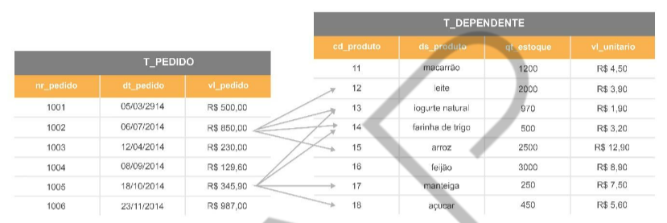 
<em>Exemplo das tabelas Pedido e Produto com registros.</em>

 

> não podemos colocar a Chave Estrangeira na entidade “PEDIDO”, pois cada pedido teria vários produtos (atributo cd_produto multivalorado). Também não podemos colocar a Chave Estrangeira na entidade “PRODUTO”, pois cada produto poderia ser comercializado em vários pedidos (atributo nr_pedido multivalorado).

## 2.3.1 Caracterização dos relacionamentos

### Cardinalidade Máxima: 

- representada ao lado da entidade “DEPARTAMENTO” e da entidade “PEDIDO” (“Exemplo de modelo conceitual (1)”). 
- indicando cardinalidade máxima “UM” (1) e “Muitos” (N). Número máximo de ocorrências entre as entidades associadas.

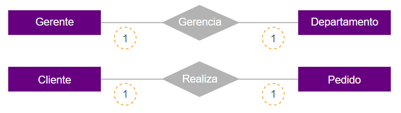 
<em>Exemplo de modelo conceitual (1).</em>

 

### Cardinalidade Mínima:

- representada ao lado da entidade “GERENTE” e da entidade “CLIENTE” (“Exemplo de modelo conceitual (2)”). 
- Indicando cardinalidade mínima “UM” (1). Número mínimo de ocorrências entre as entidades associadas.

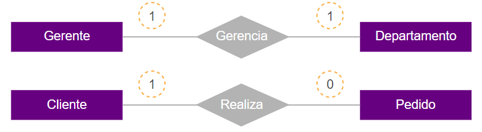 
<em>Exemplo de modelo conceitual (2).</em>

 

- `cardinalidade mínima 1` recebe o nome de `“ASSOCIAÇÃO OBRIGATÓRIA”`, pois indica que o relacionamento deve obrigatoriamente associar uma ocorrência de entidade a cada ocorrência da entidade em questão.
- `cardinalidade mínima` recebe a denominação de `“ASSOCIAÇÃO OPCIONAL”`, pois indica que o relacionamento pode ou não associar uma ocorrência da entidade a cada ocorrência da entidade em questão.- o losango representa o relacionamento entre as entidadeseo verbo significaa ação que ocorre entre as entidades.

### Outro tipo de representação:

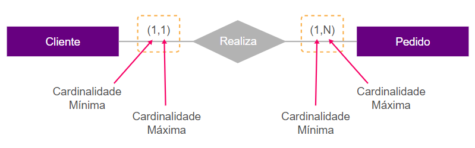 
<em>Exemplo de modelo conceitual (3).</em>

 

---

## FAST TEST

### 1. Selecione a alternativa que descreva um tipo de atributo com cardinalidade mínima = 0 e máxima = N.
> Celular.

### 2. De acordo com a notação de Barker, escolha qual das alternativas representa um atributo opcional de uma tabela.
> O.

### 3. Dentre as alternativas a seguir, escolha a que represente um relacionamento 1:N.
> Cliente e nota fiscal.

---

[Voltar ao início!](https://github.com/monicaquintal/fintech)