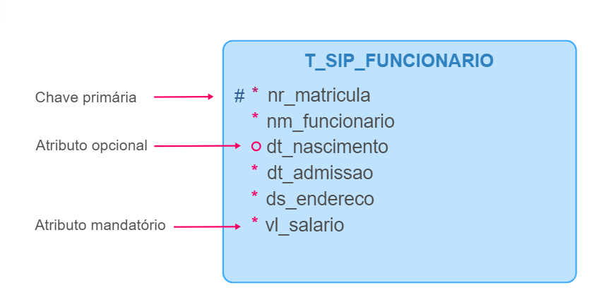
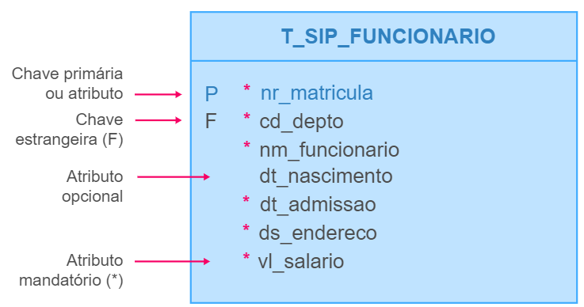
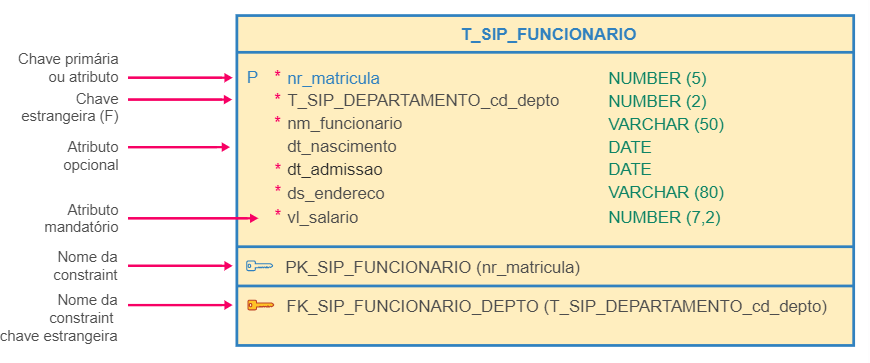

<h1>FASE 3 - MODELING</h1>
<h2>Capítulo 04: O Modelo de Entidade-Relacionamento.</h2>

<h2>1. O MODELO DE ENTIDADE-RELACIONAMENTO (MER)</h2>

 

- conjunto de objetos (entidades e relacionamentos), obtidos a partir da análise das necessidades de armazenamento de um determinado negócio (perspectiva do mundo real).
- representado pelo Diagrama Entidade-Relacionamento (DER).
- o `DER` é um artefato essencial na definição de uma forma organizada para o armazenamento de dados!

## 1.1 Cardinalidade dos atributos

- indica quantidade de valores que um atributo pode ter.
- a cardinalidade de um atributo define quantos valores desse atributo podem estar associados a uma ocorrência da entidade/relacionamento a qual ele pertence.
- todo atributo possui cardinalidade mínima e cardinalidade máxima:

  - `cardinalidade mínima`:
    - indica quantos valores, no mínimo, um atributo pode possuir;
    - pode ter dois valores válidos: 
      - `0` (no diagrama,será representado graficamente pelo sinal O), que indica que um atributo não terá nenhum valor preenchido em cada ocorrência da entidade, ou seja, será um ***atributo opcional***!
      - `1` (no diagrama, será representado graficamente pelo sinal &lowast;), que indica que um atributo terá um valor preenchido obrigatoriamente em cada ocorrência da entidade, ou seja, será um ***atributo mandatório (obrigatório)***.

  - `cardinalidade máxima`:
    - aponta quantos valores, no máximo, um atributo pode ter.
    - poderá ter dois valores válidos: 
      - `1`, o qual mostra que um atributo terá no máximo um único valor preenchido em cada ocorrência da entidade, ou seja, será um ***atributo monovalorado (único valor)***!
      - `N`, o qual representa que um atributo terá no máximo vários valores (dois ou mais) para cada ocorrência da entidade, ou seja, será um ***atributo multivalorado (vários valores)***!

Cardinalidade | Valores
:--------------:|------------
Mínima | MIN = 0 -> atributo opcional MIN = 1 -> atributo mandatório (obrigatório)
Máxima | MAX = 1 -> atributo monovalorado MAX = N -> atributo multivalorado

Exemplos: 

a) Nome do aluno (todo aluno possui um e apenas um nome):
  - Cardinalidade mínima = 1 ⟶ atributo mandatório (obrigatório).
  - Cardinalidade máxima = 1 ⟶ atributo monovalorado.

b) Telefone (nem todas as pessoas tem telefone e, se tiver, pode ser residencial, comercial e/ou celular):
  - Cardinalidade mínima = 0 → atributo opcional.
  - Cardinalidade máxima = N → atributo multivalorado.

c) Nota (nem todos os alunos realizam avaliação na data marcada, podendo ter notas não informadas):
  - Cardinalidade mínima = 0 → atributo opcional.
  - Cardinalidade máxima = 1 → atributo monovalorado.

## 1.2 Decomposição de atributos

- atributos compostos: 
  - possuem muitos dados agrupados para formar a informação.
  - exemplos: telefone (DDI + DDD + telefone + ramal + nome) e endereço (tipo logradouro, nome, número, complemento, bairro, cep, cidade, estado).
- o nível de decomposição de um atributo depende dos requerimentos do negócio.
  - alguns atributos nunca são decompostos, como data e hora.

## 1.3 Convenção de nomenclatura para atributos e entidades

- é considerado boa prática utilizar uma nomenclatura padronizada para os atributos e entidades.
- normalmente, cada empresa cria um padrão a ser seguido. 
- neste caso, será utilizada a padronização considerando o SGBD Oracle.

### 1.3.1 Nomenclatura de tabelas e campos

- bancos de dados modernos permitem tamanhos maiores, porém convencionou-se (padrão SQL-ANSI) tamanho máximo do nome da tabela (por enquanto, conhecido como entidade) e do nome de um campo (no momento, conhecido como atributo) em, `no máximo, 30 caracteres`.

### 1.3.2 Caracteres permitidos

- letras.
- números.
- underline (_).
- cifrão ($) e cerquilha (#).

Embora números sejam permitidos, não podem iniciar o nome da entidade ou atributo, que geralmente começa com uma letra.

### 1.3.3 Padrão recomendado

Tabela (Entidade) | Campos (atributos)
------------------|--------------------
SINGULAR | SINGULAR
Primeiro caractere deve ser uma letra | Primeiro caractere deve ser uma letra
***Letras maiúsculas*** | ***Letras minúsculas***

### 1.3.3.1 Nomenclatura para nomes de TABELAS (ENTIDADES)

- inicializar o nome com a letra `T`.
- utilizar 3 caracteres como prefixo para indicar a sigla do sistema.
- nome atribuído à tabela.
- utilize o underline (_) como separador.
- nomes compostos separar com o underline (_).

Exemplo de convenção de nomes de Tabelas (Entidades):
- Entidade: Funcionário
- Sistema: Sistema de Controle de Implantação de Projetos – Sigla: SIP
- Exemplo: T_SIP_FUNCIONARIO
  - T → Indica tabela
  - SIP → Nome do sistema
  - FUNCIONARIO → Nome da tabela

### 1.3.3.2 Nomenclatura para nomes de CAMPOS(ATRIBUTOS)

- utilizar 2 ou 3 caracteres como prefixo para indicar o significado da coluna.
- utilizar o underline (_) como separador.
- nome atribuído à coluna (sufixo).
- nomes compostos separar com o underline (_).

Exemplo de convenção de nomes de Campos (Atributos):
- Entidade: Funcionario
- Exemplo: nr_matricula
  - nr → indica o prefixo do nome
  - matricula → indica o nome da coluna

T_SIP_FUNCIONARIO atributos | Nome dos atributos (convenção)
----------------------------|-------------------
matrícula funcionario | nr_matricula
nome | nm_nome
data nascimento | dt_nascimento
data admissão | dt_admissao
endereço | ds_endereco
salário | vl_salario
código departamento | cd_departamento

### 1.3.3.3 Lista de prefixos comumente utilizados

Prefixo (2 caracteres) | Prefixo (3 caracteres) | Significado
-----------------------|------------------------|-----------------
Nr | Num | Número (pode identificar exclusivamente)
Cd | cod | Código (assinala esclusivamente uma ocorrência)
Id | Idt | Identificador (aponta excluivamente uma ocorrênca)
Ds | Des | Descrição
Nm | Nom | Nome
Dt | Dat | Data
Vl | Val | Valor
Qt | Qtd | Quantidade
Sq | Seq | Número sequencial que reconhece algo do mundo real
In | Ind | Indicador
St | Sta | Status
Ob | Obs | Observação
Tx | Txt | Texto extenso

## 1.4 Representação gráfica de entidades e atributos

### 1.4.1 Visão Lógica

- utilizamos `#` para identificar a `chave primária` ou atributo identificador na representação gráfica da entidade. 
- há diversas notações (formas de retratar ou expressar informações de forma gráfica ou por sinais, a fim de simplificar a representação de ideias, problemas e soluções). 
- as mais utilizadas são as notações de Barker e da Engenharia da Informação (a seguir).

 

 
<em>Exemplo de notação de Barker.</em>

 

 
<em>Exemplo de notação da Engenharia da Informação.</em>

 

### 1.4.2 Visão Física ou Relacional

 
<em>Exemplo de visão física ou relacional.</em>

 

### 1.4.3 Notação de Peter Chen

 
<em>Exemplo de notação de Peter Chen.</em>

 

---

<h2>2. RELACIONAMENTOS</h2>

