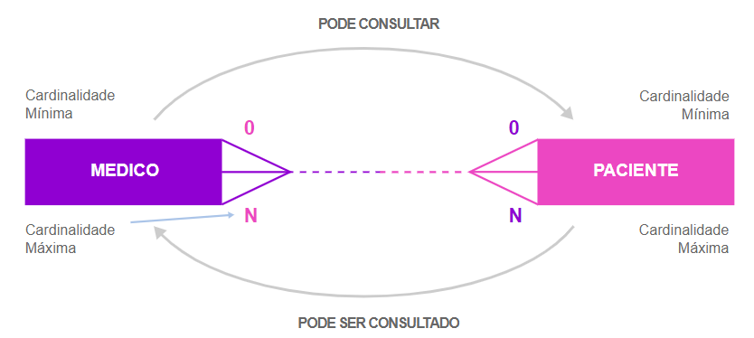
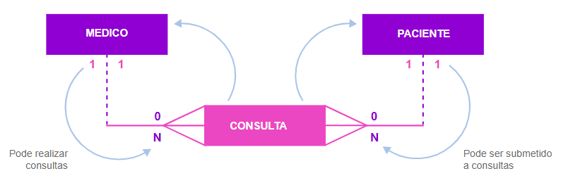

<h1>FASE 3 - MODELING</h1>
<h2>Capítulo 05: Agregando ao modelo de dados. 🎲</h2>

<h2>1. AGREGANDO AO MODELO DE DADOS</h2>

 

## 1.1 Sobre agregação

- um modelo de dados pode e deve passar por processo de refinamento.
- `extensões` têm a função de possibilitar a correção de particularidades, para que o modelo de dados possa ser posteriormente implementado de forma física, por meio de um SGBD.
- `agregação` é uma forma de ajustar a implementação de um relacionamento do tipo muitos para muitos.
  - ***não é possível implementar fisicamente esse tipo de relacionamento***, pois a chave estrangeira não pode ser multivalorada. 
  - trata-se de uma limitação de um sistema de BD relacional: uma chave estrangeira deve fazer referência a um único valor (é monovalorada).
  - buscamos `atributos do relacionamento`, que caracterizam o relacionamento e ainda há necessidade de manter a chave estrangeira monovalorada, transformamos o relacionamento e os atributos que caracterizam esse relacionamento em um **objeto agregado**!
    - ou seja, criamos uma nova entidade para representar a associação, chamada `entidade ASSOCIATIVA`.

### Entidade associativa:

- não existe por si só em um modelo entidade relacionamento.
- sua existência está condicionada à existência de duas ou mais entidades existentes no modelo!!!
- ela existe porque as duas outras entidades existem.
- ***é chamado de agregação, pois a nova entidade agrega atributos das duas entidades que anteriormente se associavam, mais os atributos que caracterizam o relacionamento!***
- há situações em que não encontramos atributos que caracterizam este relacionamento, então utilizamos uma `nova entidade` (com intuito de ligação e solução para as chaves estrangeiras, sendo monovaloradas)!
  - quando temos entidades apenas associativas, normalmente não conseguimos identificar um nome que represente a entidade e, ***no momento de nomeá-la, utilizamos os nomes das entidades que se associavam anteriormente!!!***

## 1.1.1 Exemplificando agregação

~~~
Suponha a seguinte situação: 

Um médico pode avaliar, examinar e consultar um paciente, e um paciente pode ser avaliado, examinado, consultado por um médico.

Cada médico pode avaliar, examinar, consultar vários pacientes,inclusive o mesmo paciente várias vezes.Cada paciente pode ser avaliado, examinado, consultado por vários médicos, inclusive com o mesmo médico várias vezes.
~~~

 

 
<em>Exemplo de relacionamento entre médico e paciente.</em>

 

 
<em>Exemplo 2 de relacionamento entre médico e paciente, de forma mais detalhada.</em>

 

- relacionamento com cardinalidade M:N.
- ***atributos que caracterizam o relacionamento M:N - Consulta Médica***:
  - data e hora.
  - sala ou consultório.
- portanto, cria-se a nova entidade **CONSULTA**.
  - passamos a ter dois relacionamentos 1:N:
    - um entre “MEDICO” e “CONSULTA”;
    - e outro entre “PACIENTE” e “CONSULTA”!

 

 
<em>Criação da entidade associativa "Consulta".</em>

 

- Características da entidade CONSULTA → { Data e hora, Sala ou consultório }.

