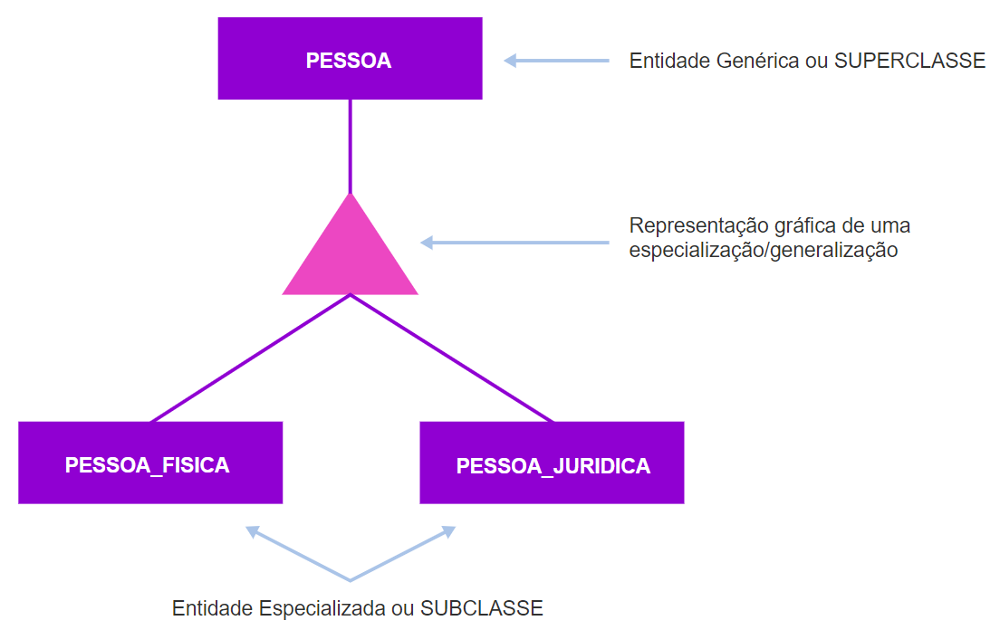
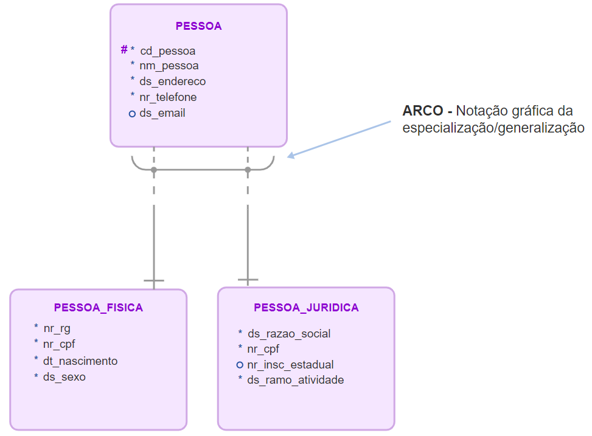
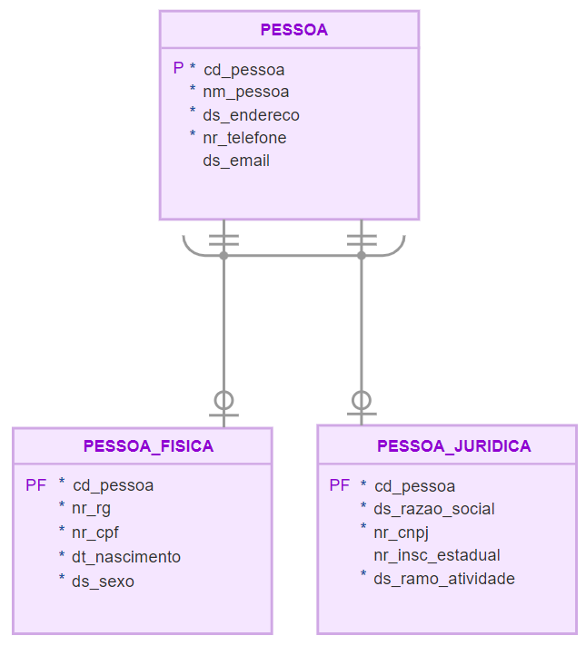
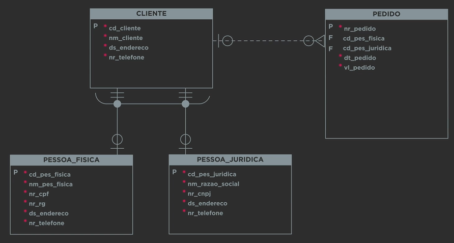
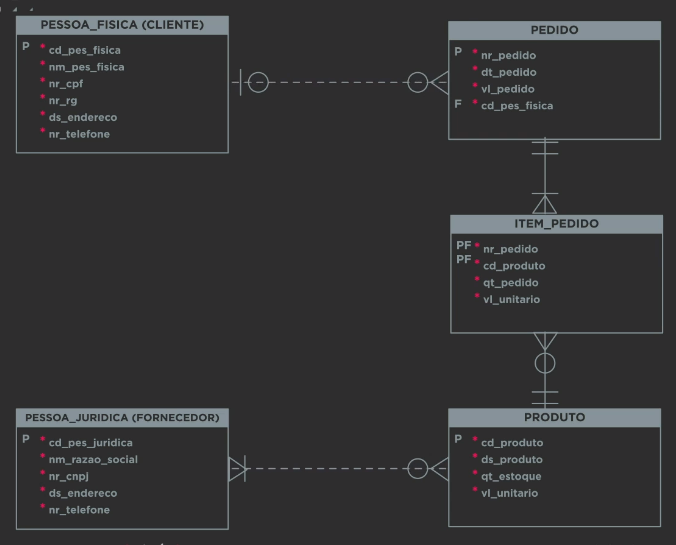

<h1>FASE 3 - MODELING</h1>
<h2>Capítulo 05: Agregando ao modelo de dados. 🎲</h2>

<h2>1. AGREGANDO AO MODELO DE DADOS</h2>

 

## 1.1 Sobre agregação

- um modelo de dados pode e deve passar por processo de refinamento.
- `extensões` têm a função de possibilitar a correção de particularidades, para que o modelo de dados possa ser posteriormente implementado de forma física, por meio de um SGBD.
- `agregação` é uma forma de ajustar a implementação de um relacionamento do tipo muitos para muitos.
  - ***não é possível implementar fisicamente esse tipo de relacionamento***, pois a chave estrangeira não pode ser multivalorada. 
  - trata-se de uma limitação de um sistema de BD relacional: uma chave estrangeira deve fazer referência a um único valor (é monovalorada).
  - buscamos `atributos do relacionamento`, que caracterizam o relacionamento e ainda há necessidade de manter a chave estrangeira monovalorada, transformamos o relacionamento e os atributos que caracterizam esse relacionamento em um **objeto agregado**!
    - ou seja, criamos uma nova entidade para representar a associação, chamada `entidade ASSOCIATIVA`.

### Entidade associativa:

- não existe por si só em um modelo entidade relacionamento.
- sua existência está condicionada à existência de duas ou mais entidades existentes no modelo!!!
- ela existe porque as duas outras entidades existem.
- ***é chamado de agregação, pois a nova entidade agrega atributos das duas entidades que anteriormente se associavam, mais os atributos que caracterizam o relacionamento!***
- há situações em que não encontramos atributos que caracterizam este relacionamento, então utilizamos uma `nova entidade` (com intuito de ligação e solução para as chaves estrangeiras, sendo monovaloradas)!
  - quando temos entidades apenas associativas, normalmente não conseguimos identificar um nome que represente a entidade e, ***no momento de nomeá-la, utilizamos os nomes das entidades que se associavam anteriormente!!!***

## 1.1.1 Exemplificando agregação

~~~
Suponha a seguinte situação: 

Um médico pode avaliar, examinar e consultar um paciente, 
e um paciente pode ser avaliado, examinado, consultado por um médico.

Cada médico pode avaliar, examinar, consultar vários pacientes,inclusive o mesmo paciente várias vezes.
Cada paciente pode ser avaliado, examinado, consultado por vários médicos, 
inclusive com o mesmo médico várias vezes.
~~~

 

 
<em>Exemplo de relacionamento entre médico e paciente.</em>

 

 
<em>Exemplo 2 de relacionamento entre médico e paciente, de forma mais detalhada.</em>

 

- relacionamento com cardinalidade M:N.
- ***atributos que caracterizam o relacionamento M:N - Consulta Médica***:
  - data e hora.
  - sala ou consultório.
- portanto, cria-se a nova entidade **CONSULTA**.
  - passamos a ter dois relacionamentos 1:N:
    - um entre “MEDICO” e “CONSULTA”;
    - e outro entre “PACIENTE” e “CONSULTA”!

 

 
<em>Criação da entidade associativa "Consulta".</em>

 

- Características da entidade CONSULTA → { Data e hora, Sala ou consultório }.

- representação gráfica com ferramenta SQL Developer Data Modeler (notação da Engenharia da Informação).

 

 
<em>Relacionamento entre médico e paciente em um modelo lógico.</em>

 

- representação do relacionamento por meio da nova entidade “CONSULTA”:

 

 
<em>Relacionamento médico e paciente envolvendo a entidade associativa consulta.</em>

 

## 1.1.2 Regras ou soluções possíveis para determinar a chave primária em uma agregação

### 1ª Solução: 
- criar uma chave primária composta pelas chaves estrangeiras, caso garantam unicidade das ocorrências, obtendo um relacionamento identificado.

### 2ª Solução:
- criar um novo atributo para ser a chave primária desta entidade.
- chaves estrangeiras não são utilizadas como identificadores. 
- o novo atributo será utilizado para garantir a unicidade das ocorrências.
- ***solução utilizada no exemplo acima***!

### 3ª Solução:
- criar uma chave primária composta por uma das chaves estrangeiras, mais um atributo da própria entidade (desde que juntos garantam a unicidade das ocorrências). 
- teríamos um relacionamento identificado de um dos lados.
- considerando que a nova entidade é uma ***entidade FRACA*** (depende das outras entidades para existir), utilizamos a mesma regra da chave primária da entidade FRACA.

> para cada situação deve-se avaliar a melhor solução a ser aplicada de acordo com o contexto de negócio e as necessidades de armazenamento!

## 1.1.3 Evoluindo o exemplo de agregação

~~~
Suponha a situação: durante uma consulta, um Médico prescreve medicamentos para um Paciente.

Em cada consulta, o Médico pode prescrever medicamentos diferentes para o Paciente, ou até nenhum.

Mas, para existir uma prescrição, o paciente deve obrigatoriamente passar por uma consulta médica.

Portanto, a prescrição seria um relacionamento entre uma entidade Medicamento e o relacionamento consulta.

Cada consulta pode prescrever vários medicamentos ou nenhum.
Cada medicamento pode ser prescrito em várias consultas ou nenhuma.
~~~

 

 
<em>Relacionamento entre consulta e medicamento.</em>

 

- relacionamento com cardinalidade M:N.

 

 
<em>Criação da entidade associativa prescrição entre consulta e medicamento.</em>

 

- Características da entidade PRESCRICAO → { Posologia, Via, Orientações de uso}

- utilizando a ferramenta SQL Developer Data Modeler (notação de Barker):

 

 
<em>Relacionamento entre consulta, prescrição e medicamento no Modelo Lógico.</em>

 

- utilizando a ferramenta SQL Developer Data Modeler (notação da Engenharia da Informação):

 

 
<em>Relacionamento entre consulta, prescrição e medicamento no Modelo Lógico.</em>

 

- utilizada a 1ª solução (**relacionamento identificado**):
  - chaves estrangeiras usadas para compor a chave primária da entidade “PRESCRICAO”.
  - considera-se que um medicamento não é prescrito mais de uma vez para uma mesma consulta (identifica de forma única as ocorrências).

> Observação: não é boa prática cr chaves primárias compostas com mais de dois atributos, pois a chave fica longa, ocupa espaço em disco, o SGBD tem um custo maior para ordenação e busca dos dados por meio da chave.

## 1.1.4 Um pouco mais de atributos do relacionamento

~~~
Um engenheiro pode exercer funções diferentes em diferentes projetos nos quais atuar.

Na representação do relacionamento “ATUACAO”, podemos utilizar um atributo que determinará a função que o engenheiro exerce em um projeto.

O atributo função não pode ser considerado do “ENGENHEIRO”, pois pode atuar em diversos projetos;
também não pode ser atributo do “PROJETO”, pois em um projeto podem atuar vários engenheiros.
~~~

- relacionamento M:N.

 

 
<em>Modelo conceitual do relacionamento entre engenheiro e projeto.</em>

 

- o atributo função (**atributo do relacionamento**) gera uma nova entidade, chamada “ENGENHEIRO_PROJETO” ou “ATUACAO”.

- Modelo lógico (notação de Barker):

 

 
<em>Criação da entidade associativa atuação, entre as entidades engenheiro e projeto.</em>

 

- Modelo lógico (notação Engenharia da Informação):

 

 
<em>Abordagem criando uma chave para a entidade associativa "atuação".</em>

 

- aplicada a **2ª solução**.
  - criado o atributo “CD_FUNCAO”.

## 1.1.5 Exemplificando outra situação na qual temos entidade associativa

- é possível que, em alguns relacionamentos M:N, não seja possível encontrar atributos do relacionamento em função das características de negócio.
- nesse caso, a entidade associativa terá apenas as chaves estrangeiras.
  - a entidade funcionará como ligação entre as entidades associadas.

~~~
Um professor pode lecionar uma ou mais disciplinas.

Cada disciplina deve ser lecionada por um ou mais professores.
~~~

 

 
<em>Criação da entidade associativa professor_disciplina.</em>

 

- chave primária é composta pelas estrangeiras.

---

## 1.2 Sobre herança

- um modelo de dados pode e deve passar por um processo de refinamento.
- **extensões**: possibilitam a correção de particularidades, para que o modelo de dados possa ser implementado de forma física, por meio de um SGBD.

### `Herança`:
- é uma forma de ajustar a implementação, quando há entidades que têm as mesmas características (atributos) e desempenhem as mesmas ações (relacionamentos).
- o conceito de herança é aplicado por meio da generalização e especialização.
- a especialização/generalização promove maior flexibilidade ao modelo, permitindo:
  - Definir um conjunto de subclasses de um tipo de entidade.
  - Definir atributos especificos para cada subclasse.
  - Definir relacionamentos especificos entre subclasses, ou outras entidades.
- associações 1:1; para indicar que é uma generalização, inserir um arco que passa por cima dos relacionamentos (representa a herança).

### `Especialização`: 
- conceito que permite atribuir propriedades particulares a um subconjunto das ocorrências (especializadas) de uma entidade genérica.
- a entidade que possui propriedades genéricas é chamada **SUPERCLASSE ou ENTIDADE GENÉRICA**.
- a entidade que possuir propriedades particulares será chamada de **SUBCLASSE ou ENTIDADE ESPECÍFICA/ESPECIALIZADA**.

### `Generalização`:
- conceito que permite unir dois ou mais conjuntos de subclasses (entidades com propriedades particulares), produzindo uma entidade com um conjunto de propriedades genéricas (Superclasse).
- atributos inseridos na entidade genérica são comuns a dois ou mais conjuntos de entidades.

> As subclasses (entidades especializadas) herdam os atributos da superclasse (entidade genérica), ou seja, cada ocorrência da entidade especializada possui, além de suas próprias propriedades (atributos e relacionamentos), as propriedades da ocorrência da entidade genérica correspondente.

## 1.2.1 Exemplificando especialização, generalização e herança

### Exemplo 1:

~~~
Como ordenar um conjunto de dados que caracterizam clientes pessoas físicas e clientes pessoas jurídicas?
~~~

- há ***atributos comuns*** aos dois conjuntos de dados, como código, nome, e-mail, endereço e telefone.
- há também ***atributos específicos*** a “PESSOA FÍSICA” (como RG, CPF, data de nascimento e sexo), e atributos específicos a “PESSOA JURÍDICA” (como razão social, CNPJ, inscrição estadual e ramo de atividade).

Portanto, é possível separar os grupos de dados em: 
- PESSOA - atributos comuns. 
- PESSOA FÍSICA - atributos específicos dos clientes pessoa física.
- PESSOA JURÍDICA - atributos específicos dos clientes pessoa jurídica.

Notação de Peter Chen:
 

 
<em>Relacionamento entre pessoa, pessoa física e pessoa jurídica.</em>

 

SQL Data Modeler – Notação de Barker:
 

 
<em>Modelo lógico utilizando um arco, notação de Barker.</em>

 

SQL Data Modeler – Notação da Engenharia da Informação:
 

 
<em>Modelo lógico utilizando um arco, notação de Engenharia da Informação.</em>

 

> Quando utilizamos o conceito de especialização/generalização, temos a ideia de herança de atributos. O que significa que cada ocorrência das entidades (entidades especializadas) “PESSOA_FISICA” ou “PESSOA_JURIDICA”, além dos seus próprios atributos, possuirá também os atributos(herança) da entidade genérica “PESSOA".

- há um relacionamento 1:1 entre entidades “PESSOA” e “PESSOA_FISICA”, e entre “PESSOA” e “PESSOA_JURIDICA”, ou seja:
  - cada pessoa pode ser uma única pessoa física. 
  - cada pessoa pode ser uma única pessoa jurídica.

### Exemplo 2:

~~~
Conjunto de dados que caracterizam os funcionários de uma empresa.
~~~

- há dados que caracterizam alguns funcionários da empresa, como um médico possui CRM, um engenheiro possui CREA.
- porém, a maior parte dos atributos é comum a todos os tipos de funcionários.

Portanto, é possível:
- especializar a entidade “FUNCIONARIO” a partir da categoria funcional, se os funcionários possuírem atributos ou relacionamentos próprios. 
- caso não exista tal necessidade no modelo de negócios, é possível criar:
  - uma única entidade com todos os atributos (comuns e específicos); 
    - atributos que eram tratados como específicos na solução envolvendo especialização/generalização são opcionais quando implementados em uma única entidade, uma vez que não se aplicam a todos os funcionários!
  - ou ainda criar três entidades e replicar seus atributos comuns.
    - quando trabalhamos dessa forma, todos os atributos são replicados a cada entidade.
    - os atributos tratados anteriormente como específicos, ora tratados como opcionais (no caso de única entidade), nessa implementação são atributos mandatórios, uma vez que cada entidade tem um papel específico dentro do contexto de negócio aplicado!

## 1.2.2 Regras para determinar a chave primária nas entidades especializadas

> Para que uma entidade seja considerada especialização de outra, é necessário que ela herde o identificador da entidade genérica.

- por tratar-se de relacionamento 1:1 IDENTIFICADO, a chave primária da entidade especializada é a chave estrangeira, proveniente dos relacionamentos entre “PESSOA” e “PESSOA_FISICA”; “PESSOA” e “PESSOA_JURIDICA”.
  - CODIGO_PESSOA é chave PRIMÁRIA na entidade PESSOA, e CHAVE ESTRANGEIRA nas entidades especializadas (PESSOA_FISICA E PESSOA_JURIDICA).
  - devido à herança de atributos, `a chave estrangeira também é chave primária nas entidades especializadas`.

## 1.2.3 Classificação ou Restrições em uma especialização/generalização

### A) Classificação: Total ou Parcial.

- `Total`:
  - para cada ocorrência da entidade genérica (SUPERCLASSE) existe sempre uma ocorrência em uma das entidades especializadas (SUBCLASSE).
  - exemplo: toda ocorrência da entidade “PESSOA” corresponde a uma ocorrência em uma das especializações (entidades “Pessoa Física” ou “Pessoa Jurídica”).

- `Parcial`:
  - nem toda ocorrência da entidade genérica (SUPERCLASSE) possui uma ocorrência correspondente em uma entidade especializada (SUBCLASSE).
  - exemplo: nem todas as ocorrências da entidade “Funcionário” possuem ocorrências correspondentes nas entidades especializadas (nem todo funcionário é Engenheiro, Médico ou Secretária).
  - quando há uma especialização/generalização parcial, podemos ter um atributo na entidade genérica que identifica o tipo de ocorrência (neste caso, atributo categoria funcional). Mas não se faz necessário, pois conseguimos recuperar informações em múltiplas entidades (tabelas) com os recursos dos comandos SQL.

### B) Classificação: Exclusiva ou Compartilhada:

- `Exclusiva`: 
  - uma ocorrência da entidade genérica é especializada no máximo uma vez.
  - exemplo: uma ocorrência de “FUNCIONARIO” aparece uma vez somente nas entidades especializadas (“ENGENHEIRO”, “MEDICO” ou “SECRETARIA”), já que um funcionário ou é médico, ou é engenheiro ou é secretária.

- `Compartilhada`: 
  - uma ocorrência da entidade genérica pode ser especializada várias vezes (poderá aparecer em várias entidades especializadas).
  - exemplo: uma pessoa pode ser professor e aluno ou funcionário e aluno ao mesmo tempo.

## 1.2.4 Exemplo de situações em que utilizamos ou não especialização/generalização

### Exemplo 1: Utilizando Especialização/Generalização

~~~
Entidades “PESSOA_FISICA” e “PESSOA_JURIDICA” desempenham o mesmo papel, representando "CLIENTE".

Ambas as entidades possuem a mesma ação, representada pela realização de “PEDIDO” 
(possui as chaves estrangeiras opcionais, pois não é possível o mesmo pedido pertencer a pessoas diferentes).
~~~

- faz-se necessário criar alguma regra que valide se uma das chaves estrangeiras é preenchida durante um pedido; senão, haverá uma inconsistência (poderá existir um pedido que não pertence a nenhuma pessoa, já que a chave estrangeira é um atributo opcional).
- portanto, para resolver essa situação, ***utilizar o conceito de especialização/ generalização***.
  - foi criada uma entidade genérica chamada “CLIENTE”, que representa todos os clientes (pessoa física ou jurídica), que possuirão ações comuns. 
  - nesse caso, a ação comum é realizar “PEDIDO”.
  - quando aplicamos o conceito de especialização/generalização, deixamos de ter o problema da chave estrangeira opcional, em função da entidade genérica “CLIENTE” associar-se com a entidade “PEDIDO”.
  - as entidades especializadas “PESSOA_FISICA” e “PESSOA_JURIDICA” associam-se apenas com entidades, suas ações são particulares, ou seja, se aplicam individualmente para pessoa física ou pessoa jurídica!

 

 
<em>Modelo lógico entre pedido, cliente, pessoa física e pessoa jurídica.</em>

 

### Exemplo 2: Quando não é necessário utilizar Especialização/Generalização

~~~
Na situação a seguir, a entidade “PESSOA_FISICA” representa um “CLIENTE” e a entidade “PESSOA_JURIDICA” representa um “FORNECEDOR”.
~~~

- como há entidades desempenhando papéis diferentes e ações diferentes, não é necessário aplicar o conceito de especialização/generalização.

 

 
<em>Modelo lógico formalizando algumas entidades.</em>

 

<h2>1.3 Sobre Autorrelacionamento</h2>

- o modelo de dados pode e deve passar por um processo de refinamento.
- extensões: função de possibilitar a correção destas particularidades para que o modelo de dados possa ser posteriormente implementado de forma física, por meio de um SGBD.
- uma dessas extensões é o `relacionamento recursivo ou autorrelacionamento`, e acontece quando as ocorrências de uma entidade se relacionam com ela própria!
- ocorre quando as ocorrências de uma mesma entidade desempenham papéis diferentes dentro de um contexto de negócio ou para representar algum tipo de hierarquia.

PÁGS 10 / 41