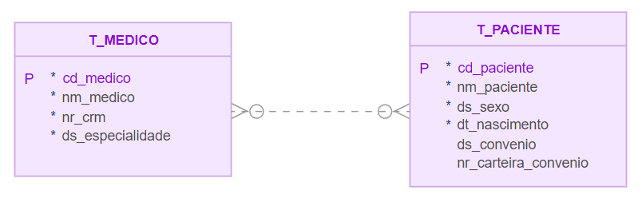
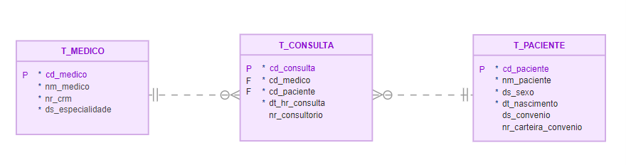
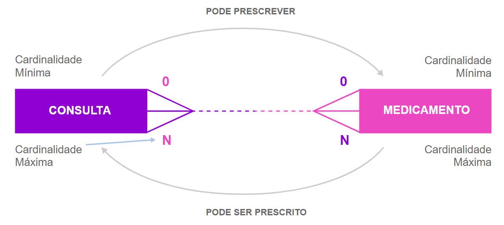
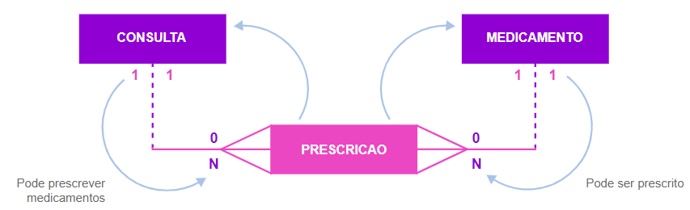
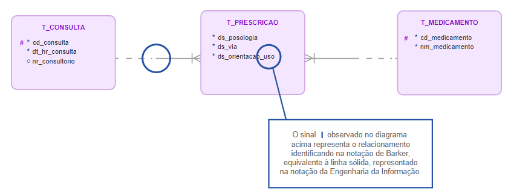
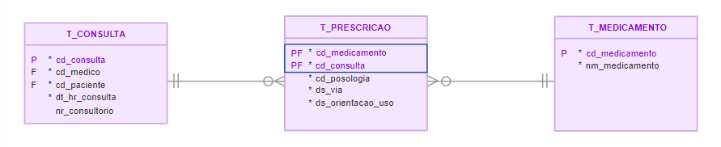
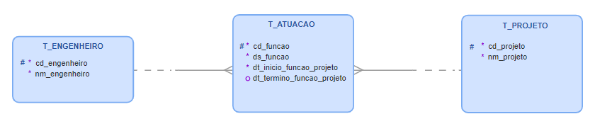
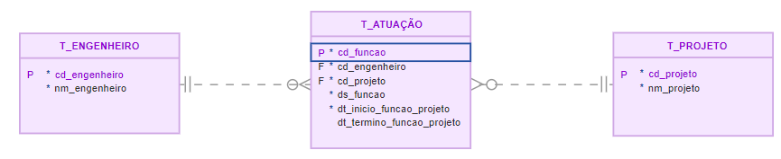
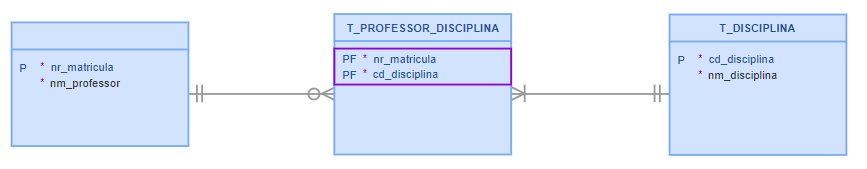

<h1>FASE 3 - MODELING</h1>
<h2>Capítulo 05: Agregando ao modelo de dados. 🎲</h2>

<h2>1. AGREGANDO AO MODELO DE DADOS</h2>

 

## 1.1 Sobre agregação

- um modelo de dados pode e deve passar por processo de refinamento.
- `extensões` têm a função de possibilitar a correção de particularidades, para que o modelo de dados possa ser posteriormente implementado de forma física, por meio de um SGBD.
- `agregação` é uma forma de ajustar a implementação de um relacionamento do tipo muitos para muitos.
  - ***não é possível implementar fisicamente esse tipo de relacionamento***, pois a chave estrangeira não pode ser multivalorada. 
  - trata-se de uma limitação de um sistema de BD relacional: uma chave estrangeira deve fazer referência a um único valor (é monovalorada).
  - buscamos `atributos do relacionamento`, que caracterizam o relacionamento e ainda há necessidade de manter a chave estrangeira monovalorada, transformamos o relacionamento e os atributos que caracterizam esse relacionamento em um **objeto agregado**!
    - ou seja, criamos uma nova entidade para representar a associação, chamada `entidade ASSOCIATIVA`.

### Entidade associativa:

- não existe por si só em um modelo entidade relacionamento.
- sua existência está condicionada à existência de duas ou mais entidades existentes no modelo!!!
- ela existe porque as duas outras entidades existem.
- ***é chamado de agregação, pois a nova entidade agrega atributos das duas entidades que anteriormente se associavam, mais os atributos que caracterizam o relacionamento!***
- há situações em que não encontramos atributos que caracterizam este relacionamento, então utilizamos uma `nova entidade` (com intuito de ligação e solução para as chaves estrangeiras, sendo monovaloradas)!
  - quando temos entidades apenas associativas, normalmente não conseguimos identificar um nome que represente a entidade e, ***no momento de nomeá-la, utilizamos os nomes das entidades que se associavam anteriormente!!!***

## 1.1.1 Exemplificando agregação

~~~
Suponha a seguinte situação: 

Um médico pode avaliar, examinar e consultar um paciente, 
e um paciente pode ser avaliado, examinado, consultado por um médico.

Cada médico pode avaliar, examinar, consultar vários pacientes,inclusive o mesmo paciente várias vezes.
Cada paciente pode ser avaliado, examinado, consultado por vários médicos, 
inclusive com o mesmo médico várias vezes.
~~~

 

 
<em>Exemplo de relacionamento entre médico e paciente.</em>

 

 
<em>Exemplo 2 de relacionamento entre médico e paciente, de forma mais detalhada.</em>

 

- relacionamento com cardinalidade M:N.
- ***atributos que caracterizam o relacionamento M:N - Consulta Médica***:
  - data e hora.
  - sala ou consultório.
- portanto, cria-se a nova entidade **CONSULTA**.
  - passamos a ter dois relacionamentos 1:N:
    - um entre “MEDICO” e “CONSULTA”;
    - e outro entre “PACIENTE” e “CONSULTA”!

 

 
<em>Criação da entidade associativa "Consulta".</em>

 

- Características da entidade CONSULTA → { Data e hora, Sala ou consultório }.

- representação gráfica com ferramenta SQL Developer Data Modeler (notação da Engenharia da Informação).

 

 
<em>Relacionamento entre médico e paciente em um modelo lógico.</em>

 

- representação do relacionamento por meio da nova entidade “CONSULTA”:

 

 
<em>Relacionamento médico e paciente envolvendo a entidade associativa consulta.</em>

 

## 1.1.2 Regras ou soluções possíveis para determinar a chave primária em uma agregação

### 1ª Solução: 
- criar uma chave primária composta pelas chaves estrangeiras, caso garantam unicidade das ocorrências, obtendo um relacionamento identificado.

### 2ª Solução:
- criar um novo atributo para ser a chave primária desta entidade.
- chaves estrangeiras não são utilizadas como identificadores. 
- o novo atributo será utilizado para garantir a unicidade das ocorrências.
- ***solução utilizada no exemplo acima***!

### 3ª Solução:
- criar uma chave primária composta por uma das chaves estrangeiras, mais um atributo da própria entidade (desde que juntos garantam a unicidade das ocorrências). 
- teríamos um relacionamento identificado de um dos lados.
- considerando que a nova entidade é uma ***entidade FRACA*** (depende das outras entidades para existir), utilizamos a mesma regra da chave primária da entidade FRACA.

> para cada situação deve-se avaliar a melhor solução a ser aplicada de acordo com o contexto de negócio e as necessidades de armazenamento!

## 1.1.3 Evoluindo o exemplo de agregação

~~~
Suponha a situação: durante uma consulta, um Médico prescreve medicamentos para um Paciente.

Em cada consulta, o Médico pode prescrever medicamentos diferentes para o Paciente, ou até nenhum.

Mas, para existir uma prescrição, o paciente deve obrigatoriamente passar por uma consulta médica.

Portanto, a prescrição seria um relacionamento entre uma entidade Medicamento e o relacionamento consulta.

Cada consulta pode prescrever vários medicamentos ou nenhum.
Cada medicamento pode ser prescrito em várias consultas ou nenhuma.
~~~

 

 
<em>Relacionamento entre consulta e medicamento.</em>

 

- relacionamento com cardinalidade M:N.

 

 
<em>Criação da entidade associativa prescrição entre consulta e medicamento.</em>

 

- Características da entidade PRESCRICAO → { Posologia, Via, Orientações de uso}

- utilizando a ferramenta SQL Developer Data Modeler (notação de Barker):

 

 
<em>Relacionamento entre consulta, prescrição e medicamento no Modelo Lógico.</em>

 

- utilizando a ferramenta SQL Developer Data Modeler (notação da Engenharia da Informação):

 

 
<em>Relacionamento entre consulta, prescrição e medicamento no Modelo Lógico.</em>

 

- utilizada a 1ª solução (**relacionamento identificado**):
  - chaves estrangeiras usadas para compor a chave primária da entidade “PRESCRICAO”.
  - considera-se que um medicamento não é prescrito mais de uma vez para uma mesma consulta (identifica de forma única as ocorrências).

> Observação: não é boa prática cr chaves primárias compostas com mais de dois atributos, pois a chave fica longa, ocupa espaço em disco, o SGBD tem um custo maior para ordenação e busca dos dados por meio da chave.

## 1.1.4 Um pouco mais de atributos do relacionamento

~~~
Um engenheiro pode exercer funções diferentes em diferentes projetos nos quais atuar.

Na representação do relacionamento “ATUACAO”, podemos utilizar um atributo que determinará a função que o engenheiro exerce em um projeto.

O atributo função não pode ser considerado do “ENGENHEIRO”, pois pode atuar em diversos projetos;
também não pode ser atributo do “PROJETO”, pois em um projeto podem atuar vários engenheiros.
~~~

- relacionamento M:N.

 

 
<em>Modelo conceitual do relacionamento entre engenheiro e projeto.</em>

 

- o atributo função (**atributo do relacionamento**) gera uma nova entidade, chamada “ENGENHEIRO_PROJETO” ou “ATUACAO”.

- Modelo lógico (notação de Barker):

 

 
<em>Criação da entidade associativa atuação, entre as entidades engenheiro e projeto.</em>

 

- Modelo lógico (notação Engenharia da Informação):

 

 
<em>Abordagem criando uma chave para a entidade associativa "atuação".</em>

 

- aplicada a **2ª solução**.
  - criado o atributo “CD_FUNCAO”.

## 1.1.5 Exemplificando outra situação na qual temos entidade associativa

- é possível que, em alguns relacionamentos M:N, não seja possível encontrar atributos do relacionamento em função das características de negócio.
- nesse caso, a entidade associativa terá apenas as chaves estrangeiras.
  - a entidade funcionará como ligação entre as entidades associadas.

~~~
Um professor pode lecionar uma ou mais disciplinas.

Cada disciplina deve ser lecionada por um ou mais professores.
~~~

 

 
<em>Criação da entidade associativa professor_disciplina.</em>

 

- chave primária é composta pelas estrangeiras.

---

## 1.2 Sobre herança

- um modelo de dados pode e deve passar por um processo de refinamento.
- **extensões**: possibilitam a correção de particularidades, para que o modelo de dados possa ser implementado de forma física, por meio de um SGBD.
- `herança`:
  - é uma forma de ajustar a implementação, quando há entidades que têm as mesmas características (atributos) e desempenhem as mesmas ações (relacionamentos).
  - o conceito de herança é aplicado por meio da generalização e especialização.
  - a especialização/generalização promove maior flexibilidade ao modelo, permitindo:
    - Definir um conjunto de subclasses de um tipo de entidade.
    - Definir atributos especificos para cada subclasse.
    - Definir relacionamentos especificos entre subclasses, ou outras entidades.

- `especialização`: conceito que permite atribuir propriedades particulares a um subconjunto das ocorrências (especializadas) de uma entidade genérica.
  - a entidade que possui propriedades genéricas é chamada SUPERCLASSE ou ENTIDADE GENÉRICA.
  - a entidade que possuir propriedades particulares será chamada de SUBCLASSE ou ENTIDADE ESPECÍFICA/ESPECIALIZADA.

- `generalização`:
  - conceito que permite unir dois ou mais conjuntos de subclasses (entidades com propriedades particulares), produzindo uma entidade com um conjunto de propriedades genéricas (Superclasse).
  - atributos inseridos na entidade genérica são comuns a dois ou mais conjuntos de entidades.

> As subclasses (entidades especializadas) herdam os atributos da superclasse (entidade genérica), ou seja, cada ocorrência da entidade especializada possui, além de suas próprias propriedades (atributos e relacionamentos), as propriedades da ocorrência da entidade genérica correspondente.

pág 7 / 21