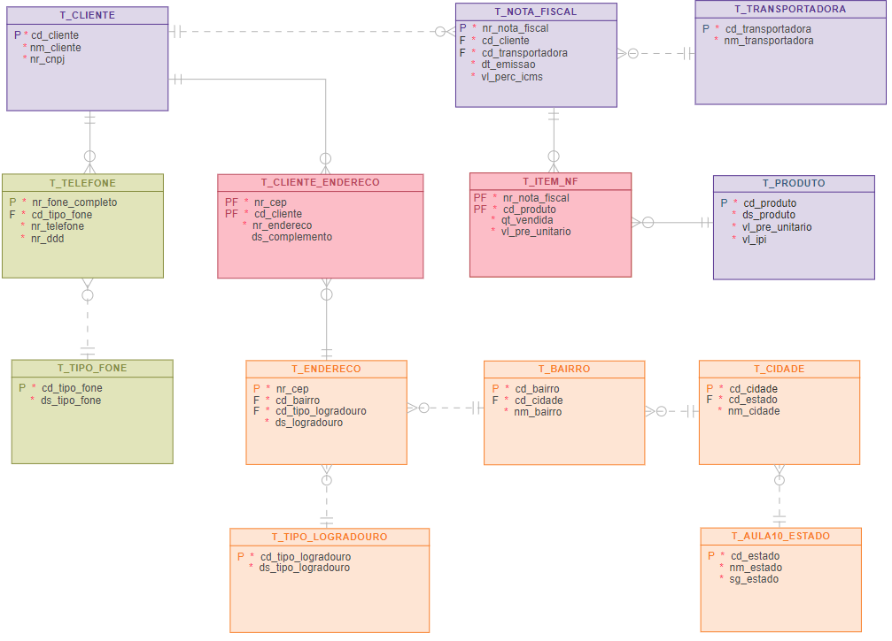
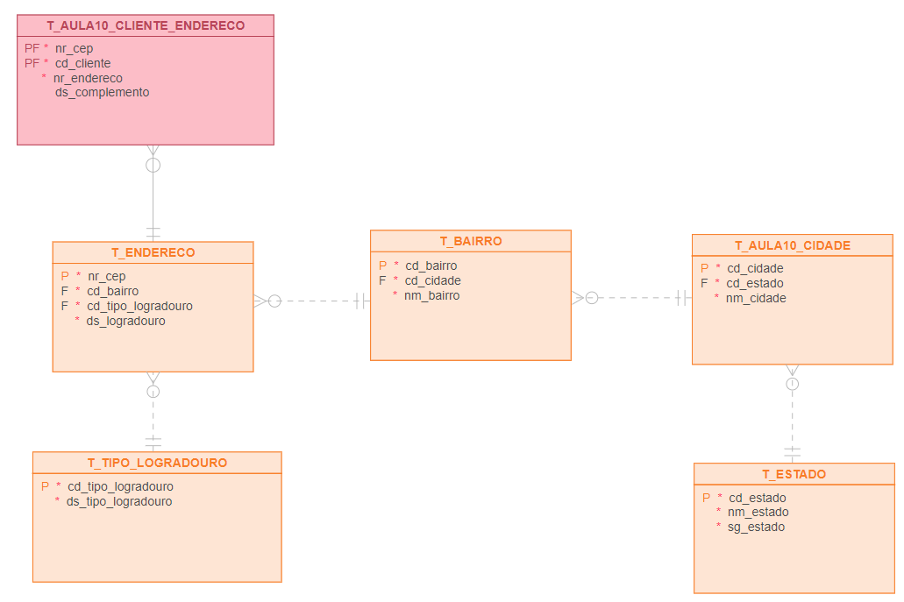
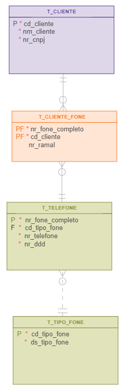

<h1>FASE 3 - MODELING</h1>
<h2>Capítulo 06: Aprendendo a armazenar de maneira correta. 🗂️</h2>

> A normalização é um conjunto de regras com o objetivo de garantir um modelo rápido, organizado e otimizado.

<h2>1.1 Instrumento de verificação - Sobre as formas normais</h2>

> Formas normais são as técnicas que evitam a redundância dos dados.

- é um instrumento para verificar a qualidade e a simplicidade (redução da complexidade) dos nossos projetos de bancos de dados.
- processo formal é um passo a passo que examina os atributos de uma entidade com o objetivo de evitar redundâncias (informações desnecessárias ou em excesso) e garantir a estabilidade do Modelo de Dados.
- aplicação de regras que irão garantir a eliminação de redundâncias e valores nulos e, por consequência, provocar reduções de tempo e acesso ao disco, além da redução da complexidade de sua estrutura!

> Embora existam 5 Formas Normais, a aplicação da 3ª regra já é suficiente para garantir estabilidade do modelo de dados e, por esta razão, o curso concentrou os estudos nas três primeiras e mais importantes regras.

### Objetivos da normalização de dados

- minimizar redundâncias e inconsistências.
- facilitar a manutenção do sistema de informações.
- facilitar manutenções dos bancos de dados.

### Ainda sobre formas normais

- são um conjunto de restrições (regras) que os dados devem satisfazer.
- introduzido por Dr. Edgar F. Codd em 1970.
- São técnicas para a retirada de “anomalias” do modelo relacional.
- O processo de normalização baseia-se no conceito de Forma Normal, uma regra que deve ser obedecida por uma tabela (entidade) para que esta seja considerada bem projetada.

## 1.1.1 Exemplificando a aplicação das 3 principais restrições ou formas normais

Nº Nota Fiscal | Data Emissão | CNPJ Cliente | Nome Cliente | Endereço Cliente | Produto | IPI | Preço Unitário | Qtd | Transportadora | ICMS | Total da Nota
-------------|---------------|-----------|-------------|-----------------|-------|----------|-------------|-----------|-----------|-----------|-----------
456789 | 10/09/2010 | 1111111 | Pedro Luis | Rua Serafim de Gusmão, 34 | Refrigerador | 8% | R$ 1.200,00 | 2 | Rio Grandense | 25% | R$ 3.290,00
456789 | 10/09/2010 | 1111111 | Pedro Luis | Rua Serafim de Gusmão, 34 | Televisão | 8% | R$ 890,00 | 1 | Rio Grandense | 25% | R$ 3.290,00
123456 | 12/09/2010 | 2222222 | Amaro Godoi | Av. Rudge, 345 | Aquecedor a gás | 8% | R$ 550,00 | 1 | Rio Grandense | 25% | R$ 5.650,00
654321 | 13/09/2010 | 3333333 | Celso Araujo | Av. Sto Amaro, 321 | Aquecedor a gás | 8% | R$ 550,00 | 3 | Rio Grandense | 25% | R$ 4.050,00
654322 | 14/09/2010 | 5555555 | Paula Maria | Rua Frei João, 42 | Televisão | 8% | R$ 890,00 | 2 | Rio Grandense | 25% | R$ 1780,00
123456 | 12/09/2010 | 2222222 | Amaro Godoi | Av. Rudge, 345 | Refrigerador | 8% | R$ 1.200,00 | 2 | Rio Grandense | 25% | R$ 5.650,00
212135 | 16/09/2010 | 3333333 | Celso Araujo | Av. Sto Amaro, 321 | Televisão | 8% | R$ 890,00 | 4 | Entrega Expressa | 25% | R$ 3.560,00
635241 | 17/09/2010 | 4444444 | Joaquina Ramalho | Rua Frei João, 42 | Aquecedor a gás | 8% | R$ 550,00 | 1 | Entrega Expressa | 25% | R$ 550,00
123456 | 12/09/2010 | 2222222 | Amaro Godoi | Av. Rudge, 345 | Computador | 8% | R$ 1.350,00 | 2 | Entrega Expressa | 25% | R$ 5.650,00
843221 | 19/09/2010 | 2222222 | Amaro Godoi | Av. Rudge, 345 | Freezer | 8% | R$ 1.560,00 | 3 | Entrega Expressa | 25% | R$ 4.680,00
654321 | 13/09/2010 | 3333333 | Celso Araujo | Av. Sto Amaro, 321 | Refrigerador | 8% | R$ 1.200,00 | 2 | Entrega Expressa | 25% | R$ 4.050,00

### Problemas:

- Para saber quais clientes compraram “Refrigerador”, teríamos que ler linha a linha (ocorrências da entidade) da tabela.•
- Para atualizar o endereço de um cliente, teríamos que ler linha a linha da tabela e realizar a alteração em todos os registros associados ao cliente em questão.
- Se deletarmos o pedido da “Joaquina Ramalho”, perderemos as informações referentes ao endereço (há apenas um registro para a Joaquina Ramalho).

### Anomalias (anormalidades/irregularidades) de uma estrutura desnormalizada, considerando o exemplo:

I. Durante a INSERÇÃO de dados:
 

- Quando um item de uma nota fiscal for inserido, será preciso informar os dados da transportadora mesmo que eles já estejam cadastrados.
- Não será possível inserir um produto vendido (item) sem inserir também uma transportadora.
- Não é possível inserir um novo produto sem que tenha sido vendido.
- Só é possível cadastrar um cliente se uma venda for realizada. 

II. Durante a EXCLUSÃO de dados:
 

- Quando um item (produto) de uma nota fiscal for excluído (ou uma nota fiscal), se ele for um único pedido associado à transportadora, perderemos os dados da transportadora, pois terão que ser excluídos juntamente com os itens (produtos vendidos) da nota fiscal. 

III. Durante a ATUALIZAÇÃO de dados:
 

- Caso seja necessário alterar os dados de uma transportadora, será preciso atualizar os mesmos dados em todas as ocorrências que estejam referenciando essa transportadora.
- O mesmo vale para o cliente, caso um cliente mude de endereço, será preciso atualizar todas as ocorrências em que o cliente está associado a uma nota fiscal.

--- 

<h2>1.2 Primeira Forma Normal (1FN)</h2>

> Uma entidade está na primeira forma normal quando nenhum de seus atributos (na estrutura) possuírem repetições.

### `Solução`: Separar informação que se repete, em uma nova entidade.
- levar a chave primária da entidade original para a nova entidade.
- podemos localizar um atributo que, unido à chave primária, formará a chave da nova entidade ou criamos um atributo identificador para essa nova entidade.

### Aplicando a 1FN no exemplo proposto:

- na tabela, há varias informações que se repetem, como:
  - há vários produtos em uma mesma nota fiscal, portanto esses elementos precisam ser tirados da estrutura 
  - nessa estrutura desnormalizada, se vender 3 produtos, haverá 3 ocorrências.
  - portanto, é possível criar dois grupos: tabelas ***Nota_Fiscal*** e ***Itens_Nota_Fiscal***.
    - “Número da Nota Fiscal” como chave primária do grupo original (NOTA FISCAL).

### Entidades “NOTA FISCAL” e “ITENS NOTA FISCAL”, após a aplicação da 1FN:

- Entidade “NOTA_FISCAL”:
  - elementos (atributos) que compõem a estrutura original, excluindo os elementos repetidos.
  - depois da aplicação da 1FN, haverá o grupo “NOTA FISCAL”, com os atributos: #Número Nota Fiscal, data da emissão, CNPJ cliente, nome do cliente, endereço do cliente, transportadora, ICMSe total da nota.

Nº Nota Fiscal | Data Emissão | CNPJ Cliente | Nome Cliente | Endereço Cliente | Transportadora | ICMS | Total da Nota
-------------|---------------|-----------|-------------|-----------------|-------|----------|-------------
456789 | 10/09/2010 | 1111111 | Pedro Luis | Rua Serafim de Gusmão, 34 | Rio Grandense | 25% | R$ 3.290,00
456789 | 10/09/2010 | 1111111 | Pedro Luis | Rua Serafim de Gusmão, 34 | Rio Grandense | 25% | R$ 3.290,00
123456 | 12/09/2010 | 2222222 | Amaro Godoi | Av. Rudge, 345 | Rio Grandense | 25% | R$ 5.650,00
654321 | 13/09/2010 | 3333333 | Celso Araujo | Av. Sto Amaro, 321 | Rio Grandense | 25% | R$ 4.050,00
654322 | 14/09/2010 | 5555555 | Paula Maria | Rua Frei João, 42 | Rio Grandense | 25% | R$ 1780,00
123456 | 12/09/2010 | 2222222 | Amaro Godoi | Av. Rudge, 345 | Rio Grandense | 25% | R$ 5.650,00
212135 | 16/09/2010 | 3333333 | Celso Araujo | Av. Sto Amaro, 321 | Entrega Expressa | 25% | R$ 3.560,00
635241 | 17/09/2010 | 4444444 | Joaquina Ramalho | Rua Frei João, 42 | Entrega Expressa | 25% | R$ 550,00
123456 | 12/09/2010 | 2222222 | Amaro Godoi | Av. Rudge, 345 | Entrega Expressa | 25% | R$ 5.650,00
843221 | 19/09/2010 | 2222222 | Amaro Godoi | Av. Rudge, 345 | Entrega Expressa | 25% | R$ 4.680,00
654321 | 13/09/2010 | 3333333 | Celso Araujo | Av. Sto Amaro, 321 | Entrega Expressa | 25% | R$ 4.050,00

- Entidade “ITEM_NF”:
  - dados (atributos) que compõem os elementos repetidos da estrutura original.
  - depois da 1FN, teremos o grupo “ITEM_NF”,contendo: #Número Nota Fiscal, #Código do Produto, descrição do produto, valor do IPI, preço unitário do produto e quantidade vendida.
  - chave primária: atributos “Nr. Nota Fiscal” e o “Código do Produto”.

Nº Nota Fiscal | Produto | IPI | Preço Unitário | Qtd
-------------|---------------|-----------|-------------|-----------------
456789 | Refrigerador | 8% | R$ 1.200,00 | 2
456789 | Televisão | 8% | R$ 890,00 | 1
123456 | Aquecedor a gás | 8% | R$ 550,00 | 1
654321 | Aquecedor a gás | 8% | R$ 550,00 | 3
654322 | Televisão | 8% | R$ 890,00 | 2
123456 | Refrigerador | 8% | R$ 1.200,00 | 2
212135 | Televisão | 8% | R$ 890,00 | 4
635241 | Aquecedor a gás | 8% | R$ 550,00 | 1
123456 | Computador | 8% | R$ 1.350,00 | 2
843221 | Freezer | 8% | R$ 1.560,00 | 3
654321 | Refrigerador | 8% | R$ 1.200,00 | 2

--- 

<h2>1.3 Segunda Forma Normal (2FN)</h2>

> Uma entidade está na segunda forma normal, se estiver na 1FN e quando todos os seus atributos não chave (atributos descritores) dependerem unicamente da chave.

### `Solução`: Separar os atributos repetidos que não fazem parte (dependência parcial) exclusivamente da chave primária e criar uma nova entidade.

### Aplicando a 2FN no exemplo proposto:

- no exemplo que o atributo “Descrição do Produto” não depende da chave “Nr. Nota Fiscal e Código do Produto”. A descrição do produto depende apenas do “CÓDIGO DO PRODUTO”.
- o atributo “QUANTIDADE VENDIDA” depende de forma total da chave primária “Nr. Nota Fiscal e Código do Produto”, pois a quantidade vendida só existe, quando o item (Produto) for vendido.
- a descrição do produto pode ser escrita de forma diferente em cada ocorrência nessa entidade (exemplo original).

> Essa técnica é utilizada em entidades que contêm mais de um atributo compondo a chave primária!

Há, ainda, outros problemas no modelo original:

- só poderemos inserir detalhes sobre um “PRODUTO”, “CLIENTE” ou “TRANSPORTADORA” apenas quando uma “VENDA” (Nota Fiscal) for realizada.
- quando uma “VENDA” (Nota Fiscal) for eliminada do cadastro, serão eliminados os dados do Cliente, Produto e Transportadora.
- para atualizar os dados (características) do “CLIENTE”, teremos que pesquisar todas as ocorrências da “VENDA” (Nota Fiscal) e atualizá‐las uma a uma. Para um cliente com muitas vendas, serão necessárias várias atualizações redundantes.

### Entidade "Produto"

- contém os atributos que dependem do “CÓDIGO PRODUTO”.
- depois da aplicação da 2FN, teremos o grupo “PRODUTO”, contendo os atributos: #Código do produto, descrição do produto, valor IPI e preço unitário do produto.

Código Produto | Produto | IPI | Preço Unitário
-------------|---------------|-----------|-------------
1 | Refrigerador | 8% | R$ 1.200,00
2 | Televisão | 8% | R$ 890,00
3 | Aquecedor a gás | 8% | R$ 550,00
4 | Computador | 8% | R$ 1.350,00
5 | Freezer | 8% | R$ 1.560,00

> Caso exista a necessidade de armazenar o valor unitário do produto como histórico de vendas, pode‐se replicar o atributo “PRECO UNITARIO” na entidade “ITEM_NF” (Desnormalização) ou implementar uma entidade responsável por manter o preço unitário do produto historicamente.

### Entidade "ITEM_NF":

- contém os elementos (atributos) originais, excluídos os atributos que são dependentes apenas do “PRODUTO”.
- a chave primária será o atributo participante da chave primária da tabela origem, ou seja, serão os atributos:“Nr. NOTA FISCAL”e “CÓDIGO PRODUTO”.

Nº Nota Fiscal | Produto | Qtd
---------------|---------|------
456789 | 1 | 2
456789 | 2 | 1
123456 | 3 | 1
654321 | 3 | 3
654322 | 2 | 2
123456 | 1 | 2
212135 | 2 | 4
635241 | 3 | 1
123456 | 4 | 2
843221 | 5 | 3
654321 | 1 | 2

---

<h2>1.4 Terceira Forma Normal (3FN)</h2>

> Uma entidade está na terceira forma normal, se estiver na 2FN e quando todos os seus atributos não chave não dependerem de nenhum outro atributo não chave; em outras palavras, um atributo não deve depender de outro atributo (dependência transitiva).Isso ocorre normalmente em cálculos e em atributos “perdidos” na entidade errada.

### `Solução`: realizar a análise: se o atributo for resultado de um cálculo matemático, devemos simplesmente excluir esse atributo, pois ele não acrescenta nada no modelo de dados. Se for um grupo de informações relacionadas, aplicar a segunda forma normal. Se for um atributo “perdido”, devemos reconduzi‐lo à entidade da qual depende.

> Muitas vezes mantemos alguns atributos resultantes de cálculos, a fim de ter melhores resultados no momento da pesquisa destas informações dentro da estrutura de armazenamento.

### Aplicando a 3FN no exemplo proposto:

- os dados do “CLIENTE” (CNPJ, nome, endereço) dependem funcionalmente do atributo “CNPJ”, o qual não faz parte da chave primária da entidade “NOTA FISCAL”.
- o mesmo ocorre comos dados da “TRANSPORTADORA”.

### Entidade “NOTA_FISCAL”:

- contém os atributos associados à chave primária “Nr. Nota fiscal”.
- o atributo “TOTAL DA NOTA” também foi retirado, por se tratar de um cálculo baseado nos atributos “QUANTIDADE VENDIDA” e “PREÇO UNITÁRIO” existentes na entidade “ITEM_NF”.

Nº Nota Fiscal | Data Emissão | CNPJ Cliente | Código da Transportadora | ICMS 
-------------|---------------|-----------|-------------|-----------------
456789 | 10/09/2010 | 1111111 | 1 | 25%
123456 | 12/09/2010 | 2222222 | 1 | 25% 
654321 | 13/09/2010 | 3333333 | 1 | 25% 
654322 | 14/09/2010 | 5555555 | 1 | 25%
123456 | 12/09/2010 | 2222222 | 1 | 25% 
212135 | 16/09/2010 | 3333333 | 2 | 25%
635241 | 17/09/2010 | 4444444 | 2 | 25% 
843221 | 19/09/2010 | 2222222 | 2 | 25%

### Entidades “TRANSPORTADORA” e “CLIENTE”

- contêm os elementos (atributos) não dependentes da chave primária “Nr. Nota Fiscal”.

CNPJ Cliente | Nome Cliente | Endereço Cliente
-------------|---------------|-----------
1111111 | Pedro Luis | Rua Serafim de Gusmão, 34
2222222 | Amaro Godoi | Av. Rudge, 345
3333333 | Celso Araujo | Av. Sto Amaro, 321 
5555555 | Paula Maria | Rua Frei João, 42 
4444444 | Joaquina Ramalho | Rua Frei João, 42

Código Transportadora | Transportadora
-------------|---------------
1 | Rio Grandense 
2 | Entrega Expressa

--- 

<h2>2. TRABALHANDO COM ATRIBUTOS</h2>

## 2.1 Trabalhando com atributos compostos

- decompor atributos compostos em atributos “Atômicos” (únicos).
- exemplos:
  - atributo composto “TELEFONE”, podemos decompor em: DDI + DDD + Nr. Telefone + Ramal.
  - atributo composto “ENDEREÇO”, podemos decompor em: Tipo de Logradouro, Nome Logradouro, Número, complemento, CEP, Cidade, Estado, Bairro e País.
  - Atributo composto “CNPJ”, podemos decompor em: Número CNPJ, Número da filial CNPJ e o dígito verificador CNPJ.

### 2.1.1 Trabalhando com atributos multivalorados

- atributos multivalorados são transformados em entidades.
- aplicar a 1ª Forma Normal, na qual geramos novas entidades para os atributos que se repetem dentro da estrutura.
- exemplo: atributo multivalorado “ENDEREÇO”, pode gerar as entidades: Estado, Cidade, Bairro, Endereço(logradouro) e Tipo de Logradouro.

## 2.2 Normalização

### 2.2.1 Benefícios da normalização

- nível maior de simplificação, reorganizando o conteúdo e removendo os grupos repetitivos.
- facilita a compreensão dos registros de dados e torna a aplicação de mudanças mais fácil do que em casos em que os dados estão organizados em formas menos precisas.
- reduz a redundância de dados, tornando mais fácil manter as informações consistentes e seguras, diminuindo total de espaço requerido para armazenar os dados.

### 2.2.2 Modelagem de dados exemplificando a normalização

`Opção 1`: 
- telefone implementado a partir da situação M:N.
- necessidade em empresas em que várias pessoas compartilham o mesmo telefone, ou em residências onde uma mesma família possui um mesmo telefone fixo.

 

 
<em>Exemplo de modelagem para normalização, primeira opção.</em>

 

`Opção 2`:
- relação 1:N entre cliente e telefone, ou seja, um cliente pode possuir vários telefones.
- se tivermos pessoas que trabalham na mesma empresa, compartilhando o mesmo fone, teremos o telefone cadastrado individualmente para cada pessoa.
- ramal mantido como  atributo opcional.

 

 
<em>Exemplo de modelagem para normalização, segunda opção.</em>

 

1. `Exemplo: Normalização do Endereço`

- o nível de decomposição sempre está associado à necessidade de negócio.
- criadas as tabelas:
  - “Estado” – Representa todos os estados da Federação brasileira.
  - “Cidade” – Representa todas as cidades existentes em cada estado.
  - “Bairro” – Representa todos os bairros existentes em cada cidade.
  - “Endereço” – Representa o nome do logradouro existente em cada bairro.
  - “Tipo_Logradouro” – Representa o tipo de logradouro (rua, avenida, praça, travessa).
  - “Cliente_Endereco” – Representa a entidade associativa que permite compartilhar um mesmo endereço para várias pessoas e representar a necessidade de uma pessoa possuir vários endereços, por exemplo: residencial, comercial, entrega, correspondência.

 

 
<em>Exemplo de modelagem para normalização.</em>

 

2. `Exemplo: Normalização do Telefone`

- criadas as tabelas:
  - “TIPO_FONE” – Representa o tipo de telefone (residencial, comercial, recados, celular).
  - “TELEFONE” – Representa todos os telefones cadastrados, pertencentes a uma ou mais pessoas.
  - “CLIENTE_FONE” – Representa entidade associativa, que permite compartilhar um mesmo telefone para várias pessoas e representar a necessidade de uma pessoa possuir vários telefones (residencial, comercial, celular, recados).

`Opção 1:`

 

 
<em>Exemplo de modelagem para normalização (2).</em>

 

- “TIPO_FONE” – Representa o tipo de telefone(residencial, comercial, recados, celular).
- “TELEFONE” – Representa todos os telefones cadastrados, pertencentes a um único cliente. Nesse caso, o telefone é cadastrado individualmente para cada pessoa.

`Opção 2:`

 

 
<em>Exemplo de modelagem para normalização, segunda opção (2).</em>

 

---

<h2>2.3 Roteiro de apoio para aplicação da normalização</h2>

Normalização | Procedimento
-------------|----------------
1FN | - Decompor a entidade em uma ou mais entidades, sem grupos repetitivos. - Destacar um ou mais atributos como chave primária da(s) nova(s) entidade(s), e este será concatenado com a clahe primária da entidade original. - Estabelecer o relacionamento e a cardinalidade entre a(a) nova(s) endidade(s) gerada(s) e a entidade geradora. - Criar relacionamentoa 1:N entre a entidade original e a entidade criada.
2FN | - Para entidades que contenham chaves primárias concatenadas, destacar os atributos que tenham dependência parcial em relação à chave primária concatenada. - Criar uma entidade que conterá esses atributos e que terá como chave primária o(s) atributo(s) do(s) qual(quais) se tenha dependência parcial. - Serão criadas tantas entidades quantos forem os atributos da chave primária concatenada que gerem dependência parcial. - Estabelecer o relacionamento e a cardinalidade entre a(s) nova(s) entidade(s) gerada(s) e a entidade geradora.
3FN | - Verificar se existem atributos que sejam dependentes transitivos de outros que não pertencem à chave primária, sendo ela concatenada ou não, bem como atributos que sejam dependentes de cálculo realizado a partir de outros atributos. - Destacar os atributos com dependência transitiva, gerando uma nova entidade com esse atributo cuja chave primária é o atributo que originou a dependência. - Eliminar os atributos obtidos por cálculos realizados a partir de outros atributos.

--- 

## FAST TEST

### 1. Dentre as formar normais, qual é a opção para validar e tratar dados repetidos?
> Primeira forma normal.

### 2. Qual é a alternativa que pode ser resolvida com a criação de atributo composto?
> Endereço residencial.

### 3. O que é um dado redundante?
> É um dado sem quelidade, sem coerência. Em uma base de dados redundantes, podem haver informações duplicadas ou haver informações desnecessárias.

--- 

[Voltar ao início!](https://github.com/monicaquintal/fintech)