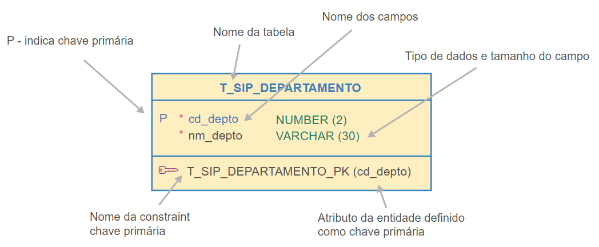
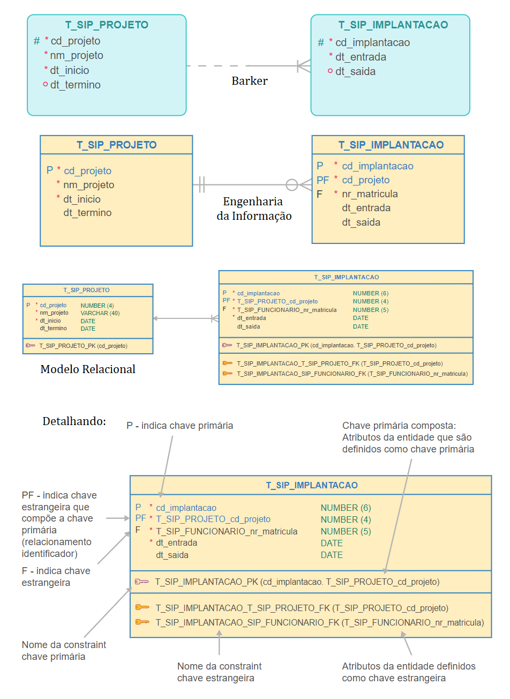

<h1>FASE 3 - MODELING</h1>
<h2>Capítulo 07: Definindo as estruturas físicas!</h2>

<h2>1. DEFININDO AS ESTRUTURAS FÍSICAS!</h2>

> Introdução ao modelo relacional ou modelo físico de dados!

## 1.1 Sobre o modelo físico

- modelo físico ou relacional representa os dados em um BD, como uma coleção de tabelas (relações), para gerência de bases de dados (SGBD).
- é um modelo de dados baseado em lógica na teoria dos conjuntos.
- é derivado do modelo lógico.
- exemplos de SGBDs relacionais: Oracle, SQL Server, DB2 (IBM), MySQL, PostgreSQL.
- é a última etapa do projeto de banco de dados.
- o conjunto de comandos DDL (Linguagem de Definição de Dados) é denominado SCRIPT de criação de banco de dados e será executado no SGBD.

## 1.2 Conversão de entidades e respectivos atributos

### Converter entidade e respectivos atributos

- Cada entidade é traduzida para uma tabela.
- Cada atributo define uma coluna.
- Cada atributo identificador define colunas que compõem a chave primária.

> É conveniente manter os nomes das colunas curtos e utilizar a mesma nomenclatura para todo o banco de dados. Normalmente, empresas criam regras para composição dos nomes, que devem estar de acordo com as regras de criação de nomes dos SGBDs em relação aos caracteres e tamanho permitidos.

`Importante`: ***Todas as tabelas devem possuir uma chave primária. No caso de não existirem, é preciso criar um identificador, preferencialmente com conteúdo numérico por ser localizado mais rapidamente pelos SGBDs.***

 

 
<em>Informações disponíveis em uma tabela do Modelo Físico.</em>

 

- ***Constraints***:
  - são restrições (regras) associadas às colunas (campos) de uma tabela.
  - no exemplo acima, a constraint do tipo chave primária é utilizada para identificar cada ocorrência (registro) de maneira única.

### `Regra para Mapeamento de entidade com relacionamento identificador`

- para cada relacionamento identificador (-  -  -  - ----<), é criada uma chave estrangeira que implementa a entidade identificada pelo relacionamento identificador.
- A chave primária da tabela, que implementa a entidade identificada pelo relacionamento identificador, será composta por:
  - Colunas correspondentes aos atributos identificadores.
  - Chaves estrangeiras que implementam os relacionamentos identificadores.

 

 
<em>Exemplificando a Regra para Mapeamento de entidade com relacionamento identificador.</em>

 

- atributos se transformam em campos de tabelas, exceto quando são multivalorados ou compostos. 
  - Atributos compostos devem ser desmembrados em atributos atômicos (único/indivisível).
  - Atributos multivalorados devem dar origem a uma nova tabela.

## 1.3 Conversão de relacionamentos e respectivos atributos

> A conversão é determinada pela cardinalidade mínima e máxima das entidades que participam do relacionamento.

- há três opções para tradução de relacionamentos:
  - Tabela própria (Entidade Associativa ou Agregação).
  - Adição de colunas (atributos do relacionamento).
  - Fusão de tabelas.

### A) Tabela Própria (ENTIDADE ASSOCIATIVA):

- o relacionamento é implementado através de uma tabela própria (ASSOCIATIVA), contendo as seguintes colunas:
  - colunas correspondentes aos identificadores das entidades relacionadas (chaves estrangeiras).
  - colunas correspondentes aos atributos do relacionamento.

### B) Adição de Colunas:

- adicionar na tabela, cuja cardinalidade máxima é 1 (relacionamento), as seguintes colunas:
  - colunas correspondentes ao identificador da entidade relacionada, formando uma chave estrangeira em relação à tabela que implementa a entidade relacionada.
  - colunas correspondentes aos atributos do relacionamento.

### C) Fusão de Tabelas:

- implementar em uma única tabela todos os atributos de ambas as entidades e atributos eventualmente existentes no relacionamento. 
- esta conversão **somente pode ser aplicada para relacionamentos do tipo 1:1**.
- teremos a implementação de um relacionamento recursivo.

## 1.4 Conversão de especialização e generalização

- há três alternativas para implementação:
  - uma única tabela para toda hierarquia de generalização/especialização.
  - uma tabela para cada entidade.
  - uma tabela genérica e tabelas especializadas.

---

<h2>2. ANÁLISE ENTRE OS TIPOS DE IMPLEMENTAÇÃO</h2>

### Tabela única: 
- os dados estão em uma única linha.
- não é necessário realizar junções para obter informações da entidade genérica e especializada. 
- as colunas opcionais são referentes aos atributos que podem ser vazios de acordo com as características de cada funcionário.
- a chave primária é armazenada uma única vez.

### Uma tabela por entidade especializada: 
- faremos junções para obter as informações necessárias, pois parte dos dados estáarmazenada na tabela genérica e parte na tabela especializada.

### Uma tabela para cada entidade: 
- há replicação dos dados em cada tabela.

## 2.1 Mapeamento de entidades fracas

- para cada tabela fraca, a chave primária será composta pela chave primária da tabela Forte e mais um atributo (chave estrangeira na tabela fraca), formando uma chave primária composta.

## 2.2 Tipos de Dados

- SQL Developer Data Modeler permite definir o tipo de dado dos atributos (poderá armazenar valores numéricos, texto, data, imagens, sons ou algum outro valor).

Tipo de dado | Informações
-------------|------------
VARCHAR2 | - tipo de dado texto - usado para armazenar caracteres alfanuméricos (palavras e texto sem formatação) - o número entre parênteses indica o nº máximo de caracteres que podem ser armazenados (tamanho do campo) - obrigatório informar o tamanho do campo
NUMBER | - tipo de dado numérico - usado para armazenar números positivos ou negativos, sejam inteiros, com ponto flutuante ou com tamanho fixo de casas decimais - caso tenha vírgula (como em NUMBER(7,2)), o primeiro número indica tamanho do campo, e o segundo, quantas casas decimais.
DATA | - usado para armazenar datas - contém data e hora - seu formato pode ser definido no momento da instalação do banco de dados ou em tempo de execução - o formato permite armazenar dia, mês, ano, hora, minuto e segundo  - não aceita frações de segundo, nem fuso horário - não é necessário informar o tamanho desse tipo de dado

## 2.3 Gerando um script

- Oracle SQL Developer Data Modeler permite gerar um arquivo de script com os comandos de Data Definition Language (DDL), que podem ser usados para criar as tabelas no banco de dados:
  - atalho Alt+Shit+L executa o Editor de Arquivos DDL.
  - outro caminho é selecionar o menu “Exibir” e escolher a opção “Editor de Arquivos DDL” > Gerar.

- Na tela “Opções de Geração de DDL”, clique em “OK”. 
- Opcionalmente desmarque as caixas “Atribuído a Esquemas”, “Esquemas”, “Tipos Estruturados” e “Tipos de Coleção”.
- As instruções DDL foram geradas.
- Ao clicar em Salvar, será gerado um arquivo com o script com os comandos DDL, que podem ser usados para criar as tabelas no banco de dados.

---

## FAST TEST

### 1. Qual é o tipo de relacionamento que permite a fusão de tabelas?
> 1:1

### 2. No modelo físico, podemos afirmar que todos os atributos se transformam em colunas de tabelas?
> Sim, exceto quando são atributos multivalorados ou compostos. Esses devem ter uma tratativa diferente.

--- 

## ATIVIDADE:
### DESENVOLVER UM MODELO DE DADOS COMPLETO (MODELO LÓGICO, MODELO FÍSICO E SCRIPT SQL DE CRIAÇÃO DE TABELAS) DO FINTECH

Agora a brincadeira ficou séria! Abra seu Oracle SQL Developer Data Modeler e crie um modelo de dados completo do sistema Fintech! A entrega deve ser composta por:
  
- Diagrama de Modelo Lógico.
- Diagrama de Modelo Físico.
- Scripts SQL de criação de tabelas.
- Plano “B”: Diagramas em formato JPG ou PNG caso o seu projeto do Data Modeler não abra por aqui!
  
As informações que você precisa foram explanadas nas Fases 1 e 2, tudo o que falamos até agora PODE E DEVE SER USADO. Não se esqueça de suas entregas até aqui: tudo isso auxilia na criação do modelo de dados.
  
O exercício de “Quais informações são indispensáveis (e, portanto, obrigatórias) e qual delas são desejáveis (e, portanto, opcionais?)” é por sua conta, use seu senso crítico!
  
Não deixe de fazer uma boa normalização! Como resolver dados compostos e multivalorados? E outras situações que deixem os dados redundantes? Mitigue tudo isso!
  
“Fui além dos dados passados nas fases 1 e 2, fiz isso no protótipo de telas e fiz no modelo. Está errado?” Não necessariamente! Se você acredita que o dado coletado é pertinente ao negócio (Fintech), ótima contribuição! No entanto, relembramos: todas as entregas a partir daqui precisam contemplar seu escopo diferenciado. O projeto final deverá ser entregue funcionando com esses acréscimos! Como sempre digo: se você topar, nós topamos!
  
Não quer usar o Oracle SQL Developer Data Modeler? Não tem problema! Embora nossos materiais didáticos estejam baseados nele, existem outras ferramentas de mercado tão boas quanto que você pode usar! No entanto, seja qual for a ferramenta, pedimos que você sempre exporte o modelo em formato de imagem (como JPG ou PNG) porque seria inviável termos por aqui todas as ferramentas disponíveis.
  
Faça isso, mesmo que você use o Data Modeler. Repare que, ao salvar o projeto em Data Modeler, ele cria um arquivo.dmd e uma pasta com o mesmo nome de seu projeto. Precisamos de um ZIP com tudo isso! Apenas o arquivo.dmd NÃO GARANTE A VISUALIZAÇÃO DO PROJETO. Compacte em ZIP e mande-nos tudo! Repetimos, aproveite e gere JPG ou PNG (a ferramenta gera facilmente) para usarmos como “plano B”. Combinado?
  
Muito bem! Excelente atividade para você e, qualquer dúvida, estamos por aqui, ok?
 

---

[Voltar ao início!](https://github.com/monicaquintal/fintech)