

<h1>FASE 5 - OOP</h1>
<h2>Capítulo 02: ... porque todos amam diagramas!</h2>

<h2>1... PORQUE TODOS AMAM DIAGRAMAS!</h2>

## 1.1 Introdução

- sistemas desenvolvidos pelo `paradigma orientado a objetos` são mais flexíveis, permitem manutenção mais fácil e melhor administração do domínio do problema. 
  - tendo o objeto como ponto central da análise e do desenvolvimento, é possível tratar as operações (métodos) e os dados (atributos) em uma mesma unidade.
  - propõe uma maneira diferente de abordar e desenhar os processos de negócios das empresas.

- `Linguagem de Modelagem Unificada` (Unified Modeling Language - UML):
  - propõe a construção de diagramas para o desenvolvimento de sistemas orientados a objetos.
  - busca facilitar, através de notação visual, uma representação comum em determinado momento do desenvolvimento de software.

### 1.1.1 Conceito de orientação a objetos

- Fintech utiliza o paradigma de orientação a objetos que colaboram entre si para realizar tarefas.

### 1.1.2 Conceito de UML (Unified Modeling Language ou Linguagem de Modelagem Unificada)

- linguagem de modelagem que inclui elementos visuais para expressar conceitos em uma notação simples, e poderosa o suficiente para comunicar de modo eficiente.
- linguagem visual utilizada para modelar softwares baseados no paradigma da orientação a objetos. 
- linguagem de modelagem de propósito geral, que pode ser usada em todos os domínios da aplicação.
- nos últimos anos, tornou-se a linguagem padrão de modelagem adotada internacionalmente pela indústria de engenharia de software.

### 1.1.3 Histórico de desenvolvimento de sistemas

- embora já existisse há décadas, o paradigma para a modelagem de sistemas orientados a objetos ganhou força na década de 80. 
- as principais técnicas para modelagem de sistemas que surgiram foram: 

Técnica | Detalhes
--------|-------------
Ivair Jacobson – OOSE (Object Oriented Software Engineering) | Ênfase em Casos de Uso – Descrição do cenário. Demonstra interação do usuário com o sistema.
James Rumbaugh – OMT (Object Modeling Technique) | Representação de objetos, classes e relacionamentos.
Grady Booch – Booch | Sistema que deve ser analisado por meio de várias visões, para cada uma delas um diagrama.

- ao final da década de 1980, estes padrões sofrem uma fusão: combinaram-se os pontos fortes de cada um, surgindo a UML, que unifica o padrão.
- a responsabilidade pela evolução da UML ficou a cargo da `OMG` (Grupo de Gerenciamento de Objeto), seu órgão aprovador. 
  - trata-se de uma sociedade aberta, sem fins lucrativos, que mantém as especificações para a indústria de software.

## 1.2 Paradigma da orientação a objetos

- Conceitos:

1. **analogia biológica**: “Como seria um sistema de software que funcionasse como um ser vivo?”
  - Alan Kay imaginou a construção de um software a partir de agentes autônomos que interagem entre si, estabelecendo os princípios:
    - Qualquer coisa é um objeto.
    - Objetos realizam tarefas através da requisição de serviços a outros objetos.
    - Cada objeto pertence a uma determinada classe, que agrupa objetos similares.
    - A classe é um repositório para comportamento associado ao objeto.
    - Classes são organizadas em hierarquias.

2. **paradigma da orientação a objetos**:
  - visualiza um sistema de software como uma coleção de agentes interconectados chamados `objetos`. 
    - cada objeto é responsável por executar tarefas específicas.
    - é pela interação entre eles que uma tarefa computacional é realizada.
    - são identificados por meio de cenários aos quais pertencem.
    - cada objeto realiza um conjunto de ações conforme suas responsabilidades dentro deste cenário.
    
- `Vantagens do paradigma`:

- facilidade na manutenção do sistema: muitas vezes, ao fazer a correção do código ou uma pequena modificação, precisamos alterar uma única classe, quando, no paradigma estruturado, a mesma modificação talvez exija alterar várias partes do sistema.
- reutilização de código: alterações se tornam possíveis com o uso de princípios de abstração como herança e polimorfismo.

### 1.2.1 Classe

- conjunto de objetos com as mesmas características (***atributos***) e comportamentos (***métodos ou operações***).
- `objeto`:
  - são as instâncias das classes, construídos com base nos atributos e métodos definidos por elas. 
  - classes são como moldes ou formas, e os objetos são moldados a partir delas. 
  - são considerados qualquer coisa do mundo real.

### 1.2.2 Mensagem

- objetos de um sistema trocam mensagens entre si para realizarem tarefas. 
- a mensagem estimula que um comportamento ocorra no objeto que a recebe, comportamento obtido por meio de uma operação que é executada.
- enviar uma mensagem = executar um método.
- **mensagem é uma requisição enviada de um objeto a outro para que este último realize alguma operação**.

### 1.2.3 Métodos, operações ou comportamentos

- `método`:
  - é a operação realizada quando um objeto recebe uma mensagem para que seja executada.
  - a mensagem é a chamada para a execução do método.

- `operação`:
  - é a implementação de um serviço que pode ser solicitado por algum objeto da classe para modificar o comportamento.
  - uma operação é uma abstração de algo que pode ser feito com um objeto e que é compartilhado entre todos os objetos da classe.
  -ao definir uma responsabilidade, determina-se um contrato de obrigações que a classe deve ter.

> Classes têm métodos, também conhecidos como operações ou comportamentos (**UML usa o termo operação**). Um método representa uma atividade que o objeto da classe pode executar.

- comportamento, operação ou método definem o que a classe pode realizar e o que é de sua responsabilidade perante os objetos da classe.
- em um sistema orientado a objetos, agrupamos objetos comuns em uma classe e determinamos quais são os comportamentos que estes podem ter no cenário ao qual pertencem.

Exemplo

### Classe **Dog**
- Atributos: 
  - - nome: String
  - - raca: String
  - - idade: int
- Comportamentos/métodos/operações:
  - + correr()
  - + latir()
  - + comer()
  - + dormir()

### Objetos:
- Pluto
- Scooby Doo
- Bidu

### Importante:
- correr, latir, comer e dormir: comportamentos observados em qualquer cachorro, logo, são métodos (ou operações) definidos na Classe Dog.
- um objeto “dono” solicita ao seu objeto “cachorro” latir e esta interação entre os dois objetos é uma troca de mensagens.
- o método “solicitar” do objeto “dono” em suas instruções realiza uma chamada ao método “latir” do objeto do tipo “Dog”.

### 1.2.4 Abstração a orientação a objetos

- conceitualmente, depende de quem vê e qual é a relação de interesse sobre algo que pode se tornar mais relevante para um do que para outro. 
- a abstração depende do contexto sobre o que está sendo analisado e da perspectiva sobre a qual uma coisa é analisada. 
- são “modelos mentais” para uma visão simplificada do mundo construída por um indivíduo e para cada situação.
- `princípios da abstração da orientação a objetos`:

1.2.4.1 Encapsulamento

- maneira de restringir o acesso ao comportamento interno de um objeto.
- permite controlar melhor o acesso a atributos e sub-rotinas (métodos mais curtos) que chamam umas às outras, escondendo detalhes irrelevantes de outros programadores que precisam apenas saber qual método chamar.
- no exemplo, a Classe Dog possui atributos com a visibilidade privada (acesso aos atributos é restrito somente à classe). Para ter acesso ao objeto, as demais classes utilizam os métodos que devem ser públicos para a troca de mensagens.
  - o encapsulamento de garante a segurança para a estrutura de atributos dos objetos.
  - representado com "-" antes do atributo, neste caso.

1.2.4.2 Polimorfismo

- habilidade de classes diferentes responderem à mesma mensagem de uma classe de maneiras diferentes.
- no exemplo anterior:
  - os cachorros executam o método Latir, em comum, mas não com os mesmos parâmetros, cada um emite um som diferente.
- outro exemplo:
  - "calcular saldo" é uma operação comum para vários tipos de contas, mas como se trata de contas diferentes, cada uma possui um conjunto de atributos respectivos ao tipo de conta.
  - portanto, calcular o saldo é um procedimento ligeiramente diferente em cada uma delas.

1.2.4.3 Herança (generalização)

- permite a reutilização de atributos e operações (métodos) de uma classe mais genérica para elementos mais específicos.

1.2.4.4 Composição

- os objetos podem ser compostos por outros objetos; esse é o princípio da composição, que permite a criação de objetos a partir da reunião de outros objetos.
- exemplo: um livro é composto de páginas, páginas possuem parágrafos, parágrafos têm frases e assim por diante.

## 1.3 Histórico da UML

- entre 1991 e 1995: 
  - desenvolvimento de técnicas para modelagem de sistemas orientados a objetos.
  - inicialmente era chamada de UM (Unified Method).
- em 1997:
  - a Object Management Group (OMG), organização que define e ratifica padronização de assuntos relacionados à orientação a objetos, aprovou e adotou o padrão UML (Unified Modeling Language) para a modelagem de sistemas orientados a objetos.
- a UML se tornou uma linguagem/notação visual que permite representar os paradigmas da orientação a objetos para modelagem de sistemas (várias perspectivas do sistema).

### Por que utilizar diagramas para modelar sistemas?

- são notações visuais que facilitam a interpretação lógica do sistema em vários aspectos.
- podemos representar facilmente as necessidades de um sistema de informação, considerando o dinamismo, complexidade e abrangência.
- fornecem uma representação objetiva do sistema (“Uma imagem diz mais que mil palavras.”).

## 1.4 UML

UML é:

- linguagem de notação visual para construir, documentar e especificar sistemas orientados a objetos.
- independente de linguagem de programação, pode ser usada para documentar sistemas que sejam desenvolvidos em qualquer linguagem.
- independente de processo de desenvolvimento (Cascata, Interativo e Incremental, XP, PMBOK®, Scrum, não importa).
- padrão de notação visual.
- responsável pela documentação da arquitetura do sistema.
- especificação dos requisitos.
- auxiliar na construção e validação dos casos de testes.
- axiliar no planejamento e gerenciamento de versão.

UML não é:

- linguagem de programação.
- metodologia.
- método.

Quais são as razões para construção de modelos visuais?

- facilidade de comunicação entre os envolvidos no projeto de software.
- redução do tempo e custo de desenvolvimento.
- futura manutenção do sistema.
- complexidade do sistema.
- controle da complexidade.
- gerenciamento dos entregáveis.
- gerenciamento de mudanças.
- redução das ambiguidades.

### 1.4.1 Diagramas da UML

- a UML utiliza o conceito de visões que pressupõem o objetivo de cada diagrama dentro do contexto de desenvolvimento de software.
- há dois tipos principais de diagramas: Diagramas Estáticos e Diagramas Dinâmicos.

Tipos de Diagrama | Exemplos
------------------|--------------
Diagramas Dinâmicos (de Comportamento) | - Diagrama de Atividades. - Diagrama de <i>Use Case</i>. - Diagrama de Fluxo de Informação. - Diagrama de Máquina de Estado. - Diagramas de Interação (Diagrama de Sequência, Diagrama de Comunicação, Diagrama de Tempo, Diagrama de Visão Geral da Interação).
Diagramas Estáticos (de Estrutura) | - Diagrama de Classe. - Diagrama de Objetos.  - Diagrama de Pacotes. - Diagrama de Estrutura Composta. - Diagrama de Componentes. - Diagrama de Implantação. - Diagrama de Perfil.

- os autores da UML propõem que um sistema pode ser desenvolvido a partir de cinco visões, cada uma delas dando ênfase aos diferentes aspectos do sistema.
- diagramas:

### 1.4.1.1 Diagrama de atividades

- objetivo: 
  - diagrama dinâmico.
  - representa o fluxo, a sequência de tarefas de um processamento.
- visão de concorrência:
  - trata da divisão do sistema em processos e processadores.
  - permite uma melhor utilização do ambiente onde o sistema se encontrará, se ele possui exceções paralelas e se existem gerenciamentos assíncronos.
- exemplos:

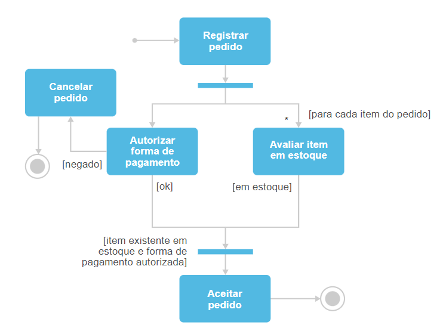 
<em>Exemplo 1: Diagrama de Atividades.</em>
 
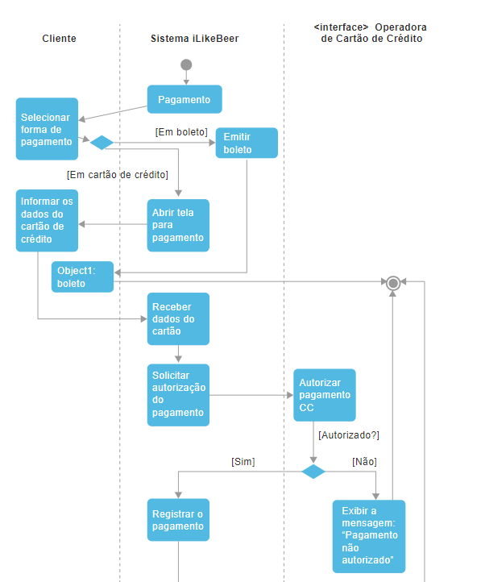 
<em>Exemplo 2: Diagrama de Atividades.</em>
 

### 1.4.1.2 Diagrama de caso de uso

- objetivo: 
  - diagrama dinâmico.
  - representa um conjunto de ações (casos de uso) que os sistemas devem executar em interação com um ou mais usuários externos (atores) para fornecer resultados para partes interessadas do(s) sistema(s).
- visão "use-case":
  - descreve a funcionalidade do sistema executada pelos atores externos (usuários).
- exemplo:

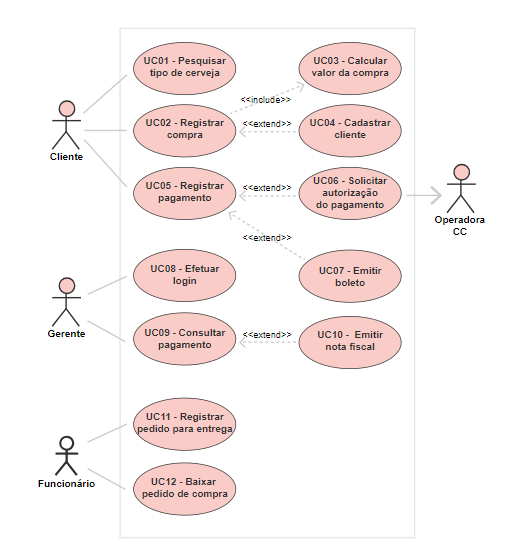 
<em>Exemplo 1: Diagrama de Caso de Uso.</em>
 

### 1.4.1.3 Diagrama de classe

- objetivo:
  - diagrama estático.
  - representa a estrutura lógica do sistema, subsistema ou componente projetado como classes e interfaces relacionadas, com suas características, restrições, associações, generalizações etc.
- visão Lógica ou de Projeto:
  - descreve o sistema internamente, dando suporte à visão estrutural do projeto.
- exemplos:

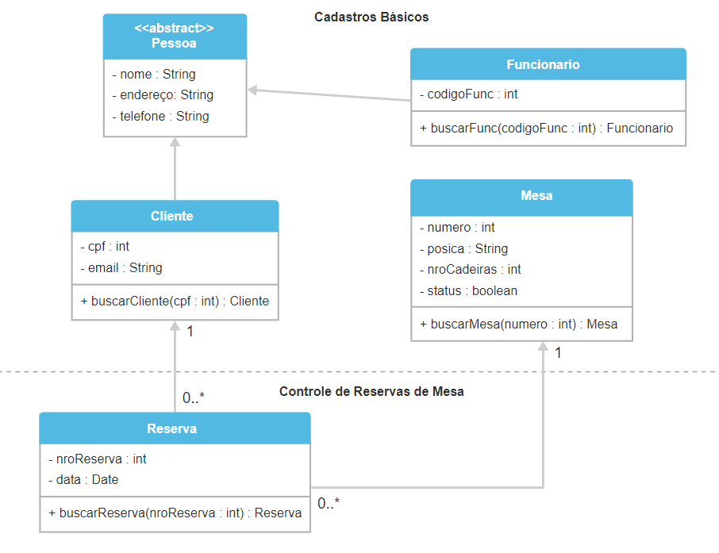 
<em>Exemplo 1: Diagrama de Classe.</em>
 
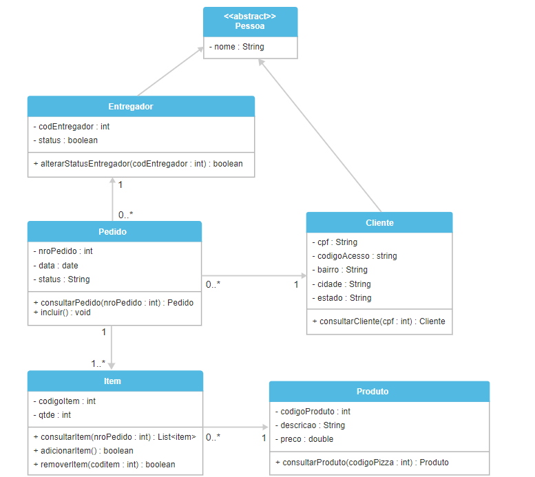 
<em>Exemplo 2: Diagrama de Classe.</em>
 

### 1.4.1.4 Diagrama de sequência

- objetivo:
  - diagrama dinâmico.
  - representa a ordem da troca de mensagens entre os objetos.
- visão de concorrência:
  - trata da divisão do sistema em processos e processadores.
  - permite uma melhor utilização do ambiente onde o sistema se encontrará, se ele possui exceções paralelas e se existem gerenciamentos assíncronos.
- exemplo:

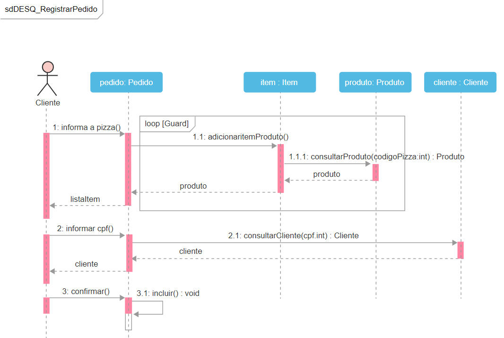 
<em>Exemplo 1: Diagrama de Sequência.</em>
 

### 1.4.1.5 Diagrama de máquina de estados

- objetivo:
  - diagrama dinâmico.
  - representa a situação em que um objeto se encontra em determinado momento durante o processamento. 
    - um objeto pode passar por diversos estados.
- visão de concorrência:
  - trata da divisão do sistema em processos e processadores.
  - permite uma melhor utilização do ambiente onde o sistema se  encontrará, se possui exceções paralelas e se existem gerenciamentos assíncronos.
- exemplo:

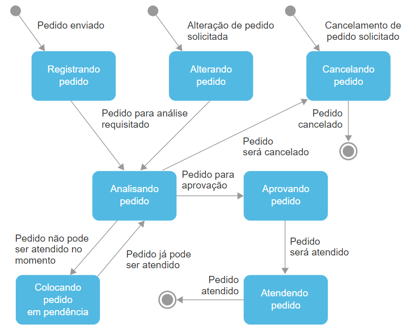 
<em>Exemplo 1: Diagrama de máquina de estados.</em>
 

### 1.4.1.6 Diagrama de componentes

- objetivo: 
  - diagrama estático.
  - representa a estrutura física da implementação, construído como parte da especificação da arquitetura do software.
- visão de componentes:
  - trata da descrição da implementação dos módulos e suas dependências.
  - são criados por desenvolvedores que têm maior experiência em programação ou por arquitetos de software.
- exemplos:

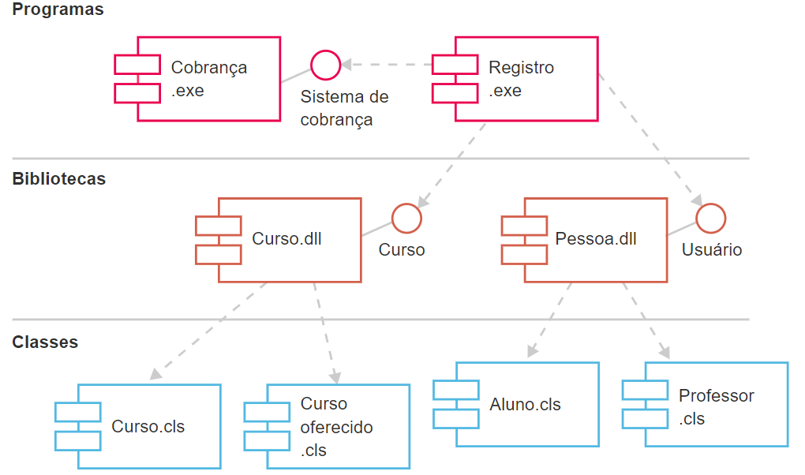 
<em>Exemplo 1: Diagrama de Componentes, notação UML 1.4.</em>
 
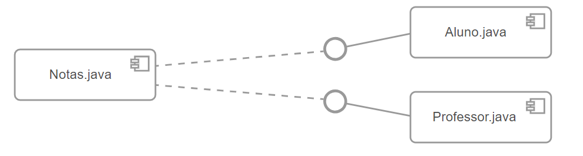 
<em>Exemplo 2: A partir da UML 2, o componente que era representado por um retângulo com dois retângulos menores foi substituído por um retângulo contendo internamente o antigo símbolo.</em>
 

### 1.4.1.7 Diagrama de implantação

- objetivo:
  - diagrama estático.
  - representa os elementos de configuração do processamento em tempo de execução, ou seja, uma visão dos componentes de software.
- visão de organização:
  - mostra a organização física do sistema, os computadores, os periféricos e como eles se conectam entre si.
- exemplo:

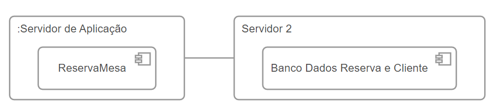 
<em>Exemplo 1: Diagrama de Implantação.</em>
 

### 1.4.1.8 Diagrama de objetos

- objetivo:
  - diagrama estático.
  - representa a relação dos objetos baseados nas instâncias criadas a partir do Diagrama de Classe de análise.
- visão Lógica ou do Projeto: 
  - descreve o sistema internamente, dando suporte à visão estrutural do projeto.
- exemplo:

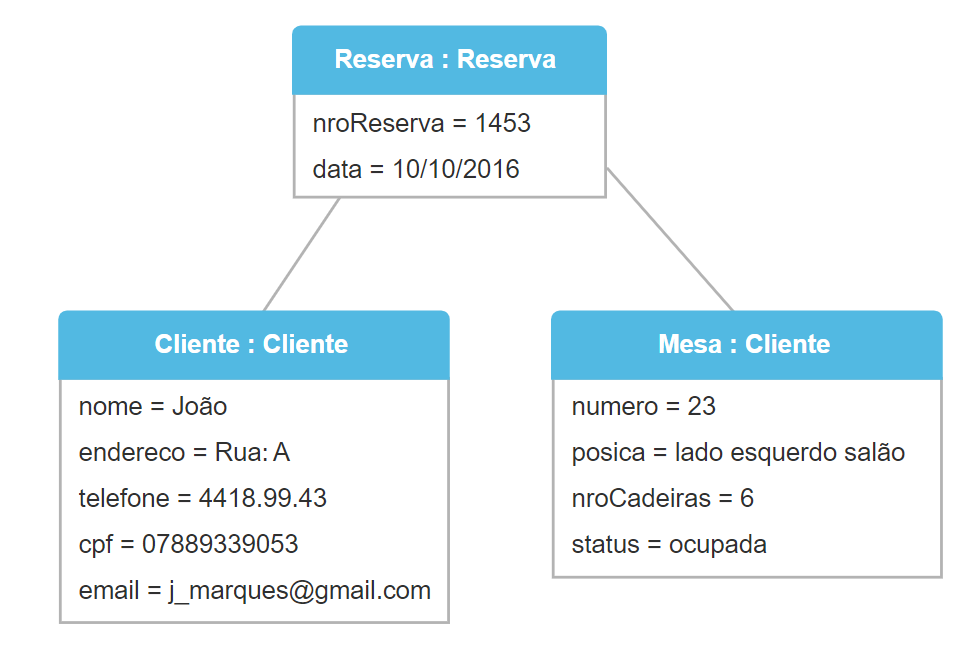 
<em>Exemplo 1: Diagrama de Objetos.</em>
 

## 1.5 Foco de estudo

- os diagramas da UML têm propósitos específicos: cada um representa o sistema a ser desenvolvido de um determinado ponto de vista. Sendo assim, os diagramas devem ser modelados conforme a necessidade. 
- nos próximos capítulos focaremos nossos estudos em quatro diagramas que serão essenciais para o sistema Fintech: Diagrama de Casos de Uso, Classes, Atividades e Sequência.

---

## FAST TEST

### 1. Qual alternativa não faz parte dos diagramas dinâmicos da UML?
> Diagrama de Classe.

### 2. Identifique a alternativa relacionada a UML que é falsa:
> Vários dos diagramas da UML não utilizam os paradigmas da orientação a objetos.

### 3. Identifique a alternativa que não faz parte dos princípios da abstração da orientação a objetos:
> UML.

### 4. Qual alternativa não faz parte dos diagramas estáticos da UML?
> Diagrama de Atividades.

--- 

[Voltar ao início!](https://github.com/monicaquintal/fintech)