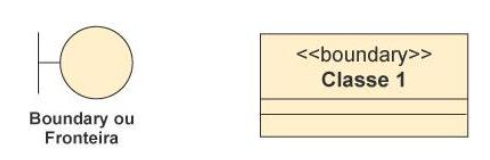
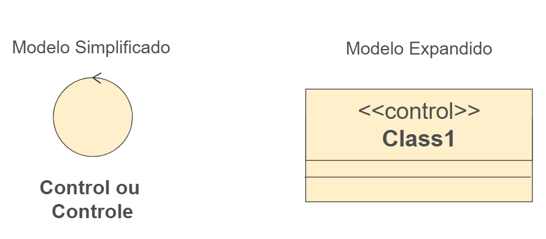
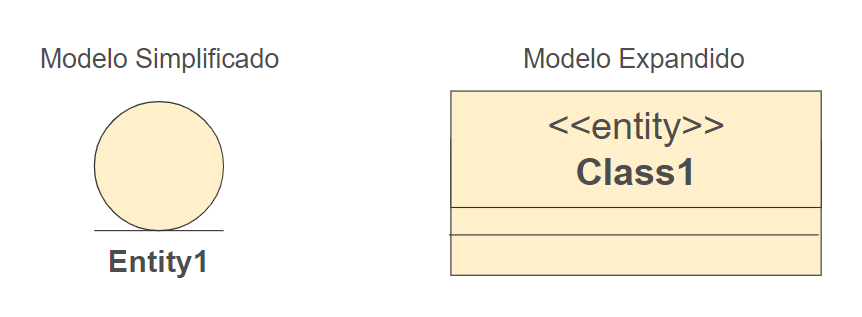

<h1>FASE 5 - OOP</h1>
<h2>Capítulo 04: Diagramando as estruturas!</h2>

<h2>1. DIAGRAMANDO AS ESTRUTURAS!</h2>

## 1.1 Introdução

- `diagrama de classes`:
  - mostra a estrutura estática do modelo, onde os elementos são representados por classes, com sua estrutura interna e seus relacionamentos. 
  - também é útil na revisão do que é armazenado no sistema e nas estruturas de armazenamento.

## 1.2 Conceito de classe

- representada por uma ‘caixa’ com no máximo três compartimentos exibidos:
  - no primeiro compartimento, é exibido o `nome da classe`. Por convenção, no singular e com as palavras começando por maiúsculas.
  - no segundo compartimento, são declarados os `atributos` (informações/dados que um objeto armazena). 
  - no terceiro compartimento, são declaradas as `operações`/métodos (ações que um objeto sabe realizar, funções que uma instância de uma classe pode executar).
- segundo a documentação da UML pelo OMG, uma classe descreve um conjunto de objetos que compartilham as mesmas especificações de atributos, operações, restrições e semântica.
- finalidade de uma classe: classificar objetos e especificar os recursos que caracterizam a estrutura e o comportamento desses objetos.
- os valores dos atributos podem variar entre um objeto e outro, podendo identificá-los individualmente, enquanto ***métodos são idênticos para todos os objetos de uma classe específica***.

### Visibilidades:

- visibilidades são representadas pelos símbolos `–`, `+`, `#` e `~` antes de um atributo ou uma operação. 

Símbolo | Tipo de visibilidade | Significado
---------|---------------------|----------
&#43; | Visibilidade pública | Atributo/método é visível por outras classes.
&#43; | Visibilidade privada | Visível somente pela própria classe.
&#35; | Visibilidade protegida | Visível para as classes derivadas (indica que as classes abaixo dela, ou seja, herança, podem ter acesso).
&#126; | Visibilidade pacote| Visível pelas classes envolvidas dentro do mesmo pacote.

- classes podem ser concretas ou abstratas:
  - `classes concretas` são aquelas que geram instâncias, ou seja, constroem objetos.
  - `classes abstratas` não geram instâncias, portanto não constroem objetos.

### 1.2.1 Conceito de tipos de classe

- em um diagrama de classe, as classes podem ser apresentadas em três tipos ou camadas, que estão relacionados com o seu objetivo na modelagem do sistema. 
- são eles: Fronteira, Controle e Entidade.

### 1.2.2 Fronteira

- `classes de fronteira` devem apenas servir como um ponto de captação de informações a partir do ambiente; ou de apresentação de informações que o sistema (modelo) processou. 
- portanto, não devemos atribuir a essas classes responsabilidades relativas à lógica do negócio.
- trata da comunicação do sistema com os atores. 
- pode ser representada por telas, sensores e interface de impressão.
- é responsável por apresentar os resultados de uma interação dos objetos. 
- muitas vezes necessita interagir com outra classe do tipo "Controle".
- pode ser utilizado o modelo expandido com o estereótipo ou o modelo simplificado, que é representado por um círculo com uma barra na frente.

 
<em>Notação para a classe de fronteira.</em>

### 1.2.3 Controle

- é o meio de comunicação entre objetos de fronteira e de entidade. 
- age como controlador dos outros objetos para a realização de um caso de uso.
- objetos desta classe interpretam os eventos ocorridos sobre os objetos da classe “fronteira” (movimentos do mouse, pressionamento de botões, entre outros) e os retransmitem aos objetos de classes de entidades que compõe o sistema.
- responsabilidades de uma classe de controle:
  - coordenar a realização de um caso de uso do sistema.
  - servir como canal de comunicação entre objetos de fronteira e de entidade.
  - comunicar-se com outros controladores, quando necessário.
  - mapear ações do usuário (ou atores de forma geral) para atualizações ou mensagens a serem enviadas a objetos de entidade.
  - estar apto a manipular exceções provenientes das classes de entidade.

 
<em>Notação para a classe de controle.</em>

### 1.2.4 Entidade

- classes de entidade são aquelas que representam os conceitos de domínio que o sistema deve processar. 
- representam as informações e as regras de negócio que direcionam a manipulação destas informações.
- representa o conceito do domínio do negócio. 
- representa as informações persistentes, portanto, é responsável pelos objetos persistentes.

 
<em>Notação para a classe de entidade.</em>

## 1.3 Diagrama de classe

- diagrama mais importante e mais utilizado da UML. 
- representa as classes que fazem parte do sistema, ou seja, a estrutura lógica. 
- é um diagrama com visão estática, serve como base de construção para outros diagramas *da maioria dos outros diagramas da UML (como o Diagrama de Sequência e o de Máquina de Estados).

### 1.3.1 Perspectivas de abstração do diagrama de classe

- é possível ter até três perspectivas de abstração do diagrama de classes:

1. ***Diagrama de classe de análise***:

- representa as classes com as informações do que o sistema deve fazer em relação à solução do problema.
- ou seja, representa as classes no domínio do negócio.
- representa um modelo conceitual para elementos que tem responsabilidades e comportamento no sistema (por isso são mantidas em alto nível).
- construído durante a fase de análise e utiliza o Diagrama de Caso de Uso para identificação de classes.
- descreve as classes do mundo real e suas relações. 
- não leva em consideração as restrições inerentes à tecnologia que será utilizada na construção do sistema. 
- as informações das classes de análise surgem a partir do enunciado do problema e é independente da linguagem de programação!!!

> A construção de um único diagrama de classe para todo o sistema pode resultar em um diagrama bastante complexo. Uma alternativa é criar uma visão de classes participantes (VCP) para cada caso de uso, um diagrama de classe cujas instâncias (objetos) participam de apenas um caso de uso.

- nesse diagrama não é obrigatório demonstrar as classes de controle e a fronteira.
- também não possui todas as operações, estas podem surgir em conjunto com o desenvolvimento do Diagrama de Sequência.

--- 

[Voltar ao início!](https://github.com/monicaquintal/fintech)