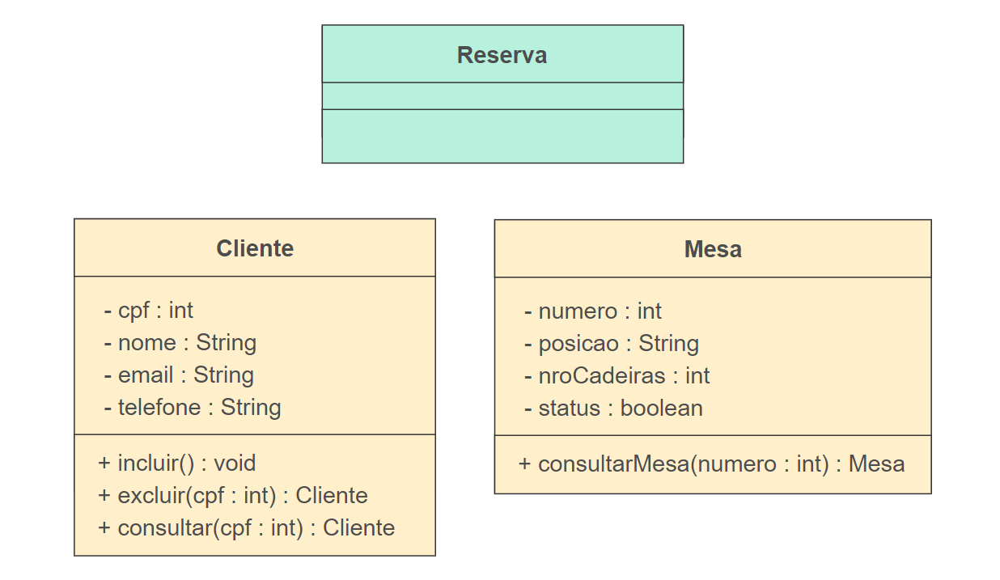
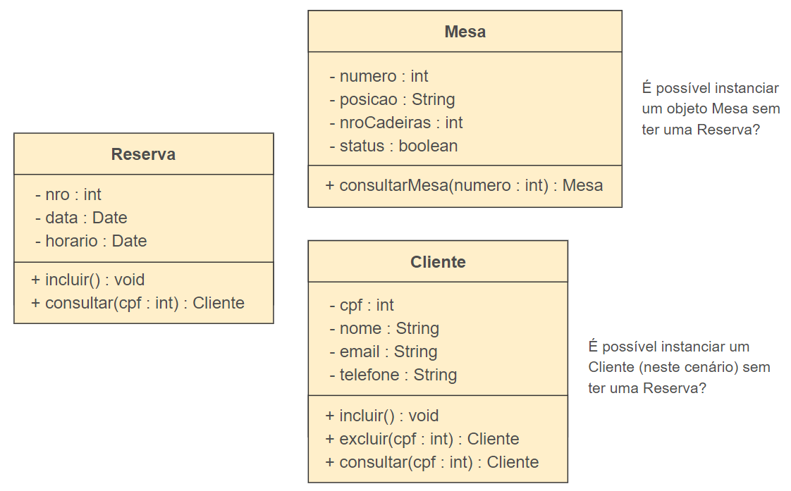

<h1>FASE 5 - OOP</h1>
<h2>Capítulo 04: Diagramando as estruturas!</h2>

<h2>1. DIAGRAMANDO AS ESTRUTURAS!</h2>

## 1.1 Introdução

- `diagrama de classes`:
  - mostra a estrutura estática do modelo, onde os elementos são representados por classes, com sua estrutura interna e seus relacionamentos. 
  - também é útil na revisão do que é armazenado no sistema e nas estruturas de armazenamento.

---

## 1.2 Conceito de classe

- representada por uma ‘caixa’ com no máximo três compartimentos exibidos:
  - no primeiro compartimento, é exibido o `nome da classe`. Por convenção, no singular e com as palavras começando por maiúsculas.
  - no segundo compartimento, são declarados os `atributos` (informações/dados que um objeto armazena). 
  - no terceiro compartimento, são declaradas as `operações`/métodos (ações que um objeto sabe realizar, funções que uma instância de uma classe pode executar).
- segundo a documentação da UML pelo OMG, uma classe descreve um conjunto de objetos que compartilham as mesmas especificações de atributos, operações, restrições e semântica.
- finalidade de uma classe: classificar objetos e especificar os recursos que caracterizam a estrutura e o comportamento desses objetos.
- os valores dos atributos podem variar entre um objeto e outro, podendo identificá-los individualmente, enquanto ***métodos são idênticos para todos os objetos de uma classe específica***.

### Visibilidades:

- visibilidades são representadas pelos símbolos `–`, `+`, `#` e `~` antes de um atributo ou uma operação. 

Símbolo | Tipo de visibilidade | Significado
---------|---------------------|----------
&#43; | Visibilidade pública | Atributo/método é visível por outras classes.
&#43; | Visibilidade privada | Visível somente pela própria classe.
&#35; | Visibilidade protegida | Visível para as classes derivadas (indica que as classes abaixo dela, ou seja, herança, podem ter acesso).
&#126; | Visibilidade pacote| Visível pelas classes envolvidas dentro do mesmo pacote.

- classes podem ser concretas ou abstratas:
  - `classes concretas` são aquelas que geram instâncias, ou seja, constroem objetos.
  - `classes abstratas` não geram instâncias, portanto não constroem objetos.

### 1.2.1 Conceito de tipos de classe

- em um diagrama de classe, as classes podem ser apresentadas em três tipos ou camadas, que estão relacionados com o seu objetivo na modelagem do sistema. 
- são eles: Fronteira, Controle e Entidade.

### 1.2.2 Fronteira

- `classes de fronteira` devem apenas servir como um ponto de captação de informações a partir do ambiente; ou de apresentação de informações que o sistema (modelo) processou. 
- portanto, não devemos atribuir a essas classes responsabilidades relativas à lógica do negócio.
- trata da comunicação do sistema com os atores. 
- pode ser representada por telas, sensores e interface de impressão.
- é responsável por apresentar os resultados de uma interação dos objetos. 
- muitas vezes necessita interagir com outra classe do tipo "Controle".
- pode ser utilizado o modelo expandido com o estereótipo ou o modelo simplificado, que é representado por um círculo com uma barra na frente.

 
<em>Notação para a classe de fronteira.</em>

### 1.2.3 Controle

- é o meio de comunicação entre objetos de fronteira e de entidade. 
- age como controlador dos outros objetos para a realização de um caso de uso.
- objetos desta classe interpretam os eventos ocorridos sobre os objetos da classe “fronteira” (movimentos do mouse, pressionamento de botões, entre outros) e os retransmitem aos objetos de classes de entidades que compõe o sistema.
- responsabilidades de uma classe de controle:
  - coordenar a realização de um caso de uso do sistema.
  - servir como canal de comunicação entre objetos de fronteira e de entidade.
  - comunicar-se com outros controladores, quando necessário.
  - mapear ações do usuário (ou atores de forma geral) para atualizações ou mensagens a serem enviadas a objetos de entidade.
  - estar apto a manipular exceções provenientes das classes de entidade.

 
<em>Notação para a classe de controle.</em>

### 1.2.4 Entidade

- classes de entidade são aquelas que representam os conceitos de domínio que o sistema deve processar. 
- representam as informações e as regras de negócio que direcionam a manipulação destas informações.
- representa o conceito do domínio do negócio. 
- representa as informações persistentes, portanto, é responsável pelos objetos persistentes.

 
<em>Notação para a classe de entidade.</em>

---

## 1.3 Diagrama de classe

- diagrama mais importante e mais utilizado da UML. 
- representa as classes que fazem parte do sistema, ou seja, a estrutura lógica. 
- é um diagrama com visão estática, serve como base de construção para outros diagramas *da maioria dos outros diagramas da UML (como o Diagrama de Sequência e o de Máquina de Estados).

### 1.3.1 Perspectivas de abstração do diagrama de classe

- é possível ter até três perspectivas de abstração do diagrama de classes:

1. ***`Diagrama de classe de análise`***:

- representa as classes com as informações do que o sistema deve fazer em relação à solução do problema.
- ou seja, representa as classes no domínio do negócio.
- representa um modelo conceitual para elementos que tem responsabilidades e comportamento no sistema (por isso são mantidas em alto nível).
- construído durante a fase de análise e utiliza o Diagrama de Caso de Uso para identificação de classes.
- descreve as classes do mundo real e suas relações. 
- não leva em consideração as restrições inerentes à tecnologia que será utilizada na construção do sistema. 
- as informações das classes de análise surgem a partir do enunciado do problema e é independente da linguagem de programação!!!

> A construção de um único diagrama de classe para todo o sistema pode resultar em um diagrama bastante complexo. Uma alternativa é criar uma visão de classes participantes (VCP) para cada caso de uso, um diagrama de classe cujas instâncias (objetos) participam de apenas um caso de uso.

- nesse diagrama não é obrigatório demonstrar as classes de controle e a fronteira.
- também não possui todas as operações, estas podem surgir em conjunto com o desenvolvimento do Diagrama de Sequência.

> O objetivo da VCP (visão de classes participantes) é auxiliar no desenvolvimento de diagramas de classes complexos, mas também pode ser utilizada para representar um estudo sobre determinada funcionalidade em relação às classes envolvidas.

 
<em>Exemplo de Diagrama de Caso de Uso para controle de chamados e soluções.</em>

 

 
<em>Exemplo de VCP para o caso de uso “Registrar Abertura do Chamado”.</em>

- na fase de análise, quando um diagrama de caso de uso é desenvolvido, é possível observar a fronteira através da interação de um caso. Ou seja, **cada interação do ator com um caso de uso pode ser representada por uma fronteira**.
- para cada caso de uso é representada uma classe de controle que gerencia o fluxo do processo da funcionalidade do sistema, conforme o objetivo determinado no fluxo principal do caso de uso.
- no exemplo acima, há o ator Atendente que “Registra Abertura do Chamado” e terá uma tela de acesso para interação, portanto será necessário criar uma classe de fronteira que é a tela de acesso da funcionalidade do sistema e a classe de controle para gerenciar o fluxo do processo de “Registar Abertura do Chamado”. 

 
<em>Exemplo de Diagrama de Classe de Análise para “Sistema de Controle de Pedido”.</em>

- o exemplo acima não apresenta as classes de fronteira e de controle, pois podemos optar por não as exibir, para facilitar e simplificar o entendimento.

2. ***`Diagrama de classe de projeto ou especificação`***:

- representa as classes do funcionamento do sistema.
- é construído na fase de projeto do desenvolvimento do sistema,
- **objetivo**: complementar o Diagrama de Classe de Análise. 
- nesta fase, normalmente identificamos a necessidade de criar outras classes, pois esse modelo relaciona a tecnologia utilizada e apresenta todas as camadas de funcionamento do sistema MVC (Model, View e Controller) ou, simplificadamente, a camada de modelo, fronteira e controle.

 
<em>Exemplo de Diagrama de Classe de Projeto para “Sistema de Controle de Pedido”.</em>

3. ***`Diagrama de classe de implementação`***:

- representado com base em um padrão de desenvolvimento, conforme uma linguagem de programação orientada a objetos, como Java ou C#. 
- é o menos utilizado no mercado por analistas de sistemas, pois uma vez que já existe o Diagrama de Classe de Análise, não é necessário construir o Diagrama de Classe de Implementação.
- deve seguir o padrão de arquitetura que foi definido ao projeto sob a responsabilidade de um arquiteto de softwares na fase de implementação. 
- somente o Diagrama de Classe de Análise é de responsabilidade do analista de sistemas, com base no problema e nos requisitos necessários para desenvolvimento do sistema.

---

## 1.4 Relacionamentos

- relacionamento descreve como as classes interagem umas com as outras, sendo necessário para a implementação de um comportamento.
- classes costumam ter relacionamentos entre si (associações), que permitem que compartilhem informações entre elas e também colaborem para a execução dos processos executados pelo sistema. 
- uma associação (relacionamento) descreve um vínculo que ocorre entre os objetos de uma ou mais classes.
- relacionamentos são divididos em dois grandes grupos: 
  - associações e 
  - generalizações.

### 1.4.1 Associações

- relacionamento existente entre as classes. 
- possui vários tipos.

- associações possuem algumas `características importantes`: 
  - `multiplicidade`, 
  - `navegabilidade`, 
  - `papéis e nome da associação` e 
  - `direção de leitura`.

> A) Multiplicidade:

- deve-se especificar a multiplicidade entre as classes:
  - `multiplicidade`:
  - é a indicação de quantos objetos podem participar de um relacionamento.
  - multiplicidade das associações indica os números mínimo e máximo de objetos envolvidos em um relacionamento.
  - cada associação em um Diagrama de Classes possui duas multiplicidades, uma em cada extremo da linha de associação.

Nome | Simbologia
-----|-----------
Apenas um | 1..1 (ou 1)
Zero ou Muitos | 0..* (ou *)
Um ou Muitos | 1..*
Zero ou Um | 0..1
Intervalo Específico | 1i..1s

> B) Navegabilidade: 

- associação também pode ter `navegabilidade`:
  - pode ser com ou sem setas. 
  - a seta representa qual a direção de leitura da troca de mensagens.
  - na representação sem a seta, não conseguimos identificar a navegabilidade da troca de mensagens, podendo ocorrer para os dois lados.
  - demonstra a direção em que os objetos são transmitidos entre as classes envolvidas.

> C) Papéis e nome da associação:

- os `papéis` indicam qual é a função da classe no contexto do relacionamento.
- `nome da associação`:
  - deve ser utilizado quando não for de fácil interpretação a leitura do relacionamento.
  - ajuda a evitar que existam interpretações equivocadas, principalmente quando ocorrem associações múltiplas (uma mesma classe pode ter mais de uma associação com outra classe).
  - nome da associação normalmente é um verbo e está relacionado ao tipo de relacionamento entre as classes.
  - possui uma seta que representa a direção da leitura do relacionamento.
  - é preferível não nomear associações a usar nomes vagos ou óbvios demais. O mesmo vale para os papéis: em situações que o significado da associação for intuitivo, a utilização só serve para ‘carregar’ o diagrama.

 
<em>Exemplo de utilização de nome de associação e papéis, sendo que o nome da associação é "Contrata", representando que a Organização contrata Indivíduo.</em>

### 1.4.2 Associação simples (ou associação binária, entre duas classes)

- representa a conexão entre as classes, isso define que os objetos se relacionam uns com os outros, eles usam os objetos.
- é o relacionamento mais comum.

 
<em>Exemplo de associação normal ou simples, onde a classe Imóvel pode se relacionar ou não a uma Locação, enquanto Locação obrigatoriamente tem que se relacionar ao imóvel para que o objeto Locação seja construído com todas as características pertinentes ao domínio de negócio (enquanto existir um objeto da classe Locação, deve haver um objeto da classe Imóvel). A navegabilidade para o Imóvel demonstra em que sentido ocorre a troca de mensagens, a Locação usa um Imóvel para ser construído, mas um Imóvel pode ser locado em nenhuma ou em muitas Locações.</em>

### 1.4.3 Associação por composição

- associações por composição e agregação sempre estão relacionadas a um contexto em que a informação pertence ao negócio.
- a composição é um caso especial de associação.
- definido como um relacionamento todo-parte, ou seja, propagam o comportamento, no sentido de que um comportamento que se aplica a uma classe se aplicará a suas partes, já que uma classe faz parte de outra.
- o objeto parte de uma Composição depende do objeto todo, ou seja, as partes “vivem” e “morrem” como um todo. Neste caso, o objeto parte é essencial para a existência do objeto todo.

 
<em>Exemplo de Associação por Composição, onde "a parte" é representada pela classe Item, e "o todo" é a Nota Fiscal. Ao eliminar a classe NotaFiscal, todos os Itens relacionados à Nota Fiscal também serão eliminados, ou seja, "morreram" com a Nota Fiscal. A leitura é um Item formal (<strong>notação de losango fechado</strong>) de uma Nota Fiscal e uma Nota Fiscal tem no mínimo um Item, mas pode ter vários Itens.</em>

### 1.4.4 Associação por agregação

- é um relacionamento do tipo todo-parte.
- a informação contida no objeto parte é complementar ao objeto todo, não é essencial para constituir a informação relacionada ao conceito do negócio do objeto todo.
- o símbolo da agregação é um **pequeno losango sem preenchimento**, também ao lado do objeto-todo.
- importante:
  - associação de agregação pode ser substituída por uma associação simples, dependendo da visão de quem faz a modelagem.
  - PORÉM, a função principal de uma associação do tipo agregação é identificar a obrigatoriedade de uma complementação das informações de um objeto-todo por seus objetos-parte, quando este for consultado. Já em uma associação simples, essa obrigatoriedade não está explícita!
- em um exemplo de Associação por Agregação, um objeto "Desconto" (objeto-parte) só existirá se houver uma "Venda" (objeto-todo).O Desconto, como objeto-parte, é complementar à Venda e não essencial, portanto, se explica um caso de Agregação (losango sem preenchimento na Venda).

### 1.4.5 Classe associativa

- construídas quando existem Classes com multiplicidade, muitos para muitos nas extremidades, desde que tenham atributos próprios entre elas.
- classes associativas são necessárias nos casos em que existem atributos relacionados à associação que não podem ser armazenados por nenhuma das classes envolvidas.

 
<em>Exemplo de Classe associativa, em que muitas equipes têm muitos funcionários, mas que as equipes são formadas conforme o ingresso dos funcionários, que têm uma data início e uma data fim para participação na equipe. Portanto, a classe Ingresso representa as instâncias dos objetos que caracterizam a data início e a data fim da participação de Funcionáriosem muitas Equipes.</em>

### 1.4.6 Associação reflexiva

- tipo de associação que ocorre quando um objeto de uma classe se relaciona com outros da mesma classe: ocorre o autorrelacionamento, mas neste caso, cada objeto tem um papel.
- também conhecida como associação “unária”.

 
<em>Exemplo de Associação Reflexiva.</em>

### 1.4.7 Associação n-ária

- utilizadas quando relacionam objetos de no mínimo três classes entre si.
- associação ternária é um caso mais comum de associação n-ária (n = 3).
- na notação da UML, as linhas de associação se interceptam em um losango.

 
<em>Exemplo de Associação Ternária, onde um Cliente pode fazer várias Viagens através de muitas Agências de Turismo, e a mesma Agência oferece muitas Viagens para muitos Clientes, muitas Viagens recebem muitos Clientes de muitas Agências. A associação é ternária, pois o contexto relaciona as três classes entre si.</em>

### 1.4.8 Associação qualificada

- utilizada na representação de 1..* (um para muitos) ou * (vários para vários).
- o identificador da associação qualificada determina como um determinado objeto no final da associação “n” é identificado, é um tipo de chave para separar todos os objetos na associação, pois este não pode se repetir.

 
<em>Exemplo de Associação QUalificada, onde um Cliente pode ter muitas Contas, mas o que o qualifica, ou seja, o que o identifica é o número da conta que não se repete para cada conta que o Cliente tem e, neste exemplo, uma Conta Corrente pode ter até dois clientes.</em>

### 1.4.9 Associação exclusiva

- a restrição {ou} representa que, em uma associação, é exclusiva quando pode ocorrer a instância de objetos de uma das classes do relacionamento da associação.

 
<em>Exemplo de Associação Exclusiva, onde o Contrato de um estacionamento só pode ocorrer para um dos objetos ClienteAvulso ou ClienteMensalista.</em>

--- 

## 1.5 Interface

- Interface representa um conjunto de serviços, sendo que um serviço é alguma tarefa que uma classe realiza para outra.
- a interface não gera instâncias: quem deve implementar (realizar o que está determinado na interface) são as `classes concretas`.
  - a classe concreta relacionada à interface tem um tipo de relacionamento denominado `realização` (significa que a classe concreta deve implementar os serviços (assinaturas) definidos na interface).
  - portanto, a classe concreta realiza os métodos definidos pela interface.
- o uso de interface está relacionado ao diagrama de classe de projeto ou especificação, e quem define é o projetista ou arquiteto, pois impacta na implementação.
- alguns padrões de implementação usam a interface.
- as `notações para interface` são o estereótipo &lt;&lt;interface&gt;&gt;, o título em negrito da classe, os métodos aparecem em itálico ou simplesmente um pequeno círculo.
- `conceitos para o objetivo de interface`:
  - capturar semelhanças entre classes não relacionadas sem forçar relacionamento entre elas.
  - declarar operações que uma ou mais classes devem implementar.
  - revelar as operações de um objeto, sem revelar a sua classe.
  - facilitar o desacoplamento entre elementos de um sistema.

> Para simplificar o exemplo de interface, imagine uma pessoa que determina que você deve realizar uma tarefa, ela é a interface, e você realizando a tarefa é a classe concreta, que executa o serviço!

 
<em>Neste exemplo há duas Interfaces, onde a classe concreta ContaBancaria implementa os <strong>métodos assinatura (serviço)</strong> das interfaces Manipulável e Administrável. Há também o <strong>relacionamento de realização</strong>, que realização determina que, por exemplo, no caso da interface Manipulável, a classe ContaBancaria deve implementar os métodos criar(), bloquear() e desbloquear().</em>
 
 
 
<em>Neste exemplo, as classes Cliente, Funcionário e Fornecedor não são relacionadas entre si, mas executam os mesmos métodos de incluir() e excluir(). As três classes implementam os mesmos métodos, portanto são declaradas as operações que uma ou mais classes devem implementar.</em>
 
 
 
<em>Neste exemplo, os serviços de três classes diferentes são definidos na interface, o que para o sistema mantém uma obrigação de implementação por elas. Assim, uma única interface serve de mandante para várias classes concretas relacionadas a ela (conceito de reutilização).</em>

--- 

## 1.6 Realização

- é o relacionamento necessário para representar que uma classe concreta use a assinatura (serviço) de uma interface para a implementação de seus métodos.
- este tipo de relacionamento herda o comportamento de uma classe, mas não sua estrutura.
- a notação é uma seta fechada e pontilhada.

--- 

## 1.7 Dependência

- no diagrama de classe de análise é suficiente utilizar as associações e generalizações; já no diagrama de classe de especificação ou projeto, a dependência é mais bem definida por um projetista, pois ***a dependência influencia na implementação***.
- `dependência` significa que uma classe depende dos serviços de outra classe.

 
<em>Exemplo de Dependência com parâmetros, onde a classe A depende classes B e C, pois estas são usadas como parâmetros para as operações um e dois.</em>
 
 
 
<em>Outro exemplo de Dependência, em que é contextualizado através da seta pontilhada para as interfaces, o que representa a classe Cliente depende dos serviços criar(), bloquear() e desbloquear() da interface Manipulável, e o que representa a classe Gerente depende dos serviços creditar() e debitar() da interface Administrável.</em>

---

<h2>2. Generalização (ou Herança).</h2>

- é o relacionamento de um objeto mais generalizado com um mais específico; o objeto generalizado é similar aos objetos específicos que recebem os atributos e/ou as operações de um objeto generalizado.
- a classe especializada é denominada **subclasse** e a classe generalizada é a **superclasse**.

 
<em>Exemplo de Generalização, onde as subclasses são ClienteMaster e ClienteVisa, e a superclasse é Cliente.</em>

- notação para Generalização ou Herança:

 
<em>Representações alternativas para o relacionamento da generalização na UML, com uma seta e as subclasses relacionadas em uma linha ou uma seta para cada subclasse apontando para a superclasse.</em>

## 2.1 Hierarquia de generalização

- no relacionamento de hierarquia de generalização, as classes mais específicas podem ser construídas a partir de mais de uma classe generalizada hierarquicamente.
- uma classe é generalização de outra se toda instância desta última for também instância da primeira.

 
<em>Exemplo de hierarquia de generalização ou herança, em que há uma hierarquia de quatro níveis: o Funcionário recebe "nome" da classe Pessoa, a classe Atendente tem "nome" e "códFuncionário" e "departamento". A classe OperadorTelemarketing tem "nome", "códFuncionário", "departamento", e ainda tem "nível", que é atributo próprio da classe.</em>

## 2.2 Generalização – restrições

- no diagrama de classe é possível contextualizar algumas restrições.
- são apresentadas entre chaves ( { } ). 
- as restrições estão relacionadas aos conceitos das informações que a classe representa e podem ser:
  - **sobreposta**: na hierarquia das classes, podem ser construídas classes que herdam de mais de uma subclasse, no nível vertical.
  - **disjunta**: as classes que são construídas podem herdar somente de um nível da superclasse na vertical.
  - **completa**: todas as subclasses possíveis já foram construídas na hierarquia horizontal, abaixo da superclasse.
  - **incompleta**: ainda é possível criar subclasses na horizontal, abaixo da superclasse.

 
<em>Exemplo de Generalização Completa e Disjunta, em que a classe Pessoa tem somente a representação de Homem e Mulher, não sendo possível criar mais subclasses na horizontal. Neste exemplo também é disjunta, o que significa que não é possível criar mais nenhum nível na vertical abaixo das classes Feminino ou Masculino.</em>
 
 
 
<em>Neste exemplo de Generalização Incompleta e Sobreposta, existem mais Atletas além de Nadador e Corredor, e a generalização é incompleta, pois é possível criar mais subclasses na horizontal, por exemplo, lutador de Jiu-jítsu, que é outro tipo de atleta. É sobreposta neste caso, pois é possível criar subclasses abaixo de Corredor e Nadador com suas especificidades, por exemplo, Nadador de cem metros nado livre.</em>

## 2.3 Classe abstrata

- classes que não geram instâncias diretas são denominadas classes abstratas.
- utilizadas para reaproveitar, organizar e simplificar uma hierarquia de generalização baseada em uma informação válida nessa hierarquia.
- as subclasses de uma classe abstrata também podem ser abstratas, mas a hierarquia deve terminar em uma ou mais classes concretas, que devem gerar a instância dos objetos.
- notação é o estereótipo com a palavra &lt;&lt;abstract&gt;&gt;, e o nome da classe fica em negrito.
- **objetivo**: reaproveitamento, a reutilização para uma implementação que possa facilitar a manutenção.
- classes abstratas também surgem no modelo do Diagrama de Classe de projeto ou especificação, pois podem impactar na implementação.

 
<em>Exemplo de classe abstrata, que possui uma classe abstrata para Pessoa. As classes Professor e Alunosão instanciáveis e recebem da classe abstrata Pessoa os atributos cpf e nome, e a operação incluir().</em>

## 2.4 Técnicas para construir um diagrama de classe

- inicialmente devemos pensar:
  - qual é o negócio?
  - o Diagrama de Caso de Uso auxiliará na construção do Diagrama de Classe?
  - quais técnicas devo utilizar?
  - quais são os passos para construir o Diagrama de Classe?

- primeiro, são construídos o Diagrama de Classe de Análise, desenvolvido pelo analista de sistemas.
  - caso o projeto tenha o envolvimento de algum arquiteto de software, o Diagrama de Classe de Análise receberá as classes necessárias para o sistema funcionar e poderá ser construído o Diagrama de Classe de Projeto ou Especificação, conforme a tecnologia envolvida.

> O papel da análise do sistema é entender o que o sistema deve fazer para atender a uma determinada necessidade de negócio, e na fase de análise deve desenvolver o Diagrama de Classe de Análise ou Domínio para demonstrar quais são os objetos de negócio pertinentes ao sistema.

- é muito importante que você tenha o processo de negócio, as regras de negócio e o Diagrama de Casos de Uso.
- a UML não obriga a utilização de um diagrama para construção de outro, mas as metodologias e boas práticas sugerem que, para seguir um padrão, seja utilizado o Diagrama de Caso de Uso para fazer abstrações das classes.
- técnicas:

### 2.4.1 Análise do caso de uso

- para a identificação das classes, o `RUP (Rational Unified Process)`, que é uma metodologia de desenvolvimento de software, propõe a análise de casos de uso.
- casos de uso são utilizados no início do levantamento das classes, e observa-se quais são os objetos utilizados para que o caso de uso produza um resultado, ou seja, são verificados quais são os objetos envolvidos no processo da funcionalidade pretendida para o sistema.
- para cada caso de uso, deve-se identificar as classes de acordo com o comportamento do caso de uso e distribuir o comportamento do caso de uso conforme as classes identificadas.
  - para cada classe de análise resultante, deve-se descrever suas responsabilidades e seus atributos e associações.
  - analistas devem estudar cada caso de uso, compreender os Fluxos Principais, Alternativos e Exceção. É necessário atribuir as responsabilidades de cada classe com seus atributos e operações

### 2.4.2 Análise de robustez

- propõe que os objetos sejam desenvolvidos por categorias: fronteira, controle e entidade.
- também chamada de `Categorização BCE (Boundary, Control e Entity)`.
  - objetos de fronteira (ou Boundary) desenvolvem a comunicação e a interação do sistema com os atores.
  - objetos de controle (ou Control) servem como uma ponte entre os objetos de entidades e os objetos de fronteira, essas classes controlam as operações que o sistema deve executar.
  - objetos de entidade (ou Entity), que representados pela classe, contextualizam a informação de domínio do negócio.
- para cada caso de uso, podem ser utilizadas as `regras`:
  - um objeto de fronteira para cada interação do usuário com um caso de uso.
  - um objeto de controle para cada caso de uso, que deve controlar a colaboração de um ou mais objetos entre si, a fim de realizar a tarefa definida para o caso de uso.
  - classes de entidade correspondem aos conceitos pertinentes ao domínio de negócio.

 
<em>Notação de Categorização BCE.</em>

- classes de fronteira e de controle são normalmente identificadas na modelagem de classes de aplicação. Portanto, controladores normalmente não são objetos de domínio, mas sim da aplicação, cuja responsabilidade é coordenar a interação entre outros objetos.
- classes com mais detalhes de controle e fronteira são, portanto, construídas na modelagem do diagrama de classe de projeto, seu objetivo é compreender a aplicação, ou seja, seu funcionamento através do uso da tecnologia no qual o sistema será implementado.

### 2.4.3 Modelagem CRC

- Modelagem CRC = Classes, Responsabilidades e Colaboradores.
- ***objetivo***: ensinar os conceitos do paradigma da orientação a objetos, mas por ser muito simples tem o envolvimento de analistas e desenvolvedores, que se reúnem em uma sala para dar início ao que é chamado de sessão CRC.
- teve início na utilização de um cartão para cada classe de domínio envolvida no projeto de software.
- exemplo de cartão de matrícula:

***Classe Matrícula***

Responsabilidades | Colaboradores
----------------|-------------
Ter a data de matrícula | Candidato
Ter o número da matrícula | Curso
&#32; | Turno

- neste exemplo, a classe Matricula tem como responsabilidade ter a data e o número de matrícula, mas para que essa classe possa construir um objeto Matrícula, é necessária a ajuda das classes colaboradoras Candidato, Curso e Turno.
- o Colaborador é a outra classe que oferece seu objeto para auxiliar na construção de um objeto para outro que necessite de sua instância.
- amodelagem CRC é um processo que é utilizado em reuniões, mas sem o uso efetivo de cartões.
- na prática, existem muito mais discussões para as definições das classes com o uso da modelagem CRC como um processo mental e lógico.

> há algo em comum entre as técnicas para construção do diagrama de classe entre a modelagem CRC e a Análise de Robustez: ambas determinam as colaborações para a construção dos objetos.

- na utilização da técnica CRC, novos casos de uso podem ser identificados, e essa técnica pode ser necessária para a alteração de casos de uso já existentes, até porque a modelagem realizada é em alto nível.
- detalhes são adicionados aos poucos, à medida que o problema é entendido.

 
<em>Interdependência entre o modelo de caso de uso e o modelo de classes.</em>

- casos de uso são essenciais para interpretação e identificação das classes, assim como estas auxiliam na visão dos objetos pertinentes ao caso de uso de um sistema; portanto, um complementa o outro.
- os casos de uso devem ser analisados para se obter classes, e as classes fornecem detalhes para refinar os casos de uso.
- no caso do Diagrama de Classe, também pode ser utilizado o Diagrama de Sequência, que enriquece as classes com detalhes em operações.

---

<h2>3. PASSOS PARA ELABORAR O DIAGRAMA DE CLASSE</h2>

## 3.1 Diagrama de classe

- inicialmente, vamos analisar os casos de uso e observar quais são os objetos utilizados para que o caso de uso produza um resultado.
- a modelagem CRC será utilizada para atribuir o que é responsabilidade de uma classe através de atributos e comportamentos, além de definir quais são as classes colaboradoras (classes necessárias para completar o objeto de negócio).
- são necessárias várias fontes de informação para conhecer o domínio de negócio, para isso, os documentos de requisitos e regras de negócio são importantes para os esclarecimentos em caso de dúvidas.
- as técnicas serão trabalhadas em conjunto.

### `Como identificar as classes?`

- um sistema orientado a objetos é composto de objetos em colaboração para realizar as tarefas do sistema.
- todo objeto pertence a uma classe. 
- portanto, quando se fala na identificação das classes, o objetivo na verdade é saber quais objetos são necessários para compor o sistema.

### `Quais são os passos paracriar o Diagrama de Classe?`

1. Observar os casos de uso com os seus cenários. A documentação de caso de uso facilita na identificação de objetos no processo da funcionalidade.

2. Verificar as regras de negócio e identificar as possibilidades de relacionamentos das informações pertinentes ao domínio.

3. Levantar TODAS as classes possíveis, com base na análise de caso de uso e nas Regras de Negócio.

4. Atribuir as responsabilidades das classes que não precisam de outras. As responsabilidades são seus atributos e operações (comportamentos), essas classes instanciam objetos sem ter a colaboração de outros, portanto, estas devem ser as que colaboram com as demais.

5. Identificar as classes que precisam de colaboradores e quem são esses colaboradores.

6. Relacionar as classes conforme os conceitos de relacionamento.

## Exemplo: Cenário de controle de reservas de mesa de um restaurante

<em>
"O restaurante ABC Ltda. necessita de um controle para as reservas de mesa que são realizadas on-line através de uma aplicação Web. Você foi contratado para realizar a modelagem do sistema. 
Após o levantamento de dados, ficou definido que: o funcionário do restaurante cadastra as mesas do restaurante, informa o número da mesa, a posição no salão (com base na entrada e que pode ser: centro, lado esquerdo e lado direito), número de cadeiras e status. 
O cliente consulta as mesas. O sistema deve exibir somente as mesas disponíveis para o cliente. Este realiza o cadastro com CPF, RG, nome, endereço, telefone e e-mail. 
Para reservar uma mesa, o cliente informa o número da mesa disponível, informa data e horário e CPF do cliente solicitante da reserva. Ao concluir areserva, recebe um protocolo com a identificação da reserva."
</em>

### `Regras de negócio`:

Regra de negócio 001 | &#32;
--------------------|----------
Nome | Reserva Cliente
Descrição | Uma reserva tem um cliente

Regra de negócio 002 | &#32;
--------------------|----------
Nome | Reserva Mesa
Descrição | Uma reserva tem uma mesa

Regra de negócio 03 | &#32;
--------------------|----------
Nome | Protocolo Reserva
Descrição | Um protocolo da reserva tem CPF do cliente + data da reserva + número da mesa

### `1°. Passo`: 

- observar os casos de uso com os seus cenários. 
- analisar o Diagrama de Caso de Uso e a documentação de caso de uso com o fluxo principal, no qual informa os objetos processados através dos substantivos. 

 
<em>Diagrama de Caso de Uso Reservar Mesa.</em>

- podemos identificar os objetos que são processados nos casos de uso, não em seu detalhe, mas em um nível mais alto, como o objeto cliente aparece no caso de uso Cadastrar Cliente, isso significa que o cliente será armazenado em um banco de dados. Portanto, será necessária uma classe para esse objeto.
- outro exemplo usado para abstração de classes é a ***documentação de casos de uso***; realizar análise dos substantivos que são candidatos a objeto da classe do cenário.

Usuário | Sistema 
--------|------------------
Cliente seleciona a data para sua reserva | Exibe datas e horários disponíveis
Cliente seleciona data e horário | &#32;
&#32; | Reserva data e horário
Cliente seleciona a mesa | &#32;
&#32; | Recebe a mesa
Cliente confirma a reserva | &#32;
Caso de uso continua | &#32;

- se analisarmos alguns dos substantivos, serão os atributos da classe, outros serão colaboradores da Reserva, como a classe Cliente e a classe Mesa.
- utilizar as Regras de Negócio também pode facilitar muito, pois representam os objetos do negócio em sua restrição e relação.
- as documentações de casos de uso nem sempre são desenvolvidas com tanta agilidade, e o tempo para o desenvolvimento das classes não é compatível.

> Portanto, utilizar o diagrama de caso de uso e as regras de negócio é mais viável, pois as classes são identificadas no início do processo de desenvolvimento de software, na fase de Levantamento de Requisitos.

### `2°. Passo`: 

- verificar as regras de negócio e identificar as possíveis classes, até para complemento das que já foram identificadas através do Diagrama de Caso de Uso.
- avaliar a possibilidade de relacionar as informações pertinentes ao domínio.
- no exemplo:

**Regras de Negócio (representação simplificada do exemplo):** 
RN01. Uma reserva tem um cliente. 
RN02. Uma reserva tem uma mesa. 
RN03. Um protocolo da reserva tem CPF do cliente + data da reserva + número da mesa. 
 

- por meio das Regras de Negócio, é possível identificar as classes que foram levantadas através do Diagrama de Caso de Uso, mas isso nem sempre é possível

### `3°. Passo`: 

- representar TODAS as classes possíveis com base na análise de caso de uso e nas Regras de Negócio.

 
<em>Classes identificadas – exemplo Reserva.</em>

### `4°. Passo`: 

- atribuir as responsabilidades das classes que não precisam de outras, ou seja, essas classes instanciam um objeto sem a necessidade de troca de mensagens com outra classe (colaborador).
- responsabilidades são seus atributos (características) e operações (comportamentos), essas classes instanciam objetos independentemente da necessidade da colaboração de outros objetos, portanto, provavelmente, estas são as classes colaboradoras ou que colaboram com as demais.

 
<em>Classes com Responsabilidades – exemplo Reserva.</em>

### `5°. Passo`:

- identificar as classes que precisam de colaboradores – são asclasses que trocam mensagens com outras para gerar uma instância. 
- também definir quais são as responsabilidades dessas classes e quais são os colaboradores para o relacionamento no próximo passo.

 
<em>Classe que precisa de colaboradores – exemplo Reserva.</em>

- no exemplo, a classe Reserva que atribuímos às responsabilidades (atributos e operações) recebe a colaboração da classe Clientee da classe Mesa. 
- neste caso, não é necessário inserir os métodos get e set, pois eles são óbvios ao identificar os atributos da classe. 
- somente foram identificadas as operações essenciais para a reserva da mesa.
- identificamos que a Reserva precisa de colaboradores, por si só não consegue gerar uma instância e, consequentemente, seus colaborares são a classe Mesa e a classe Cliente.

### `6°. Passo`: 

- relacionar as classes conforme os conceitos de relacionamentos.
- para saber qual o tipo de relacionamento das classes, é importante entender o negócio, pois isto facilitará muito em alguns conceitos do que representa o objeto no contexto da execução do sistema para resolver o problema do negócio. 
- algumas questões devem ser levantadas:
  - é necessário entender o objeto a ser relacionado com um colaborador, se esse objeto é parte do todo nessa colaboração?
  - o objeto colaborador tem como objetivo formar um todo?
  - em caso afirmativo, isso é essencial? Ou seja, é composição para formar o todo?
  - é um complemento do objeto que solicita a colaboração?
  - tem características comuns que podem ser compartilhadas com outras classes?
  
- agora vamos relacionar a classe Reserva.
- observar que não existe generalização, pois são objetos diferentes, não têm características comuns entre eles. 
- portanto, vamos analisar as questões da associação que podem ser simples, por composição ou agregação.

 
<em>Classes colaboradoras – exemplo Reserva.</em>

- no exemplo acima, podemos verificar se os objetos são parte, todo ou simplesmente independentes, e se são associados para construir a instância necessária. 
- uma pergunta pode facilitar a identificação do tipo de relacionamento: **“É possível instanciar o Cliente sem ter uma Reserva?”**.
  - neste caso, a pergunta relacionou a classe Cliente com a classe Reserva, mas ela pode ser utilizada para qualquer relacionamento.
  - conforme o Diagrama de Caso de Uso, a resposta é SIM. Neste caso, então, é uma **Associação Simples**, pois o objeto Cliente não depende da instância da classe Reserva para ser instanciado. 
  - mas para a Reserva é necessário, ou seja, precisa de uma Mesa e de um Cliente, conforme as Regras de Negócio 01 e 02.
- com relação ao outro relacionamento da classe Reserva e da classe Mesa, fazer novamente a pergunta: **“É possível instanciar uma Mesa sem Reserva?”**.
  - a resposta é SIM, pois caso seja necessário instanciar o objeto Mesa, este é compreendido em suas características e comportamentos por si só, não precisa de outra classe para entendê-lo como objeto.

> Portanto, nos dois casos os relacionamentos são Associações Simples, ou seja, o objeto Reserva utiliza os objetos Cliente e o objeto Mesa como colaboradores através de uma ligação de “eu preciso do seu objeto, para entender um objeto reserva, mas vocês não precisam de mim para ser entendidos”.

 
<em>Classes colaboradoras – exemplo Reserva.</em>

- inserir as classes de Fronteira para contextualizar a tela e a classe de Controle para representar a comunicação das classes de entidade com a classe de fronteira.

 
<em>Diagrama de Classe – exemplo Reserva.</em>

> há mais dois exemplos na apostila, consultar!

---

## 3.2 Diagrama de Objetos

- ***objetivo***: esclarecer como serão construídos os objetos do sistema quando instanciados por uma classe.
  - fornecer uma “visão” dos valores armazenados pelos objetos das classes, em um determinado momento do sistema.

- utilizando o exemplo da Reserva de Mesa, demonstraremos o Diagrama de Objetos com a construção das instâncias das classes.
- a estrutura das classes em relação aos seus atributos é mantida, e somente são apresentadas as informações correlacionadas ao objetivo da classe.

 
<em>Diagrama de Objetos – exemplo Reserva.</em>

- segundo a notação dos objetos conforme Guedes (2011, p. 183), o nome dos objetos está contido, como nas classes, na primeira divisão do retângulo que representa os objetos e pode ser apresentado de três formas: 
  - nome do objeto, com todas as letras minúsculas, seguido do símbolo de dois-pontos (:) e o nome da classe à qual o objeto pertence, com as letras iniciais maiúsculas. Este é o formato mais completo.
  - nome do objeto omitido, mas mantendo o símbolo de dois pontos e o nome da classe.
  - somente o nome do objeto, sem os dois-pontos.

---

## 3.3 Tutorial para modelar o Diagrama de Classe

- utilizando a ferramenta Astah.
- para criar um projeto, clique em File > New.
- para criar o Diagrama de Classe, clique no menu Diagram > Class Diagram.
- clicar no segundo botão da barra para criar uma classe, e informar o nome da classe conforme os padrões. 
- clicar sobre a Classe e utilizar a propriedade do lado esquerdo na aba Base, conforme os itens Name e Visibility.
  - também é possível clicar com o botão direito do mouse sobre a Classe.
- inserir os atributos, através do botão direito do mouse, no link Add Atributte.
- inserir as operações, através do botão direito do mouse, no link Add Operation.
- para relacionar com Associações, clicar no botão Association.
- para utilizar um dos relacionamentos, clicar sobre ele e sobre a classe que deseja relacionar com o colaborador.
- para inserir Generalização clicar no botão Generalization. Clicar inicialmente nas subclasses e direcione para a superclasse.
- ao finalizar o Diagrama, é possível exportar a imagem, clicanto no Menu: Tools > Export Image. 
  - a imagem pode ser exportada para PNG.

---

<h2>FAST TEST</h2>

### 1. Uma empresa solicitou aos analistas de sistemas a elaboração de um diagrama que represente a visão estática do sistema que servirá como base de construção para outros diagramas. Com base nesse pedido, qual diagrama deve ser elaborado?
> Diagrama de Classes.

### 2. Com base no conteúdo estudado no capítulo, podemos afirmar que as visibilidades são representadas pelos símbolos -, +, # e ~ antes de um atributo ou uma operação. Selecione a alternativa que apresenta o conceito da visibilidade representado pelo símbolo #.
> Visibilidade protegida: é visível para as classes derivadas.

### 3. Uma classe é um gabarito para a definição de objetos. A especificação de uma classe é composta por:
> Nome da classe, atributos (propriedades) e métodos (funcionalidades).

### 4. Em um diagrama de classe, as classes podem ser apresentadas em três tipos ou camadas, que estão relacionados com o seu objetivo na modelagem do sistema. Qual das alternativas apresenta o conceito de classes de entidades?
> As classes de entidade são aquelas que representam os conceitos de domínio que o sistema deve processar. Essas classes representam as informações e as regras de negócio que direcionam a manipulação destas informações.

--- 

[Voltar ao início!](https://github.com/monicaquintal/fintech)