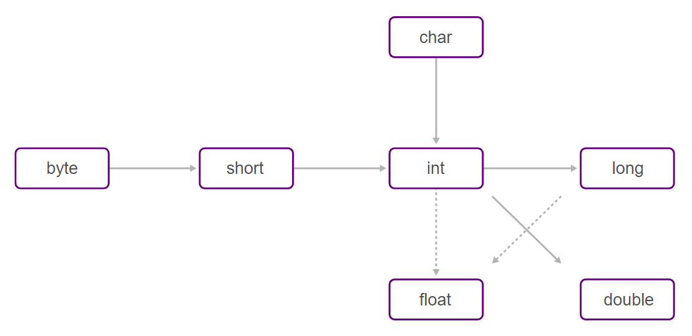

<h1>FASE 5 - OOP</h1>
<h2>Capítulo 05: Um pouco de Java nesta forma de pensar. 🤔</h2>

<h2>1. UM POUCO DE JAVA NESTA FORMA DE PENSAR</h2>

## 1.1 Ambiente de desenvolvimento integrado

`IDE` (Integrated Development Environment ou Ambiente de Desenvolvimento Integrado):

- é um programa que visa maximizar a produtividade do desenvolvedor.
- possui várias funcionalidades que auxiliam no desenvolvimento, sendo as mais comuns:
  - editor: editor de código-fonte específico para cada linguagem de programação suportada pela IDE.
  - compilador: compila o código-fonte.
  - debugger (Depurador): executa o programa “passoa passo”, por meio do qual é possível verificar o que ocorre em cada linha do programa, auxiliando no entendimento do sistema e no processo de encontrar e corrigir problemas.
  - modelagem: criação de modelos de classes, objetos, interfaces, associações e interações de forma visual.
  - geração de código: a partir de templates de código comumente utilizados para solucionar problemas rotineiros.
  - deploy (Distribuição): auxilia no processo de gerar o arquivo final para a instalação do programa desenvolvido.
  - testes automatizados: realiza testes no programa de forma automatizada, baseados em scripts ou programas de testes previamente especificados, gerando relatórios que auxiliam na análise do impacto das alterações no código-fonte.
  - refactoring (Refatoração): melhoria constante do código-fonte do programa, seja na construção de código mais otimizado, mais limpo e/ou com melhor entendimento pelos envolvidos no desenvolvimento do software.
- há várias IDEs disponíveis no mercado, destinadas às linguagens de programação ou uma plataforma de desenvolvimento específica. Exemplos: Visual Studio, da Microsoft, Netbeans, da Oracle etc.
- para a plataforma Java existem várias IDEs,como Eclipse, NetBeans, JDeveloper e IntelliJ.

> Para o curso e desenvolvimento do sistema Fintech, vamos utilizar a IDE Eclipse.

## 1.2 Criando um projeto com Eclipse

### 1. menu File > New > Project.

### 2. escolher a primeira opção: Java Project e clicar em Next.

### 3. definir o nome do projeto. 

    - como sugestão, dar o nome de 01-OlaMundo e clicar em Finish.

### 4. antes de finalizar a criação do projeto, o eclipse pode abrir uma janela perguntando se você gostaria de mudar de perspectiva. 
    - o eclipse possui diferentes visões que são associadas ao tipo de projeto/atividade que está sendo executada. 
    - provavelmente, na primeira execução do eclipse ele estará na perspectiva de Java EE, e quando criarmos um Java Project, ele estará associado ao Java SE, por isso aparece o dialog perguntando se gostaria de mudar de perspectiva.
    - neste ponto, não faz diferença a perspectiva que escolher. A qualquer momento, é possível mudar de perspectiva através da opção Window > Open Perspective.

### 5. após escolher a perspectiva, o eclipse irá finalizar a criação do projeto e o resultado poderá ser visualizado na aba de Package Explorer,localizado na janela à esquerda no eclipse.
    - `pasta src` é onde devemos criar os arquivos Java. Abaixo desta pasta, estão localizadas as bibliotecas de classes básicas do Java (`JRE System Library`).

### 6. depois de definir a workspace e criar um projeto, está na hora de criar a nossa primeira classe Java.
    -  para isso, vamos primeiro definir o diretório em que ele será criado.
    - a hierarquia de diretórios para a organização dos arquivos de um programa em Java é denominada `Pacotes`.

> Devemos sempre criar uma estrutura de diretório (pacotes) para organizar os arquivos do sistema. Dessa forma, podemos agrupar as classes em coleções e separá-las das bibliotecas de classes fornecidas por outras empresas.

  - além de organizar, utilizar pacotes garante a singularidade dos nomes das classes.
  - em um sistema, não podemos ter classes com o mesmo nome dentro do mesmo pacote. 
  - porém, não há conflito se as classes estiverem em pacotes diferentes! 
  - para garantir um nome de pacote único, é recomendado utilizar o nome de domínio da internet da empresa (que é único) escrito ao contrário. E depois especificar melhor ainda os pacotes com nome do projeto, tipos de classes etc.
  - exemplo: para a faculdade FIAP, que possui o domínio fiap.com.br e está desenvolvendo um projeto para e-commerce, o pacote será definido como br.com.fiap.ecommerce.

### 7. criar um pacote para o projeto, chamado br.com.fiap.tds, para agrupar as classes do projeto do curso de TDS.
    - clicar com o botão direito do mouse no diretório src e escolher new > package.
    - definir o nome do pacote e finalizar o processo clicando no botão Finish.

### 8. verificar a estrutura que foi criada no disco rígido. 
    - para isso, navegar até a pasta do workspace no Windows Explorer.
    - podemos visualizar uma pasta que representa o Projeto “01-OlaMundo”. Dentro da pasta do projeto, temos a pasta src, com uma estrutura de diretórios do pacote criado. Assim, podemos perceber que cada pasta do pacote é separada pelo “.” (ponto).

### 9. criar a primeira classe Java: clicar com o botão direito do mouse no pacote e escolher New > Class.

### 10. definir o nome da classe: dar o nome de “OlaMundo”e finalizar o processo com o botão Finish.

### 11. o resultado pode ser visualizado na área central do eclipse, onde está localizado o editor de código-fonte.
    - a classe possui uma primeira instrução, que define o pacote da classe: package br.com.fiap.tds.
    - a definição de pacote sempre é feita na primeira linha do arquivo Java, em seguida, temos a definição da classe, conforme o código abaixo:

~~~java
package br.com.fiap.tds;

public class OlaMundo {

}
~~~

- após a `palavra-chave class`, vem o nome da classe. 
  - o nome do arquivo gerado é o mesmo da classe com a extensão .java. 
  - é importante, pois é obrigatório que o nome do arquivo seja o mesmo da classe pública.
  - nomes devem iniciar com uma letra, depois podem conter quaisquer combinações entre letras e dígitos.
  - ***padrão para atribuir nomes a classes*** é utilizar substantivos que iniciam com uma letra maiúscula. 
    - se o nome tiver mais de uma palavra, utilizar “notação camelo” ou “CamelCase”.

- as chaves delimitam os blocos em um programa.
  - neste caso, as chaves delimitam o início e o fim da classe OlaMundo.

> Dentro de uma workspace, definimos os projetos. Projetos podem ter vários pacotes, e estes, por sua vez, podem conter várias classes.

### 12. adicionar um código para executar o programa e exibir informações:

~~~java
package br.com.fiap.tds;

public class OlaMundo {
	public static void main (String[] args) {
		System.out.println("FIAP - Olá Mundo!");
	}	
}
~~~

- o código `public static void main(String[] args)` define o método main, o método principal do programa, por onde a aplicação é inicializada.- - as chaves de abertura e fechamento estão delimitando o início e o fim do método.
- para executar uma classe compilada, a máquina virtual do Java sempre inicia a execução pelo método main.
- a `instrução System.out.println()` exibe na console a informação que está entre os parênteses, neste caso “FIAP – Olá Mundo”. 

> Toda instrução deve terminar com ponto e vírgula (;).

- outro detalhe é o `asterisco antes do nome da classe na aba do editor`; ele indica que a classe não foi salva. 
  - utilizar o atalho CTRL + S ou o botão Save, na barra de ferramentas.

### 13. para executar o programa:

- utilizar o atalho F11 ou o botão “play” localizado na barra de ferramentas.
- há mais uma opção para executar a classe Java: clicar com o botão direito do mouse em cima da classe e escolher as opções: Run As > Java Application.

> O primeiro programa desenvolvido pode ser visualizado [aqui](../fase05/projects/olaMundo/src/br/com/fiap/tds/OlaMundo.java).

---

## 1.3 Fundamentos da programação Java

### 1.3.1 Tipos de dados e variáveis

- `variáveis`:
  - compostas pelo seu nome e o tipo de informação que irá armazenar. 
  - uma variável também pode armazenar um objeto.
  - para declará-la, primeiro é definido o tipo e depois o nome da variável, como:

~~~java
int idade;
double preco;
double taxa, salario;
~~~

- é possível declarar mais de uma variável do mesmo tipo de uma só vez, basta separar o nome das variáveis por vírgulas (,).
- **nomes das variáveis** podem começar com uma letra, um caractere de sublinhado (_) ou $.
  - depois do primeiro caractere, os nomes das variáveis podem conter qualquer combinação de letras ou números. A
  - evitar utilizar acentuação na declaração do nome das variáveis, evitar nomes muito longos.
  - por padrão, o nome da variável deve começar com um caractere em minúsculo e, se for composto por mais de uma palavra, a próxima palavra deve começar com caractere em maiúscula.

> a linguagem Java é `case sensitive`: as letras maiúsculas e minúsculas são diferentes. 

- na linguagem Java existem palavras que não podemos utilizar para nomear as variáveis, classes ou métodos.
  - são as `palavras reservadas`, que possuem significados dentro da programação.
  - abstract, asert, boolean, break, byte, case, catch, char, class, const, continue, default, do, double, else,enum, extends, final, finally, float, for, goto, if, implements, import, instanceof, int, interface, long, native, new, package, private, protected, public, return, short, static, strictfp, super, switch, synchronized, this, throw, throws, transient, try, void, volatile, while.

> `Java é uma linguagem fortemente tipada`, pois cada variável precisa ter um tipo declarado.

- há `oito tipos primitivos` para armazenamento de informações.
  - tipos primitivos não são objetos, são partes internas da linguagem Java, o que os tornam mais eficientes, pois armazenam somente o seu valor.

> A) quatro dos tipos primitivos são para armazenar `tipos numéricos inteiros, positivo ou negativo, sem a parte fracionária`.

&#32; | Tipos de números inteiros do Java | &#32;
------|-----------------------------------|------
Tipo | Requisito de Armazenamento | Intervalo (inclusive)
int | 4 bytes | -2.147.483.648 a 2.147.483.647 (um pouco acima de 2 bilhões)
short | 2 bytes | -32.768 a 32.767
long | 8 bytes | -9.223.372.036.854.775.808 a 9.223.372.036.854.775.807
byte | 1 byte | -128 a 127

- a diferença entre os tipos é o tamanho do número que consegue armazenar, e consequentemente, a quantidade de memória necessária para isso. 
- na maioria das situações, o tipo int é o mais utilizado. 
- quando for necessário armazenar um número muito grande, recorrer ao tipo long.

> B) `valores de ponto flutuante` são os números que contêm parte fracionária, ou seja, os números decimais.

&#32; | Tipos de ponto flutuante | &#32;
------|-----------------------------------|------
Tipo | Requisito de Armazenamento | Intervalo (inclusive)
float | 4 bytes | aprox. +/- 3.40282347E+38F (6-7 dígitos significativos)
short | 8 bytes | aprox. +/- 1.797693134862311570E+308 (15 dígitos decimais significativos)

- o tipo double é duas vezes mais preciso que o tipo float.

> C) `outros tipos primitivos`:

- tipo char:
  - utilizado para armazenar caracteres individuais, como letras, algarismos, sinais de pontuação, entre outros.

- tipo boolean:
  - possui somente dois valores, verdadeiro (true) ou falso (false). 
  - no Java não é possível converter números inteiros em valores booleanos.

> “E o conjunto de caracteres?”. Na linguagem Java, `String` é uma classe, ou seja, não é um valor primitivo. Dessa forma, ela possui métodos e atributos!

### 1.3.2 Atribuindo valores às variáveis

- depois de declarar uma variável, é possível atribuir um valor a ela com o operador de atribuição (sinal de igual =).

~~~java
int idade = 10;
double preco = 10.0;
char sexo = ‘M’;
boolean maiorIdade = false;
~~~

- criada a classe [PraticandoTiposPrimitivos](../fase05/projects/olaMundo/src/br/com/fiap/tds/PraticandoTiposPrimitivos.java).

~~~java
package br.com.fiap.tds;

public class PraticandoTiposPrimitivos {
	public static void main(String[] args) {
		long codigo = 1523156;
		int batimento = 65;
		float peso = 80.5f; // para o valor do tipo float, adicionada a letra f ao final, para que o Java entenda que o n°. não é do tipo double.
		double altura = 1.80;
		boolean fumante = false;
		char sexo = 'M'; // o valor do char deve estar entre aspas simples (').
		
		System.out.println("Código: " + codigo);
		System.out.println("Frequência cardíaca: " + batimento);
		System.out.println("Peso: " + peso);
		System.out.println("Altura: " + altura);
		System.out.println("Fumante? " + fumante);
		System.out.println("Sexo: " + sexo);
	}
}
~~~

- muitas vezes é necessário converter um tipo de dado em outro tipo, conforme imagem abaixo:

 
<em>Conversões automáticas de tipos de dados. Setas sólidas indicam as conversões de tipos onde não se perdem informações, pois o tipo muda de um tamanho menor para um maior, enquanto as três setas pontilhadas indicam conversões que podem perder informações.</em> 

- criada a classe [ConversaoTiposPrimitivos](../fase05/projects/olaMundo/src/br/com/fiap/tds/ConversaoTiposPrimitivos.java).

~~~java
package br.com.fiap.tds;

public class ConversaoTiposPrimitivos {
	public static void main(String[] args) {
		int x = 10; //declaração de uma variável do tipo int
		double d = x; // variável double recebe um tipo int
		long l = x; // variável long recebe um tipo int
		float f = x; // variável float recebe um tipo int
		short s = 20; //declaração de uma variável do tipo short
		x = s; // variável int recebe um tipo short
		
		System.out.println(x); // 20
		System.out.println(d); // 10.0
		System.out.println(l); // 10
		System.out.println(f); // 10.0
		System.out.println(s); // 20
	}
}
~~~

- por outro lado, há momentos em que não é possível realizar as conversões automáticas, como transformar um double em int. Essa conversão é viável, porém há risco em perder informações. Esse tipo de conversão é possível por meio de `cast`.
- a sintaxe do `cast` é adicionar o tipo que queremos converter entre parênteses, como no exemplo [ConvesaoComCast](./projects/olaMundo/src/br/com/fiap/tds/ConvesaoComCast.java).

~~~java
package br.com.fiap.tds;

public class ConvesaoComCast {
	public static void main(String[] args) {
		double valorDouble = 9.99;
		int valorInt = (int) valorDouble;
		
		System.out.println(valorInt);}
}
~~~

### 1.3.3 Operadores

- são símbolos especiais utilizados para operações matemáticas, instruções de atribuições e comparações lógicas.

1. `Operadores aritméticos`:

    - utilizados para realizar somas, subtrações, multiplicaçõese divisões. 
    - existe ainda um operador que retorna o resto da divisão de dois números, chamado módulo.

Operador Java | Operador | Expressão Algébrica | Expressão Java
--------------|----------|----------------------|--------------
Adição | + | f + 7 | f + 7
Subtração | - | p - c | p - c
Multiplicação | * | b.m ou b*m | b * m
Divisão | / | x/y ou x:y | x/y
Resto | % | r mod s | r % s

- a divisão entre inteiros produz números inteiros: a parte fracionária é descartada, sem nenhum arredondamento.
- no Java podemos realizar várias operações aritméticas de uma vez, aplicando as mesmas regras de precedência de operadores aplicados na matemática:
  - operações de multiplicação, divisão e módulo são realizadas primeiro; possuem o mesmo nível de precedência, ou seja, se a expressão matemática possuir dois operadores desses, elas serão aplicadas da esquerda para a direita.
  - operações de adição e subtração são aplicadas em seguida; possuem o mesmo nível de precedência.
  - podemos utilizar os parênteses para agrupar as operações matemáticas.

2. `Operadores de atribuição`:

- para atribuir valores a uma variável utilizamos o símbolo de igual (=).
- a atribuição ocorre sempre após o processamento das expressões do lado direito da atribuição.

~~~java
int x = 10;
x = x + 15;
~~~

- operadores de atribuição e as expressões às quais são equivalentes:

Expressão | Significado
---------|--------------
x += y | x = x + y 
x -= y | x = x - y
x *= y | x = x * y
x /= y | x = x / y

3. `Operadores de incremento e decremento`:

- para aumentar ou diminuir o valor de uma variável em uma unidade, podemos utilizar os operadores de incremento e decremento.
- para adicionar 1 à variável x, utilizamos x++ (mesmo resultado da expressão x = x + 1); parasubtrair 1 de x, escrever x-- (mesmo resultado de x = x - 1).
- exemplo em [OperadoresIncrementoDecremento](./projects/olaMundo/src/br/com/fiap/tds/OperadoresIncrementoDecremento.java).

~~~java
package br.com.fiap.tds;

public class OperadoresIncrementoDecremento {
	public static void main (String[] args) {
		int numero = 10;
		numero++;
		System.out.println(numero); // retorna 11
		
		numero--;
		System.out.println(numero); // retorna 10
	}
}	
~~~

- o código [OperadoresAritmeticos](./projects/olaMundo/src/br/com/fiap/tds/OperadoresAritmeticos.java) apresenta um resumo dos operadores vistos até aqui.

~~~java
package br.com.fiap.tds;

public class OperadoresAritmeticos {
	public static void main (String[] args) {
		int x = 9;
		int y = 2;
		
		int soma = x + y;
		int subtracao = x - y;
		int multiplicacao = x * y;
		int divisao = x / y;
		int resto = x % y;
		
		System.out.println("Resultado da adição: " + soma); // 11
		System.out.println("Resultado da subtração: " + subtracao); // 7
		System.out.println("Resultado da multiplicação: " + multiplicacao); // 18
		System.out.println("Resultado da divisão: " + divisao); // 4
		System.out.println("Resultado do módulo: " + resto); // 1
		
		x++;
		System.out.println("Resultado do incremento de x: " + x); // 10
		y--;
		System.out.println("Resultado do decremento de y: " + y); // 1
		
		x += 10;
		System.out.println("Resultado da atribuição aditiva: " + x); // 20
		y -= 10;
		System.out.println("Resultado da atribuição subtrativa: " + y); // -9
	}
}
~~~

4. `Operadores de igualdade e relacionais`:

- utilizados para realizar comparações entre variáveis, variáveis e valores ou outros tipos de informações.
- utilizados para para formar expressões que retornam um valor booleano verdadeiro (true) ou falso (false).

Operador de igualdade ou relacional Java | Exemplo de condição em Java | Significado da condição em Java
-----------------------------------------|-----------------------------|--------------------------------
&#32; | <b>Operadores de igualdade</b>| &#32;
== | x == y | x é igual a y
!= | x != y | x é diferente de y
&#32; | <b>Operadores relacionais</b> | &#32;
&gt; | x > y | x é maior que y 
&lt; | x < y | x é menor que y
&gt;= | x >= y | x é maior que ou igual a y 
&lt;= | x <= y | x é menor que ou igual a y

~~~java
int idade = 10;
boolean maioridade = idade > 18;
~~~

5. `Operadores lógicos`:

- utilizados para formar expressões de comparação mais complexas, que possuem mais de um termo para comparação. 
  - essas expressões resultam em valores booleanos.
- os operadores utilizados para combinar as comparações são ***AND, OR, XOR e NOT***.

a) ***operador lógico AND (e)***:
  - representeado pelo símbolo &&. 
  - quando duas expressões booleanas utilizam o operador &&, o resultado final é verdadeiro (true) somente quando as duas expressões forem verdadeiras.

~~~java
boolean precisaVotar = idade >= 18 && idade < 70;
~~~

b) ***operador lógico OR (ou)***:
  - operador || é utilizado.
  - essas expressões combinadas retornam com verdadeiro caso uma das expressões seja verdadeira (falso apenas se ambas forem falsas).

~~~java
boolean suspenso = nrAmarelo == 2 || nrVermelho == 1;
~~~

c) ***operador XOR***:
  - representado pelo símbolo (^) e é conhecido como ou exclusivo.
  - a combinação resulta em um valor verdadeiro (true) somente se um dos lados for verdadeiro. 
  - se ambos forem verdadeiros, ou ambos falsos, o resultado da expressão será false.

~~~java
boolean teste = x > 10 ^ y > 10;
~~~

d) ***operador NOT***:
  - utiliza o símbolo (!).
  - reverte o valor da expressão booleana.
  - é o único operador lógico que pode receber apenas um valor. 

6. `Fluxo de controle e escopo de bloco`:

- a maioria das linguagens possui um fluxo de controle como as instruções de seleção e loops.
- as chaves { } delimitam o início e o fim de classes e métodos; delimitam os blocos de código que pertencem à classe e ao método. Os blocos podem ser aninhados dentro de outro bloco, como, por exemplo, a classe que possui um método.
- a `instrução condicional` no Java é realizada pela ***palavra reservada if*** e tem a sintaxe:

~~~java
if (condicao) {
  instrucao 1;
  instrução 2;
}
~~~

- quando a instrução if possuir somente uma instrução para ser executada, as chaves são opcionais. 
- caso o if execute mais de uma instrução, é preciso determinar o bloco, adicionando todas as instruções entre as chaves ({ }).

~~~java
if(x > 10) { 
  System.out.println("X é maior que 10");
  System.out.println(" ***** FIM ***** ");
}
~~~

- podemos utilizar também o ***comando else*** (opcional) junto do if.
  - se a condição do if for false, o bloco de código do else será executado.
  - sintaxe:

~~~java
if (condição) {
  Instrução;
  } else {
    Instrução;
  }
~~~

~~~java
if (x > 10) {
  System.out.println("X é maior que 10");
} else {
  System.out.println("X é menor ou igual a 10");
}
~~~

- é possível utilizar uma instrução de seleção dentro de outra instrução de seleção.
  - dessa forma, um if fica dentro de outro if(neste caso do else). Sempre um else pertence ao if que estiver mais próximo dele.

~~~java
if (x > 10){
  System.out.println("X é maior do que 10");
} else if (x == 10) {
  System.out.println("X é igual a 10");
} else {
  System.out.println("X é menor do que 10");
}
~~~

7. `Entrada e saída de dados`:

- podemos exibir informações para o usuário com as seguintes instruções, sendo que a diferença entre eles é a quebra de linha:
  - System.out.Println(): pula uma linha no final.
  - System.out.Print(): somente imprime a informação e continua na mesma linha.

- ***para ler uma informação inserida pelo usuário, precisamos da ajuda da classe Scanner***!

~~~java
Scanner sc = new Scanner(System.in);
~~~

- um scanner permite a leitura de dados que podem ser provenientes de várias origens, como um arquivo do disco ou informações digitadas pelo usuário.
- o valor System.in especifica que queremos ler os valores digitados pelo usuário.
- há vários métodos que são utilizados para ler cada um dos tipos de dados possíveis:

~~~java
Scanner sc = new Scanner(System.in);
int idade = sc.nextInt(); // lê um número inteiro
double preco = sc.nextDouble(); // lê um número com casas decimais
~~~

- a ***classe Scanner*** está definida no ***pacote java.util***.
  - sempre que precisamos utilizar uma classe que está em um pacote diferente e não é do pacote básico (java.lang) é necessário utilizar a instrução import. 

~~~java
import java.util.Scanner;
~~~

- o import possui o nome do pacote mais o nome da classe. Assim, a classe Scanner está no pacote java.util.

~~~java
package br.com.fiap.tds;

import java.util.Scanner;

public class LeituraDeDados {
	public static void main(String[] args) {
		Scanner sc = new Scanner(System.in);
		System.out.print("Informe o seu peso: ");
		float peso = sc.nextFloat();
		System.out.println("Peso informado: " + peso);
		sc.close();
	}
}
~~~

- exemplos em [LeituraDeDados](./projects/olaMundo/src/br/com/fiap/tds/LeituraDeDados.java) e em [UltimoExemplo](./projects/olaMundo/src/br/com/fiap/tds/UltimoExemplo.java). 

---

## FAST TEST

### 1. Selecione a alternativa que representa a expressão correta para o cálculo da média de 3 notas em Java (que resulta em 5.5):
> media = (5.5 + 2.5 + 8.5) / 3.0

### 2. Em um código em Java foram declaradas duas variáveis do tipo inteiro (x e y). Para a variável x, foi atribuido o valor 2 (dois) e para a variável y foi atribuido o valor 3 (três). Selecione a alternativa que apresenta o valor armazenado na variável x após a execução deste comando: x *= y.
> 6.

### 3. Selecione a alternativa que apresenta corretamente o comando em Java para a exibição do texto FIAP em tela.
> System.out.println("FIAP")

### 4. Selecione a alternativa que apresenta a sintaxe correta para a declaração de uma variável do tipo inteiro na linguagem Java.
> int idade;

### 5. Em JAVA, temos os operadores lógicos: NOT (não), AND (e), OR (ou) e XOR. Os operadores lógicos servem para combinar expressões, tendo como resultado os valores true (verdadeiro) ou false (falso). Assinale a alternativa CORRETA, conforme as expressões a seguir:
> false OR true = true.

--- 

[Voltar ao início!](https://github.com/monicaquintal/fintech)