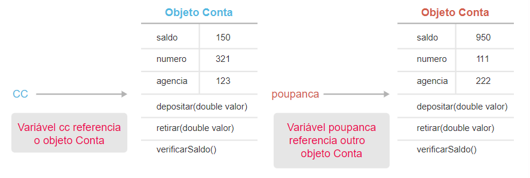

<h1>FASE 5 - OOP</h1>
<h2>Capítulo 06: Software de classe.</h2>

<h2>1. SOFTWARE DE CLASSE</h2>

## 1.1 Introdução

- relembraremos as classes, entendendo como declará-las na linguagem Java e como instanciá-las, ou seja, como obter um objeto, que é a instância da classe, para que seja possível utilizá-la.

---

## 1.2 Classe

- uma classe possui o modelo ou estrutura a partir do qual os objetos serão criados.
- o processo de criação de um objeto a partir de uma classe é chamado de `instanciação`.

> [`EXEMPLO`](./projects/capitulo06/src/capitulo06/Conta.java): As informações relevantes para uma conta bancária podem ser saldo, número da conta, agência, tipo de conta etc. Já as ações ou comportamentos importantes de uma classe Conta são: sacar, depositar, verificar o saldo etc. 

- podemos desenvolver uma classe ***Conta***, que contenha informações e comportamentos. Porém, essa classe é somente o modelo para o conceito de Conta Bancária dentro do sistema.
- assim como em um Banco Financeiro real, antes de guardar dinheiro na conta, é preciso ir ao Banco para abrir uma Conta.
- na orientação a objetos, primeiro precisamos criar um objeto utilizando a classe Conta, para depois utilizá-la.

> Em resumo, um ***objeto é uma instância de uma Classe***!

~~~java
// Para instanciar uma classe, utilizamos o operador new:
new Conta();
~~~

- precisamos armazenar o objeto em alguma variável para utilizá-lo posteriormente.
- portanto, ***declarar uma variável do tipo da Classe (Conta) e atribuir o objeto à variável com o operador de atribuição (=)***.

~~~java
Conta cc = new Conta();
Conta poupanca = new Conta();
~~~

- as variáveis cc e poupança armazenam a referência de seus respectivos objetos.
- podemos instanciar várias classes do mesmo tipo; nesse caso, há vários objetos do tipo Conta.
- classes Java são definidas em arquivos separados com a extensão .java e o nome do arquivo deve ser igual ao nome da Classe. 
  - por convenção, o nome segue o padrão UpperCamelCase, no qual as palavras sempre se iniciam com a letra em maiúscula.
- sintaxe:

~~~java
[modificador] class [NomeDaClasse] {
  // código
}
~~~

---

## 1.3 Atributos

- uma classe ***pode conter nenhum, um ou vários atributos***. 
- depois de instanciar a classe, os atributos serão utilizados para armazenar informações do objeto. 
  - as informações diferenciam um objeto do outro!!
- atributos são ***definidos por variáveis***, que podem ser:
  - ***tipo primitivo*** ou
  - ***tipo de referência***: a variável armazena uma referência ao objeto. 
- nomes do atributos:
  - lowerCamelCase (primeira letra é minúscula e as demais palavras começam com letra maiúscula).
  - utilizar substantivos e nomes bem definidos para os atributos.
  - nomes pouco sugestivos devem ser evitados.
- variáveis que definem um atributo em uma classe são chamadas de `variáveis de instância` (só é possível armazenar informações nessas variáveis após a instanciação da classe, ou seja, no objeto).
- declarar uma variável de instância segue a mesma sintaxe das variáveis locais.
- exemplo:

~~~java
public class Conta {
  int numero;
  int agencia;
  double saldo = 100;
  Calendar dataAbertura;
  String tipo;
  Cliente cliente;
}
~~~

- variáveis de instância recebem valores-padrão quando não atribuímos valores à sua declaração:
  - para números, o valor padrão é 0 (zero), 
  - para booleanos é falso (false) e 
  - para referência é vazio (null).

Data type | Default value (for fields)
----------|---------------------------
byte | 0
short | 0
int | 0
long | 0L
float | 0.0f
double | 0.0d
char | '\u0000'
String (or any object) | null
boolean | false

---

## 1.4 Métodos

- métodos definem os comportamentos (ações ou serviços) que o objeto possui. 
- método é comportamento específico, residente no objeto, que define como ele deve agir quando exigido, definindo, assim, as habilidades do objeto.
- nomes dos métodos:
  - assim como os seus atributos, devem sempre ser escritos em lowerCamelCase.
  - geralmente utilizamos verbos para os nomes.
- sintaxe:

~~~java
<modificador> <tipo de retorno> <nomeDoMetodo>(<[lista de argumentos]>){
  [instrucoes];
}
~~~

~~~java
public class Conta {
	double saldo;
	
	public double recuperarSaldo() {
		return saldo;
	}
	
	public void depositar(int agencia, String numeroConta, double valor) {
		saldo = saldo + valor;
	}
}
~~~

- devemos definir o ***tipo de retorno*** que o método deve devolver. 
  - no exemplo acima, o método recuperarSaldo retorna um valor do tipo double. 
  - a `instrução return` é utilizada para retornar o valor.
  - o método retorna o valor do atributo saldo.
- caso o método não precise retornar nenhum valor, podemos definir o retorno como `void`. 
  - no exemplo, o método depositar não retorna nenhum valor. 
- métodos podem receber valores, como o método depositar.
  - os `parâmetros dos métodos` são declarados pela ***[lista de argumentos]***, conjunto de declarações de variáveis separadas por vírgulas e definidas dentro dos parênteses. 
  - os parâmetros se tornam variáveis locais no método, recebendo seus valores quando o método for chamado.

### 1.4.1 Sobrecarga de métodos

- sobrecarregar um método significa ***prover mais de uma versão de um mesmo método***. 
- as versões devem, *necessariamente*, conter parâmetros diferentes, seja no tipo ou no número desses parâmetros.
- o tipo de retorno não é relevante.
- LOGO, ***duas características diferenciam os métodos com o mesmo nome: o número de parâmetros e o tipo deles***, características que fazem parte da assinatura de um método.
- o uso de vários métodos com o mesmo nome e assinaturas diferentes é chamado de sobrecarga de métodos.

~~~java
public class Conta {
  double saldo;

  public void retirar(double valor) {
		saldo = saldo - valor;
	}
	
	public void retirar(double valor, double taxa) {
		saldo = saldo - valor - taxa;
	}
}
~~~

- no exemplo acima, a classe Conta possui dois métodos com o nome retirar, com assinaturas diferentes. 
  - um método recebe somente um parâmetro: o valor para retirada e 
  - o outro recebe dois parâmetros: o valor de retirada e o valor da taxa de retirada.

- a sobrecarga de métodos permite que os métodos se comportem de modo diferente, dependendo dos argumentos que recebem. 
- quando chamamos um método em um objeto, o Java verifica o nome do método e os parâmetros enviados para escolher o melhor método a ser invocado. 
- a `palavra reservada this` faz referência ao próprio objeto. É por meio dela que é possível acessar atributos, métodos e construtores do objeto em questão. 
- quando houver duas variáveis com o mesmo nome, uma sendo uma variável de instância (atributo da classe) e outra pertencente ao método, utilizar a palavra this para referenciar o atributo da classe, como a seguir:

~~~java
public class Conta {
  int agencia;

  public void setAgencia (int agencia) {
    this.agencia = agencia;
  }
}
~~~

---

## 1.5 Construtores

- são métodos especiais, que são executados automaticamente quando os objetos dessa classe são criados.
- auxiliam na construção do objeto, podendo ser utilizados para inicializar os atributos e/ou chamar métodos.
- o método construtor é chamado quando o objeto é construído, ou seja, é invocado quando utilizar a instrução new para criar uma instância da classe.
- quando criamos uma instância da classe, **três passos são executados pelo Java**:
  - alocar memória para o Objeto.
  - inicializar os atributos com os valores iniciais ou padrões.
  - chamar o método Construtor da classe.
- construtores se parecem com métodos comuns, mas têm **três diferenças básicas**:
  - possuem o mesmo nome da Classe.
  - não têm tipo de retorno (nem mesmo void).
  - não podem retornar valor no método usando a instrução return.
- **toda classe tem pelo menos um construtor**.
  - quando o construtor não é especificado, a linguagem Java fornece um construtor default (padrão) – vazio – que não recebe parâmetros.
  - se for declarado algum construtor na classe, a linguagem Java não fornecerá mais o construtor padrão.

~~~java
public class Conta {
	double saldo;
	
	public double recuperarSaldo() {
		return saldo;
	}
	
	public void depositar(double valor) {
		saldo = saldo + valor;
  }
}
~~~

- quando uma instância de Conta for criada (com a instrução new Conta(100);), o atributo saldo será inicializado com o valor 100 e será impresso no console do Eclipse a frase “Criando uma instância de Conta”.
- podemos adicionar um construtor que recebe parâmetros, como:

~~~java
public class Conta {
	double saldo;
	
	public Conta(double valor) {
		saldo = valor;
    System.out.println("Criando uma instância de conta!");
	}
}
~~~

- no exemplo acima, o construtor padrão (sem parâmetros) não será fornecido pelo Java. 
- o único construtor que a classe Conta tem é o que recebe um valor doublecomo parâmetro. 
- esse valor é utilizado para inicializar o valor do atributo saldo.
- exemplo de utilização: new Conta(100);

~~~java
public class Conta {
	double saldo;
	
	public Conta(double saldo) {
		this.saldo = saldo;
    System.out.println("Criando uma instância de conta!");
	}
}
~~~

- no exemplo acima, o construtor recebe um parâmetro chamado saldo e atribui o seu valor ao atributo saldo. 
- para diferenciar o atributo da classe do parâmetro, utiliza-se a instrução this.
- assim como os métodos, uma classe pode ter vários construtores com diferentes tipos e quantidades de argumentos.
  - chamado de **sobrecarga de métodos construtores**. 
  - uma classe pode ser instanciada com qualquer um dos construtores.

~~~java
public class Conta {
  double saldo;
  int agencia;

  public Conta() {

  }

  public Conta (double saldo) {
    this.saldo = saldo;
  }
  
    public Conta (int agencia, double saldo) {
    this.saldo = saldo;
    this.agencia = agencia;
  } 
}
~~~

- dessa forma, há três opções para instanciar a classe Conta:
  - new Conta().
  - new Conta(100).
  - new Conta(10,100).
- outro uso para a palavra reservada this é na chamada de um construtor por outro construtor da própria classe.

~~~java
public class Conta {
  double saldo;
  int agencia;

  public Conta (double saldo) {
    this.saldo = saldo;
  }
  
    public Conta (int agencia, double saldo) {
    this(saldo);
    this.agencia = agencia;
  } 
}
~~~

- no exemplo acima, o construtor com dois parâmetros chama o construtor com um parâmetro (saldo) por meio da instrução this(saldo)!

---

<h2>2. TRABALHANDO COM OBJETOS</h2>

> Exemplo desenvolvido [aqui](./projects/capitulo06/src/br/com/fiap/banco).

- para consolidar os conceitos, criar uma [classe Conta](./projects/capitulo06/src/br/com/fiap/banco/Conta.java) com os atributos saldo, agência e número.
- desenvolver os métodos retirar, depositar e verificarSaldo.
- implementar dois construtores: um construtor padrão e outro que recebe três argumentos: o saldo, a agência e o número.

~~~java
package br.com.fiap.banco;

public class Conta {
	int numero;
	int agencia;
	double saldo;
	
	public Conta(){
		
	}
	
	public Conta (int numero, int agencia, double saldo) {
		this.numero = numero;
		this.agencia = agencia;
		this.saldo = saldo;
	}
	
	public void depositar (double valor) {
		this.saldo += valor;
	}
	
	public void retirar (double valor) {
		this.saldo -= valor;
	}
	
	public double verificarSaldo() {
		return saldo;
	}
}
~~~

- criar uma nova classe chamada [Teste](./projects/capitulo06/src/br/com/fiap/banco/Teste.java), no pacote br.com.fiap.banco, e implemente o método main, a fim de testar e criar instâncias (objetos) da classe Conta.
- dentro do método main, instanciar a classe Conta e armazenar a referência desse objeto em uma variável.

~~~java
package br.com.fiap.banco;

public class Teste {
	public static void main(String[] args) {
		Conta cc = new Conta();
	}
}
~~~

- a variável cc tem uma referência ao objeto Conta: é por meio dela que podemos acessar os atributos e métodos do objeto!!! 
- utilizando o operador ponto (.), podemos acessar as variáveis de instância e os métodos do objeto. 
  - por exemplo, para acessar o atributo saldo do objeto conta, que está referenciado pela variável cc, utilizar o código apresentado abaixo:

~~~java
double valor = cc.saldo; 
// recupera valor do atributo saldo do objeto conta e atribui à variável valor
System.out.println(cc.saldo);
// imprime o valor do saldo no console
cc.saldo = 1000;
~~~

- para atribuir um valor ao atributo do objeto, utilizamos o operador de atribuição:

~~~java
cc.saldo = 1000;
~~~

- chamar um método de um objeto é semelhante ao acesso a um atributo: utilizada a notação de ponto (.).
  - a variável que referencia o objeto (cc) fica do lado esquerdo e o nome do método e seus argumentos ficam do lado direito do ponto. 
  - dentro dos parênteses são informados os argumentos do método. 
  - caso o método tenha mais de um argumento, são separados por vírgulas.
  - métodos que não recebem parâmetros não precisam receber nenhum valor,.
  - exemplos:

~~~java
cc.depositar(100);
cc.verificarSaldo();
~~~

- criar mais uma instância da classe conta, atribuir alguns valores aos seus atributos e chamar os métodos:

~~~java
package br.com.fiap.banco;

public class Teste {
	public static void main(String[] args) {
		Conta cc = new Conta();
    // cria um objeto conta
		cc.saldo = 50; 
		cc.agencia = 123;
		cc.numero = 321;
    // atribuem valores aos atributos do objeto
		
		cc.depositar(100);
    //chama um método do objeto 
		
		System.out.println(cc.verificarSaldo());
    // chama outro método e imprime o valor do retorno
		
		Conta poupanca = new Conta (111, 222, 1000);
    // cria um objeto Conta utilizando o Construtor
    // que recebe valores iniciais para os atributos 
		
		poupanca.retirar(50);
    // chama um método do objeto
		
		System.out.println(poupanca.verificarSaldo());
    // chama outro método e imprime o valor do retorno
	}
}
// no console, os retornos são "150" e "950".
~~~

- cada objeto possui os seus próprios valores para as variáveis de instância e seus métodos atuam dentro do próprio objeto, independentemente.

 
<em>Visão de variáveis que armazenam referências aos objetos Java.</em>

- uma variável que armazena a referência de um objeto pode ter o valor null, o que significa que a variável está vazia e não faz referência a nenhum objeto.
  - tomar cuidado, pois no caso de tentar acessar um atributo ou método em uma variável vazia, irá ocorrer um erro na execução do programa.
- é possível utilizar o valor null na lógica do programa sempre que for necessário verificar se a variável faz referência a um objeto ou não. 

~~~java
Conta cc = null;
if (cc != null) {
  System.out.println("Existe uma conta");
}
~~~

--- 

## 2.1 Modificadores de acesso

- modificadores são palavras-chave que alteram as definições de uma classe, método, atributo ou construtor.
- há vários tipos de modificadores na linguagem Java, da qual fazem parte: static, abstract e final.

> `modificadores de acesso`: palavras-chave utilizadas para controlar o acesso a uma classe, variável de instância, método ou construtor.

- o Java disponibiliza três modificadores de acesso: `public`, `protected` e `private`. 
- quando nenhum modificador é utilizado, o nível de acesso padrão (default), chamado ***package***, é utilizado.
- os modificadores usados com mais frequência nos sistemas são os que controlam o acesso a métodos, atributos e construtores.
- os modificadores irão determinar quais variáveis, métodos e construtores serão visíveis a outras classes.

Modificadores de acesso | Descrição
------------------------|------------
private | - atributos, métodos e construtores. - acessíveis somente dentro da própria classe. - utilizado para encapsulamento, um dos pilares da orientação a objetos e tem o objetivo de proteger o acesso indevido de seus atributos e métodos por outras classes.
package | - atributos, métodos e construtores. - acessíveis somente em classes do mesmo pacote.
protected | - atributos, métodos e construtores. - acessíveis na própria classe, suas subclasses (herança) e também nos métodos das classes que pertencem ao mesmo pacote. - é parecido com default, a diferença é a visibilidade dos membros classes filhas. Em uma herança,serão acessíveis nas subclasses da classe, mesmo que estejam em pacotes diferentes.
public | - atributos e métodos. - acessíveis em todos os métodos de todas as classes.

- membros da classe declarados sem nenhum modificador de acesso terão o nível de acesso padrão, `package`, ou seja, métodos, atributos e construtores serão acessíveis a outras classes que estiverem dentro do mesmo pacote (forma de organizar classes em uma estrutura de diretórios).

~~~java
public class Conta {
  // atributos com nível de acesso default:
	int numero;
	int agencia;
	double saldo;
	
  // construtor com nível de acesso public:
	public Conta(){
	}
	
  // construtor com nível de acesso public:
	public Conta (int numero, int agencia, double saldo) {
		this.numero = numero;
		this.agencia = agencia;
		this.saldo = saldo;
	}
	
  // método com nível de acesso public:
	public void depositar (double valor) {
		this.saldo += valor;
	}
	
  // método com nível de acesso public:
	public void retirar (double valor) {
		this.saldo -= valor;
	}
	
  // método com nível de acesso public:
	public double verificarSaldo() {
		return saldo;
	}
}
~~~

- todos os atributos não foram marcados com nenhum modificador de acesso, então o nível de acesso é o default; construtores e métodos têm o nível de acesso public.
  - logo, atributos são visíveis somente a classes que estiverem dentro do mesmo pacote da classe Conta, enquanto construtores e métodos são visíveis em qualquer outra classe, independentemente do pacote em que esteja.

--- 

## 2.2 Java API Specification

- a biblioteca de classes do Java contém milhares de classes e interfaces para o desenvolvimento de aplicações. 
  - estão agrupadas em pacotes, de acordo com suas funcionalidades.
  - exemplo: classes utilizadas para manipular arquivos estão dentro do `pacote java.io`.

### [Java API Specification](http://docs.oracle.com/javase/8/docs/api/):

- documentação para descrever as classes e seus membros públicos (public) e protegidos(protected).
- apresenta uma visão geral de todas as classes com detalhes de seus construtores, métodos e atributos que podemos manipular.
- está dividida em três janelas:
  - janela superior esquerda: apresenta os pacotes em ordem alfabética.
  - janela logo abaixo, do lado esquerdo: lista as classes e interfaces, pode ser filtrada pela escolha do pacote da janela anterior.
  - janela à direita: exibe as informações da classe, pacote ou interface, dependendo da escolha das janelas anteriores.

---

## 2.3 Comentários

- informações incluídas no código-fonte que não interferem no programa. 
- é uma forma de melhorar a legibilidade e ajudar os desenvolvedores na organização e no entendimento do código.
- há três tipos de comentários:
  - para comentar uma linha, utilizam-se duas barras (//).
  - caso seja necessário comentar mais de uma linha, iniciar o comentário com /* e terminá-lo com */.
  - comentário de documentação, ou seja, o comentário será legível tanto para computadores quanto para os desenvolvedores. 
    - esse tipo de comentário é interpretado como documentação oficial que descreve o funcionamento de uma classe e seus métodos. 
    - a sintaxe é semelhante ao comentário de várias linhas, se inicia com /** e termina com */.

~~~java
// Comentário de linha

/* Comentário de
 * mais de uma linha
 */

/**
 * Comentário de
 * documentação
 */
~~~

---

## 2.4 Javadoc

- próxima etapa: criar a documentação das classes que desenvolvemos.
- utilizaremos a `ferramenta de documentação javadoc`, que permite documentar as classes criadas no formato HTML, da mesma forma que a Java API Specification da Oracle.
- sintaxe:

~~~java
/** Descrição 
 * @tag descrição dessa tag
 */
~~~

- os comentários de documentação devem ser inseridos imediatamente acima do elemento que está sendo documentado. 
- além do texto que descreve o elemento, podemos utilizar algumas tags para dar um significado próprio a trechos do comentário (como determinar o autor ou a versão do programa). 
  - as tags são precedidas por um sinal de arroba  (@).

Tag | Descrição
-----|----------
@author | Nome do desenvolvedor.
@deprecated | Marca o mátodo como deprecated. Algumas IDEs exibirão um alerta de compilação seo método for chamado.
@exception | Documenta uma exceção lançada por um método - ver também @throws.
@param | Define um parâmetro do método. Requerido para cada parâmetro.
@return | Documenta o valor de retorno. Essa tag não deve ser usada para construtores ou métodos definidos com o tipo de retorno void.
@see | Documenta uma associação a outro método ou classe.
@Since | Documenta uma exceção lançada por um método. É um sinônimo de @exception, introduzida no Javadoc 1.2. 
@version | Exibe o número da versão de uma classe ou um método.

- exemplo de utilização do comentário de documentação com as tags:

~~~java
public class ContaCorrente {

  /**
   * Realiza um depósito na conta corrente
   * @param agencia O número da agencia
   * @param numero O número da conta
   * @param valor O valor que será depositado
   * @return O número do protocolo de confirmação
   */

  public int depositar(int agencia, long numero, double valor) {
    //implementação do método
    return 0;
  }
}
~~~

- alterada a Classe [Conta](./projects/capitulo06/src/br/com/fiap/banco/Conta.java), adicionando comentários para construção da documentação.

~~~java
package br.com.fiap.banco;

/**
 * Classe que abstrai uma Conta Bancária
 * @author Mônica Quintal
 * @version 1.0
 */

public class Conta {
	
	/**
	 * Número da conta
	 */
	public int numero;
	
	/**
	 * Número da agência
	 */
	public int agencia;
	
	/**
	 * Saldo da Conta
	 */
	public double saldo;
	
	public ContaAntiga(){
		
	}
	
	public ContaAntiga (int numero, int agencia, double saldo) {
		this.numero = numero;
		this.agencia = agencia;
		this.saldo = saldo;
	}
	
	/**
	 * Acrescenta valor ao Saldo da Conta
	 * @param valor que será depositado
	 */
	
	public void depositar (double valor) {
		this.saldo += valor;
	}
	
	/**
	 * Retira um valor do Saldo da Conta
	 * @param valor
	 */
	
	public void retirar (double valor) {
		this.saldo -= valor;
	}
	
	/**
	 * Verifica o Saldo da Conta
	 * @return Valor do Saldo da Conta
	 */
	public double verificarSaldo() {
		return saldo;
	}
	
}
~~~

- gerar a documentação da classe Conta. 
- a ferramenta javadoc fica dentro da pasta de instalação do Java (jdk) na pasta bin. Nessa pasta, existe o programa executável javadoc.exe.
- utilizar o Eclipse para gerar a documentação. Para isso, acessar o menu Project > Generate javadoc.
- após essa operação, uma janela será aberta. Configurar a ferramenta javadoc.
- navegar até a pasta em que está a ferramenta e escolher o programa javadoc.exe. No Eclipse mais atual, a ferramenta já vem configurada.
- escolher os pacotes que terão as suas classes e interfaces documentadas. 
- Configurar também uma pasta de destino para a criação dos arquivos de documentação.
- O resultado pode ser visualizado na pasta que foi escolhida como destino dos arquivos de documentação. 
- Abrir o arquivo [index.html](./projects/capitulo06/doc/banco/capitulo06/br/com/fiap/banco/class-use/Conta.html).

---

## 2.4 JavaBean e encapsulamento

- uma das principais vantagens da POO é a ***capacidade de reutilizar o mesmo objeto em diferentes classes e programas***.
- a especificação JavaBeans define diretrizes que ditam os nomes de suas variáveis, os nomes e tipos de retorno de seus métodos e alguns outros aspectos para que o `objeto, chamado de beans`, seja reutilizável.

> a ideia é criar pequenos componentes que possam ser reaproveitados ao máximo, simplificando o processo de desenvolvimento!

- `regras para que uma classe seja um JavaBean`:
  - ter um construtor padrão, sem argumentos.
  - encapsular os seus atributos, provendo métodos para o acesso a eles em outras classes.
  - é uma boa prática implementar a interface java.io.Serializable (permite a serialização de objetos).

- uma classe JavaBean pode conter construtores com argumentos, porém ela deve ter também um construtor sem argumentos.
- encapsulamento é aplicado a métodos e atributos de uma classe e consiste em proteger os dados ou, até mesmo, em escondê-los.
- para encapsular um método, utilizar o acesso mais restritivo quando desejarmos que as outras classes não tenham acesso ao método, permitindo o uso somente de dentro da própria classe.
- para limitar ou controlar o conteúdo de um atributo, métodos devem ser utilizados para atribuir ou alterar valores dos atributos de um objeto. 
  - sempre marcamos os atributos de uma classe com o nível de visibilidade mais restritivo (private), a não ser que exista um bom motivo para deixá-la com outro nível de acesso. 
  - permitir acesso total a um atributo não é uma boa prática, pois qualquer mudança na estrutura interna da classe acarretaria mudanças nas outras classes que a utilizam, limitando a flexibilidade de mudança do código!

- outros benefícios do encapsulamento:
  - esconder a implementação de uma classe: para utilizar uma classe que envia e-mail, precisamos saber somente os valores que a classe precisa receber para realizar o envio, não precisamos saber como ela o faz.
  - definir o modo de acesso aos dados: escrita, leitura, escrita e leitura.
  - proteger os dados que estão dentro dos objetos, evitando-se que eles sejam alterados erroneamente.

- o uso de métodos de leitura (get) e escrita (set) visam desacoplar os atributos de uma classe dos clientes que a utilizam.

~~~java
package br.com.fiap.banco;

public class Pessoa {

  private String nome;

  public String getNome() {
    return nome;
  }
  
  public void setNome (String nome) {
    this.nome = nome;
  }
}
~~~

- no exemplo da [Classe Pessoa](./projects/capitulo06/src/br/com/fiap/banco/Pessoa.java), o atributo nome está encapsulado.
- a única forma de recuperar ou alterar o valor do atributo nome é utilizando os `métodos assessores get e set`. 
  - a convenção de nome para métodos que alteram o valor do atributo é adicionar a palavra set antes do nome do atributo.
  - para os métodos que recuperam a informação, utiliza-se a palavra get seguida do nome do atributo.
- para atributos do tipo boolean, também é possível utilizar a palavra is antes do atributo, conforme exemplo da [Classe Cliente](./projects/capitulo06/src/br/com/fiap/banco/Cliente.java).

~~~java
package br.com.fiap.banco;

public class Cliente {
	private boolean especial;
	
	public boolean isEspecial() {
		return especial;
	}
	
	public void setEspecial(boolean especial) {
		this.especial = especial;
	}
}
~~~

- para os métodos, podemos encapsular como exemplo da [Classe Telefone](./projects/capitulo06/src/br/com/fiap/banco/Telefone.java).

~~~java
package br.com.fiap.banco;

public class Telefone {
	private String ddd;
	private String numero;
	
	//métodos gets e sets
	public String getTelefoneFormatado(){
		return formatarTelefone(ddd,numero);
	}
	
	private String formatarTelefone(String ddd, String numero){
		return "(" + ddd + ") " + numero;
	}
}
// método formatarTelefone encapsulado, pois está marcado como private.
// ou seja, permite o acesso somente de dentro da própria classe Telefone.
~~~

- alterar [Classe Conta](./projects/capitulo06/src/br/com/fiap/banco/Conta.java) para a especificação Java Bean:

~~~java
package br.com.fiap.banco;
/**
 * Classe que abstrai uma Conta Bancária
 * @author Monica
 * @version 1.0
 */
public class Conta {
	/**
	 * Número da conta
	 */
	private int numero;
	
	/**
	 * Número da Agência
	 */
	private int agencia;
	
	/**
	 * Saldo da Conta
	 */
	private double saldo;
	
	
	public Conta(){
		
	}
	
	public Conta(int numero, int agencia, double saldo){
		this.setNumero(numero);
		this.setAgencia(agencia);
		this.setSaldo(saldo);
	}
	
	/**
	 * Acrescenta valor ao Saldo da Conta
	 * @param valor que será depositado
	 */
	public void depositar(double valor){
		this.setSaldo(this.getSaldo() + valor);
	}
	
	/**
	 * Retira um valor do Saldo da Conta
	 * @param valor
	 */
	public void retirar(double valor){
		this.setSaldo(this.getSaldo() - valor);
	}
	
	public int getNumero() {
		return numero;
	}

	public void setNumero(int numero) {
		this.numero = numero;
	}

	public int getAgencia() {
		return agencia;
	}

	public void setAgencia(int agencia) {
		this.agencia = agencia;
	}

	public double getSaldo() {
		return saldo;
	}
}
~~~

- o método setSaldo não foi implementado, pois não podemos deixar que a alteração do valor do saldo seja feita de qualquer maneira. Para isso, existem os métodos depositar e retirar. 
- outro detalhe foi a remoção do método verificarSaldo, que foi substituído pelo método getSaldo,já que os dois tinham o mesmo comportamento.
- para finalizar, ajustar [classe de teste](./projects/capitulo06/src/br/com/fiap/banco/Teste.java) para corrigir os erros que surgiram:

~~~java
package br.com.fiap.banco.teste;
import br.com.fiap.banco.Conta;
public class Teste {
	public static void main(String[] args) {
		Conta cc = new Conta();
		cc.setSaldo(50);
		cc.setAgencia(123);
		cc.setNumero(321);
		
		cc.depositar(100);
		
		System.out.println(cc.verificarSaldo());
		
		Conta poupanca = new Conta(254, 123, 1000);
		
		poupanca.retirar(50);
		
		System.out.println(poupanca.verificarSaldo());
	}
}
~~~

---

<h2>FAST TEST</h2>

### 1. Escolha a alternativa que apresenta a criação de uma classe em Java.
> public class Produto {}

### 2. Um objeto é uma instância para uma Classe. No Java, para instanciar uma classe, utilizamos:
> Operador new.

### 3. Assinale a alternativa correta. I - Os métodos definem os comportamentos que o objeto possui. II - As classes Java são definidas em arquivos separados “.jar” com o nome da classe. III - Uma classe pode conter nenhum, um ou vários atributos.
> Estão corretas apenas as asserções I e III.

--- 

[Voltar ao início!](https://github.com/monicaquintal/fintech)