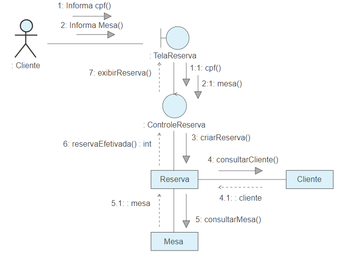
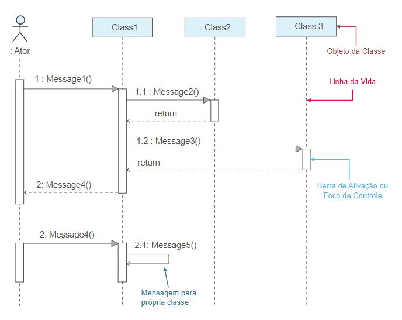
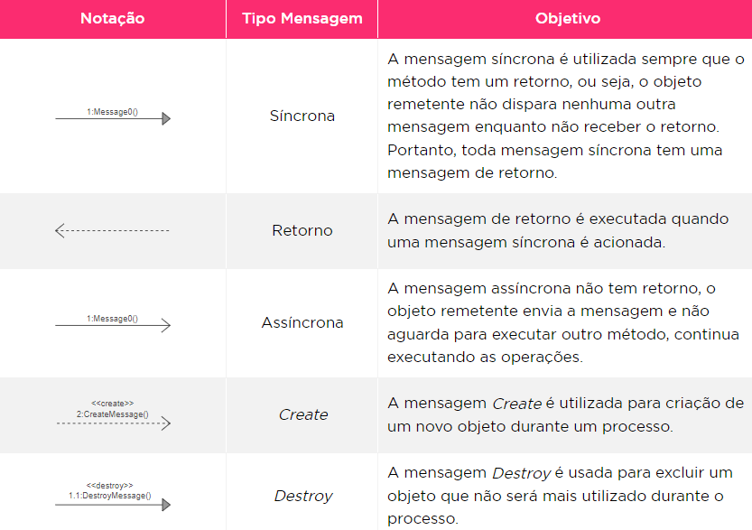
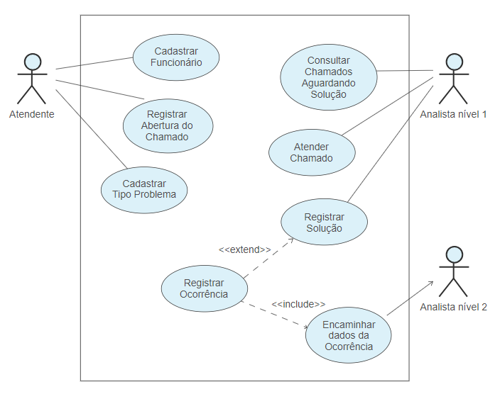
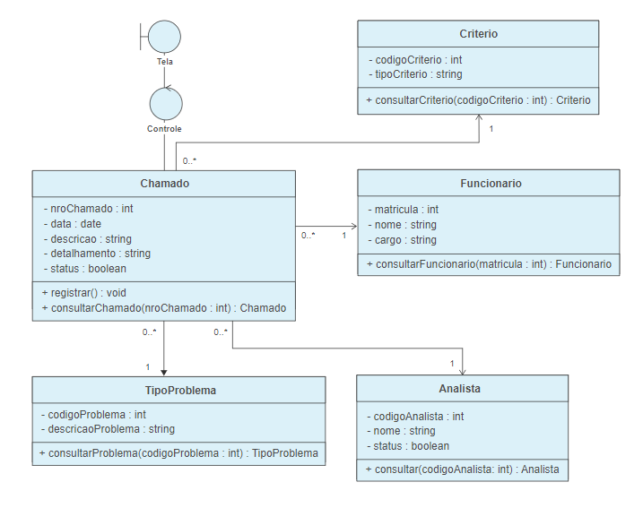
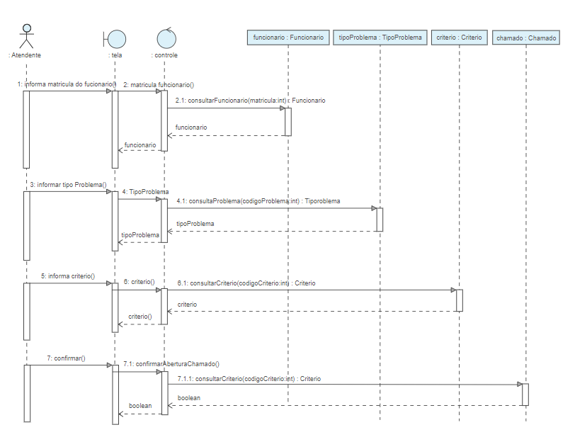

<h1>FASE 5 - OOP</h1>
<h2>Capítulo 07: Quando as partes conversam.</h2>

<h2>1. QUANDO AS PARTES CONVERSAM</h2>

## 1.1 Diagrama de Interação

- o Diagrama de Sequência será importante para entender como os objetos vão interagir com a troca de mensagens.
- `Diagramas de Interação`:
  - objetivos: 
    - demonstrar a relação dos objetos em determinado processo.
    - demonstrar o comportamento interno do sistema, auxiliando no esclarecimento dos casos de uso pela representação do funcionamento do processo por meio da troca de mensagens entre os objetos,
  - na versão 2.5 da UML, estão no grupo dos Diagramas de Interação: Diagrama de Visão Geral de Interação, Diagrama de Tempo, Diagrama de Comunicação e o Diagrama de Sequência. 
  - até a versão 1.5 da UML, o Diagrama de Comunicação era conhecido como Diagrama de Colaboração.

> Um `Diagrama de Interação` mostra uma interação formada por um conjunto de objetos e seus relacionamentos, incluindo as mensagens que poderão ser trocadas entre eles.

> O objetivo do `Diagrama de Sequência` é apresentar as interações entre os objetos na ordem temporal em que elas acontecem.

- ***diferenças*** entre o Diagrama de Sequência e o Diagrama de Comunicação é:

Diagrama de Comunicação | Diagrama de Sequência
------------------------|--------------------
- não existe a representação de tempo em que o objeto está sendo utilizado. | - é possível verificar claramente esse momento.
- não podemos demonstrar uma fragmentação do processo. | - é possível demonstrar uma fragmentação do processo.
- utilizado para modelar processos mais simples. | - o mercado utiliza muito mais o Diagrama de Sequência.

 
<em>Diagrama de Comunicação – Processo Reservar Mesa.</em>

- no exemplo acima, o cliente informa a mesa e o CPF, e a classe de controle inicia o processo para que a reserva troque mensagens com o cliente e a mesa para criar uma reserva.

---

## 1.2 Conceito de mensagem

- representa a requisição de um objeto remetente a um objeto receptor para que este último execute alguma operação definida para sua classe.
- a mensagem deve conter informação suficiente para que a operação do objeto receptor possa ser executada.
- é um estímulo utilizado para demonstrar quando um método é solicitado para que realize a sua operação dentro do processo.

---

## 1.3 Diagrama de Sequência

### 1.3.1 Conceito

- Diagrama de Sequência representa a ordem lógica da troca de mensagens entre os objetos de um caso de uso.
- demonstra o processamento a partir de solicitações e de execuções dos métodos entre os objetos.
- é um diagrama comportamental que procura determinar a sequência de eventos que ocorrem em um processo.
- ***é desenvolvido por caso de uso***!
- faz o papel da documentação de caso de uso, que pode ser utilizada para conferir a ocorrência do processo existente no caso de uso.
- nos projetos com muitos casos de uso, podem ser desenvolvidos os Diagramas de Sequência dos processos que tenham maior complexidade.

> como boa prática para um projeto, é ideal que a modelagem de classes seja realizada em conjunto com o Diagrama de Sequência, pois um diagrama complementa o outro!

### 1.3.2 Notação

- exemplo:

 
<em>Notação do Diagrama de Sequência.</em>

1. `Linha da vida`:

- sua criação está relacionada ao objeto participante do caso de uso.
- os objetos são representados por meio da linha da vida. 
- a notação da parte superior da linha da vida é a mesma aplicada aos objetos, e os objetos que podem ser representados são os de fronteira, controle e entidade.

2. `Barra de ativação ou controle`:

- ao receber uma mensagem, a linha da vida cria uma barra para demonstrar o processamento do objeto e indica os momentos em que o objeto é utilizado para executar os métodos encontrados no processo do caso de uso.
- indica os períodos em que um determinado objeto está participando ativamente do processo.
- ativada por meio do recebimento de uma mensagem.

3. `Tipos de mensagem`:

- a mensagem é representada por uma linha entre dois elementos.
- podem ser trocadas entre Ator com objeto e entre objetos.

 
<em>Tipos de mensagem.</em>

4. `Exemplo`:

- cenário: Controle de Chamados.
- para o Diagrama de Classe, desenvolvido o caso de uso Registrar Abertura do Chamado. Também fazer o Diagrama de Sequência dessa funcionalidade.
- Diagrama de Caso de uso:

 
<em>Diagrama de Caso de Uso para controle de chamados e soluções.</em>

- Diagrama de Classe:

 
<em>VCP (Visão de Classes Participantes) do caso de uso "Registrar Abertura do Chamado".</em>

- Diagrama de Sequência:

 
<em>Diagrama de Sequência do caso de uso “Registrar Abertura do Chamado”.</em>

- neste caso, o chamado é criado após concluir todas as trocas de mensagens. 
- foram utilizadas mensagens síncronas, e ao gravar o Chamado é retornada uma mensagem de confirmação (verdadeiro ou falso), para determinar se ele foi criado com sucesso.

> Observações:

- o Diagrama de Sequência pode ainda possuir `condição de guarda`, representadas dentro dos colchetes [Condição], utilizado para realizar verificações SE, CASO etc.
- em caso `loop`, este vem acompanhado da condição de guarda []. O loop pode ser utilizado em cenários que pedem a estrutura de repetição.
- quando é `criado um componente`, utilizamos &lt;&lt;create&gt;&lg;.
- `componente de destruição`: representado pelo X. 
- a interação com outros casos de uso permite a fragmentação do Diagrama de Sequência.
  - outro caso de fragmentação está relacionado ao desenvolvimento da sequência de troca de mensagens de acordo com a documentação de caso de uso, podendo ser construído um diagrama para o Fluxo Principal, outro para o Fluxo Alternativo ou para o Fluxo de Exceção. Estes dois últimos são desenvolvidos somente quando ocorre um conjunto considerável de mensagens entre os objetos.
- a `notação de interação` representa a existência de outras funcionalidades no sistema e que cada uma tem uma sequência, sendo representada, nesse diagrama, apenas pelas sequências agrupadas em uma referência, chamada de `interaction`.

---

## 1.4 Tutorial para modelar o Diagrama de Sequência

1. para criar um projeto, opção: File > New.
2. para criar o Diagrama de Sequência, menu Diagram > Sequence Diagram.
3. utilizar o botão da “Linha da Vida”. 
4. quando as classes estiverem prontas, clicar sobre elas, arrastá-las e soltá-las na área de desenvolvimento do diagrama.
5. qualquer outro elemento pode ser inserido na área de desenvolvimento do diagrama. 
6. as classes de Fronteira e Controle também podem ser arrastadas para o diagrama.
7. mensagens estão na barra de ferramentas; clicar sobre ela, deixar no ponto de origem em que deseja criar a mensagem, arrastar e soltar sobre o destino.
8. ao clicar na mensagem, a propriedade do lado esquerdo na parte inferior irá exibir as operações relacionadas à classe, quando houver.
9. para criar as operações, utilizamos a propriedade Operation.
10. ao selecionar a mensagem, clicar na Propriedade do lado esquerdo na parte inferior e pressionar Guard: esta é a condiçã guarda(Figura “Propriedade de condição de guarda”).
11. para criar uma situação de loop, utilizar o elemento CombinedFragment (alt, loop, opt...): cliar neste elemento, segurar e arrastar para a posição em que deseja colocar no diagrama.
    - a propriedade do lado esquerdo possui duas Abas: a Base e a Operand.
    - na Aba Base, alterar a propriedade Operator para loop.
    - na Aba Operand, insirerir a condição de Guard e informar o texto que deseja para a condição.
12. para criar um objeto temporário cuja instância será excluída após o processo:
    - clicar no elemento Lifeline da barra de ferramentas; o Astah irá criar um objeto.
    - com o novo Lifeline, usar a barra de ferramentas e clicar sobre “Create Message”.
    - clicar sobre o Create Message e arrastar até a barra de ativação em que deseja iniciar um novo objeto.

---

<h2>FAST TEST</h2>

### 1. De acordo com o estudo do capítulo, selecione a alternativa que contém o conceito de Diaframa de Interação.
> Demonstra o comportamento interno do sistema, auxiliando no esclarecimento dos casos de uso pela representação do funcionamento do processo por meio da troca de mensagens entre os objetos.

### 2. Representa a requisição de um objeto remetente a um objeto receptor para que esse último execute alguma operação definida para sua classe. Ela deve conter informação suficiente para que a operação do objeto receptor possa ser executada.
> Mensagem.

### 3. Analise o texto a seguir: "Representa a ordem lógica da troca de mensagens entre os objetos de um caso de uso, ou seja, demonstra o processamento a partir de solicitações e de execuções dos métodos entre os objetos". Qual é a alternativa que representa o conceito apresentado?
> Diagrama de Sequência.

--- 

[Voltar ao início!](https://github.com/monicaquintal/fintech)