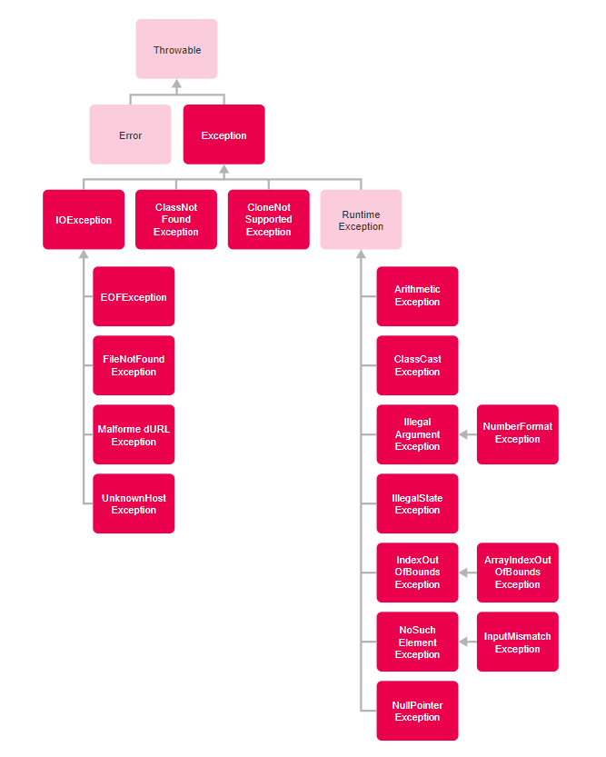

<h1>FASE 6 - MODEL</h1>
<h2>Capítulo 05: Exceções à regra.</h2>

<h2>1. EXCEÇÕES À REGRA</h2>

## 1.1 Introdução 

- capítulo dedicado a conceitos avançados de orientação a objetos e sua aplicabilidade em Java (possibilidade do polimorfismo, classes abstratas e o uso de exceções para tratar as falhas às quais todo software está sujeito).

## 1.2 Tratamento de exceções

- durante a execução de um programa, é possível que algumas exceções ou erros aconteçam.
- alguns dos problemas mais comuns: 
  - falha na aquisição de algum recurso, como abrir um arquivo, conectar com o banco de dados ou acessar um web service.
  - tentativa de realizar algo impossível, como a divisão de um número por zero, acessar uma posição que não existe em um array.
  - outras condições inválidas, como evocar um método de um objeto que não foi instanciado ou realizar um cast inválido.
- esses eventos não esperados geralmente interrompem o fluxo da execução do código.
- o tratamento de exceções permite verificar esses eventos (erros) e realizar uma ação sem prejudicar o fluxo do programa.
- em geral, o fluxo para o tratamento de exceções no Java ocorre em `três passos`:
  - ***uma exceção é lançada***: um comando do código dispara uma condição inesperada de erro.
  - ***a exceção é capturada***: em algum ponto do código, podemos adicionar um comando para capturar a possível exceção.
  - ***o tratamento de erro é realizado***: após a captura da exceção, o tratamento de erro adequado é executado.

> IMPORTANTE: Realizando o tratamento das exceções, o programa consegue continuar a execução normalmente. Exceções não capturadas provocam a finalização do programa.

## 1.3 Classificação

- uma exceção é um objeto do tipo Exception.
- no polimorfismo, um objeto desse tipo pode ser qualquer instância de uma subclasse de Exception.
- dentro da plataforma Java, podemos classificar as exceções em:
  - `Checked`: exceção que deve ser tratada ou relançada pelo desenvolvedor, geralmente herda da classe Exception. 
  - `Unchecked`: exceção que pode ser tratada ou relançada pelo programador. Essa exceção é gerada pelo código mal escrito. Caso a exceção não seja tratada, ela será automaticamente relançada. Geralmente, esse tipo de exceção herda de RuntimeException.
  - `Error`: erro crítico, utilizado pela JVM para indicar que existe um problema que não permite a continuação da execução do programa.

Classe | Objetivo | Erro
-------|----------|--------------
Error | Erro que não pode ser tratado na aplicação. Lançado pela JVM indicando que o programa não pode continuar a execução. | OutOfMemoryError: indica que não há memória suficiente na máquina para continuar a execução do programa.
Exception | Exceção que deve ser tratada pelo desenvolvedor. | ArithmeticException: indica que houve alguma operação aritmética inválida, exemplo: divisão por zero.
RuntimeException | Exceção que pode ser tratada pelo desenvolvedor. | NullpointerException: indica que há uma tentativa de acessar algum método ou atributo de uma classe que não foi instanciada.

- além das exceções existentes na plataforma, podemos criar as nossas próprias exceções, sejam elas checked (filhas de exception) ou unchecked(filhas de RuntimeException).
- hierarquia de classes de exceções do Java:

 

- a classe Throwable tem duas subclasses: Exception e Error
  - Exception é a classe base para as subclasses de exceções checked e unchecked, exceções que devem ou podem ser tratadas. 
  - Error é a base para as classes de exceções que não podem ser tratadas.
- `exceções mais comuns em Java`:

1. ***ArithmeticException***:

- exceção unchecked.
- ocorre quando alguma operação aritmética é inválida; operação esta que não pode ser resolvida, como é o caso da divisão de um número por zero.

2. ***ArrayIndexOutOfBoundsException***:

- exceção do tipo unchecked (o desenvolvedor não é obrigado a tratar a exceção).
- acontece quando tentamos acessar uma posição inválida de uma matriz ou vetor (array). 
  - uma posição inválida é uma posição que não existe (negativa ou valor igual ou maior que o tamanho do vetor). 
  - lembre-se: o índice do vetor sempre começa em zero, ou seja, não existe posição negativa e o último elemento de um array está posicionado no tamanho do vetor menos um.

3. ***NullpointerException***:

- é uma exceção unchecked, mais conhecida e comum durante o desenvolvimento.
- ocorre na tentativa de acessar um objeto que ainda não foi instanciado.
- exemplo: quando tentamos acessar o método size() de um ArrayList que ainda não foi instanciado. 

4. ***FileNotFoundException***:

- exceção checked.
- precisamos tratar quando tentamos acessar um arquivo que não foi encontrado.

5. ***NumberFormatException***:

- não precisa ser tratada (unchecked).
- ocorre quando tentamos transformar uma string inválida em algum tipo numérico. 

## 1.4 Captura e tratamento de exceções

- para tratar as exceções (checked ou unchecked) em tempo de execução, elas devem ser capturadas e tratadas. 
- o Java possui duas estruturas importantes para o tratamento de exceções: `try-catch` e `try-catch-finally`.
- essas estruturas têm a finalidade de separar o código que executa as tarefas desejadas das rotinas de tratamento das exceções.

~~~java
try {
  //Código
} catch(Excecao) {
  //Tratamento da exceção
}
~~~

- o `bloco try` tem um código que pode gerar uma exceção, ou seja, esse trecho de código será monitorado pela JVM. 
  - se um erro for gerado, o fluxo da execução será desviado para o bloco catch, para o tratamento do erro.
  - o uso do try indica que o código está tentando realizar algo “perigoso”, passível de erro. 
- o `bloco catch` só é executado se uma exceção for gerada. 
  - caso nenhuma exceção seja lançada, a execução pula o bloco catch e continua normalmente. 
  - se uma exceção for lançada, o bloco try é finalizado e o fluxo de execução procura por um bloco catch adequado para tratar a exceção.
  - depois de executar o bloco catch, a execução do programa continua na primeira instrução após o último bloco catch.
  - podemos adicionar vários blocos catch para capturar diferentes tipos de exceções:

~~~java
try {
  // Código
  } catch (Excecao1) {
    // Tratamento da exceção 1
  } catch (Excecao2) {
    //Tratamento da exceção 2
  } catch (Excecao3) {
    //Tratamento da exceção 3
}
~~~

- os catches são testados de cima para baixo, um por um, até que o catch apropriado seja executado, por isso as exceções mais específicas devem ser colocadas nos primeiros catches, sempre obedecendo à ordem das exceções mais específicas para as mais genéricas.
- a `exceção Exception` é a mais genérica possível, pois todas as exceções (checked ou unchecked) são filhas dela. 
  - portanto, a captura dessa exceção deve ser colocada no último catch, pois ela captura qualquer tipo de exceção que for lançada.
  - se nenhum catch conseguir capturar a exceção lançada, ela não será tratada, como se não existisse o bloco try-catch.
  - exemplo:

~~~java
Scanner sc= new Scanner(System.in);
//Lê os dois números
int numero1 = sc.nextInt();
int numero2 = sc.nextInt();
//Realiza a divisão
int divisao = numero1/numero2;
//Exibe o resultado
System.out.println("O resultado é: "+ divisao);
sc.close();
~~~

- código é simples, porém pode lançar uma exceção, caso o segundo número informado pelo usuário seja zero; caso isso aconteça, o erro gerado será:

~~~
2
0
Exception in thread "main" java.lang.ArithmeticException: / by zero
at br.com.fiap.tds.View.main(View.java:16)
~~~

- a `exceção ArithmeticException` foi lançada, pois não é possível realizar uma divisão por zero! 
- essa exceção é unchecked, já que não fomos obrigados a tratá-la.
- realizando alteração no código, para realizar o tratamento da exceção:

~~~java
Scanner sc = new Scanner(System.in);
// Lê os dois números
int numero1 = sc.nextInt();
int numero2 = sc.nextInt();

try {
  // Realiza a divisão
  int divisao = numero1 / numero2;
  // Exibe o resultado
System.out.println("O resultado é: "+ divisao);
} catch(ArithmeticException e) {
  System.err.println("Erro ao dividir por zero!");
}
sc.close();
~~~

- neste caso, o bloco try-catch captura a exceção: caso o usuário insira um divisor igual a zero, a divisão vai gerar a ArithmeticException. 
- assim, o fluxo da execução será desviado para o bloco catch, e a linha do código que exibe o resultado não será executada; o tratamento de exceção previsto no catch para o erro consiste na apresentação da mensagem Erro ao dividir por zero, retornando:

~~~
2
0
Erro ao dividirpor zero!
~~~

- se o programa rodar sem lançar exceção (se o usuário informar o dividendo diferente de zero), o resultado da divisão será exibido e o bloco catch não será executado.
- dentro do bloco catch, podemos recuperar a exceção gerada, por meio do parâmetro; `no exemplo dado, a exceção é recuperada no parâmetro com o nome "e"`.
- A `classe Throwable` possui alguns métodos que podem exibir informações dos erros gerados, então, por herança, a exceção ArithmeticException também tem estes métodos:
  - ***printStackTrace()***:
    - imprime a pilha de erro encontrada na exceção.
    - nesta pilha, podemos verificar o número da linha e a classe na quala exceção foi gerada.
  - ***getMessage()***:
    - retorna uma mensagem contendo a lista de erros armazenados em uma exceção.
- resultado retornado pelo método printStackTrace e a mensagem de erro da exceção:

~~~java
int[] array = new int[2];
try {
  //Tentaa cessar uma posição inexistente do vetor 
  array[2] = 10;
} catch (ArrayIndexOutOfBoundsException e) {
  System.err.println("Mensagem de erro: "+ e.getMessage());
  e.printStackTrace();
}
~~~

- a exceção é gerada quando tentamos acessar uma posição inválida de um array: ArrayIndexOutOfBoundsException.
- no bloco catch, utilizamos os métodos getMessage() e printStackTrace(), resultando em:

~~~
Mensagem de erro: 2
java.lang.ArrayIndexOutOfBoundsException: 2
at br.com.fiap.tds.View.main(View.java:10)
~~~

- a mensagem tem o valor do índice inválido que tentamos acessar no array. 
- o método printStackTrace imprime o rastro da pilha e exibe a exceção, a classe e a linha que gerou a exceção: View.java:10. Classe View, linha 10.
- utilizamos o `System.err` para exibir a mensagem de erro:
  - é uma classe utilizada para exibir os erros em um programa Java.
  - podemos enviar o fluxo de saída para um arquivo de log, enquanto o fluxo de saída padrão de um System.out é a tela da aplicação.
  - além do try-catch, podemos utilizar o bloco try-catch-finally para tratar as exceções.
  - o terceiro bloco finally é opcional e utilizado sempre que precisamos executar um código, independentemente de ter ou não acontecido uma exceção.
    - se uma exceção for lançada: o fluxo de execução passa do bloco try para o bloco catch adequado e, após a sua execução, o bloco finally será processado.
    - se não for gerado uma exceção: após executar todo o bloco try, o bloco finally será processado.
  - exemplo:

~~~java
try {
  //Fluxo normal que pode gerar uma exceção
} catch (Exception e) {
  //Fluxo alternativo, para tratamento da exceção
} finally {
  //Fluxo normal, que sempre será executado
}
~~~

- um exemplo clássico da utilização do bloco finally é o fechamento da conexão com o banco de dados (sempre devemos fechar a conexão, independentemente da concretização ou não da operação no banco).
- voltando ao primeiro exemplo, vamos tratar as exceções de divisão por zero e entrada de dados inválida, quando o usuário digita um número inválido; também vamos adicionar um bloco finally para exibir uma mensagem para o usuário e fechar o objeto scanner:

~~~java
Scanner sc = new Scanner(System.in);
try {
  // Lê os dois números
  int numero1 = sc.nextInt();
  int numero2 = sc.nextInt();
  // Realiza a divisão
  int divisao = numero1 / numero2;
  // Exibe o resultado
  System.out.println("O resultado é: "+ divisao);
} catch (ArithmeticException e) {
  System.err.println("Erro ao dividir por zero!");
} catch (InputMismatchException e) {
  System.err.println("Erro de entrada de dados!");
} finally {
  System.out.println("Finalizando a execução do programa!");
  sc.close();
}
~~~

- portanto, há 3 possíveis fluxos de execução:

1. Sem gerar exceção, a saída será: 

~~~
2
2
O resultado é: 1
Finalizando a execução do programa!
~~~

2. Em exceção causada pela divisão por zero, a saída será:

~~~
2
0
Erro ao dividir por zero!
Finalizando a execução do programa!
~~~

3. Em exceção causada pelo valor inserido inválido, a saída será:

~~~
a
Erro de entrada de dados!
Finalizando a execução do programa!
~~~

> Observe que todos os fluxos sempre executam o bloco finally!

## 1.5 Propagação de exceções – Throws

- umm método pode optar por não tratar a exceção e simplesmente propagá-la, ou melhor, delegá-la para o método que a chamou.
- podemos notificar o método que invocou outro método em que alguma exceção ocorreu.
- exemplo: criar uma classe chamada Calculadora que será responsável por implementar as operações aritméticas, entre eles a divisão.

~~~java
public class Calculadora {
  public int dividir (int n1, int n2) {
    return n1/n2;
  }
}
~~~

- esse método pode lançar uma exceção, caso o valor de n2 seja zero. 
- podemos utilizar o try-catch para tratar a exceção, porém quem chamar o método dividir não saberá se a operação ocorreu de forma correta ou se aconteceu algum erro.

~~~java
public int dividir (int n1, int n2) {
  try {
    return n1/ n2;
  } catch (ArithmeticException e) {
    e.printStackTrace();
  }
  return 0;
}
~~~

- nesse exemplo, quando o método dividir for acionado e o usuário informar para n2 o valor zero, internamente, no método dividir, será feito o tratamento do erro e ele retornará para o ambiente de chamada o valor zero e, nesse caso, o usuário não será informado sobre a ocorrência do erro!!!
- logo, ***a melhor maneira de tratar a exceção é não a tratar***; no caso, somente propagar a exceção, notificando ao ambiente de chamada que algum problema aconteceu na execução: adicionar na assinatura do método o throws, com a exceção que queremos propagar!

~~~java
public int dividir (int n1, int n2) throws Exception {
  return n1 / n2;
}
~~~

- um método pode propagar mais de um tipo de exceção.
- para isso, adicionar as exceções separadas por vírgula.

~~~java
public void gravarArquivo (String valor) throws SecurityException, FileNotFoundException, IOException {
  //Código...
}
~~~

- portanto, ***a cláusula throws declara exceções que podem ser lançadas em determinados métodos***.
- é uma vantagem para os devs, pois deixamos de modo explícito os eventuais erros que podem ocorrer na chamada do método, permitindo que o tratamento adequado para o erro seja implementado.
- podemos também lançar uma nova exceção nesse método, utilizando o comando throw:

~~~java
public void depositar (double valor) {
  if (valor < 0) {
    throw newIllegalArgumentException();
  } 
  saldo = saldo + valor;
}
~~~

- no exemplo, estamos validando se o valor depositado é maior do que zero. 
  - em caso positivo, o valor é adicionado ao saldo.
  - caso contrário, uma exceção do tipo IllegalArgumentException será lançada, o que indica que o valor passado como parâmetro para o método é inválido.
- não foi preciso adicionar o throws na assinatura do método, pois essa exceção é unchecked. Caso a exceção seja checked, é necessário declará-la na assinatura do método!

~~~java
public void sacar (double valor) throws Exception {
  if (valor > saldo) {
    throw new Exception ("Saldo insuficiente");
  }
  saldo = saldo - valor;
}
~~~

- o método acima valida se o valor a ser retirado é maior do que o valor do saldo. 
- caso o valor do saldo seja insuficiente, uma exceção será lançada (foi necessário adicionar o throws na assinatura do método, para que, quem chamar o método sacar possa tratar a exceção ou lançá-la novamente).

~~~java
public static void main (String[] args) {
  // Cria uma nova instância de Conta
  Conta c = new Conta();
  try {
    // Saca
    c.sacar(100);
  } catch (Exception e) {
    e.printStackTrace();
  }
  // Deposita
  c.depositar(200);
}
~~~

- após criar um novo objeto conta, chamamos o método sacar e, como lança uma exceção checked, precisamos tratá-la ou lançá-la.
  - nesse caso, optamos por tratar a exceção com o bloco try-catch.
- já o método depositar lança uma exceção unchecked, não sendo obrigados a tratá-la. 
  - porém, se uma exceção ocorrer, ela será relançada automaticamente pelo método main, que imprimirá o erro no console!

## 1.6 Criação de exceções

- é possível também criar as nossas próprias classes de exceções. 
- exemplo "Método sacar":
  - lança a exceção mais genérica possível (Exception). 
  - para melhorar o uso das exceções e não utilizar uma exceção que serve para tudo, podemos criar uma exceção específica para o erro que pode acontecer.
- para criar uma exceção, criar uma classe que herde de Exception(checked) ou RuntimeException (unchecked).
- vamos criar nossas exceções: uma para identificar que o valor de saque é inválido e outra para dizer que o saldo da conta é insuficiente.
  - a primeira exceção será unchecked (vai descender de RuntimeException). Por padrão, as exceções no Java terminam com Exception.

~~~java
public class ValorInvalidoException extends RuntimeException {
  // ...
}
~~~

- para utilizá-la, modificar o método sacar para que lance a exceção customizada:

~~~java
public void depositar (double valor) {
  if (valor < 0) {
    throw new ValorInvalidoException();
  }
  saldo = saldo + valor;
}
~~~

- agora vamos criar uma exceção checked que verifique se o saldo é insuficiente:

~~~java
public class SaldoInsuficienteException extends Exception{
  // ...
}
~~~

- para utilizá-la, podemos relançá-la, não nos esquecendo de modificar o throws na assinatura do método:

~~~java
public void sacar (double valor) throws SaldoInsuficienteException {
  if (valor > saldo) {
    throw new SaldoInsuficienteException();
  }
  saldo = saldo - valor;
}
~~~

- nos exemplos anteriores, criamos exceções checked e unchecked para ilustrar nossos exemplos, mas nada impede de elaborar somente um tipo de exceção para a classe Conta. 
- ***procure sempre utilizar as exceções customizadas com informações do motivo do erro!***

## 1.7 Acesso a arquivos

--- 

[Voltar ao início!](https://github.com/monicaquintal/fintech)