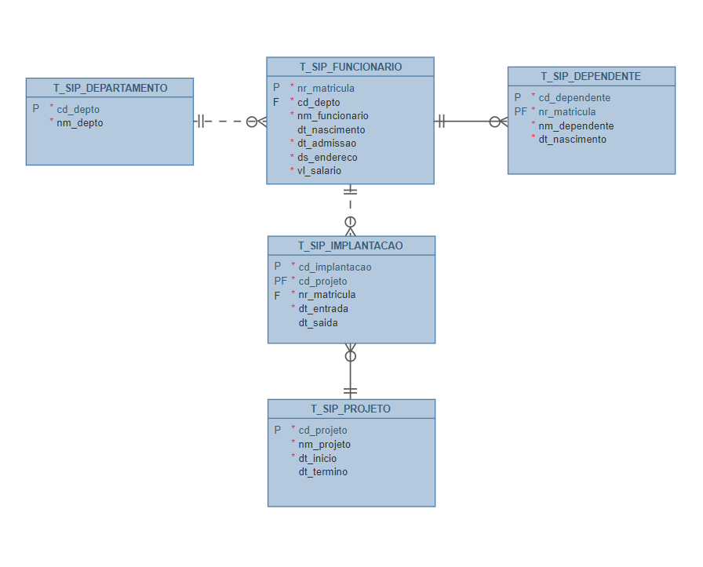
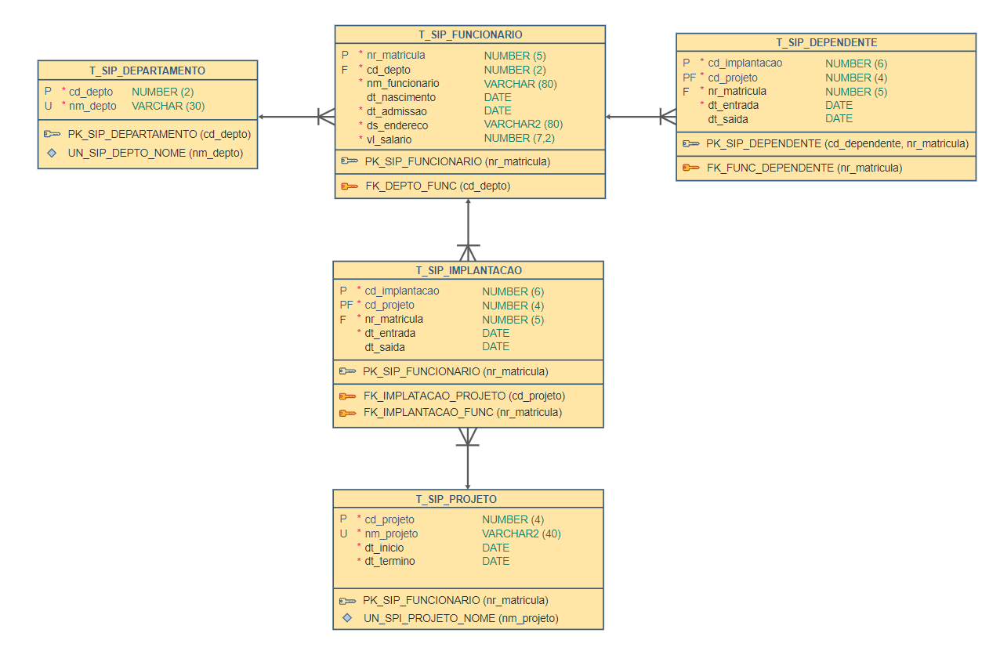

<h1>FASE 6 - MODEL</h1>
<h2>Capítulo 06: Armazenando e manipulando informações no banco.</h2>

<h2>1. ARMAZENANDO E MANIPULANDO INFORMAÇÕES NO BANCO</h2>

## 1.1 Linguagem SQL – Manipulação de dados

- na linguagem SQL, há instruções que permitem manipular os dados de um banco de dados, epertencem à divisão `DML` (Data Manipulation Language) da linguagem.
- são operações de manutenção de um banco de dados:
  - inclusão ou inserção de dados em uma tabela.
  - alteração ou atualização de dados em uma tabela.
  - exclusão ou deleção de dados em uma tabela.
- após a implementação da estrutura de um banco de dados, o passo seguinte é popular esse banco.

### 1.1.1 Inclusão ou inserção de dados

- `comando INSERT`:

~~~sql
INSERT INTO <nome-tabela> 
	[(<nome-coluna>, <nome-coluna>,...)]
VALUES 
	([<conteúdo>], [<conteúdo>], ...);
~~~

- a lista de colunas pode ser omitida na declaração do comando.
- existem algumas situações que podem ocasionar erros durante a inserção de dados:
  - ***violação de Chave Primária***: é um campo que deve receber um valor único; se houver tentativa de inserção de valor repetido, ocasionará violação de Chave Primária.
  - ***violação de UNIQUE CONSTRAINT***: o campo UNIQUE deve receber um valor que não se repete em outros registros (único).
  - ***valor informado excede o tamanho de coluna***.
  - ***tipo de dado incompatível com a coluna*** (caracteres em coluna).
  - ***violação de CHECK CONSTRAINT***: tentativa de inserção de um valor que está em desacordo com a validação imposta pelo uso de CHECK.
  - ***violação de Chave Estrangeira***: quando há tentativa de inserir um registro filho que não tem correspondente na tabela de origem (pai).
  - ***violação de Not Null***: quando um campo de preenchimento obrigatório deixa de ser preenchido.

### 1.1.2 Alteração ou atualização de dados

- `comando UPDATE`: faz parte da DML.

~~~sql
UPDATE <nome-tabela>
SET <nome-coluna> = <novo conteúdo para o campo>
  [,<nome-coluna> = <novo conteúdo para o campo>]
[WHERE <condição>]
~~~

- as situações de erro que foram vistas para a instrução INSERT também se aplicam ao UPDATE.

### 1.1.3 Exclusão ou deleção de dados

- `comando DELETE`: faz parte da divisão DML.

~~~sql
DELETE FROM <nome-tabela>
	[WHERE <condição>]
~~~

- se tentarmos excluir um registro que possui registros filhos, ocasionará uma violação de Chave Estrangeira (na tentativa de excluir um registro que tem um campo Chave Primária, que é Chave Estrangeira em outra tabela).

## 1.2 COMMIT E ROLLBACK

- `transação`: conjunto de instruções para realização de uma operação completa no banco de dados, e deve respeitar o princípio ACID.
  - **Atomicidade (Atomicity)**: Atômico, tudo (commit) ou nada (rollback).
  - **Consistência (Consistency)**: toda transação executada deve seguir as regras de integridade do BD, mantendo a consistência da base de dados.
  - **Isolamento (Isolation)**: garante que nenhuma transação seja interferida por outra até que a primeira seja completada.
  - **Durabilidade (Durability)**: garante que as informações gravadas no banco de dados durem de forma imutável até que outra transação de atualização ou remoção as afete.

- o controle de transações pode ser realizado utilizando as instruções:
  - `COMMIT`: efetiva as atualizações no banco de dados (inserção, atualização ou exclusão de registros).
  - `ROLLBACK`: desfaz as operações que não tenham sido efetivadas no banco de dados ainda.

## 1.3 Exemplificação dos comandos DML

- para ilustrar o uso dos comandos DML, utilizar o Estudo de Caso “SIP - SISTEMA DE CONTROLE DE IMPLANTAÇÃO DE PROJETOS”.

### 1.3.1 Apresentação do Estudo de Caso

Regras de Negócio:
- RN01 – Um funcionário possui apenas um endereço residencial.
- RN02 – Um funcionário pode ter um ou mais dependentes (filhos, esposa ou marido).
- RN03 – Um funcionário tem apenas uma data de admissão.
- RN04 – Um funcionário deve pertencer a um único departamento.
- RN05 – Um funcionário possui um único número de matrícula.
- RN06 – Um funcionário pode participar da implantação de um ou mais projetos.
- RN07 – Um departamento pode locar vários funcionários.
- RN08 – Um projeto pode ser implantado por vários funcionários.
- RN09 – Cada dependente deve ter uma datade nascimento.
- RN10 – Cada dependente pertence a um único funcionário.
- RN11 – Um funcionário pode participar da implantação de um mesmo projeto várias vezes, ou seja, um funcionário pode participar da implantação de um projeto em diferentes momentos.
- RN12 – Não será considerada a hipótese de termos um casal trabalhando na mesma empresa, pois eles teriam dependentes comuns.

### 1.3.2 Modelo de dados lógico

<em>Modelo de dados lógico do Estudo de Caso “SIP - SISTEMA DE CONTROLE DE IMPLANTAÇÃO DE PROJETOS”.</em>
 

### 1.3.3 Modelo de Dados Físico ou Relacional

<em>Modelo de dados físico/relacional do Estudo de Caso “SIP - SISTEMA DE CONTROLE DE IMPLANTAÇÃO DE PROJETOS”.</em>
 

### 1.3.4 Exemplo de comando INSERT

### a) Inserir registros ou linhas na tabela “DEPARTAMENTO”:

~~~sql
-- INSERINDO DADOS NA TABELA DEPARTAMENTO
INSERT INTO T_SIP_DEPARTAMENTO VALUES (1,'FINANCEIRO');
 
INSERT INTO T_SIP_DEPARTAMENTO 
	(cd_depto, nm_depto) VALUES (2, ‘MARKETING');
~~~

- podemos realizar a inserção informando ou não as colunas.
  - quando as colunas não são listadas, os valores informados serão inseridos conforme a ordem (o desenvolvedor precisa conhecer a ordem das colunas).
  - quando listamos as colunas, os dados serão incluídos conforme a ordem declarada no comando.
- valores contendo cadeia de caracteres e datas devem ser informados entre apóstrofos.

### b) Para visualizar a inserção realizada:

~~~sql
SELECT * 
FROM T_SIP_DEPARTAMENTO;
~~~

- na sintaxe do comando SELECT, o asterisco (*) equivale a todas as colunas da tabela “DEPARTAMENTO”.
- após incluir informações, aplicar o comando COMMIT para que a inserção física seja realizada; caso contrário, ao fechar a ferramenta, as informações inseridas serão perdidas!

### 1.3.5 Exemplo de comando INSERT com subquery

- uma instrução DML pode utilizar o resultado de uma subconsulta.
- exemplo: realizar uma operação para inserir todas as linhas da tabela “DEPARTAMENTO” que serão copiadas na“DEPARTAMENTO_TEMP”.

~~~sql
-- COPIANDO LINHAS DE UMA TABELA PARA OUTRA
INSERT INTO T_SIP_DEPARTAMENTO_TEMP
	 (cd_depto, nm_depto) 
 (SELECT cd_depto, nm_depto FROM T_SIP_DEPARTAMENTO);
~~~

- para visualizar o resultado da inserção:

~~~sql
SELECT * FROM T_SIP_DEPARTAMENTO_TEMP;
~~~

- observação: para realizar o teste, é necessário criar a tabela “T_SIP_DEPARTAMENTO_TEMP” com a mesma estrutura da tabela “T_SIP_DEPARTAMENTO”.

### 1.3.6 Exemplo de comando INSERT, manipulando datas e números decimais

- ao inserir linhas que contenham colunas que recebem valores de data, normalmente utilizamos a `função TO_DATE()` para informar a data e o formato que está sendo enviada ao SGBD.
- para inserção de valores decimais, geralmente informamos o valor a ser armazenado, utilizando o ponto decimal.
- exemplo: comando INSERT para inserir registros na tabela “FUNCIONARIO”:

~~~sql
-- Inserindo DATA e números DECIMAIS
INSERT INTO T_SIP_FUNCIONARIO
	(nr_matricula, cd_depto, nm_funcionario,
 	  dt_nascimento, dt_admissao,
      ds_endereco, vl_salario) 
    VALUES (1234,1,'ANA MARIA', 
        TO_DATE('10/02/1986','DD/MM/YYYY'),
        TO_DATE('09/08/2010','DD/MM/YYYY'),
        'R. DARIO PEREIRA, 23', 1234.56);
~~~

- visualizando a inserção realizada:

~~~sql
SELECT * 
FROM T_SIP_FUNCIONARIO;
~~~

### 1.3.7 Exemplo de comando INSERT com colunas opcionais

- para inserção de colunas opcionais, podemos informar `“NULL”` como valor para a coluna opcional quando ela não receber valores.
- exemplo: comando INSERT para inserir registros na tabela “FUNCIONARIO” (a coluna “dt_nascimento” é opcional, podendo informar valor “NULL” no momento da inserção).

~~~sql
-- Inserindo valor NULL para colunas opcionais
INSERT INTO T_SIP_FUNCIONARIO
	( nr_matricula, cd_depto, nm_funcionario,
 	  dt_nascimento, dt_admissao,
      ds_endereco, vl_salario ) 
    VALUES ( 1235,1, 'JOANA', NULL,
             TO_DATE('19/03/2012','DD/MM/YYYY'),
        'R. DARIO PEREIRA, 23', 1098.00);
~~~

- visualizando a inserção realizada:

~~~sql
SELECT * 
FROM T_SIP_FUNCIONARIO;
~~~

- outra forma de realizar a inserção é omitindo as colunas opcionais (coluna “dt_nascimento”).

~~~sql
-- Inserindo valor NULL para colunas opcionais
INSERT INTO T_SIP_FUNCIONARIO
	( nr_matricula, cd_depto, nm_funcionario,
 	  dt_admissao, ds_endereco, vl_salario ) 
    VALUES ( 1236,1, 'JOANA',
             TO_DATE('19/03/2012','DD/MM/YYYY'),
        'R. DARIO PEREIRA, 23', 1098.00);
~~~

### 1.3.8 Exemplo de comando UPDATE

- ao utilizar o comando UPDATE, não é obrigatório informar uma condição para atualização. Porém, se isso não for feito, todas as linhas das tabelas serão afetadas!!!
- ***é muito importante o uso de uma condição para estabelecer as linhas que deverão sofrer a alteração***.
- exemplo: apenas o nome do departamento de código igual a 2 será alterado.

~~~sql
-- ATUALIZANDO OS DADOS NA TABELA 
-- DEPARTAMENTO (TEMPORÁRIA)
UPDATE T_SIP_DEPARTAMENTO_TEMP
   SET NM_DEPTO='TESTANDO ATUALIZAÇÃO'
 WHERE CD_DEPTO=2;
~~~

- visualizando a alteração realizada:

~~~sql
SELECT * 
FROM T_SIP_DEPARTAMENTO_TEMP;
~~~

### 1.3.9 Exemplo de comando UPDATE com subquery

- o comando UPDATE também aceita o uso de subconsultas. 
- exemplo: o nome do departamento de código igual a 6 da tabela “DEPARTAMENTO_TEMP” terá o mesmo nome do departamento de código igual 1 da tabela “DEPARTAMENTO”.

~~~sql
-- ATUALIZANDO OS DADOS NA TABELA 
-- DEPARTAMENTO (TEMPORÁRIA)
UPDATE T_SIP_DEPARTAMENTO_TEMP
 SET NM_DEPTO =
   (SELECT NM_DEPTO FROM T_SIP_DEPARTAMENTO WHERE CD_DEPTO=1)
WHERE CD_DEPTO=2;
~~~

- subquery: comando SELECT (consulta), em que recuperamos o nome do departamento de código igual a dois da tabela “DEPARTAMENTO”.
- visualizando a alteração:

~~~sql
SELECT * FROM T_SIP_DEPARTAMENTO_TEMP;
~~~

### 1.3.10 Exemplo de comando UPDATE com cálculos

- exemplo: o salário dos funcionários será reajustado em 10%; o cálculo é baseado no valor existente no campo “VL_SALARIO”, acrescido de 10%.

~~~sql
-- ATUALIZAÇÃO DE UMA COLUNA COM BASE NELA MESMA.
-- AUMENTO DE TODOS OS SALÁRIOS EM 10%.
UPDATE 	T_SIP_FUNCIONARIO
  SET 	VL_SALARIO = VL_SALARIO * 1.10;
~~~

- não há cláusula WHERE no comando UPDATE., fazendo com que todos os salários armazenados sejam alterados.
- para visualizar a alteração realizada:

~~~sql
SELECT * 
FROM T_SIP_FUNCIONARIO;
~~~

### 1.3.11 Exemplo de comando UPDATE com alteração de várias colunas

- podemos atualizar os dados de várias colunas de um registro:

~~~sql
-- ATUALIZAÇÃO DE VÁRIAS COLUNAS.
-- OS CAMPOS ALTERADOS SÃO SEPARADOS POR VÍRGULA.
 UPDATE 	T_SIP_FUNCIONARIO
	SET 	NM_FUNCIONARIO = 'MARIA DAS DORES',
    DT_ADMISSAO = TO_DATE('20/05/2014', 'DD/MM/YYYY'),
    DS_ENDERECO = 'RUA DA VEIGA, 97',
    VL_SALARIO = 3245.98
  WHERE NR_MATRICULA=1236;
~~~

- para visualizar a alteração realizada:

~~~sql
SELECT * 
FROM T_SIP_FUNCIONARIO;
~~~

### 1.3.12 Exemplo de comando UPDATE com operadores lógicos e relacionais

- as condições utilizadas na cláusula WHERE podem ser estabelecidas com o uso de operadores lógicos e/ou relacionais.
- exemplo: a instrução a seguir estabelece o reajuste do salário em 5% de todos os funcionários admitidos a partir de 01/03/2012 e que possuem remuneração inferior a R$ 1.700,00.

~~~sql
-- ATUALIZAÇÃO UTILIZANDO OPERADORES LÓGICO E RELACIONAL.
 UPDATE T_SIP_FUNCIONARIO
	SET VL_SALARIO = VL_SALARIO * 1.05
  WHERE DT_ADMISSAO >= TO_DATE ('01/03/2012', 'DD/MM/YYYY')
    AND VL_SALARIO < 1700.00 ;
~~~

- para visualizar a alteração realizada:

~~~sql
SELECT * 
FROM T_SIP_FUNCIONARIO;
~~~

### 1.3.13 Exemplo de comando DELETE

- no comando DELETE, o uso de condições é opcional; porém, caso não seja estabelecida uma condição, todas as linhas da tabela serão excluídas.
- exemplo:

~~~sql
-- EXCLUINDO OS DADOS NA TABELA. 
-- DEPARTAMENTO (TEMPORÁRIA).
DELETE FROM T_SIP_DEPARTAMENTO_TEMP
  WHERE CD_DEPTO = 2;
-- apenas o nome do departamento de código = 2 será excluído.
~~~

- para visualizar a exclusão realizada:

~~~sql
SELECT * 
FROM T_SIP_DEPARTAMENTO_TEMP;
~~~

---

## FAST TEST

### 1. O que compõe o princípio ACID?
> Atomicidade, Consistência, Isolamento e Durabilidade.

### 2. Se executarmos o comando DELETE sem nenhuma cláusula WHERE, o resultado será:
> Todas as linhas da tabela serão apagadas.

### 3. A frase "Representa a confirmação de uma transação no banco" melhor descreve o comando:
> COMMIT.

### 4. No Oracle, qual a função utilizada para manipulação de datas?
> TO_DATE.

### 5. Ao inserir dados em uma tabela, qual erro podemos receber durante a execução do comando?
> Todas as anteriores.

--- 

[Voltar ao início!](https://github.com/monicaquintal/fintech)