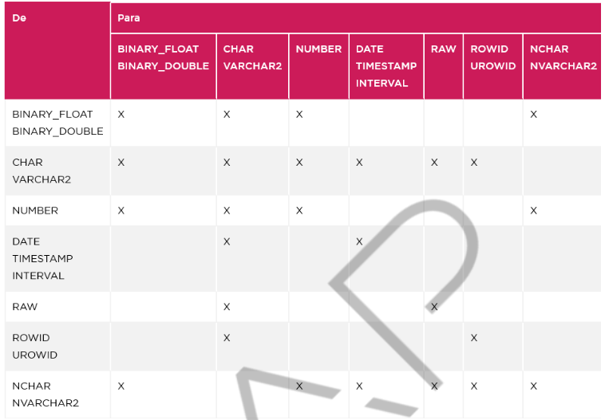

<h1>FASE 6 - MODEL</h1>
<h2>Capítulo 07: Consulte o oráculo.</h2>

<h2>1. CONSULTE O ORÁCULO</h2>

- com o SQL, também podemos recuperar os dados armazenados e realizar operações com eles, utilizando o comando SELECT.
- essas operações permitem construir consultas capazes de responder às diversas demandas do negócio.

## 1.1 Recuperação de dados

- na linguagem SQL, as `consultas (queries)` são instruções que permitem recuperar os dados de tabelas de um BD, e pertencem à divisão DRS (Data Retrieve Statement) ou DQL (Data Query Language).
- são operações de recuperação de dados de tabelas:
  - SELECT simples.
  - SELECT com operadores.
  - SELECT a partir de junções.
  - SELECT a partir de agrupamentos.
- para recuperarmos os dados das tabelas, utilizamos o `comando SELECT`.

~~~sql
SELECT [ DISTINCT | ALL] { * | coluna  [, coluna, … ] }
  FROM tabela
  WHERE condição
  ORDER BY coluna [, coluna, ...]
~~~

- em que:
  - SELECT: especifica as colunas (campos) necessárias para a pesquisa.
  - DISTINCT: não mostra eventuais valores repetidos de colunas.
  - ALL: mostra todos os valores, mesmo que repetidos. É O PADRÃO, se o DISTINCT não for definido.
  - * (asterisco): indica que devem ser mostradas todas as colunas da tabela.
  - FROM: indica em que tabelas serão efetuadas essas pesquisas.
  - WHERE: condição para que se execute a pesquisa (filtra dados).
  - ORDER BY: especifica em que ordem deverá ser apresentada a pesquisa desejada e por qual campo estará ordenada (crescente ou decrescente).

> Para exemplificar o uso do SELECT, utilizaremos o Estudo de Caso: SIP - SISTEMA DE CONTROLE DE IMPLANTAÇÃO DE PROJETOS.

## 1.2 Exemplos de comando SELECT

- comando SELECT para recuperar registros ou linhas na tabela “FUNCIONARIO”: retornará todas as colunas (*) e todas as linhas (não há condições) da tabela “FUNCIONARIO”.

~~~sql
SELECT * FROM T_SIP_FUNCIONARIO;
~~~

> Não é uma boa prática utilizar a cláusula SELECT *, pois todas as colunas serão retornadas. É importante recuperar apenas as colunas realmente necessárias, ou seja, que serão utilizadas.

- neste exemplo, as colunas a serem retornadas são declaradas na cláusula SELECT:

~~~sql
SELECT NR_MATRICULA ,
  CD_DEPTO ,
  DT_ADMISSAO ,
  VL_SALARIO
  FROM T_SIP_FUNCIONARIO;
~~~

- no próximo exemplo, além de selecionar as colunas, acrescentaremos um filtro que recuperará apenas as linhas que satisfazem a condição:

~~~sql
SELECT NR_MATRICULA ,
  CD_DEPTO ,
  DT_ADMISSAO ,
  VL_SALARIO
FROM T_SIP_FUNCIONARIO
WHERE CD_DEPTO = 3;
~~~

- a instrução `SELECT DISTINCT` é usada para retornar valores distintos: o comando SELECT retornará apenas as colunas declaradas com valores distintos e todas as linhas da tabela “FUNCIONARIO”:

~~~sql
SELECT 	DISTINCT CD_DEPTO 
  FROM 	T_SIP_FUNCIONARIO;
~~~

- no exemplo a seguir, o comando SELECT retornará apenas colunas declaradas com valores distintos, considerando-se colunas declaradas cd_depto e dt_admissao, e todas as linhas da tabela “FUNCIONARIO”:

~~~sql
SELECT DISTINCT CD_DEPTO, DT_ADMISSAO 
  FROM T_SIP_FUNCIONARIO;
~~~

## 1.4 Operadores relacionais

- são utilizados para realizar comparações, por exemplo, entre valores e valores, campos e valores, ou campos e campos, além de serem usados também em estruturas de controle.

Operador | Significado | Exemplo
----------|------------|---------------
= | Igual | codigo = 2
&lt; | Menor que | preco < 10
&lt;= | Menor ou igual a | preco <= 10
&gt; | Maior que | preco > 10
&gt;= | Maior ou igual a | preco >= 10
&lt;&gt; ou != | Diferente | codigo <> 2

- exemplo: recuperados funcionários com salário maior que R$ 1.500,50.

~~~sql
-- Exemplo de filtro com números
SELECT 	NR_MATRICULA ,
        NM_FUNCIONARIO,
        VL_SALARIO
  FROM 	T_SIP_FUNCIONARIO
  WHERE VL_SALARIO > 1500.50 ;
~~~

- exemplo: recupera funcionários com nome “ROSA MARIA”.

~~~sql
-- Exemplo de filtro com texto
SELECT 	NR_MATRICULA,
        NM_FUNCIONARIO 
  FROM T_SIP_FUNCIONARIO
  WHERE NM_FUNCIONARIO = 'ROSA MARIA';
~~~

- exemplo: recuperar funcionários admitidos a partir de 01/08/2010 (inclusive).

~~~sql
-- Exemplo de filtro com data
SELECT	NR_MATRICULA,
        NM_FUNCIONARIO,
        DT_ADMISSAO
  FROM	T_SIP_FUNCIONARIO
  WHERE DT_ADMISSAO >= TO_DATE ('01/08/2010','DD/MM/YYYY');
~~~

## 1.5 Operadores lógicos

- utilizados para filtrar linhas de uma base de dados, usando mais de uma condição.

Operador | Descrição
---------|------------
AND | Retorna TRUE se ambas as condições forem verdadeiras
OR | Retorna TRUE se ao menos uma das condições for verdadeira
NOT | Retorna TRUE se a condição for falsa

- exemplo: recuperar todos os funcionários alocados no departamento de código igual a 3, admitidos a partir de 01/08/2010.

~~~sql
-- Exemplo OPERADOR LÓGICO AND
SELECT 	NR_MATRICULA,
        NM_FUNCIONARIO,
        CD_DEPTO,
        DT_ADMISSAO
  FROM T_SIP_FUNCIONARIO
  WHERE CD_DEPTO = 3 AND
        DT_ADMISSAO > TO_DATE('01/08/2010','DD/MM/YYYY');
~~~

- exemplo: recuperar funcionários alocados no departamento de código igual a quatro o uque possuem salário maior que R$ 3.000,00.

~~~sql
-- Exemplo OPERADOR LÓGICO OR
SELECT 	NR_MATRICULA,
        NM_FUNCIONARIO,
        CD_DEPTO,
        VL_SALARIO
  FROM T_SIP_FUNCIONARIO
  WHERE CD_DEPTO = 4 OR
        VL_SALARIO > 3000 ;
~~~

- exemplo: recuperar funcionários que não estão alocados no departamento de código igual a quatro:

~~~sql
-- Exemplo OPERADOR LÓGICO NOT
SELECT 	NR_MATRICULA,
        NM_FUNCIONARIO,
        CD_DEPTO,
        VL_SALARIO
  FROM T_SIP_FUNCIONARIO
  WHERE NOT CD_DEPTO = 4 ;
~~~

## 1.6 Operadores SQL 

- operadores SQL permitem limitar as linhas recuperadas com base na correspondência de padrão de strings, listas de valores, intervalos de valores e campos nulos.

Operador | Descrição
--------|-------------------
BETWEEN... AND... | Entre dois valores (inclusive)
IN (lista) | Compara o valor de uma coluna com um conjunto de valores
Like *valor* | Compara cadeia de caracteres
IS NULL / IS NOT NULL | É um valor nulo / não nulo

### 1.6.1 Operador SQL BETWEEN

- utilizado para recuperar linhas cujo valor da coluna está em um intervalo especificado; inclui os valores das duas extremidades.
- exemplo: recuperar os funcionários com remuneração (salário) entre R$ 600,00 (inclusive) e R$ 1.200,00 (inclusive).

~~~sql
-- Exemplo SQL BETWEEN
SELECT 	NR_MATRICULA,
        NM_FUNCIONARIO,
        CD_DEPTO,
        VL_SALARIO
  FROM T_SIP_FUNCIONARIO
  WHERE VL_SALARIO BETWEEN 600 AND 1200 ;
~~~

- exemplo: recuperar funcionários admitidos entre 01/01/2011 (inclusive) e 31/12/2011 (inclusive).

~~~sql
-- Exemplo SQL BETWEEN
SELECT 	NR_MATRICULA,
        NM_FUNCIONARIO,
        CD_DEPTO,
        DT_ADMISSAO
  FROM T_SIP_FUNCIONARIO
  WHERE DT_ADMISSAO 
        BETWEEN 
          TO_DATE ('01/01/2011','DD/MM/YYYY') AND
          TO_DATE ('30/12/2011','DD/MM/YYYY');
~~~

- exemplo: recuperar todos os funcionários com nome entre a letra ‘J’ (inclusive) e as letras ‘RU’ (inclusive).

~~~sql
-- Exemplo SQL BETWEEN
SELECT 	NR_MATRICULA,
        NM_FUNCIONARIO,
        CD_DEPTO,
        DT_ADMISSAO
  FROM T_SIP_FUNCIONARIO
  WHERE NM_FUNCIONARIO BETWEEN 'J' AND 'RU';
~~~

### 1.6.2 Operador SQL IN()

- utilizado para recuperar linhas cujo valor da coluna está em uma lista.
- exemplo: recuperar todos os funcionários alocados nos departamentos um, dois ou três.

~~~sql
-- Exemplo SQL IN()
SELECT  NR_MATRICULA,
        NM_FUNCIONARIO ,
        CD_DEPTO 
  FROM T_SIP_FUNCIONARIO
  WHERE CD_DEPTO IN (1, 2, 3);
~~~

- exemplo: recuperar todos os funcionários admitidos nos anos de 2010 ou 2011.

~~~sql
-- Exemplo SQL IN()
SELECT 	NR_MATRICULA,
        DT_ADMISSAO,
        VL_SALARIO
  FROM T_SIP_FUNCIONARIO
  WHERE TO_CHAR(DT_ADMISSAO,'YYYY') IN ('2010','2011');
~~~

- a função TO_CHAR converte o conteúdo informado para uma string e tem a sintaxe: TO_CHAR (&lt;conteudo&gt;,&lt;formato&gt;).
- no exemplo acima, convertemos a data em string e capturamos apenas o ano com quatro dígitos, em função do formato especificado.
- outro exemplo: recuperar todos os funcionários que não estão alocados nos departamentos um, dois ou três.

~~~sql
-- Exemplo SQL NOT IN()
SELECT 	NR_MATRICULA,
        NM_FUNCIONARIO,
        CD_DEPTO 
  FROM T_SIP_FUNCIONARIO
  WHERE CD_DEPTO NOT IN (1, 2, 3);
~~~

### 1.6.3 Operador SQL IS NULL e IS NOT NULL

- são utilizados para recuperar linhas cujo valor da coluna é nulo ou não é nulo, respectivamente.
- utilizados para avaliar se uma coluna tem valor ou não, portanto, devem ser aplicados em situações nas quais há colunas opcionais.
- exemplo: recuperar funcionários que possuem data de nascimento informada (cadastrada).

~~~sql
-- Exemplo SQL IS NOT NULL
SELECT 	NR_MATRICULA,
        NM_FUNCIONARIO ,
        DT_NASCIMENTO 
  FROM T_SIP_FUNCIONARIO
  WHERE DT_NASCIMENTO IS NOT NULL;
~~~

- exemplo: recuperar funcionários que não possuem data de nascimento informada (cadastrada).

~~~sql
-- Exemplo SQL IS NULL
SELECT 	NR_MATRICULA,
        NM_FUNCIONARIO ,
        DT_NASCIMENTO 
  FROM T_SIP_FUNCIONARIO
  WHERE DT_NASCIMENTO IS NULL ;
~~~

### 1.6.4 Operador SQL LIKE

- utilizado para recuperar linhas quando se deseja procurar um padrão em uma string.
- os padrões são especificados usando uma combinação de caracteres normais e os dois caracteres curinga:
  - Sublinhado (_): corresponde a um caractere em uma posição específica.
  - Porcentagem (%): corresponde a qualquer número de caracteres a partir da posição especificada

Expressão | Descrição
-----------|-----------------
LIKE 'A%' | Todas as palavras que iniciem com a letra A.
LIKE '%A' | Todas as palavras que terminem com a letra A.
LIKE '%A%' | Todas as palavras que contenham a letra A em qualquer posição.
LIKE 'A_' | String de dois caracteres que tenham a primeira letra A e o segundo caractere seja qualquer um.
LIKE '_A' | String de dois caracteres, onde o primeiro caractere é qualquer um, e a última letra é A.
LIKE '&lowbar;A&lowbar;' | String de três caracteres, onde a segunda letra é A, independente do primeiro e último caracteres.
LIKE '%A_' | Todas as palavras que tenham a letra A na penúltima posição e a última seja qualquer outro caractere.
LIKE '_A%' | Todos que tenham a letra A na segunda posição e o primeiro caractere seja qualquer um.

- exemplo: recuperar todos os departamentos cujo nome seja iniciado com as letras ‘FINA’.

~~~sql
-- Exemplo SQL LIKE
SELECT 	CD_DEPTO,
        NM_DEPTO
  FROM 	T_SIP_DEPARTAMENTO
  WHERE NM_DEPTO LIKE 'FINA%';
~~~

- exemplo: recuperar todos os departamentos que tenham como segundo caractere do nome a letra 'A'.

~~~sql
-- Exemplo SQL LIKE
SELECT 	CD_DEPTO,
        NM_DEPTO
  FROM	T_SIP_DEPARTAMENTO
  WHERE NM_DEPTO LIKE '_A%';
~~~

- exemplo: recuperar todos os departamentos que tenham como quarto e quinto caracteres do nome as letras 'UR', respectivamente.

~~~sql
-- Exemplo SQL LIKE
SELECT 	CD_DEPTO,
        NM_DEPTO
  FROM	T_SIP_DEPARTAMENTO
  WHERE NM_DEPTO LIKE '___UR%' ;
~~~

- exemplo: recuperar todos os departamentos que tenham as letras 'MER' em qualquer parte do nome.

~~~sql
-- Exemplo SQL LIKE
SELECT 	CD_DEPTO,
        NM_DEPTO
  FROM T_SIP_DEPARTAMENTO
  WHERE NM_DEPTO LIKE '%MER%';
~~~

## 1.7 Exemplo de consulta com vários operadores

- seste exemplo, serão recuperados todos os funcionários nascidos entre 01/01/1970 e 30/12/1996, admitidos a partir de 01/01/2009, com salário inferior a R$ 1.500,00, e que não estejam alocados no departamento de código igual a três.

~~~sql
-- Exemplo utilizando vários operadores
SELECT 	NR_MATRICULA,
        CD_DEPTO,
        NM_FUNCIONARIO,
        DT_NASCIMENTO,
        DT_ADMISSAO,
        VL_SALARIO
  FROM T_SIP_FUNCIONARIO
  WHERE DT_NASCIMENTO 
    BETWEEN 
      TO_DATE('01/01/1970','DD/MM/YYYY')
    AND
      TO_DATE('30/12/1996','DD/MM/YYYY')
    AND
      DT_ADMISSAO > TO_DATE('01/01/2009','DD/MM/YYYY')
    AND VL_SALARIO < 1500 
    AND NOT CD_DEPTO=3 ;
~~~

## 1.8 Cláusula ORDER BY

- utilizada para classificar (ordenar) as linhas recuperadas por uma consulta.
- podemos especificar uma ou mais colunas para ordenar os dados de uma tabela.
- exemplo: todos os departamentos cadastrados ordenados de forma ascendente (crescente), por nome do departamento.

~~~sql
-- Exemplo ORDER BY (ASC)
SELECT 	CD_DEPTO,
        NM_DEPTO
  FROM T_SIP_DEPARTAMENTO
  ORDER BY NM_DEPTO ;
~~~

- a ordenação é por `default ascendente`; o uso do **ASC** é opcional, mas se a ordenação for descendente, o **DESC** deve ser informado obrigatoriamente.
- exemplo: retornar departamentos cadastrados, ordenados de forma descendente (decrescente), por nome do departamento.

~~~sql
-- Exemplo ORDER BY (DESC)
SELECT 	CD_DEPTO,
        NM_DEPTO
  FROM T_SIP_DEPARTAMENTO
  ORDER BY NM_DEPTO DESC;
~~~

- as opções ASC e DESC podem ser combinadas, e a classificação é feita conforme a ordem das colunas especificadas na cláusula ORDER BY.
- exemplo: recuperar todos os funcionários cadastrados alocados nos departamentos de código superior a um, ordenados de forma ascendente (crescente), por código e nome do departamento, e ordenados de forma descendente (decrescente), por salário.

~~~sql
-- Exemplo ORDER BY (ASC e DESC)
SELECT 	NR_MATRICULA,
        CD_DEPTO,
        NM_FUNCIONARIO,
        VL_SALARIO
  FROM T_SIP_FUNCIONARIO
  WHERE CD_DEPTO > 1 
  ORDER BY CD_DEPTO ASC, VL_SALARIO DESC ;
~~~

- podemos ***substituir o nome das colunas declaradas na cláusula ORDER BY pelo número de ordem das colunas declaradas na cláusula SELECT***, conforme exemplo:

~~~sql
-- Exemplo ORDER BY (ASC e DESC)
SELECT 	NR_MATRICULA,
        CD_DEPTO,
        NM_FUNCIONARIO,
        VL_SALARIO
  FROM T_SIP_FUNCIONARIO
  WHERE CD_DEPTO > 1 
  ORDER BY 2 ASC, 3 DESC, 4 DESC;
~~~

## 1.9 Operador de concatenação (||)

- permite a concatenação de colunas ou string de caracteres com outras colunas.
- a coluna resultante de uma consultaem que utilizamos este operador é uma expressão de caracteres.
- exemplo: será apresentado o texto "O funcionário &lt;nome&gt; foi admitido em &lt;data admissão&gt;", em que &lt;nome&gt; e &lt;data admissão&gt; serão obtidosa partir da leitura das colunas da tabela "FUNCIONARIO".

~~~sql
-- EXIBIR O TEXTO: "O FUNCIONARIO <NOME> FOI ADMITIDO EM <DATA>"
SELECT NR_MATRICULA,
        'O FUNCIONARIO' || 
          NM_NOME || 
        ' FOI ADMITIDO EM ' || 
          DT_ADMISSAO
FROM T_SIP_FUNCIONARIO;
~~~

## 1.10 Pseudocoluna ROWNUM

- todas as tabelas possuem a pseudocoluna ROWNUN, utilizada quando precisamos limitar a quantidade de linhas retornadas por meio de um comando SELECT.
- podemos usá-la, por exemplo, para recuperar certo número de linhas por vez para auxiliar a paginação em uma página WEB.
- exemplo: retornar as quatro primeiras linhas da tabela T_SIP_FUNCIONARIO.

~~~sql
-- Exemplo pseudocoluna ROWNUM
SELECT NR_MATRICULA,
       CD_DEPTO,
       DT_ADMISSAO,
       VL_SALARIO,
       (VL_SALARIO * 12) "SALÁRIO ANUAL"
  FROM T_SIP_FUNCIONARIO
  WHERE ROWNUM < 4;
~~~

- análise top-n (): análise que permite montar um ranking, de forma crescente ou decrescente.

~~~sql
  SELECT ROWNUM as RANK, 
         NM_FUNCIONARIO,
         VL_SALRIO
  FROM
    (
      SELECT NM_FUNCIONARIO,
             VL_SALARIO
        FROM T_SIP_FUNCIONARIO
      ORDER BY VL_SALARIO DESC
    ) 
  WHERE ROWNUM <= 3;
~~~

## 1.11 Pesquisa em múltiplas tabelas

### 1.11.1 NATURAL JOIN –Junção interna

- segue a padronização ANSI, e implica criar a junção interna entre duas tabelas.
- a junção é feita por meio de colunas com o mesmo nome nas duas tabelas.
- esse tipo de junção surgiu a partir da padronização ANSI 99.
- caso as colunas tenhamo mesmo nome, mas tipos de dados diferentes, será retornado um erro. 
- é ilustrada por meio da intersecção entre dois conjuntos.
- exemplo: recuperar todos os funcionários e respectivos departamentos nos quais trabalham.

~~~sql
--EXEMPLO - NATURAL JOIN
SELECT F.NR_MATRICULA "MATRICULA",
       CD_DEPTO "COD. DEPTO" ,
       D.NM_DEPTO "DEPARTAMENTO", 
       F.NM_FUNCIONARIO "FUNCIONARIO"
  FROM T_SIP_DEPARTAMENTO D 
  NATURAL JOIN T_SIP_FUNCIONARIO F;
~~~

> **NOTA**: não aplicar o qualificador na coluna “CD_DEPTO”, pois acarretará um erro. Quando utilizamos NATURAL JOIN, não podemos usar qualificadores para as colunas Chaves Primária/Estrangeira.

- há situações em que tabelas possuem campos com nomes iguais, mas conteúdos diferentes.
- nesses casos, podemos modificar a NATURAL JOIN adicionando a ***cláusula USING*** para especificar as colunas que devem ser usadas em uma junção.
- exemplo:

~~~sql
--EXEMPLO - NATURAL JOIN e cláusula USING
SELECT F.NR_MATRICULA "MATRICULA",
       CD_DEPTO "COD. DEPTO" ,
       D.NM_DEPTO "DEPARTAMENTO", 
       F.NM_FUNCIONARIO "FUNCIONARIO"
  FROM T_SIP_DEPARTAMENTO D 
  NATURAL JOIN T_SIP_FUNCIONARIO F
  USING (CD_DEPTO);
~~~

### 1.11.2 INNER JOIN – Junção interna

- segue o padrão ANSI e, na união de duas tabelas, serão exibidos todos os dados para os quais exista correspondência entre a Chave Primária e Chave Estrangeira.
- ou seja, INNER JOIN pode ser representado pela intersecção entre duas (ou mais) tabelas.
- exemplo: exibir funcionários e respectivos departamentos. 
  - a condição de junção é estabelecida na cláusula ON, em que comparamos a Chave Primária à Chave Estrangeira, com o objetivo de recuperar a intersecção entre as tabelas.

~~~sql
-- EXEMPLO - INNER JOIN – Padrão SQL/99
SELECT F.NR_MATRICULA "MATRICULA",
       F.CD_DEPTO "COD. DEPTO",
       D.NM_DEPTO "DEPARTAMENTO", 
       F.NM_FUNCIONARIO "FUNCIONARIO"
  FROM T_SIP_DEPARTAMENTO D INNER JOIN
    T_SIP_FUNCIONARIO F 
  ON ( D.CD_DEPTO = F.CD_DEPTO )
  ORDER BY D.NM_DEPTO;
~~~

- o mesmo exemplo pode ser reescrito de acordo com o padrão Oracle para equijunções (era utilizado antes da sua adequação ao SQL/99).
- a condição de junção é feita na cláusula WHERE, em que comparamos a Chave Primária à Estrangeira, para obter a intersecção entre as tabelas.

~~~sql
-- EXEMPLO - INNER JOIN – Padrão ORACLE
SELECT F.NR_MATRICULA "MATRICULA",
       F.CD_DEPTO "COD. DEPTO",
       D.NM_DEPTO "DEPARTAMENTO", 
       F.NM_FUNCIONARIO "FUNCIONARIO"
  FROM T_SIP_DEPARTAMENTO D,
    T_SIP_FUNCIONARIO F 
  WHERE D.CD_DEPTO = F.CD_DEPTO
  ORDER BY D.NM_DEPTO;
~~~

- a instrução INNER JOIN pode ser modificada, adicionando-se a ela a cláusula USING para especificar as colunas que devem ser usadas em uma junção.

~~~sql
SELECT F.NR_MATRICULA "MATRICULA",
       F.CD_DEPTO "COD. DEPTO",
       D.NM_DEPTO "DEPARTAMENTO", 
       F.NM_FUNCIONARIO "FUNCIONARIO"
  FROM T_SIP_DEPARTAMENTO D INNER JOIN
    T_SIP_FUNCIONARIO F 
  USING CD_DEPTO
  ORDER BY NM_DEPTO;
~~~

> NOTA: não utilizar apelido ou nome de tabelas nas colunas em que a referência for feita (Chave Primária/Chave Estrangeira)!!!

### 1.11.3 INNER JOIN com duas ou mais tabelas – Junção interna

- podemos combinar duas ou mais tabelas.
- a condição de junção é estabelecida na cláusula ON, em que comparamos a Chave Primária à Estrangeira, com o objetivo de recuperar a intersecção entre as tabelas (comparação aos pares).
- exemplo: serão recuperados todos os funcionários associados aos projetos que estão atuando (implantando) e ordenados por nome do funcionário.

~~~sql
-- EXEMPLO - INNER JOIN – Padrão SQL/99
  SELECT F.NR_MATRICULA "MATRICULA",
        F.NM_FUNCIONARIO "FUNCIONARIO",
        P.NM_PROJETO "PROJETO",
        I.DT_ENTRADA "ENTRADA",
        I.DT_SAIDA "SAIDA"
  FROM T_SIP_PROJETO P INNER JOIN 
        T_SIP_IMPLANTACAO I
        ON ( P.CD_PROJETO = I.CD_PROJETO )
        INNER JOIN T_SIP_FUNCIONARIO F 
        ON ( F.NR_MATRICULA = I.NR_MATRICULA )
  ORDER BY F.NM_FUNCIONARIO ;
~~~

- exemplo da sintaxe, utilizando a cláusula USING, para tabelas que possuem colunas com o mesmo nome:

~~~sql
-- EXEMPLO COM INNER JOIN - PADRÃO SQL/99
-- CLÁUSULA USING
SELECT NR_MATRICULA "MATRICULA",
       F.NM_FUNCIONARIO "FUNCIONARIO",
       P.NM_PROJETO "PROJETO",
       I.DT_ENTRADA "ENTRADA",
       I.DT_SAIDA "SAIDA"
  FROM T_SIP_PROJETO P INNER JOIN 
       T_SIP_IMPLANTACAO I
    USING ( CD_PROJETO )
    INNER JOIN T_SIP_FUNCIONARIO F 
    USING ( NR_MATRICULA )
ORDER BY F.NM_FUNCIONARIO ;
~~~

> NOTA: não aplicar o qualificador na coluna “NR_MATRICULA”, acarretará um erro. Quando utilizamos INNER JOIN com a cláusula USING, não podemos usar qualificadores para as colunas Chaves Primária/Estrangeira.

- exemplo anterior reescrito com o padrão Oracle:

~~~sql
-- EXEMPLO COM INNER JOIN - PADRÃO ORACLE (ANTES SQL/99)
SELECT F.NR_MATRICULA "MATRICULA",
       F.NM_FUNCIONARIO "FUNCIONARIO",
       P.NM_PROJETO "PROJETO",
       I.DT_ENTRADA "ENTRADA",
       I.DT_SAIDA "SAIDA"
  FROM T_SIP_PROJETO P,
       T_SIP_FUNCIONARIO F ,
       T_SIP_IMPLANTACAO I
  WHERE P.CD_PROJETO = I.CD_PROJETO AND
        F.NR_MATRICULA = I.NR_MATRICULA
ORDER BY F.NM_FUNCIONARIO ;
~~~

> DICA: no padrão SQL, a ordem em que colocamos as tabelas na cláusula FROM determina quais tabelas serão pesquisadas primeiro. Logo, se colocarmos as tabelas menores primeiro, a busca ficará mais rápida.Portanto, deixe as tabelas maiores, sempre que possível, para o final da cláusula!!!

### 1.11.4 Junções externas

- utilizada para recuperar as linhas de um EQUIJOIN, podendo, em alguma das tabelas, não existir linhas/registros correspondentes.
- a junção externa pode ser ***esquerda, direita ou completa***.
- junção externa é aquela que inclui linhas no resultado da busca, mesmo que não haja relação entre as duas tabelas que estão sendo combinadas.
- onde não houver informação, será recuperado NULL.
- há três formas de realizar uma junção externa:
  - `Left Outer Join`: 
    - junção externa à esquerda.
    - recupera todas as linhas do EQUIJOIN, além das que não possuem correspondentes na tabela à esquerda da operação.
  - `Right Outer Join`:
    - junção externa à direita.
    - recupera todas as linhas do EQUIJOIN, além das que não possuem correspondentes na tabela à direita da operação.
  - `Full Outer Join`:
    - junção completa.
    - recupera todas as linhas do EQUIJOIN, além das que não possuem correspondentes na tabela à direita e à esquerda da operação.

### 1.11.5 Left outer join

- todas as linhas da tabela à esquerda serão recuperadas, independentemente da existência de ocorrências relacionadas na tabela da direita, ou seja, entre a Chave Primária e a Chave Estrangeira.
- preserva as linhas se correspondência da primeira tabela (esquerda), juntando-as com uma linha nula na forma da segunda tabela (direita).
- a condição de junção é estabelecida na cláusula ON, onde comparamos a Chave Primária à Chave Estrangeira, com o objetivo de recuperar a intersecção ou não entre as tabelas.
- as linhas/registros recuperados são aqueles que atendem à intersecção dos conjuntos ou não.
- exemplo: nos projetos em que não há funcionários atuando em implantações, no momento da recuperação, os dados serão preenchidos com NULL.

~~~sql
-- EXEMPLO LEFT OUTER JOIN - PADRÃO SQL/99
SELECT P.CD_PROJETO "CÓDIGO",
       P.NM_PROJETO "PROJETO",
       P.DT_INICIO "DATA INÍCIO",
       I.NR_MATRICULA "MATRÍCULA FUNCIONÁRIO",
       I.DT_ENTRADA "ENTRADA" 
  FROM T_SIP_PROJETO P LEFT OUTER JOIN
      T_SIP_IMPLANTACAO I
    ON ( P.CD_PROJETO = I.CD_PROJETO );
~~~

- podemos recuperar somente os projetos que não possuem funcionários atuando em implantações.

~~~sql
-- EXEMPLO COM LEFT OUTER JOIN - PADRÃO SQL/99 -
-- COM VALIDAÇÃO DOS RESULTADOS NULOS
SELECT P.CD_PROJETO "CÓDIGO",
       P.NM_PROJETO "PROJETO",
       P.DT_INICIO "DATA INÍCIO",
       I.NR_MATRICULA "MATRÍCULA FUNCIONÁRIO",
       I.DT_ENTRADA "ENTRADA" 
  FROM T_SIP_PROJETO P LEFT OUTER JOIN
      T_SIP_IMPLANTACAO I
    ON ( P.CD_PROJETO = I.CD_PROJETO )
    WHERE I.CD_PROJETO IS NULL;
~~~

- exemplo da sintaxe, utilizando a cláusula USING, quando as colunas possuem o mesmo nome.

~~~sql
-- EXEMPLO COM LEFT OUTER JOIN - PADRÃO SQL/99 -
-- CLÁUSULA USING
SELECT P.CD_PROJETO "CÓDIGO",
       P.NM_PROJETO "PROJETO",
       P.DT_INICIO "DATA INÍCIO",
       I.NR_MATRICULA "MATRÍCULA FUNCIONÁRIO",
       I.DT_ENTRADA "ENTRADA" 
  FROM T_SIP_PROJETO P LEFT OUTER JOIN
      T_SIP_IMPLANTACAO I
    USING ( CD_PROJETO );
~~~

> NOTA: Não aplicar o qualificador na coluna “CD_PROJETO”, acarretará um erro. Quando utilizamos LEFT OUTER JOIN com a cláusula USING, não podemos usar qualificadores para colunas Chaves Primária/Estrangeira.

- exemplo da sintaxe aceita pelo Oracle:

~~~sql
-- EXEMPLO COM LEFT OUTER JOIN - PADRÃO ORACLE
-- OPERADOR ( + )
SELECT P.CD_PROJETO "CÓDIGO",
       P.NM_PROJETO "PROJETO",
       P.DT_INICIO "DATA INÍCIO",
       I.NR_MATRICULA "MATRÍCULA FUNCIONÁRIO",
       I.DT_ENTRADA "ENTRADA" 
  FROM T_SIP_PROJETO P,
      T_SIP_IMPLANTACAO I
    WHERE P.CD_PROJETO = I.CD_PROJETO (+);
~~~

> NOTA: o operador (+) deve ser inserido ao lado da coluna que poderá ter o valor nulo. Este operador só poderá ser colocado em um dos lados. Caso se coloque nos dois lados, será gerado um erro!

- podemos recuperar somente projetos que não possuem funcionários atuando em implantações. Para isso,deverá ser inserida a validação do NULO, na cláusula WHERE, nesta sintaxe:

~~~sql
-- EXEMPLO COM LEFT OUTER JOIN - PADRÃO ORACLE
-- OPERADOR ( + )
SELECT P.CD_PROJETO "CÓDIGO",
       P.NM_PROJETO "PROJETO",
       P.DT_INICIO "DATA INÍCIO",
       I.NR_MATRICULA "MATRÍCULA FUNCIONÁRIO",
       I.DT_ENTRADA "ENTRADA" 
  FROM T_SIP_PROJETO P,
      T_SIP_IMPLANTACAO I
    WHERE P.CD_PROJETO = I.CD_PROJETO (+)
          AND I.CD_PROJETO IS NULL;
~~~

### 1.11.6 RIGHT OUTER JOIN – Junções externas

- segue a padronização ANSI (surgiu a partir da ANSI 99).
- implica em criar a junção externa entre duas tabelas, e todas as linhas da tabela à direitaserão recuperadas, independentemente da existência de ocorrências relacionadas na tabela da esquerda, ou seja, correspondência entre as Chaves Primária e Estrangeira.
- preserva as linhas sem correspondência da primeira tabela (direita), juntando-as com uma linha nula na forma da segunda tabela (esquerda).
- a condição de junção é estabelecida na cláusula ON, em que comparamos a Chave Primária à Chave Estrangeira, com o objetivo de recuperar a intersecção ou não entre as tabelas.

~~~sql
-- EXEMPLO RIGHT OUTER JOIN - PADRÃO SQL/99
SELECT F.NR_MATRICULA "MATRÍCULA FUNCIONÁRIO",
        I.CD_PROJETO "CÓDIGO PROJETO",
        I.DT_ENTRADA "DATA ENTRADA",
        I.DT_SAIDA "DATA SAÍDA"
      FROM T_SIP_IMPLANTACAO I RIGHT OUTER JOIN
            T_SIP_FUNCIONARIO F
      ON ( F.NR_MATRICULA = I.NR_MATRICULA );
~~~

- exemplo: recuperar somente os funcionários que não atuam em implantações .Para isso, utilizaríamos o comando “SELECT” com RIGHT OUTER JOIN e a condição, em que serão recuperadas apenas as combinações que resultaram em NULOS.

~~~sql
-- EXEMPLO COM RIGHT OUTER JOIN - PADRÃO SQL/99 -  
-- COM VALIDAÇÃO DOS RESULTADOS NULOS
SELECT F.NR_MATRICULA "MATRÍCULA FUNCIONÁRIO",
       I.CD_PROJETO "CÓDIGO PROJETO",
       I.DT_ENTRADA "DATA ENTRADA",
       I.DT_SAIDA "DATA SAÍDA"
       FROM T_SIP_IMPLANTACAO I RIGHT OUTER JOIN
            T_SIP_FUNCIONARIO F
        ON ( F.NR_MATRICULA = I.NR_MATRICULA )
       WHERE I.NR_MATRICULA IS NULL ;
~~~

- exemplo da sintaxe, utilizando a cláusula USING, quando as colunas possuem o mesmo nome.

~~~sql
-- EXEMPLO RIGHT OUTER JOIN - PADRÃO SQL/99 
-- CLÁUSULA USING

SELECT NR_MATRICULA "MATRÍCULA FUNCIONÁRIO",
       I.CD_PROJETO "CÓDIGO PROJETO",
       I.DT_ENTRADA "DATA ENTRADA",
       I.DT_SAIDA "DATA SAÍDA"
    FROM T_SIP_IMPLANTACAO I RIGHT OUTER JOIN
         T_SIP_FUNCIONARIO F
    USING ( NR_MATRICULA );
~~~

> NOTA: não aplicar qualificador na coluna “NR_MATRICULA” (acarretará um erro). Quando utilizamos RIGHT OUTERJOIN com a cláusula USING, não podemos usar qualificadores para as colunas Chaves Primária/Estrangeira.

- exemplo da sintaxe aceita pelo Oracle, anterior ao padrão SQL/99.

~~~sql
-- EXEMPLO RIGHT OUTER JOIN - PADRÃO ORACLE 
-- OPERADOR ( + )
SELECT F.NR_MATRICULA "MATRÍCULA FUNCIONÁRIO",
       I.CD_PROJETO "CÓDIGO PROJETO",
       I.DT_ENTRADA "DATA ENTRADA",
       I.DT_SAIDA "DATA SAÍDA"
    FROM T_SIP_IMPLANTACAO I , 
         T_SIP_FUNCIONARIO F
    WHERE I.NR_MATRICULA (+) = F.NR_MATRICULA;
~~~

> NOTA: operador (+) deverá ser inserido ao lado da coluna que poderá ter o valor nulo. Este operador só poderá ser colocado em um dos lados. Caso seja colocadonos dois lados, será gerado erro.

- exemplo: recuperar somente os funcionários que não atuam em implantações, inserindo a validação do NULO, na cláusula WHERE.

~~~sql
-- EXEMPLO RIGHT OUTER JOIN - PADRÃO ORACLE 
-- OPERADOR ( + )
SELECT F.NR_MATRICULA "MATRÍCULA FUNCIONÁRIO",
       I.CD_PROJETO "CÓDIGO PROJETO",
       I.DT_ENTRADA "DATA ENTRADA",
       I.DT_SAIDA "DATA SAÍDA"
    FROM T_SIP_IMPLANTACAO I, 
         T_SIP_FUNCIONARIO F
    WHERE I.NR_MATRICULA (+) = F.NR_MATRICULA 
          AND I.NR_MATRICULA IS NULL ;
~~~

### 1.11.7 FULL OUTER JOIN – Junções externas

- neste tipo de junção, todas as linhas das tabelas à direita e à esquerda serão recuperadas, independentemente da existência de ocorrências relacionadas.
- essa junção preserva as linhas sem correspondência da primeira tabela (direita ou esquerda), juntando-as com uma linha nula na forma da segunda tabela (esquerda ou direita).
- exemplo: uma instituição que pode ter alunos associados e aluno podem pertencer a uma instituição. O comando SELECT retornará a combinação (junção) das tabelas “INSTITUICAO” e “ALUNO”.

~~~sql
-- EXEMPLO FULL OUTER JOIN - PADRÃO SQL/99
  SELECT I.CD_INSTITUICAO,
         I.DS_RAZAO_SOCIAL,
         AL.NR_MATRICULA,
         AL.NM_ALUNO,
         AL.CD_INSTITUICAO
  FROM T_SCA_INSTITUICAO I FULL OUTER JOIN 
       T_SCA_ALUNO AL
  ON ( I.CD_INSTITUICAO = AL.CD_INSTITUICAO );
~~~

- também podemos recuperar somente alunos ou instituições que não possuam associações:

~~~sql
-- EXEMPLO COM FULL OUTER JOIN - PADRÃO SQL/99 - 
-- COM VALIDAÇÃO DOS RESULTADOS NULOS
  SELECT I.CD_INSTITUICAO,
         I.DS_RAZAO_SOCIAL,
         AL.NR_MATRICULA,
         AL.NM_ALUNO,
         AL.CD_INSTITUICAO
  FROM T_SCA_INSTITUICAO I FULL OUTER JOIN 
       T_SCA_ALUNO AL
    ON ( I.CD_INSTITUICAO = AL.CD_INSTITUICAO )
  WHERE I.CD_INSTITUICAO IS NULL OR
        AL.CD_INSTITUICAO IS NULL;
~~~

- exemplo da sintaxe, utilizando a cláusula USING, quando as colunas possuem o mesmo nome:

~~~sql
-- EXEMPLO FULL OUTER JOIN - PADRÃO SQL/99 
-- CLÁUSULA USING

  SELECT CD_INSTITUICAO,
         I.DS_RAZAO_SOCIAL,
         AL.NR_MATRICULA,
         AL.NM_ALUNO,
         AL.CD_INSTITUICAO
  FROM T_SCA_INSTITUICAO I FULL OUTER JOIN 
       T_SCA_ALUNO AL
    USING ( CD_INSTITUICAO );
~~~

> NOTA: não aplicar qualificador na coluna “CD_INSTITUICAO”, acarretará erro. Quando utilizamos FULL OUTER JOIN com a cláusula USING, não podemos usar qualificadores para as colunas Chaves Primária/Estrangeira.

### 1.11.8 NON-EQUIJOINS – Junções não idênticas

- realizam a união de tabelas sem colunas em comum (non-equijoin): não requer comparação entre Chaves Primária e Estrangeira.
- existem situações nas quais, mesmo não havendo um relacionamento entre as tabelas, há o relacionamento de uma coluna com o intervalo de outras colunas em outras tabelas. Exemplos:
  - empregados estão associados a uma faixa salarial. Caso criemos as tabelas relacionadas, quando houver mudança de faixa, teremos de ir à tabela de empregados para alterar a faixa salarial (FK) do empregado e vice-versa. Ao alterarmos o salário do empregado, precisaremos buscar a nova faixa e associá-la novamente ao empregado.
  - faixa de Imposto de Renda, alíquotas de impostos em geral e enquadramentos baseados em valores e/ou quantidades. Nesses casos, as tabelas não seriam relacionadas por meio do modelo, mas por meio da aplicação.
- exemplo: o preço de um CD pertence a uma determinada faixa de preço.Não há um relacionamento. Todas as vezes que o preço do CD for alterado, poderia mudar de faixa e, portanto, a relação (Chave Estrangeira) mudaria também. Para evitar a manutenção do relacionamento, podemos consultar as faixas de preço e verificar em qual o preço do CD se enquadra. Dessa forma,estamos fazendo uma junção não idêntica.

~~~sql
-- EXEMPLO NON-EQUIJOIN 
SELECT C.NM_TITULO , 
       C.VL_PRECO_VENDA , 
       F.DS_FAIXA_PRECO
  FROM T_SCC_CD C, 
       T_SCC_FAIXA_PRECO F
  WHERE C.VL_PRECO_VENDA BETWEEN F.VL_INICIAL AND 
                                 F.VL_FINAL;
~~~

### 1.11.9 SELF JOIN ou AUTOJUNÇÃO

- utilizadas quando há, no modelo de dados, a figura do autorrelacionamento (relacionamento recursivo).
- nesse caso, precisamos acessar a mesma tabela duas vezes: uma para recuperar os registros e a outra para buscar os dados relacionados a ela(autorrelacionamento).
- exemplo: cada funcionário pode ter a referência de um gerente, ou seja, pode ser gerenciado por um outro funcionário que ocupa um cargo de gerência.

~~~sql
-- EXEMPLO AUTOJUNÇAO (SELF JOIN) - PADRÃO SQL/99
SELECT FUNC.Matrícula,
       FUNC.NOME "FUNCIONÁRIO",
       FUNC.GERENTE "COD. GERENTE",
       GER.NOME "GERENTE"
    FROM T_FUNCIONARIO FUNC INNER JOIN
        T_FUNCIONARIO GER
    ON ( GER.MATRICULA = FUNC.GERENTE );
~~~

> NOTA: sempre que tratarmos de SELF JOIN, é necessário o uso do apelido nas tabelas e nomes das colunas, em função de estarmos apontando para a mesma tabela. Caso os apelidos não sejam utilizados, ocorrerá erro!

- exemplo da sintaxe aceita pelo Oracle, anterior ao padrão SQL/99.

~~~sql
-- EXEMPLO AUTOJUNÇAO (SELF JOIN) - PADRÃO ORACLE
SELECT FUNC.Matrícula ,
       FUNC.NOME "FUNCIONÁRIO",
       FUNC.GERENTE "CÓD. GERENTE",
       GER.NOME "GERENTE"
  FROM T_FUNCIONARIO FUNC ,
       T_FUNCIONARIO GER
  WHERE GER.MATRICULA = FUNC.GERENTE;
~~~

### 1.11.10 CROSS JOIN – Junção cruzada

- também conhecida por produto cartesiano.
- ocorrerá um produto cartesiano sempre que:
  - não houver uma condição para a união (ausência da cláusula WHERE).
  - a condição de união entre as tabelas for inválida (cláusula WHERE incorreta).
  - todas as linhas da primeira tabela estiverem unidas a todas as linhas da segunda tabela.
  - para evitar um produto cartesiano, utilize uma condição válida para junção na cláusula WHERE.
- exemplo: tabelas “DEPARTAMENTO“ e “FUNCIONARIO”.

~~~sql
SELECT * 
  FROM T_SIP_DEPARTAMENTO , 
  T_SIP_FUNCIONARIO;
~~~

~~~sql
SELECT * 
  FROM T_SIP_DEPARTAMENTO
  CROSS JOIN T_SIP_FUNCIONARIO;
~~~

- é boa prática utilizar a sintaxe conforme padrão ANSI – SQL/99, pois assim será possível migrar a aplicação para outro SGBD, sem alteração de código.
- as ligações entre colunas são simplificadas, pois ficam fora da cláusula WHERE, separadas das condições de filtro. Essa característica facilita manutenções futuras.

> Em relação à performance, não há diferenças entre o padrão ANSI e o Oracle, a maioria das instruções SQL, quando executadas, é convertida internamente para o dialeto Oracle. A exceção é o FULL OUTER JOIN, por ter uma sintaxe simplificada (melhor performance e menor complexidade) no padrão ANSI.

<h2>1.12 Funções SQL</h2>

- não são necessariamente padronizadas: podemos ter funções que existem no SGBD SQL Server e que não existem no SGBD Oracle.
- as funções recebem parâmetros e atuam sobre eles, realizando alguma operação e retornando sempre um ou mais valores.
- o retorno de uma função pode ser um valor numérico, “string”, data ou,eventualmente, NULO.

## 1.12.1 Funções de uma única linha

- operam sobre uma linha por vez: recebem uma linha, processam e retornam uma linha por vez.
- há cinco tipos de funções de uma única linha.

Função | Descrição
---------|-----------------
Caractere | Manipulam strings de caractere.
Numéricas | Efetuam cálculos.
Conversão | Convertem um valor de um tipo de banco de dados para outro.
Data | Processam datas e horas.
Expressão regular | Utilizam expressões regulares para procurar dados. Introduzidas no Oracle 10g e ampliadas no 11g.

## 1.12.2 Funções de caractere

- são funções utilizadas para manipulação de strings de caractere.
- entre as funções de caractere, temos:
  - funções de manipulação maiúsc./minúsc.: LOWET, UPPER, INITCAP.
  - funções de manipulação de caracteres: CONCAT, SUBSTR, LENGTH, INSTR, LPAD/RPAD, TRIM, REPLACE.

### 1.12.2.1 LOWER(), UPPER() e INITCAP()

- funções para manipulação de caracteres são utilizadas para conversão de strings em caracteres maiúsculos ou minúsculos.
- a função retornará uma nova string como resultado da função.

Função | Descrição
------|----------------
LOWER(x) | Converte as letras de x para minúsculas e retorna a nova string.
UPPER(x) | Converte as letras de x para maiúsculas e retorna a nova string.
INITCAP(x) | Converte a letra inicial de cada palavra da string x em maiúsculas e retorna a nova string. 

- após o SELECT, o conteúdo, conforme armazenado na tabela, também é apresentado para que possa ser verificada a aplicação de cada uma das funções.

~~~sql
-- EXEMPLO – FUNÇÕES LOWER(), UPPER() e INITCAP()
SELECT F.NM_FUNCIONARIO "COMO ESTÁ GRAVADO",
       LOWER(F.NM_FUNCIONARIO) "MINÚSCULAS (LOWER)",
       UPPER(F.NM_FUNCIONARIO) "MAIÚSCULAS (UPPER)",
       INITCAP(F.NM_FUNCIONARIO) "MAIÚSCULA/MINÚSCULA (INITCAP)"
  FROM T_SIP_FUNCIONARIO F;
~~~

### 1.12.2.2 ASCII() e CHR()

- as funções ASCII e CHR para manipulação de caracteres retornam o código ASCII ou o caractere correspondente ao código ASCII informado.
- exemplo: retornará o código ASCII da letra ‘R’ e o caractere correspondente ao código ASCII 82; apontamos para tabela DUAL (do Oracle), pois o conteúdo não está sendo recuperado de nenhuma tabela do modelo.

~~~sql
--EXEMPLO - FUNÇÕES ASCII() e CHR()
SELECT ASCII('R'), 
       CHR(82) 
  FROM DUAL;
~~~ 

### 1.12.2.3 CONCAT()

- função para manipulação de caracteres, em que é possível concatenar valores. 
- a função retornará o valor concatenado em uma nova string.
- exemplo: o comando SELECT, por meio da função CONCAT(), retornará primeiramente a execução da função CONCAT() no parêntese mais interno, em que será concatenado o número de matrícula do funcionário ao hífen.Após isso, será executada a função CONCAT() referente ao parêntese externo (matrícula do funcionário mais hífen) ao nome do funcionário.

~~~sql
--EXEMPLO – FUNÇÃO CONCAT()
SELECT CONCAT (CONCAT (F.NR_MATRICULA,'-'), F.NM_FUNCIONARIO)
  FROM T_SIP_FUNCIONARIO F;
~~~

### 1.12.2.4 INSTR()

- função para manipulação de caracteres, em que é possível localizar um caractere ou cadeia de caracteres em qualquer parte de uma string. 
- a função retornará a posição em que ocorre o caractere ou cadeia informados.
- o comando SELECT, por meio da função INSTR(), retornará à posição do caractere especificado para localização dentro de uma string, exemplos:
  - INSTR(F.NM_FUNCIONARIO,'A'): será retornada a posição da primeira ocorrência encontrada para a letra ‘A’.
  - INSTR(F.NM_FUNCIONARIO,'JOS'): retornada a posição da primeira ocorrência encontrada para a cadeia de caracteres ‘JOS’.
  - INSTR(F.NM_FUNCIONARIO,'A',3): retornada a posição da primeira ocorrência encontrada para a letra ‘A’, a partir da terceira posição da string.
  - INSTR(F.NM_FUNCIONARIO,'A',3,2): retornada a posição da segunda ocorrência encontrada para a letra ‘A’, a partir da terceira posição.

~~~sql
-- EXEMPLO – FUNÇÃO INSTR()
SELECT F.NM_FUNCIONARIO,
       INSTR(F.NM_FUNCIONARIO,'A'),
       INSTR(F.NM_FUNCIONARIO,'JOS'),
       INSTR(F.NM_FUNCIONARIO,'A',3),
       INSTR(F.NM_FUNCIONARIO,'A',3,2)
  FROM T_SIP_FUNCIONARIO F;
~~~

### 1.12.2.5 LENGTH()

- função para manipulação de caracteres.
- permite recuperar o tamanho, em número de caracteres, de uma string.
- exemplo:

~~~sql
-- EXEMPLO – FUNÇÃO LENGTH ()
SELECT F.NM_FUNCIONARIO , 
  LENGTH(F.NM_FUNCIONARIO)
  FROM T_SIP_FUNCIONARIO F;
~~~

### 1.12.2.6 LPAD() e RPAD()

- R = right e L= left.
- funções para manipulação de caracteres, em que é possível preencher uma cadeia de caracteres com espaços (padrão) ou outro caractere (a ser definido), à direita ou à esquerda, para que a string atinja “n”caracteres da largura informada.
- exemplos: o comando SELECT, por meio das funções RPAD() e LPAD(), preencherá uma string à direita ou à esquerda com espaços em branco (padrão) ou um outro caractere (a ser definido) até atingir a largura informada por meio do parâmetro da função. O
  - RPAD(F.NM_FUNCIONARIO,60): será preenchido com espaços em branco à direita do nome do funcionário até que atinja largura de 60 caracteres.
  - RPAD(F.NM_FUNCIONARIO,60,'.'): será preenchido com '.' (ponto) à direita do nome do funcionário até que atinja a largura de 60 caracteres.
  - LPAD(F.VL_SALARIO,10,'&ast;'): será preenchido com ' &ast;' à esquerda do salário do funcionário até que atinja a largura de 10 caracteres.

~~~sql
-- EXEMPLO – FUNÇÕES RPAD() e LPAD()
SELECT F.NM_FUNCIONARIO,
       F.VL_SALARIO,
       RPAD(F.NM_FUNCIONARIO,60),
       RPAD(F.NM_FUNCIONARIO,60,'.'),
       LPAD(F.VL_SALARIO,10,'*')  
  FROM T_SIP_FUNCIONARIO F;
~~~

### 1.12.2.7 LTRIM(), RTRIM() e TRIM()

- funções para manipulação de caracteres.
- permitem remover espaços (padrão) ou outro caractere (a ser definido) à direita e à esquerda da cadeia de caracteres informada.
- se não foram fornecidas strings, por padrão são cortados os espaços em branco.
- exemplo:
  - LTRIM(F.NM_FUNCIONARIO,'A'): será removido o caractere ‘A’ à esquerda do campo “nome do funcionário”, caso exista.
  - RTRIM(F.NM_FUNCIONARIO, 'O'): será removido o caractere ‘O’ à direita do campo “nome do funcionário”, caso exista.
  - TRIM('A' FROM F.NM_FUNCIONARIO): será removido o caractere ‘A’ à direita e à esquerda do campo “nome do funcionário”, caso exista.

~~~sql
-- EXEMPLO – FUNÇÕES RTRIM(), LTRIM() E TRIM()
SELECT F.NM_FUNCIONARIO,
       LTRIM(F.NM_FUNCIONARIO, 'A'),
       RTRIM(F.NM_FUNCIONARIO, 'O'),
       TRIM('A' FROM F.NM_FUNCIONARIO)
  FROM T_SIP_FUNCIONARIO F;
~~~

### 1.12.2.8 NVL() e NVL2()

- funções para manipulação de caracteres.
- permitem retornar um valor predeterminado (caso o valor da cadeia de caracteres seja nulo), o próprio valor (caso a cadeia de caracteres não seja nula) ou valores predeterminados (caso o valor da cadeia de caracteres seja ou não nulo).
- exemplos:
  - NVL(F.DT_NASCIMENTO,'01/01/1900'): será retornada a data ‘01/01/1900’, caso o valor da cadeia de caracteres, referente à data de nascimento do funcionário, seja nulo.
  - NVL2(F.DT_NASCIMENTO,SYSDATE,'01/01/1900'): será retornado a data do sistema (função SYSDATE do Oracle), caso o valor da cadeia caracteres, referente à data de nascimento do funcionário, seja não nulo; e a data ‘01/01/1900’, caso o valor da cadeia de caracteres seja nulo.

~~~sql
-- EXEMPLO – FUNÇÕES NVL() e NVL2()
SELECT F.DT_NASCIMENTO,
       NVL(F.DT_NASCIMENTO,'01/01/1900'),
       NVL2(F.DT_NASCIMENTO,SYSDATE,'01/01/1900')
  FROM T_SIP_FUNCIONARIO F;
~~~

### 1.12.2.9 REPLACE()

- função para manipulação de caracteres.
- utilizada para substituir uma string por outra. 
- permite substituir uma string inteira ou parte dela, dependendo do valor informado para busca dentro da cadeia de caracteres.
- exemplo: serão substituídas todas as ocorrências do caractere ‘A’ pelo caractere ‘*’ (asterisco), no campo nome do funcionário.

~~~sql
-- EXEMPLO – FUNÇÃO REPLACE()
SELECT F.NM_FUNCIONARIO,
       REPLACE(F.NM_FUNCIONARIO,'A','*')
  FROM T_SIP_FUNCIONARIO F;
~~~

### 1.12.2.10 SUBSTR()

- função para manipulação de caracteres.
- recupera parte de uma string de acordo com o comprimento predeterminado ou a partir de uma posição predeterminada.
- exemplos:
  - SUBSTR(F.NM_FUNCIONARIO, 3): será recuperado parte do conteúdo do campo nome do funcionário, a partir da terceira posição do nome do funcionário.
  - SUBSTR(F.NM_FUNCIONARIO, 3, 5): será recuperado parte do conteúdo do campo nome do funcionário, a partir da terceira posição do nome do funcionário e com um comprimento de cinco caracteres.

~~~sql
-- EXEMPLO – FUNÇÃO SUBSTR()
SELECT F.NM_FUNCIONARIO,
       SUBSTR(F.NM_FUNCIONARIO,3),
       SUBSTR(F.NM_FUNCIONARIO,3, 5)
  FROM T_SIP_FUNCIONARIO F;
~~~

## 1.12.3 Funções numéricas

- usadas para manipulação de números que normalmente recebem um número e retornam um número.
- podemos utilizá-las para cálculos matemáticos em geral.

Função | Descrição
--------|-----------
ROUND(x,[y]) | Retorna o resultado do arredondamento de x com y casas decimais (opcional). Se y omitido, arredonda em 0 casas decimais. Se y for negativo, x será arredondado à esquerda do ponto decimal.
MOD(x,y) | Retorna o resto (quando x é dividido por y).
TRUNC (x, [y]) | Retorna o resultado do truncamento de x com y com casas decimais opcionais. Se y omitido, arredonda em 0 casas decimais. Se y for negativo, x será arredondado à esquerda do ponto decimal.
ABS(x) | Retorna o valor absoluto de x. Ignora o sinal (+ ou -).
SQRT(x) | Retorna a raiz quadrada de x.

- exemplos:
  - ROUND(F.VL_SALARIO): será recuperado o valor arredondado do campo salário do funcionário, na parte inteira do número, uma vez que a quantidade de casas decimais não foi informada.
  - ROUND(F.VL_SALARIO,1): será recuperado o valor arredondado do campo salário do funcionário, a partir da primeira casa decimal.
  - TRUNC(F.VL_SALARIO): será recuperado o valor truncado (cortado) do campo salário do funcionário, na parte inteira do número, uma vez que a quantidade de casas decimais não foi informada (não há arredondamento).
  - TRUNC(F.VL_SALARIO,1): será recuperado o valor truncado (cortado) do campo salário do funcionário, na primeira casa decimal. Nesse caso,não há arredondamento.
  - MOD(F.VL_SALARIO,3): será recuperado o valor do resultado do resto da divisão do valor do campo salário (dividendo) pelo divisor três. 
  - ABS(F.VL_SALARIO): será recuperado o valor absoluto (sem sinal)  do valor do campo salário.
  - SQRT(F.VL_SALARIO): recuperado valor da raiz quadrada referente ao valor do campo salário do funcionário.

~~~sql
-- EXEMPLO – FUNÇÕES NUMÉRICAS
SELECT F.VL_SALARIO,
       ROUND(F.VL_SALARIO),
       ROUND(F.VL_SALARIO,1),
       TRUNC(F.VL_SALARIO),
       TRUNC(F.VL_SALARIO,1),
       MOD(F.VL_SALARIO,3),
       ABS(F.VL_SALARIO),
       SQRT(F.VL_SALARIO)
  FROM T_SIP_FUNCIONARIO F;
~~~

## 1.12.4 Funções de conversão

- permitem converter um valor de entrada em um outro valor de saída após a execução da função.

Função | Descrição
-------|--------------
TO_CHAR(x,[,formato]) | Converte x em uma string VARCHAR2. Pode ser fornecido um formato (opcional), indicando o formato de x.
TO_NUMBER(x,[,formato]) | Converte x em um valor NUMBER.
TO_DATE(x,[,formato]) | Converte x em um valor DATE.

### 1.12.4.1 TO_CHAR()

- recebe um valor e converte para caracteres de acordo com o formato estabelecido. 
- exemplos:
  - TO_CHAR(F.VL_SALARIO, 'L9999999.99'): será recuperado o valor do campo salário do funcionário convertido no padrão de símbolo de moeda local (conforme configurações de localidade).
  - TO_CHAR(F.VL_SALARIO, 'C99,999.99'): recuperado o valor do campo salário convertido no padrão de símbolo de moeda ISO.
  - TO_CHAR(F.VL_SALARIO, '99,999.99'): recuperado o valor do campo salário convertido no formato numérico especificado.
  - TO_CHAR(F.NR_MATRICULA, '0099999'): recuperado valor do campo salário formatado numericamente. As posições à esquerda não preenchidas pelo valor serão preenchidas com zero.

~~~sql
-- EXEMPLO – FUNÇÕES DE CONVERSÃO – TO_CHAR()
SELECT F.VL_SALARIO ,
       TO_CHAR(F.VL_SALARIO, 'L9999999.99') "SÍMBOLO MOEDA LOCAL",
       TO_CHAR(F.VL_SALARIO, 'C99,999.99') "SÍMBOLO MOEDA ISO",
       TO_CHAR(F.VL_SALARIO, '99,999.99'),
       F.NR_MATRICULA,
       TO_CHAR(F.NR_MATRICULA, '0099999')
  FROM T_SIP_FUNCIONARIO F;
~~~

### 1.12.4.2 TO_NUMBER()

- recebe um valor e converte para o formato numérico desde que seja possível, isto é, desde que haja compatibilidade, pois não é possível converter uma palavra em números.
- exemplos:
  - TO_NUMBER('103'): será recuperado o valor informado, convertido em número.
  - TO_NUMBER('103')+ 30: será recuperado o valor informado convertido em número e somado ao valor 30.
  - TO_NUMBER('-$12,345.99','$99,999.99'): será recuperado o valor informado convertido para um número decimal no formato de moeda.

~~~sql
-- EXEMPLO – FUNÇÕES DE CONVERSÃO – TO_NUMBER()
SELECT TO_NUMBER('103'),
       TO_NUMBER('103') + 30,
       TO_NUMBER('-$12,345.99','$99,999.99')
  FROM DUAL;
~~~

### 1.12.4.3 TO_DATE()

- recebe um valor e o converte para o formato de data, conforme exemplificado: 
  - TO_DATE(F.DT_ADMISSAO,'DD/MM/YYYY'): será recuperado o valor do campo data de admissão para uma data no formato dia, mês e ano.

~~~sql
-- EXEMPLO – FUNÇÕES DE CONVERSÃO – TO_DATE()
SELECT F.DT_ADMISSAO ,
       TO_DATE(F.DT_ADMISSAO,'DD/MM/YYYY') 
  FROM T_SIP_FUNCIONARIO F;
~~~

### 1.12.4.4 CAST (X as TIPO)

- utilizada para converter um valor de um tipo de dados para outro tipo de dados compatível.

<em>Conversões válidas em um CAST().</em>
 

- exemplos:
  - CAST (12345.67 AS VARCHAR2(10)): será recuperada a string correspondente à conversão do valor do literal informado, do tipo de dado NUMBER() para o tipo VARCHAR2.
  - CAST('29/09/2013' AS DATE): recuperada a data correspondente à conversão do valor do literal informado, do tipo de dado VARCHAR2 para o tipo DATE.
  - CAST(12345.678 AS NUMBER(10,2)): será recuperado o número correspondente à conversão do valor do literal informado, do tipo de dado NUMBER(8,3) para o tipo NUMBER(10,2).

~~~sql
-- EXEMPLO – FUNÇÕES DE CONVERSÃO – CAST()
-- CONVERTER VALORES LITERAIS EM TIPOS ESPECÍFICOS
SELECT 
  CAST( 12345.67 AS VARCHAR2(10) ),
  CAST( '29/09/2013' AS DATE ),
  CAST( 12345.678 AS NUMBER(10,2)) 
FROM DUAL;
~~~

- no próximo comando SELECT, teremos o seguinte retorno:
  - CAST (F.VL_SALARIO AS VARCHAR2(10)): será recuperada a string correspondente à conversão do valor da coluna salário do funcionário, do tipo de dado NUMBER()para o tipo VARCHAR2.
  - CAST (F.VL_SALARIO + 1000 AS NUMBER (8,2)): será recuperado o número correspondente à conversão da coluna salário somado ao literal 1000, do tipo NUMBER(7,2) para o tipo NUMBER(8,2).

~~~sql
-- EXEMPLO – FUNÇÕES DE CONVERSÃO – CAST()
-- CONVERTER VALORES DE COLUNA DE UM TIPO PARA OUTRO
SELECT 
  CAST ( F.VL_SALARIO AS VARCHAR2(10) ),
  CAST ( F.VL_SALARIO + 1000 AS NUMBER (8,2) )
FROM T_SIP_FUNCIONARIO F;
~~~

## 1.12.5 Funções de data

- permitem manipular data e hora no Oracle.
- algumas delas são: SYSDATE, ADD_MONTHS(), LASTDAY(), MONTHS_BETWEEN() e NEXT_DAY().

### 1.12.5.1 SYSDATE

- permite recuperar a data do sistema.

~~~sql
-- EXEMPLO – SYSDATE
SELECT SYSDATE FROM DUAL;
~~~

### 1.12.5.2 ADD_MONTHS()

--- 

[Voltar ao início!](https://github.com/monicaquintal/fintech)