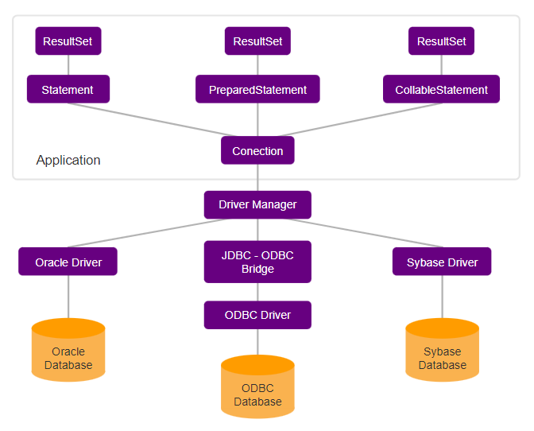

<h1>FASE 6 - MODEL</h1>
<h2>Capítulo 08: Quando o café javanês consulta o oráculo.</h2>

<h2>1. QUANDO O CAFÉ JAVANÊS CONSULTA O ORÁCULO</h2>

## 1.1 Introdução

- neste capítulo vamos ver o que o sistema deve fazer para interagir com os dados em um banco de dados.
- quais são os procedimentos necessários para que o sistema faça uso desse recurso tão essencial?

## 1.2 Recapitulando banco de dados

- a maioria dos sistemas precisa armazenar dados e informações para serem recuperados posteriormente. 

### a) `Sistemas de Gerenciamento de Banco de Dados` (SGBD):
- são sistemas especializados no armazenamento de dados, que oferecem funcionalidades e recursos avançados, como backup e pesquisas eficientes.
- SGBD é um conjunto de programas de computador responsáveis pelo gerenciamento de uma base de dados. 
- seu principal objetivo é retirar da aplicação cliente a responsabilidade de gerenciar acesso, manipulação e a organização dos dados. 
- o SGBD disponibiliza uma interface para que seus clientes possam realizar as operações de inclusão, alteração, exclusão e consulta de dados.
- os principais SGBDs utilizados aplicam o Modelo Relacional para armazenar informações e a linguagem (Structure Query Language) é utilizada para realizar as operações na base de dados. 
- principais SGBDs utilizados no mercado: Oracle Database, Microsoft SQL Server, PostgreSQL, Sysbase, MySQL Server, Apache Derby.

### b) `Modelo Relacional`:
- é um modelo de dados baseado em entidades e relacionamentos.
  - uma tabela armazena as informações relevantes da entidade.
  - a atribuição de valores de uma entidade constrói um registro da tabela.
  - a relação determina como cada registro da tabela se associa a registros de outras tabelas.
  - uma tabela é formada por registros (linhas) e os registros são formados por campos (colunas).
  - tabelas normalmente têm uma chave primária, que é um identificador único que garante que nenhum registro será duplicado. 

### c) SQL (Structured Query Language) ou Linguagem de Consulta Estruturada:
- é uma linguagem de pesquisa declarativa padrão para banco de dados relacional.
- por meio dela, os principais SGBDs interagem com os bancos de dados.
- alguns dos principais comandos SQL para manipulação de dados são: INSERT (inserção), UPDATE (atualização), SELECT (consulta) e DELETE(exclusão). 
- possibilita também criar tabelas, relações, controle de acesso, etc.

> Sistemas desenvolvidos na plataforma Java comunicam-se com o SGBD e manipulam seus dados utilizando a API Java DataBase Connectivity (JDBC)!

## 1.3 Java Database Connectivity

- é uma API (Application Programming Interface).
- contém um conjunto de regras que permite uma padronização no acesso aos diversos SGDBs disponíveis no mercado.
- define um conjunto de interfaces que devem ser implementadas pelas empresas fornecedoras de SGDB que desejam ser compatíveis com a plataforma Java.

> São os SGDBs que se adaptam à plataforma Java, por meio da implementação de um JDBC, e não o contrário! Todo o código implementado para sistema será o mesmo, pois as bibliotecas de acesso aos bancos de dados seguem os mesmos padrões.

- as bibliotecas de classes que permitem a integração de um SGDB à aplicação Java são chamadas `driver`.
- geralmente, as empresas fornecedoras de SGDBs oferecem o driver de conexão que seguem as especificações JDBC.

<em>Estrutura JDBC.</em>
 

- uma das poucas classes que é implementada é a `DriverManager`, responsável por identificar o conjunto de bibliotecas (driver) que será utilizada: Oracle Driver, JDBC-ODBC Driver ou Sybase Driver.
- principais interfaces e a classe principal utilizadas para acesso ao banco de dados por meiodos padrões JDBC:

Componente | Descrição
-----------|------------------
DriverManager | Responsável por encontrar o drive e estabelecer a conexão com o SGBD.
Conection | Representa a conexão com o SGBDR por onde serão passados os comandos SQL.
Statement PreparedStatement CallableStatement | Representa os registros de um Statement, PreparedStatement ou CallableStatement.

- as classes para manipulação de um banco de dados estão no `pacote java.sql`. 
- para conectar-se a um banco de bados (SGDB) é preciso solicitar a abertura de uma conexão com o banco de dados utilizando o Driver Manager, que é o gerenciador de drivers.
  - caso o DriverManager consiga estabelecer uma conexão com o SGDB, um `objeto do tipo java.sql.Connection` é retornado, caso contrário, uma exceção é gerada.
- quando uma implementação (driver) é carregada, é registrada utilizando o Driver Manager, a partir do qual serão criadas as conexões para a base de dados utilizando o `método getConnection()` (que recebe uma String que identifica o banco de dados que será conectado).
- após a conexão, é possível utilizar os objetos do tipo java.sql.Statement, java.sql.PreparedStatement e java.sql.CallableStatement para executar comandos SQL no SGDB.
- todas as interfaces e classes da estrutura do JDBC podem ser encontradas no `arquivo rt.jar`, contido no pacote JDK do Java.

> O desenvolvimento de sistemas que acessam banco de dados segue alguns passos comuns, independente da linguagem de programação utilizada.

### a) para a comunicação de um sistema a um BD:
  - primeiro, é necessário ter o “número” do banco de dados destinatário, considerando o endereço de IP (Internet Protocol) como endereço físico e a porta como endereço lógico.
  - com o banco disponível, obter uma conexão para realizar a comunicação.
  - por meio da conexão, é possível enviar comandos SQL, que serão executados no banco de dados.
  - por fim, a conexão é fechada, encerrando-se o processo.

### b) importante:
- deve ser realizado o tratamento dos possíveis problemas que podem ocorrer no processo da comunicação com o BD.
- o próprio programa deve prever e tratar as possíveis situações de erro.

## 1.4 Banco de dados Oracle e comandos SQL

### a) Criar a tabela para armazenar os dados dos colaboradores de uma empresa:
- A tabela deverá conter as colunas:
  - CODIGO_COLABORADOR: chave primária da tabela, campo obrigatório e com valores únicos. 
  - NOME: nome do colaborador. 
  - EMAIL: e-mail do funcionário. 
  - SALARIO: valor do salário do colaborador. 
  - DATA_CONTRATACAO: data de contratação.

> Para criar a tabela, podemos utilizar o comando SQL CREATE TABLE ou fazê-lo de forma visual, por meio do Oracle SQL Developer.

### b) Criar uma sequence para gerar os valores do código do colaborador.
- `sequence` é um objeto do banco de dados Oracle que gera sequências numéricas automaticamente.

### 1.4.1 Cadastrando informações na tabela

- utilizando o ***comando INSERT*** para cadastrar um registro em uma tabela. 
- podemos utilizá-lo de duas formas:
  - omitindo o nome das colunas e informando somente os valores para as colunas (os dados serão inseridos conforme a ordem das colunas na tabela) OU
  - informando os nomes das colunas e os valores que serão cadastrados. Nesse caso, cada valor será inserido na respectiva coluna, conforme a ordem estabelecida na instrução.

> O mais indicado é utilizar a segunda opção, pois caso a estrutura da tabela seja alterada, os valores ainda serão inseridos nas colunas corretas.

### 1.4.2 Leitura de dados de uma tabela

- para recuperar os registros de uma ou mais tabelas, utilizar o ***comando SELECT***.
- adicionar filtros às buscas, pois permitem recuperar os registros de acordo com condições, além de trazer registros mais específicos, e de utilizarem menos capacidade de processamento.
- para criar condições, precisamos utilizar os operadores relacionais e lógicos.

### 1.4.3 Atualizando valores na tabela

- utilizar o ***comando UPDATE***: permite a alteração do conteúdo de um ou mais campos (colunas) pertencentes a um ou mais registros (linhas) de uma tabela.
- é possível alterar várias colunas em um mesmo comando UPDATE, basta separar o nome das colunas por vírgula.

### 1.4.4 Remoção de registros de uma tabela (Delete)

- o ***comando DELETE*** permite remover um registro de uma tabela.
- precisamos especificar uma acondição, pois, sem ela, todos os registros da tabela serão apagados.

### 1.4.5 Conectando a base de dados

- no Eclipse, criar um novo projeto para manipular a base de dados: “File” > “New” > “Java Project”.
- configurar o ambiente (pois precisamos do driver JDBC do banco de dados Oracle). Logo, vamos adicionar o arquivo .jar ao projeto. Para isso: 
  - criar uma pasta chamada `lib` e adicionar o driver do Oracle (ojdbc11).
  - adicionar o driver no build path do projeto para que as classes e interfaces fiquem disponíveis para o uso dentro do projeto (botão direito do mouse no driver > “BuildPath” > “Add to Build Path).
- agora estamos prontos para começar a desenvolver um programa!!!

### para estabelecer uma conexão com a base de dados:
- precisamos criar um objeto do tipo Connection que representará a conexão. 
- depois, poderemos realizar qualquer operação (Cadastrar, Atualizar, Apagar e Buscar) na base de dados.
- exemplo de classe de teste que realiza a conexão com o banco de dados:

~~~java
package br.com.fiap.teste;
  
  import java.sql.Connection;
  import java.sql.DriverManager;
  import java.sql.SQLException;
  
  public class TesteView {
  
    public static void main(String[] args) {
      try {
        //Registra o Driver
        Class.forName("oracle.jdbc.driver.OracleDriver");
  
        //Abre uma conexão
        Connection conexao = DriverManager.getConnection(
            "jdbc:oracle:thin:@192.168.60.15:1521:ORCL", "OPS$PF0392", "123456");
        
        System.out.println("Conectado!");
        
        //Fecha a conexão
        conexao.close();
        
      //Tratamento de erro 
      } catch (SQLException e) {
        System.err.println("Não foi possível conectar no Banco de Dados");
        e.printStackTrace();
      } catch (ClassNotFoundException e) {
        System.err.println("O Driver JDBC não foi encontrado!");
        e.printStackTrace();
      }
    }
  }
~~~

### 1.4.6 Statements

--- 

[Voltar ao início!](https://github.com/monicaquintal/fintech)