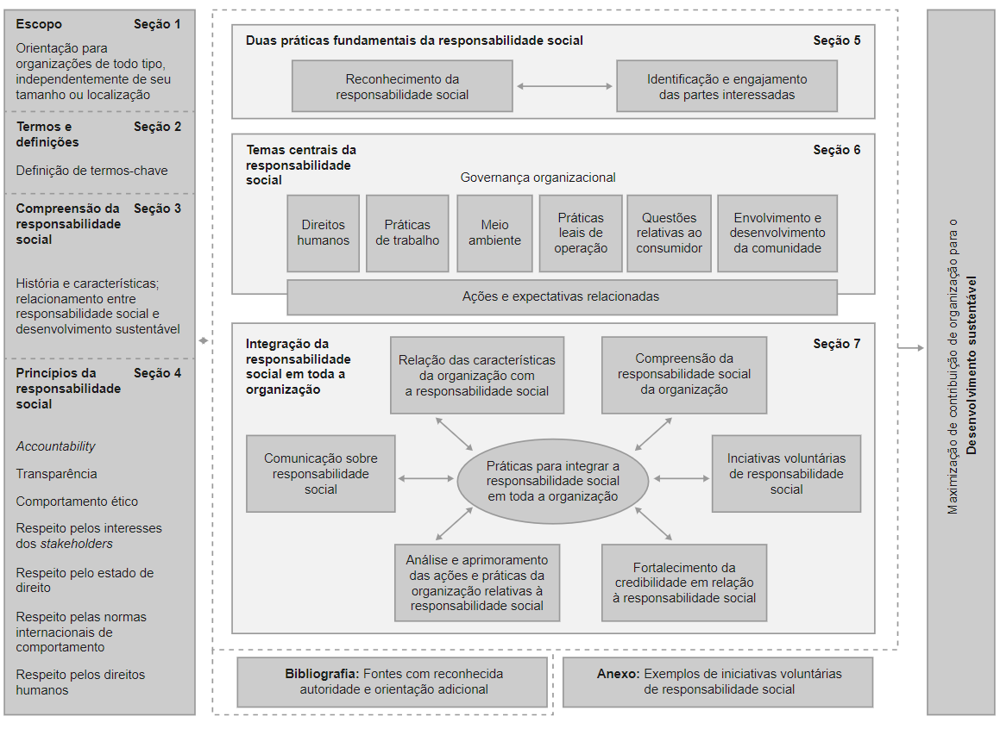

<h1>FASE 6 - MODEL</h1>
<h2>Capítulo 11: Mercado e Tecnologia.</h2>

<h2>1. MERCADO E TECNOLOGIA</h2>

## 1.1 Introdução

- sustentabilidade baseia-se no tripé do desenvolvimento econômico, ambiental e social, ou seja, mesmas diretrizes do ESG: Environment, Social & Governance, significante no mercado de ações e nas empresas multinacionais. 
- no quesito ambiental, há fatores de recursos naturais, como energia, água, ar, flora, fauna, resíduos, emissões e uso dos espaços de maneira geral. 
- no social estão requisitos de saúde, bem-estar, segurança e justiça, equidade e diversidades, valores éticos e educação.
- no econômico, encontram-se questões relacionadas às riquezas e suas distribuições, à tecnologia e infraestrutura, ao trabalho, à produção, às regulações econômicas e ao consumo de modo geral.

> Tripé de sustentabilidade - `Triple Bottom Line`: em uma reflexão empresarial, está associado às metas e mensurações relativas a outros três pilares, que são os 3 Ps: **People**, **Planet** & **Profit** (pessoas, planeta e lucros).

- o objetivo é que a gestão empresarial possa desenvolver e observar seus resultados olhando para esta base, buscando indicadores referentes a cada um destes pilares para que os responsáveis pela estratégia possam acompanhar e monitorar ainda que de modo distante do “chão de fábrica”.
- a sustentabilidade no ambiente empresarial pode ser observada no conjunto de políticas e ações dessa companhia que ***objetivam não somente o lucro e sua segurança a curto prazo, mas principalmente o foco em longo prazo para beneficiar toda a cadeia produtiva, consumidores e fornecedores***. E a produção em si, que seja menos impactante para todos envolvidos e garanta que as condições atuais sejam mantidas ou melhoradas no futuro.

## 1.2 Objetivos empresariais em práticas sustentáveis

- o interesse em ter práticas e ações voltadas para a sustentabilidade costuma ocorrer de duas maneiras: para cumprir legislações e outras exigências legais ou na geração de valor à companhia, por meio da sustentabilidade.
- podemos citar algumas exigências legais, como:
  - Ibama – CTF / RAPP.
  - Processos de licenciamento ambiental – Órgãos ambientais.
  - Resoluções Conama – Diretrizes de limites de emissões, diretrizes de programas de gestão de resíduos etc.
  - Lei de Cotas para Pessoas com Deficiências – PCDs – Lei 8.213/91 – Obriga empresas com mais de 100 funcionários ao preenchimento de 2% a 5% das vagas do quadro de funcionários com pessoas com deficiência ou reabilitadas.
  - Convenção da Guatemala (1999) – Decreto 3.956/2001 – Afirma que as pessoas com deficiência têm os mesmos direitos humanos e liberdades fundamentais que as demais. Define como discriminação com base na deficiência toda diferenciação ou exclusão que possa impedir ou anular o exercício dos direitos humanos e de suas liberdades fundamentais.

### 1.2.1 Responsabilidade Social Empresarial (RSE):

> Segundo a `ISO 26000`, `Responsabilidade Social Empresarial (RSE)` trata-se da responsabilidade de uma organização pelos impactos de suas decisões e atividades na sociedade e meio ambiente por meio de um comportamento ético e transparente que: contribua para o desenvolvimento sustentável, inclusive, o bem-estar da sociedade; leve em consideração as expectativas das partes interessadas; esteja em conformidade com a legislação aplicável e seja consistente com as normas internacionais de comportamento, e esteja integrada em toda a organização e seja praticada em suas relações.

- uma organização que busca pela RSE deve estar alinhada com os aspectos sociais e ambientais que não estão necessariamente contemplados na legislação, mas que visam atender às necessidades da sociedade.
- a implantação de RSE pode ser realizada utilizando diversas orientações, diretrizes, relatórios, indicadores e índices. Entre eles,podemos iniciar com a NBR ISO 2600:2010, que tem o objetivo principal de auxiliar as empresas a contribuírem com o desenvolvimento sustentável,estimulando organizações a irem além das obrigações legais, promovendo uma compreensão comum da área de responsabilidade social. Essa norma não se refere ao sistema de gestão, como as Normas ISO 14001 do Sistema de Gestão Ambiental, ISO 45001 do Sistema de Gestão de Saúde e Segurança do Trabalho ou mesmo a ISO 9001 do Sistema de Gestão da Qualidade.

## 1.3 DIRETRIZES para responsabilidade social empresarial – a `ISO 2600`

- não é passível de certificação ou auditorias, pois se trata de uma norma orientativa. 
- se divide em 7 seções, além da bibliografia e anexos.
  - até a seção 4 são dados subsídios para o entendimento da norma, alinhando conceitos e princípios.
- são `7 os princípios básicos` para alcançarmos a sustentabilidade empresarial.

### a) Accountability:
- dever da empresa de prestar contas sobre suas ações a todos os interessados, como o Estado, os consumidores, os fornecedorese a sociedade em geral.

### b) Transparência:
- ser transparente sobre suas atividades que resultem impactos sobre o meio ambiente e na sociedade, incluindo seus balanços econômicos, contanto que não atinja informações confidenciais.

### c) Comportamento ético:
- atuação pautada pelos valores de honestidade, equidade e integridade.
- esses valores implicam a preocupação com pessoas, animais e meio ambiente. 
- além do compromisso de lidar com o impacto de suas atividades e decisões nas expectativasdas partes interessadas.

### d) Respeito pelos interesses dos stakeholders:
- respeite, considere e responda aos interesses de stakeholders, tais como conselheiros, clientes ou associados.
- Outros indivíduos ou grupos podem também ter direitos, reivindicações ou interesses específicos que convêm que sejam levados em conta. 

### e) Respeito pelo Estado de Direito:
- refere-se à supremacia da lei e, em especial, à ideia de que nenhum indivíduo ou organização está acima da lei e que o governo também está sujeito à lei. 
- o Estado de Direito contrapõe-se ao exercício arbitrário do poder.

### f) Respeito pelas normas internacionais de comportamento:
- convém que uma organização respeite as normas internacionais de comportamento, ao mesmo tempo em que adere ao princípio de respeito pelo Estado de Direito.

### g) Respeito pelos direitos humanos:
- convém que uma organização respeite os direitos humanos e reconheça tanto sua importância quantosua universalidade.

<em>Visão esquemática da ABNT NBR ISO 26000/2010.</em>
 

- somente após entender todos os conceitos, a organização deve seguir para uma compreensão da relação da organização e todo o seu contexto dentro da sociedade, com as partes interessadas e das partes interessadas com a sociedade, analisando expectativas, interesses e impactos entre elas.

### 1.3.1 Questionamentos:

- uma forma mais palpável de se buscar essas partes interessadas, sugerida pela própria norma, é fazer os `questionamentos`:
  - Com quem a organização tem obrigações legais?
  - Quem poderia ser positiva ou negativamente afetado pelas atividades ou decisões da organização?
  - Quem provavelmente expressará preocupação com as decisões e atividades da organização?
  - Quem se envolveu no passado quando preocupações semelhantes precisaram ser tratadas?
  - Quem pode ajudar a organização a cuidar de impactos específicos?
  - Quem pode afetar a capacidade da organização de arcar com suas responsabilidades?
  - Quem seria desfavorecido se fosse excluído do engajamento?
  - Quem da cadeia de valor é afetado?

### 1.3.2 Implantação da governança organizacional 

- após todo o estudo e a análise da empresa e seu contexto, inicia-se de fato a `implantação da governança organizacional`.
- pode compreender tanto mecanismos formais de governança, baseados em estruturas e processos definidos, quanto mecanismos informais, que emergem a partir da cultura e dos valores da organização, geralmente influenciados pelas pessoas que estão liderando a empresa.
- toda forma de governança deverá ser pautada nos temas centrais e interdependentes propostos na norma: 
  - Direitos humanos.
  - Práticas de trabalho (dividido em 5 questões: emprego e relações de trabalho, condições de trabalho e proteção social, diálogo social, saúde e segurança no trabalho, desenvolvimento humano e treinamento no trabalho).
  - Meio ambiente.
  - Práticas leais de operação.
  - Questões relativas ao consumidor.
  - Envolvimento e desenvolvimento da comunidade.

### 1.3.3 Saúde e segurança no trabalho

- ao nos referirmos sobre a `saúde e segurança no trabalho`, também mencionamos a respeito de promoção e manutenção do mais alto nível de bem-estar físico, mental e social dos trabalhadores e prevenção de perigos à saúde causados pelas condições de trabalho.
- algumas ações e expectativas são:
  - Desenvolver, implementar e manter uma política de saúde e segurança no trabalho baseada no princípio de que normas de saúde e segurança e desempenho organizacional sólidos se apoiam e se reforçam mutuamente.
  - Compreender e aplicar princípios de gestão de saúde e segurança, entre os quais, a hierarquia de controles: eliminação, substituição, controles de engenharia, controles administrativos, procedimentos de trabalho e equipamentos de proteção individual.
  - Analisar e controlar os riscos à saúde e à segurança envolvidos em suas atividades.
  - Comunicar a exigência de que convém que os trabalhadores sigam todas as práticas de segurança o tempo todo; e garantirque os trabalhadores sigam os procedimentos adequados.

### 1.3.4 Meio Ambiente

- a visão geral desse tema (Environment) traz questões e desafios ambientais como: exaustão dos recursos naturais, poluição, mudanças climáticas, destruição de biomas, extinção de espécies, colapso de ecossistemas e degradação do meio ambiente das mais diferentes formas antrópicas. 
- princípios que uma organização deve seguir para que possam promover, neste aspecto, o real ESG:
  - Responsabilidade ambiental: atuar não somente na melhoria do seu desempenho ambiental, mas visando melhoria do desempenho dentro da sua esfera de influência.
  - Princípio da precaução: veio da Declaração do Rio sobre Meio Ambiente e Desenvolvimento. Tal conceito afirma que quando houver “ameaças de danos graves ou irreversíveis ao meio ambiente e à saúde humana, a ausência de certeza científica absoluta não será utilizada como razão para o adiamento de medidas efetivas eficazes e economicamente viáveis para prevenir a degradação ambiental.”(MINISTÉRIO DO MEIO AMBIENTE, 2013).
  - Gestão de risco ambiental: foco em implementar um programa para avaliar, evitar, reduzir e mitigar os riscos e impactos ao meio ambiente que a organização pode ocasionar, incluindo as respostas a emergências e conscientização.
  - Poluidor pagador: define que os custos da poluição causada por suas atividades de acordo com a extensão do impacto deverão ser pagos por aquele que ocasionou. Esse princípio também foi originário da Declaração do Rio.

> No Brasil temos esses princípios da precaução e pagador poluidor. O primeiro está descrito no Artigo 225 da Constituição Federal por meio dos estudos prévios de impacto ambiental; e o segundo, no Artigo 4º da Lei 6.938/81 – Política Nacional de Meio Ambiente.

### 1.3.5 E por que uma organização deveria ser social e ambientalmente responsável?

- Melhor controle de riscos, inclusive legais.
- Aumento da credibilidade – visibilidade no mercado (reputação).
- Suporte na licença de operação.
- Gera inovação.
- Melhor competitividade, inclusive por acesso aos financiamentos.
- Aumento da retenção, envolvimento, participação e moral dos trabalhadores.
- Melhoria na saúde e segurança de todos os trabalhadores.
- Impacto positivo na capacidade de recrutar talentos.
- Redução de desperdícios e aumento da produtividade e eficiência no uso de recursos (P+L).
- Maior confiabilidade econômica e política (concorrência leal e ausência de corrupção).
- Redução de conflitos com os consumidores.

## 1.4 Tecnologia verde ou green it

- associado ao estilo de vida marcado pelo consumismo excessivo de equipamentos e obsolescência programada, ocasionou uma elevada quantidade de resíduos eletrônicos.
- o Brasil foi o quinto país que mais gerou lixo eletrônico no mundo em 2019.
- o termo "green it" aborda um conjunto de ações que visam evitar, reduzir ou mitigar impactos ambientais, pensando na produção e serviços de tecnologia da informação ou mesmo no seu uso em outros processos com o mesmo objetivo.
- a TI verde objetiva ter práticas em toda a sua cadeia de suprimentos,alinhadas e direcionadas com os temas centrais da ISO 26000.
- temas centrais da ISO 26000 são: direitos humanos, práticas de trabalho, meio ambiente, práticas leais de operação, questões relativas ao consumidor, envolvimento e desenvolvimento da comunidade.
  - ***dois principais tópicos analisados pela Green IT*** são as problemáticas mais observáveis: questão da gestão do consumo de energia e a minimização de resíduos eletrônicos.

### a) classificação:

- Brooks, Wang e Sarker (2010) categorizam a TI verde de três maneiras: 

1. `TI verde tática`: representada por iniciativas que utilizam os equipamentos e a infraestrutura de TI já existentes para mudar processos e/ou práticas organizacionais, visando à redução dos impactos ambientais.
2. `TI verde estratégica`: por meio da criação de produtos e infraestruturas em TI ambientalmente saudáveis desde sua concepção.
3. `TI verde profunda`: correspondente às duas anteriores, mas dando ênfase ao prisma de transformação cultural com vistas à responsabilidade socioambiental.

> O objetivo de Conferências é monitorar os indicadores de mudanças climáticas e avaliar, negociar e alinhar ações de cada um dos países envolvidos, sendo um deles o Brasil. Por essa razão, as questões de TI verde relacionadas à eficiência energética estão sendo mais amplamente discutidas e são, inclusive, passíveis de certificações.

### b) ações para a redução das emissões de carbono e consumo de energia:

- Investir em educação e conscientização sobre desperdício de energia.
- Engajar nas políticas de fornecedores as mudanças de tecnologias com maior eficiência energética.
- Otimização dos sistemas de fornecimento de energia dos Data Centers.
- Melhoria da eficiência dos sistemas de refrigeração dos Data Centers.
- Melhoria nos sistemas de distribuição de energia.
- Aumento na eficiência energética dos servidores.

### c) e-waste:

> No mercado de TI, responsabilidade ambiental vem tomando força nos últimos anos, principalmente pela preocupação da sociedade, de ONGs e por legislações, como a Política Nacional de Resíduos Sólidos(PNRS), de 2010, sobre a destinação final dos resíduos de equipamentos eletroeletrônicos (REEE) - monitores, computadores, celulares, televisões, impressoras, equipamentos audiovisuais e gadgets inservíveis (e-lixo, ou Electrical and Electronic Equipment - EEE).

- O governo atua por meio de legislações, como a Lei da Política Nacional de Resíduos Sólidos (PNRS), de 2010, que determina que todos os consumidores de produtos e embalagens realizem a logística reversa, sendo empresas ou consumidores domésticos.
- Decreto n°. 10.240, que traz obrigatoriedade da logística reversa especificamente sobre o EEE de consumidores domésticos. 
- há outras soluções seguindo o preceito dos 5 Rs:

1. ***Repensar***: induz a refletir anecessidade real da troca de um determinado equipamento. Questionar a compra, o tempo de troca e o tipo de equipamento quando realmente for preciso trocá-lo, se há ou não logística reversa pelo fabricante. Questionar como posso cuidar desses equipamentos para durarem mais tempo e como poderia dar a melhor destinaçãoa eles.
2. ***Recusar e reduzir***: recusar produtos de origem suspeita ou a compra caso já tenha outros com funções similares.
3. ***Reparar (ou reaproveitar)***: reformar e atualizar aparelhos de TI antigos parafazê-los funcionar minimamente bem. É possível transformar um computador antigo ou outro hardware em aparelhos quase novos apenas recondicionando e substituindo suas peças.
4. ***Reutilizar***: o ideal é doar para locais que o reutilizemda maneira adequada para evitar contaminações. O processo de reutilização poderá ocorrer em conjunto com a reciclagem. “trade in” = fabricante reutilizará partes do equipamento que voltarão como estão para a fabricação de novos aparelhos.
5. ***Reciclagem***: além do plástico, normalmente, o policloreto de vinila (PVC), alguns outros componentes, ainda que perigosos, podem ser reciclados em indústrias especializadas.

### d) Objetivos da ONU:

- a ONU, ainda em seus Objetivos de Desenvolvimento Sustentável (ODS), traz na ODS 12 duas metas, 12.4 e 12.5, muito alinhadas com a questão dos resíduos eletrônicose os consequentes indicadores adotados pelo Brasil abaixo.

### - Meta 12.4:
- Nações Unidas
- Até 2020, alcançar o manejo ambientalmente saudável dos produtos químicos e todos os resíduos, ao longo de todo o ciclo de vida destes, de acordo com os marcos internacionais acordados, e reduzir significativamente a liberação destes para o ar, água e solo, para minimizar seus impactos negativos sobre a saúde humana e o meio ambiente
- Indicadores: 
  - 12.4.1 - Número de Partes em acordos multilaterais internacionais sobre resíduos perigosos e outros produtos químicos, no domínio do ambiente, que cumpram os seus compromissos e obrigações na transmissão de informações, conforme exigido por cada acordo relevante.
  - 2.4.2 - Quantidade de resíduos perigosos gerados per capitae proporção de resíduos perigosos tratados, por tipo de tratamento.

  ### - Meta 12.5
- NaçõesUnidas
- Até 2030, reduzir substancialmente a geração de resíduos por meio da prevenção, redução, reciclagem e reuso.
- Brasil: até 2030, reduzir substancialmente a geração de resíduos por meio da Economia Circular e suas ações de prevenção, redução, reciclagem e reúso de resíduos
- Indicadores:
  - 12.5.1 - Taxa de reciclagem nacional, toneladas de material reciclado.

> O conceito de `economia circular` donsiste em um tratamento desde a concepção do produto com uma visão de design circular focada em projetar produtos e sistemas para manter o valor dos recursos. Seja por meio da longevidade, remanufatura, novos modelos de negócio e, por último,a recuperação destes materiais.

- processos e os produtos podem ser certificados ou adquirir selos ambientais passando por avaliação que utiliza critérios ambientais com o objetivo de diferenciá-los no mercado. São muito conhecidos e popularizados no Brasil, como as certificações no Sistema de Gestão Ambiental – ISO 14001 para processos produtivos ou serviços.

### e) exemplos de selos verdes:
- EPEAT (abrange 51 critérios, sendo 23 obrigatórios).
- Energy Star.
- TCO.
- Restriction of Hazardous Substances Directive (RoHS).

---

## FAST TEST

### 1. A ISO26000 se norteia em 7 princípios fundamentais para que que a implantação das diretrizes preconizadas para os temas centrais sejam realmente funcionais e garantam o atingimento do objetivo maior que é a maximização da organização para o desenvolvimento sustentável. Dessa maneira, quais são os 6 temas centrais para a ISO26000 sobre responsabilidade social e que devem fazer parte da governança organizacional?
> Direitos humanos, práticas do trabalho, meio ambiente, práticas leais de operação, questão relativas ao consumidor e envolvimento e desenvolvimento da comunidade.

### 2. A Responsabilidade Social Empresarial (RSE.) é a forma de uma empresa gerar valor de sustentabilidade, ou seja, elevar as suas ações além das legislações e obrigatoriedade. A ISO 26000 fornece diretrizes para auxiliar as empresar a terem RSE. Acerca disso, assinale a alternativa correta.
> RSE deve contribuir para o desenvolvimento sustentável considerando os interesses de todas as partes interessadas, sociedade, acionistas, vizinhança, fornecedores, clientes, enfim, todos que possam ter algum tipo de relação com a atividade empresarial.

### 3. No tema central Meio Ambiente, a norma aponta os desafios que temos neste quesito, exemplificando exaustão dos recursos naturais, poluição, mudanças climáticas, destruição de biomas, extinção de espécies, colapso de ecossistemas e a degradação do meio ambiente das mais diferentes formas antrópicas. No Brasil, a Lei 6938/81 – Política Nacional de Meio Ambiente e a Constituição Federal trazem princípios essenciais para o desenvolvimento do meio ambiente. Quais são eles?
> Princípio do poluidor pagador e da precaução.

### 4. O interesse em ter práticas e ações voltadas para a sustentabilidade costumam ocorrer por uma ou outra forma, quais são esses fatores?
> Exigências legais ou geração de valor para a companhia para obtenção de lucro.

---

## QUESTIONÁRIO INDIVIDUAL - Cap 11: Mercado e Tecnologia

### 1. O interesse em ter práticas e ações voltadas para a sustentabilidade costumam ocorrer por uma ou outra forma, quais são esses fatores?
> Exigências legais ou geração de valor para a companhia para obtenção de lucro.

### 2. A Responsabilidade Social Empresarial (RSE.) é a forma de uma empresa gerar valor de sustentabilidade, ou seja, elevar as suas ações além das legislações e obrigatoriedade. A ISO 26000 fornece diretrizes para auxiliar as empresar a terem RSE. Acerca disso, assinale a alternativa correta.
> RSE deve contribuir para o desenvolvimento sustentável considerando os interesses de todas as partes interessadas, sociedade, acionistas, vizinhança, fornecedores, clientes, enfim, todos que possam ter algum tipo de relação com a atividade empresarial.

### 3. A ISO26000 se norteia em 7 princípios fundamentais para que que a implantação das diretrizes preconizadas para os temas centrais sejam realmente funcionais e garantam o atingimento do objetivo maior que é a maximização da organização para o desenvolvimento sustentável. Dessa maneira, quais são os 6 temas centrais para a ISO26000 sobre responsabilidade social e que devem fazer parte da governança organizacional?
> Direitos humanos, práticas do trabalho, meio ambiente, práticas leais de operação, questão relativas ao consumidor e envolvimento e desenvolvimento da comunidade.

### 4. No tema central Meio Ambiente, a norma aponta os desafios que temos neste quesito, exemplificando exaustão dos recursos naturais, poluição, mudanças climáticas, destruição de biomas, extinção de espécies, colapso de ecossistemas e a degradação do meio ambiente das mais diferentes formas antrópicas. No Brasil, a Lei 6938/81 – Política Nacional de Meio Ambiente e a Constituição Federal trazem princípios essenciais para o desenvolvimento do meio ambiente. Quais são eles?
> Princípio do poluidor pagador e da precaução.

--- 

## QUIZ - FASE 06 - MODEL

### 1. Assinale a alternativa que completa corretamente a frase a seguir: “Desenhar um chatbot é um processo de design, centrado _____________ e envolve muito mais do que o simples processo de construção de um produto digital.”.
> No ser humano.

### 2. Supondo que a tabela VEICULOS exista, assinale a alternativa correta em relação ao código SQL abaixo:
~~~sql
1   UPDATE INTO VEICULOS SET VEICULO = 'Automovel' WHERE ID = 1;
~~~
> O código em questão executará somente se o atributo INTO for removido da sintaxe.

### 3. Assinale a alternativa que corretamente descreve o comando SQL LIKE '%A_'.
> Todas as palavras que tenha a letra A na penúltima posição e a última posição seja qualquer outro caractere.

### 4. Supondo que a tabela VEICULOS exista e que o campo ID seja chave primária desta tabela, assinale a alternativa correta em relação ao código SQL abaixo:
~~~sql
1   UPDATE VEICULOS SET ID = 3 WHERE ID = 1;
~~~
> O código executa com sucesso alterando o campo ID do registro, caso não haja outro registro com ID igual a 3.

### 5. Em relação às chaves, assinale a alternativa correta:
> Chaves estrangeiras podem apresentar valores repetidos entre diferentes registros.

### 6. Supondo que a tabela VEICULOS exista, assinale a alternativa correta em relação ao código SQL abaixo:
~~~sql
1   DELETE FROM VEICULOS;
~~~
> O código executa com sucesso.

### 7. A Declaração do Rio sobre o Meio Ambiente e o Desenvolvimento é uma proposição das Nações Unidas (ONU) para promover o desenvolvimento sustentável que contém uma série de princípios. Um deste princípios afirma que quando houver “[...] ameaças de danos graves ou irreversíveis ao meio ambiente e à saúde humana, a ausência de certeza científica absoluta não será utilizada como razão para o adiamento de medidas efetivas eficazes e economicamente viáveis para prevenir a degradação ambiental.”. Que princípio é este?
> Princípio da precaução.

### 8. As métricas fundamentadas em quantidade visam trazer informações com base no volume de mensagens que os usuários trocam com o chatbot. Neste contexto, a primeira métrica que pode ser utilizada é o:
> Número de interações.

### 9. Em relação aos vetores, considere as seguintes afirmações:
- I – Vetor é uma variável composta homogênea unidimensional, isto é, um conjunto de variáveis do mesmo tipo de dado, que possuem o mesmo identificador (nome) e são alocadas sequencialmente na memória.
- II – Como as variáveis do tipo vetor tem o mesmo nome, o que as distingue é um índice que faz referência à sua localização dentro da estrutura.
- III – Em Java, todo vetor possui o atributo length que retorna o tamanho do vetor, isto é, o número de elementos do vetor.
Sobre as afirmações acima, assinale a alternativa correta:
> Todas as afirmações estão corretas.

### 10. Considerando-se que exista a tabela LIVROS e que exista a tabela USUARIOS e supondo um relacionamento entre elas de tal forma que o campo EMPRESTOU_ID da tabela LIVROS representa o valor do campo ID da tabela USUARIOS, armazenando o ID do usuário que emprestou o livro da biblioteca ou o valor NULL no caso de o livro estar disponível na biblioteca. Qual é a melhor forma de se construir um SELECT de união entre estas duas tabelas para trazer os dados de todos os livros e de todos os usuários, independente dos livros estarem emprestados ou não?
> SELECT * FROM LIVROS FULL JOIN USUARIOS ON LIVROS.EMPRESTOU_ID = USUARIOS.ID.

### 11. Em alguns casos, não é possível entender o que o usuário quer dizer. Isso acontece porque o chatbot não possui o conhecimento necessário para responder à pergunta feita pelo usuário. Este tipo de cenário é classificado como:
> Cauda longa.

### 12. Em geral, erros de programação geram qual tipo de exceção:
> RunTimeException.

### 13. Na execução de um programa, se, por engano, houver uma tentativa de se armazenar um elemento fora do intervalo de elementos definido para o vetor, ocorrerá uma exceção de qual tipo?
> ArrayIndexOutOfBoundsException.

### 14. Qual cláusula é utilizada para classificar as linhas retornadas por uma consulta?
> ORDER BY.

### 15. A descrição “É uma coleção de dados binários armazenados como uma única entidade, até mesmo código binário executável pode ser armazenado por este tipo de dado.”, refere-se a qual tipo de dado?
> BLOB.

### 16. Para um dado do tipo _____________, que armazene um valor de apenas 4 posições (por exemplo, “FIAP”), as outras 6 posições serão ocupadas com _____________, consumindo o mesmo espaço em disco e em memória para todos os valores armazenados (10 bytes). Se este mesmo dado for definido como sendo do tipo _____________ e armazenar um valor com as mesmas 4 posições, apenas as 4 posições serão preenchidas e, consequentemente, o espaço utilizado em disco e em memória será menor.
> CHAR(10) / brancos (“ ”) / VARCHAR(10).

### 17. A frase: “Possibilita a interação humana falada com chatbots, usando o reconhecimento de fala para entender comandos falados e responder a perguntas.”, refere-se a um(a):
> Interface de Usuário de Voz.

### 18. No IBM Watson Assistant é possível utilizar entidades predefinidas pela IBM, chamadas:
> System entities.

### 19. A linguagem DTL (Data Transaction Language) é responsável por:
> Gerenciar conjuntos de operações sobre os dados.

### 20. Utilizado por empresas – como Bradesco (com a BIA) e Magazine Luiza (com a Lu) – o IBM Watson Assistant desempenha um papel fundamental no avanço da tecnologia de chatbots, valendo-se de tecnologias como:
> Machine learning e natural language process.

### 21. Sobre vetores e matrizes, considere as seguintes afirmações:
- I – Um vetor também pode ser criado a partir de uma lista de valores entre {} e separados por vírgula. Por exemplo: int [] numerosPrimos = { 2, 3, 5, 7, 11, 13, 17, 19, 23, 29, 31 }.
- II – Se um vetor tem N elementos, os índices de seus elementos vão variar entre 0 e N-1.
- III – Para obter as dimensões de uma matriz M[][] pode-se utilizar os atributos M.length e M[].length.
Sobre as afirmações acima, assinale a alternativa correta:
> Todas as afirmações estão corretas.

### 22. Nos dias atuais, a geração de valor almejada pelas empresas, vai muito além da obtenção de lucro nos negócios e do cumprimento de legislações e práticas regulatórias. As empresas esperam que seus executivos tomem decisões com base na consciência socioambiental. Qual é a norma ISO relacionada à Responsabilidade Social?
> ISO 26000.

### 23. Em geral, um vetor pode ser indexado com qualquer expressão, cujo valor de retorno seja um número inteiro. Neste contexto, considere as afirmações abaixo:
- I – O tamanho de um vetor pode ser uma constante ou uma variável.
- II – O tamanho de um vetor pode ser uma expressão contendo operadores aritméticos, constantes e variáveis.
- III – Um vetor não precisa ter seu tamanho previamente definido pelo desenvolvedor, o tamanho de um vetor pode ser calculado pelo programa em tempo de execução.
Sobre as afirmações acima, assinale a alternativa correta:
> Apenas as afirmações I e II estão corretas.

### 24. Assinale a alternativa que apresenta o padrão de projeto que abstrai e encapsula todo o acesso à base de dados.
> Data Access Object (DAO).

### 25. “_____________ é a propriedade da transação que garante que as mudanças aplicadas ao banco de dados pela transação confirmada persistam no banco de dados, isto é, que as mudanças não sejam perdidas por causa de alguma falha.”
> Durabilidade. 

### 26. A linguagem DCL (Data Control Language) é responsável por:
> Gerenciar o acesso aos dados.

### 27. A descrição “A TI verde representada por iniciativas que utilizam os equipamentos e a infraestrutura de TI já existentes, visando à redução dos impactos ambientais.”, refere-se a:
> TI verde tática.

### 28. Considerando-se o modelo transacional, assinale a alternativa que apresenta corretamente o significado das propriedades ACID.
> Isolamento (I) são técnicas que procuram evitar que transações paralelas interfiram umas nas outras, permitindo que o resultado de várias transações, executadas em paralelo, seja consistente, sendo equivalente à execução destas mesmas transações de forma sequencial.

### 29. Sobre SQL (Structured Query Language), considere as afirmações a seguir:
- I – É uma linguagem de consulta estruturada.
- II – É uma linguagem para definição, manipulação e controle de banco de dados.
- III – É uma linguagem declarativa que detalha a forma do resultado.
Sobre as afirmações acima, assinale a alternativa correta:
> Apenas as afirmações I e II estão corretas.

### 30. Em relação aos arquivos, considere as seguintes afirmações:
- I – Os arquivos são utilizados para persistência de dados, isto é, o armazenamento mesmo após o término da execução do programa.
- II – A classe File fornece meios de associar um objeto a um arquivo físico, ou seja, criar um caminho abstrato entre o programa e o arquivo.
- III – Em Java, é possível trabalhar com arquivos sem considerar os aspectos referentes ao sistema operacional, isto é, abstraindo-se as características do sistema operacional.
Sobre as afirmações acima, assinale a alternativa correta:
> Todas as afirmações estão corretas.

---
 
[Voltar ao início!](https://github.com/monicaquintal/fintech)