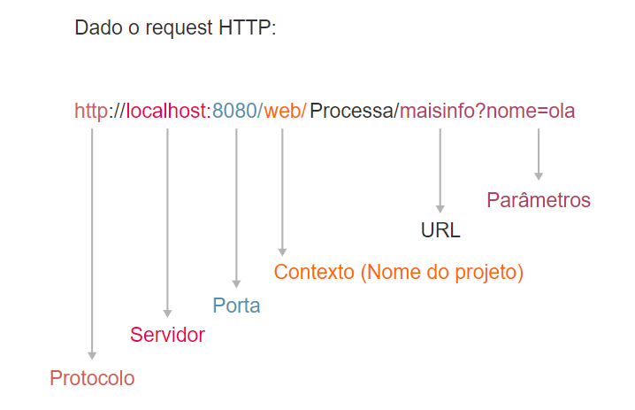
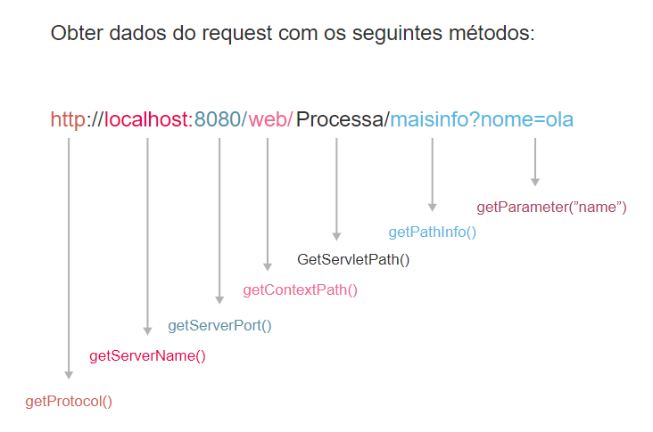

<h1>FASE 7 - INTEGRATION</h1>
<h2>Capítulo 02: Mais dinamismo na interface com o usuário.</h2>

<h2>1. MAIS DINAMISMO NA INTERFACE COM O USUÁRIO.</h2>

## 1.1 Introdução: Servlets

- `Servlet` é o componente da plataforma Java Web que será responsável por fazer o “meio de campo” entre a página (interface do usuário) e o modelo de negócio (model).
- são classes Java que realizam o direcionamento de requisições HTTP feitas por clientes, como os navegadores (Mozilla, Firefox, Chrome), eles são responsáveis por receber os dados para serem processados e devolver uma resposta a esses clientes.Essas classes são instaladas em um Servlet Container ou WebContainer (Servidor), o que permite à servlet tratar as requisições.

## 1.2 Requisição e resposta

- para promover a interação entre os diversos componentes envolvidos na programação Web dinâmica, a servlet deve receber uma requisição e devolver uma resposta ao cliente.
- uma servlet tem a função de recuperar as informações enviadas pelo usuário (por meio de uma requisição) e passar essas informações para outros componentes da aplicação para que sejam processadas. Depois, esses componentes devem retornar algum valor para que a servlet possa enviar uma resposta para o usuário.

## 1.3 Requisição a uma Servlet

- cada requisição a uma servlet é executada em uma thread.
- o objeto servlet é único na aplicação.
- a servlet é acessada por vários clientes simultaneamente, o que é possível pelo fato de terem sido criados threads (linhas de execução paralelas) para cada um dos clientes.

## 1.4 Ciclo de vida de uma servlet

- as servlets são instanciadas pelo container, na primeira vez que são acessadas.
- após iniciadas, as servlets podem atender a requisições.
- o container decide a hora de destruir as servlets(chamando o método destroy()).

### Como transformar uma classe em servlet?

- herdar a classe HttpServlet: essa herança transforma a classe Java em servlet, e está pronta para atender às requisições dos clientes. 
- para isso, a classe deve sobrescrever os métodos doGet e/ou doPost, dependendo do tipo de requisição que será tratada.
- exemplo:

~~~java
public class MeuServlet extends HttpServlet {
  
  public void init(ServletConfig config) throws ServletException {
  }

  public void destroy() {
  }
  
  protected void doGet(HttpServletRequest request,
   HttpServletResponse response) throws ServletException, IOException {
  }
  
  public void doPost(HttpServletRequest request, HttpServletResponse
  response) throws ServletException, IOException {
  }

}
~~~

- neste exemplo, há dois métodos dentro da servlet: doGet e doPost, que representam métodos do protocolo HTTP, o GET e o POST, pois dependendo de como as informações serão submetidas a partir da página HTML, teremos que esperar essas informações em um desses métodos!

## 1.5 Sequência de eventos no HttpServlet

 

<em>Sequência de eventos em uma Servlet.</em>
 

### 1.5.1 Interface HttpServletRequest

- contém vários métodos para lidar com as solicitações do cliente. 
- sempre que uma servlet é invocada, o container Web passa os objetos que implementam a interface HTTPServletRequest para o método service() da servlet.
- a interface HTTPServletRequest:
  - representa a requisição feita pelo usuário.
  - possibilita obter dados enviados pelo browser, atributos, informações de endereço de IP, protocolo etc.
- possui alguns ***métodos importantes***:

1. `Enumeration getHeaderNames()`: obtém o nome de todos os atributos do header HTTP passados pelo browser; permite listar os nomes dos parâmetros que são enviados na requisição. Esses nomes serão utilizados para recuperar os valores dos atributos. Dessa forma, podemos saber o nome do browser do usuário e qual tipo de dado foi enviado. Exemplo:

~~~java
Enumeration<String> h = request.getHeaderNames();
while (h.hasMoreElements()) {
	System.out.println("Elemento :" + h.nextElement());
}

/****** Resultado ******
 * Saida:
 * Elemento :host
 * Elemento :user-agent
 * Elemento :accept
 * Elemento :accept-language
 * Elemento :accept-encoding
 * Elemento :dnt
 * Elemento :referer
 * Elemento :cookie
 * Elemento :connection
 * Elemento :content-type
 * Elemento :content-length
 */
~~~

2. `String getHeader(String)`: Obtém o valor de um atributo no header HTTP.

~~~java
System.out.println(request.getHeader("user-agent"));
~~~

- é possível recuperar qualquer atributo do cabeçalho HTTP. 
- os nomes dos atributos foram exibidos na saída da execução do método getHeaderNames(). 
- exemplo, obtendo o nome e versão do navegador que realizou a requisição:

~~~java
/*Saida:
 * Mozilla/5.0 (Windows NT 10.0; WOW64; rv:47.0) Gecko/20100101 
 * Firefox/47.0
~~~

3. `getAttribute(String) / setAttribute(String, Object)`: permite obter e armazenar objetos Java temporariamente na requisição. Esses métodos serão úteis no momento de passar informações da servlet para a página web.

~~~java
request.setAttribute("Attr1","1");
request.setAttribute("Attr2","2");
request.setAttribute("Attr3","3");
request.setAttribute("Attr4","4");
System.out.println("Atributo 1 :" + request.getAttribute("Attr1"));
System.out.println("Atributo 2 :" + request.getAttribute("Attr2"));
System.out.println("Atributo 3 :" + request.getAttribute("Attr3"));
System.out.println("Atributo 4 :" + request.getAttribute("Attr4"));
~~~

- após armazenar os valores na request como método setAttribute(), o código utiliza o método getAttribute() para recuperar os valores armazenados e exibe-os no console do eclipse. 
- resultado da execução:

~~~java
/*Saída:
 * Atributo 1 :1
 * Atributo 2 :2
 * Atributo 3 :3
 * Atributo 4 :4
 */
~~~

4. `Enumeration getAttributeNames()`: obtém todos os nomes dos atributos armazenados na requisição.

~~~java
Enumeration<String> atrib = request.getAttributeNames();
while (atrib.hasMoreElements()) {
	System.out.println("Elemento :" + atrib.nextElement());
}
~~~

- esse exemplo recupera todos os nomes de atributos armazenados no request e imprime no console. Resultado:

~~~java
/* Saida:
 * Elemento :Attr1
 * Elemento :Attr2
 * Elemento :Attr3
 * Elemento :Attr4
 */
~~~

5. `Cookie[] getCookies()`: obtém os cookies enviados pelo browser (são informações que o browser do usuário pode armazenar por um período maior de tempo, muito útil para identificar o usuário e suas preferências).
- dois exemplos comuns para o uso de cookie: armazenamento de credencias de acesso que são recuperados a cada acesso ao site e para guardar algumas preferências de buscas de produtos nos mecanismos de busca.

~~~java
Cookie[] cookie = request.getCookies();
for(Cookie c : cookie) {
  System.out.println("Nome do Cookie :" + c.getName());
  System.out.println("Nome do Cookie :" + c.getValue());
}
~~~

6. `HttpSession getSession()`: obtém a seção do usuário. Esse objeto pode armazenar informações do usuário por um período maior de tempo na aplicação Java. A seção é um recurso muito comum para armazenar itens de um carrinho de compra em um portal de venda de produtos!

~~~java
HttpSession sessao = request.getSession();
~~~

7. `String getParameter(String)`: obtém informações submetidas de um formulário ou link HTML.
  - esse método é o principal na relação entre as páginas HTML/JSP e as servlets, pois é por meio dele que recuperamos os valores de formulários, por exemplo.

~~~java
String nome = request.getParameter("nome");
~~~

 

<em>Exemplo de uma URL (e suas partes), utilizada para realizar uma requisição no servidor.</em>
 

 

<em>Métodos da interface HttpServletRequest utilizados para recuperar cada informação da requisição.</em>
 

### 1.5.2 Interface HttpServletResponse

- contém vários métodos que permitem à servlet responder às solicitações do cliente; representa a resposta que será enviada ao cliente.
- métodos:

1. `addCookie(Cookie)`: adiciona um cookie na resposta que será enviada ao browser.

~~~java
Cookie cookie = new Cookie("cookieTeste1", "Alexandre|Carlos" );
response.addCookie(cookie);
~~~

2. `setContentType(String)`: informa o tipo de retorno que será enviado para o browser. Podemos determinar o tipo como uma página HTML, pdf, texto, imagem, json etc.

~~~java
response.setContentType("text/html");
~~~

3. `getWriter()`: obtém o objeto PrintWriter para envio de texto/html para o browser, o qual permite escrever tags HTML e textos que serão exibidos para o usuário.

~~~java
response.setContentType("text/html");
PrintWriter out = response.getWriter();
out.println("<html>");
out.println("<body>");
out.println("Exemplo Servlet");
out.println("</body>");
out.println("</html>");
~~~

--- 

<h2>2. APLICAÇÃO WEB</h2>

## 2.1 Recuperação de parâmetros

- cada elemento/tag HTML exerce algum tipo de função ao ser interpretado pelo navegador e que todos possuem atributos, e são eles que possibilitam a captura das informações no momento da requisição (request) nas servlets.
- exemplo de implementação de um formulário HTML:

~~~html
<form action="ExemploServlet" method="post">
  <fieldset>
    <legend>Validação</legend>
    <label>Login</label> 
    <input type="text" name="login">
    

    <label>Senha</label> 
    <input type="text" name="senha">
  </fieldset>
  <input type="submit" value="Enviar">
</form>
~~~

- neste exemplo, o elemento form utiliza o ***método POST*** do HTTP (propriedade method), pois este é o termo mais adequado para submeter/enviar um formulário HTML.
- o ***método GET*** é mais utilizado para recuperar informações, como em uma busca.
- a propriedade action do formulário define o destino das informações, ou seja, a URL que será utilizada para enviar os dados para o servidor.

## 2.2 Mapeamento das Servlets

- exemplo em que a propriedade action aponta para o nome da servlet.

~~~html
<form action="ExemploServlet" method="post">
  <!-- Código -->
</form>
~~~

- sempre que criar uma servlet, a IDE não tem como saber qual será o endereço, mapeamento ou apelido da servlet, então, a IDE assume que o mapeamento será o próprio nome da classe.
- o mapeamento pode ser realizado por meio do ***arquivo web.xml*** da aplicação ou de ***annotations***.
- anotações em Java começam com o caractere @(arroba). Elas têm a função de colocar mais informações em uma classe, método, atributo, parâmetro de método etc.
- nesse caso, a anotação @WebServlet está informando à url que a classe servlet está esperando para ser invocada.

~~~java
@WebServlet("/ExemploServlet")
public class ExemploServlet extends HttpServlet {
  //...
}
~~~

- porém, ***não podemos deixar o mesmo nome da classe na url***, pois terá um formulário html a que todo mundo vai ter acesso, e o nome da sua servlet estará exposto para o mundo. 
- nesse caso, mudar para “/exemplo” – não se esquecer da barra, pois isso indica ao servidor que esse é um mapeamento da servlet!

~~~java
@WebServlet("/exemplo")
public class ExemploServlet extends HttpServlet {
       //...
}
~~~

- colocar o nome /exemplo nos links e formulários para submeter as informações:

~~~html
<form action="exemplo" method="post">
	<fieldset>
		<legend>Validação</legend>
		<label>Login</label> 
    <input type="text" name="login">
		

		<label>Senha</label> 
    <input type="text" name="senha">
	</fieldset>
	<input type="submit" value="Enviar">
</form>
~~~

~~~java
// Exemplo de Servlet para recuperação de parâmetros

protected void doPost (HttpServletRequest request, HttpServletResponse response) throws ServletException, IOException {
	String login = request.getParameter("login");
	String senha = request.getParameter("senha");
	
	if (login.equals("userx") && senha.equals("xxxxx")) {
		response.sendRedirect("sucesso.html");
	} else {
		response.sendRedirect("acesso_negado.html");
	}
}
~~~

- no exemplo acima, observamos que a servlet controla o fluxo das informações em nossa aplicação web. 
- os parâmetros foram passados por meio do request via método POST, basta olhar para os parâmetros que os métodos request.getParameter("login") e request.getParameter("senha") estão recebendo, e o nome dos campos do formulário estão representados aqui como parâmetros dos métodos, já com suas informações para serem coletadas, armazenadas e processadas.
- neste exemplo, estamos ainda realizando uma pequena validação para verificar se a senha e o nome do usuário estão corretos.
- para devolver uma resposta para o usuário, vamos redirecioná-lo para páginas HTML estáticas (que já existem e não foram geradas naquele momento).

> O que vimos foi o processo de request e response, em que o cliente gera uma requisição para a servlet e ela recebe a requisição originada em um dos métodos do HTTP (GET ou POST). Na servlet existem dois métodos: doGet e DoPost, responsáveis por receber os parâmetros que vêm no request para a servlet e geram o response para o cliente, que sempre será HTML.

## 2.3 Servlet request

- a partir de agora, a servlet enviará requests para outras páginas, passando um determinado valor, como o resultado de uma operação matemática.
- exemplo: formulário HTML (calculadora) para a passagem de parâmetros.

~~~html
<form action="exemplo" method="post">
  <fieldset>
		<legend>CALCULAR</legend>
		<label>Valor - 1</label> 
    <input type="text" name="valor1">
		

		<label>Operação</label>
		<select name="operacao">
			<option value="soma">+</option>
			<option value="subtracao">-</option>
			<option value="multiplicacao">*</option>
			<option value="divisao">/</option>
		</select>
		

		<label>Valor - 2</label> 
    <input type="text" name="valor2">
	</fieldset>
	<input type="submit" value="Enviar">
</form>
~~~

- o processo de passagem de parâmetros é o mesmo, porém adicionaremos algumas informações na servlet:

~~~java
public void doPost(HttpServletRequest request, HttpServletResponse response) throws ServletException, IOException {

  int result = 0;

	if(request.getParameter("operacao").equals("soma") {
    result = Integer.parseInt(request.getParameter("valor1")) + Integer.parseInt(request.getParameter("valor2"));
		} else if (request.getParameter("operacao").equals("subtracao")) {
		  result = Integer.parseInt(request.getParameter("valor1")) - Integer.parseInt(request.getParameter("valor2"));
		} else if (request.getParameter("operacao").equals("multiplicacao")) {
		  result = Integer.parseInt(request.getParameter("valor1")) * Integer.parseInt(request.getParameter("valor2"));
		} else if (request.getParameter("operacao").equals("divisao")) {
		  result = Integer.parseInt(request.getParameter("valor1")) / Integer.parseInt(request.getParameter("valor2"));
	}
		
  request.setAttribute("resultado", result);
  request.getRequestDispatcher("resposta.jsp").forward(request, response);
	}
~~~

- nesse caso, a servlet recebe os parâmetros, que são os números e a operação matemática a ser realizada.
- o primeiro a ser avaliado é o parâmetro operação, para determinar qual operação será executada com os demais valores passados.
- por fim, foi criado um atributo no request, no estilo chave e valor (***request.setAttribute("resultado", result)***), sendo “resultado” a chave e result, o valor. Esse valor foi adicionado no request, que será encaminhado para a página ***resposta.jsp*** por meio do método:

~~~java
request.getRequestDispatcher("resposta.jsp").forward(request, response);
~~~

- p `forward` é um método encapsulado que leva as informações para a página de destino, nesse caso, "resposta.jsp".
- somente páginas JSP (Java Server Pages) têm a capacidade de recuperar os dados enviados pela servlet, **arquivos HTML não possuem tal característica**. Páginas JSP trabalham em conjunto com as servlets. 
- além de recuperar as informações em uma página JSP, precisamos utilizar uma linguagem nativa desse tipo de página, chamada EL (Expression Language), cujo símbolo de utilização é: `${ }`. 
- exemplo da página resposta.jsp:

~~~jsp
<%@ page language="java" contentType="text/html; charset=ISO-8859-1" pageEncoding="ISO-8859-1"%>
<!DOCTYPE html>
<html>
<head>
<meta http-equiv="Content-Type" content="text/html; charset=ISO-8859-1">
  <title>Resposta</title>
</head>
<body>
	<h1>Resultado da Operação</h1>
	
 ${ resultado } 
 
</body>
</html>
~~~

> A página calculo.html envia uma requisição assim que o usuário clica no botão calcular do formulário. Após o envio do request, a servlet recebe as informações e realiza o cálculo. Por fim, a servlet adiciona na requisição o valor da resposta do cálculo e encaminha a requisição para a página JSP. A página JSP é processada, recupera a informação adicionada pela servlet (atributo) e gera o HTML final, que é enviado no response para o usuário.

## 2.4 Requestatravés de links

- um link nada mais é do que um endereço que será utilizado para realizar uma requisição no servidor. Ou seja, podemos apontar o link para uma página ou para a servlet.

~~~html
<!DOCTYPE html>
<html>
<head>
<meta http-equiv="Content-Type" content="text/html; charset=ISO-8859-1">
<title>Resposta</title>
</head>
<body>
	
<a href="exemplo">LINK PARA A SERVLET</a>

<body>
</html>
~~~

- nos links, podemos passar valores para as servlets,utilizando o próprio endereço (URL), da mesma forma que uma requisição com um formulário configurado com o método GET.
- exemplo:

~~~html

<a href="exemplo?parametro=valor">LINK PARA A SERVLET</a>

~~~

- se precisar passar mais de um parâmetro, colocar um E comercial (&) depois do valor do último parâmetro para começar um novo.

~~~html

<a href="exemplo?parametro1=valor&parametro2=valor">LINK PARA A SERVLET</a>

~~~

> Sinal de interrogação (?) para separar os parâmetros da servlet e o E comercial (&) para separar os parâmetros.

> Os links, por padrão, são submetidos por meio do protocolo HTTP, pelo método GET, então sempre deve recepcionar os links no método doGet de nossa servlet.

- ***outro exemplo***: 

~~~html

<a href="exemplo?nome=Hello">LINK PARA A SERVLET</a>

~~~

- quando o request chega à servlet, realizamos o mesmo procedimento que já conhecemos, recebendo o parâmetro “nome” na servlet e adicionado um atributo“conteudoLink” no request para que a página JSP possa exibi-lo. Por fim, é feito o redirecionamento do request para a página JSP, assim a página recupera o atributo enviado pelo servlet e gera o HTML final, que será exibido para o usuário.

~~~java
protected void doGet(HttpServletRequest request, HttpServletResponse response) throws ServletException, IOException {
  //Parâmetro enviado através do request por um link
  String parametro = request.getParameter("nome");
  //Criando um atributo no request para encaminhar para a página de resposta
	request.setAttribute("conteudoLink", parametro);
  
    //Realizando o redirecionamento para a página resposta.jsp e
    // encaminhando as informações no request junto com o response.
	 request.getRequestDispatcher("resposta.jsp").forward(request, response);
	}
~~~

- e no código da página resposta.jsp recuperando atributo por EL passada pela servlet, temos o conteúdo colocado em um parágrafo na página HTML:

~~~jsp
<%@ page language="java" contentType="text/html; charset=ISO-8859-1" pageEncoding="ISO-8859-1"%>
<!DOCTYPE html>
<html>
<head>
<meta http-equiv="Content-Type" content="text/html; charset=ISO-8859-1">
<title>Resposta</title>
</head>
<body>
	<h1>Conteúdo do Link</h1>
	
 ${ conteudoLink }

</body>
</html>
~~~

> O verbo GET permite até 2048 caracteres na URL e uma requisição feita no verbo POST não possui limitação. Os links são sempre no método doGet e o formulário pode ser qualquer um dos dois (doGet ou doPost).

## 2.5 Prática!

1. Comece escolhendo a opção File > New > Dynamic Web Project.
2. Atribuir um nome ao projeto (PraticaServlets) e configurar o servidor; utilizar o Apache Tomcat.
3. Criar uma página HTML e um formulário para enviar as informações para uma Servlet. Clicar com o botão direito do mouse na pasta WebContent e escolher a opção New > HTML File, e nomear "index.html".
4. Implementar um formulário HTML para o cadastro de um produto, os campos serão: nome, quantidade e valor.
5. Criar a Servlet para receber as informações do formulário. Clicar com o botão direto do mouse na pasta src e escolha a opção New > Servlet.
6. Como uma Servleté uma classe Java, definir um Java package e um Class name. Como sugestão, pacote br.com.fiap.controller e o classe ProdutoServlet.
7. Configurar a servlet para atender a action (URL) configurada no formulário. O valor do @WebServlet (“/produto”) deve ser igual ao do action(“produto”) do formulário. Outro detalhe importante é utilizar o método doPost da Servlet para recuperar os dados.
8. Utilizar o método getParameter(“parametro”), da request, lembrando que os valores sempre são retornados com o tipo String, gerando a necessidade de realizar as conversões de dados (integer e double).
9. Para enviar dados para a página, adicionar atributos no request por meio do método setAttribute(“nome”, ”valor”).
10. Redirecionar a requisição para a página “sucesso.jsp”. 
11. Criar a página “sucesso.jsp”. Clicar com o botão direito na pasta WebContent e escolher New > JSP File.
12. Executar o projeto, clicando com o botão direito do mouse na página index.html e escolhendo Run As > Run on Server.

## Exemplo 2, com links enviando valores para as Servlets:

1. Adicionar um link na página index.html.
2. Implementar o método doGet da servlet.
3. Implementar o JSP para exibir as informações que foram enviadas pela Servlet. 

> Exemplos [aqui](./projects/PraticaServlets/).

---

## FAST TEST

### 1. Analise as expressões sobre Servlets e identifique qual está incorreta.
> As servlets são componentes responsáveis pela conexão entre layout e o código.

### 2. A interface HTTPServletResponse contém vários métodos, identifique a alternativa correta.
> setContentType(String), getWriter() e addCookie(Cookie).

### 3. Qual é o método que permite obter e armazenar objetos Java temporariamente na requisição?
> getAttribute (String) / setAttribute (String, Object).

--- 

[Voltar ao início!](https://github.com/monicaquintal/fintech)