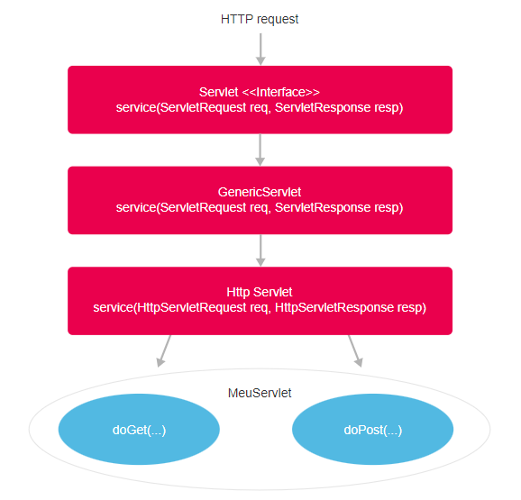

<h1>FASE 7 - INTEGRATION</h1>
<h2>Capítulo 02: Mais dinamismo na interface com o usuário.</h2>

<h2>1. MAIS DINAMISMO NA INTERFACE COM O USUÁRIO.</h2>

## 1.1 Introdução: Servlets

- `Servlet` é o componente da plataforma Java Web que será responsável por fazer o “meio de campo” entre a página (interface do usuário) e o modelo de negócio (model).
- são classes Java que realizam o direcionamento de requisições HTTP feitas por clientes, como os navegadores (Mozilla, Firefox, Chrome), eles são responsáveis por receber os dados para serem processados e devolver uma resposta a esses clientes.Essas classes são instaladas em um Servlet Container ou WebContainer (Servidor), o que permite à servlet tratar as requisições.

## 1.2 Requisição e resposta

- para promover a interação entre os diversos componentes envolvidos na programação Web dinâmica, a servlet deve receber uma requisição e devolver uma resposta ao cliente.
- uma servlet tem a função de recuperar as informações enviadas pelo usuário (por meio de uma requisição) e passar essas informações para outros componentes da aplicação para que sejam processadas. Depois, esses componentes devem retornar algum valor para que a servlet possa enviar uma resposta para o usuário.

## 1.3 Requisição a uma Servlet

- cada requisição a uma servlet é executada em uma thread.
- o objeto servlet é único na aplicação.
- a servlet é acessada por vários clientes simultaneamente, o que é possível pelo fato de terem sido criados threads (linhas de execução paralelas) para cada um dos clientes.

## 1.4 Ciclo de vida de uma servlet

- as servlets são instanciadas pelo container, na primeira vez que são acessadas.
- após iniciadas, as servlets podem atender a requisições.
- o container decide a hora de destruir as servlets(chamando o método destroy()).

### Como transformar uma classe em servlet?

- herdar a classe HttpServlet: essa herança transforma a classe Java em servlet, e está pronta para atender às requisições dos clientes. 
- para isso, a classe deve sobrescrever os métodos doGet e/ou doPost, dependendo do tipo de requisição que será tratada.
- exemplo:

~~~java
public class MeuServlet extends HttpServlet {
  
  public void init(ServletConfig config) throws ServletException {
  }

  public void destroy() {
  }
  
  protected void doGet(HttpServletRequest request,
   HttpServletResponse response) throws ServletException, IOException {
  }
  
  public void doPost(HttpServletRequest request, HttpServletResponse
  response) throws ServletException, IOException {
  }

}
~~~

- neste exemplo, há dois métodos dentro da servlet: doGet e doPost, que representam métodos do protocolo HTTP, o GET e o POST, pois dependendo de como as informações serão submetidas a partir da página HTML, teremos que esperar essas informações em um desses métodos!

## 1.5 Sequência de eventos no HttpServlet

 

<em>Sequência de eventos em uma Servlet.</em>

### 1.5.1 Interface HttpServletRequest

- contém vários métodos para lidar com as solicitações do cliente. 
- sempre que uma servlet é invocada, o container Web passa os objetos que implementam a interface HTTPServletRequest para o método service() da servlet.
- a interface HTTPServletRequest:
  - representa a requisição feita pelo usuário.
  - possibilita obter dados enviados pelo browser, atributos, informações de endereço de IP, protocolo etc.
- possui alguns ***métodos importantes***:

1. `Enumeration getHeaderNames()`: obtém o nome de todos os atributos do header HTTP passados pelo browser; permite listar os nomes dos parâmetros que são enviados na requisição. Esses nomes serão utilizados para recuperar os valores dos atributos. Dessa forma, podemos saber o nome do browser do usuário e qual tipo de dado foi enviado. Exemplo:

~~~java
Enumeration<String> h = request.getHeaderNames();
while (h.hasMoreElements()) {
	System.out.println("Elemento :" + h.nextElement());
}

/****** Resultado ******
 * Saida:
 * Elemento :host
 * Elemento :user-agent
 * Elemento :accept
 * Elemento :accept-language
 * Elemento :accept-encoding
 * Elemento :dnt
 * Elemento :referer
 * Elemento :cookie
 * Elemento :connection
 * Elemento :content-type
 * Elemento :content-length
 */
~~~

2. `String getHeader(String)`: Obtém o valor de um atributo no header HTTP.

~~~java
System.out.println(request.getHeader("user-agent"));
~~~

- é possível recuperar qualquer atributo do cabeçalho HTTP. 
- os nomes dos atributos foram exibidos na saída da execução do método getHeaderNames(). 
- exemplo, obtendo o nome e versão do navegador que realizou a requisição:

~~~java
/*Saida:
 * Mozilla/5.0 (Windows NT 10.0; WOW64; rv:47.0) Gecko/20100101 
 * Firefox/47.0
~~~

3. `getAttribute(String) / setAttribute(String, Object)`: permite obter e armazenar objetos Java temporariamente na requisição. Esses métodos serão úteis no momento de passar informações da servlet para a página web.

~~~java
request.setAttribute("Attr1","1");
request.setAttribute("Attr2","2");
request.setAttribute("Attr3","3");
request.setAttribute("Attr4","4");
System.out.println("Atributo 1 :" + request.getAttribute("Attr1"));
System.out.println("Atributo 2 :" + request.getAttribute("Attr2"));
System.out.println("Atributo 3 :" + request.getAttribute("Attr3"));
System.out.println("Atributo 4 :" + request.getAttribute("Attr4"));
~~~

- após armazenar os valores na request como método setAttribute(), o código utiliza o método getAttribute() para recuperar os valores armazenados e exibe-os no console do eclipse. 
- resultado da execução:

~~~java
/*Saída:
 * Atributo 1 :1
 * Atributo 2 :2
 * Atributo 3 :3
 * Atributo 4 :4
 */
~~~

4. `Enumeration getAttributeNames()`: obtém todos os nomes dos atributos armazenados na requisição.

~~~java
Enumeration<String> atrib = request.getAttributeNames();
while (atrib.hasMoreElements()) {
	System.out.println("Elemento :" + atrib.nextElement());
}
~~~

- esse exemplo recupera todos os nomes de atributos armazenados no request e imprime no console. Resultado:

~~~java
/* Saida:
 * Elemento :Attr1
 * Elemento :Attr2
 * Elemento :Attr3
 * Elemento :Attr4
 */
~~~

5. `Cookie[] getCookies()`: obtém os cookies enviados pelo browser (são informações que o browser do usuário pode armazenar por um período maior de tempo, muito útil para identificar o usuário e suas preferências).
- dois exemplos comuns para o uso de cookie: armazenamento de credencias de acesso que são recuperados a cada acesso ao site e para guardar algumas preferências de buscas de produtos nos mecanismos de busca.

~~~java
Cookie[] cookie = request.getCookies();
for(Cookie c : cookie) {
  System.out.println("Nome do Cookie :" + c.getName());
  System.out.println("Nome do Cookie :" + c.getValue());
}
~~~

6. `HttpSession getSession()`: obtém a seção do usuário. Esse objeto pode armazenar informações do usuário por um período maior de tempo na aplicação Java. A seção é um recurso muito comum para armazenar itens de um carrinho de compra em um portal de venda de produtos!

~~~java
HttpSession sessao = request.getSession();
~~~

7. `String getParameter(String)`: obtém informações submetidas de um formulário ou link HTML.
  - esse método é o principal na relação entre as páginas HTML/JSP e as servlets, pois é por meio dele que recuperamos os valores de formulários, por exemplo.

~~~java
String nome = request.getParameter("nome");
~~~

--- 

[Voltar ao início!](https://github.com/monicaquintal/fintech)