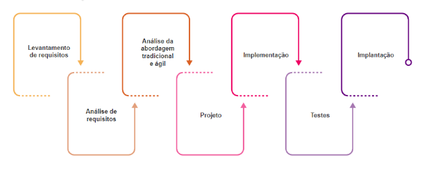
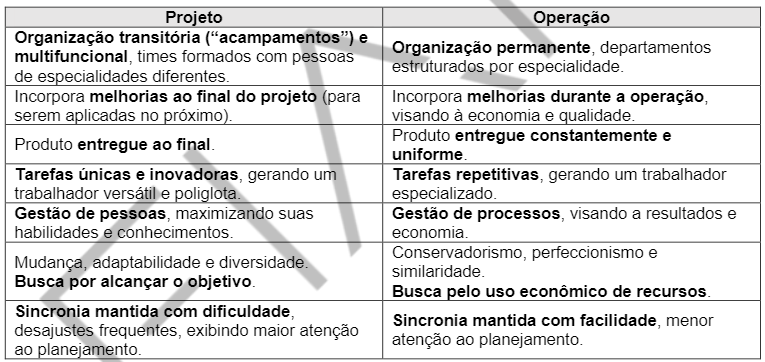

<h1>Startup Fintech</h1>
<h3>ANÁLISE E DESENVOLVIMENTO DE SISTEMAS</h3>

1°. ANO - 2023/1

FIAP

<a href="#fase01"><h2>📚 FASE 1 - DEVELOPMENT ENVIRONMENT (de 15/02 até 21/03)</h2></a>

<a href="#fase1cap01">Capítulo 01: Precisamos falar sobre finanças.</a> 
<a href="#fase1cap02">Capítulo 02: Mas como um Software é criado?</a> 
<a href="#fase1cap03">Capítulo 03: Por onde começamos?</a> 
<a href="#fase1cap04">Capítulo 04</a> 
<a href="#fase1cap05">Capítulo 05</a> 
<a href="#fase1cap06">Capítulo 06</a> 
<a href="#fase1cap07">Capítulo 07</a> 
<a href="#fase1cap08">Capítulo 08</a> 
<a href="#fase1cap09">Capítulo 09</a> 
<a href="#fase1cap10">Capítulo 10</a> 

<h2>FASE 1 - DEVELOPMENT ENVIRONMENT</h2>

<h2>Capítulo 1: Precisamos falar sobre finanças 💰</h2>

## Educação financeira:

### A) O que é?

Consiste no processo pelo qual consumidores/investidores financeiros aprimoram sua compreensão sobre produtos, conceitos e riscos financeiros. Não é só saber economizar, é também ter conhecimento e habilidades necessários para tomar decisões estratégicas sobre o uso do dinheiro, organizando os gastos e alocando de forma inteligente esses recursos.

### B) Por onde começar?

O ponto de partida é identificar ganhos, gastos e dívidas, para estruturar e melhorar a vida financeira. O primeiro passo é entender  quanto se ganha e quanto se gasta no mês, tanto as despesas fixas quanto as variáveis. Um estímulo para controlar gastos e aprendizados em Educação Financeira são as metas e objetivos; e o planejamento deve ser algo dinâmico, que se altera juntamente com as fases de sua vida!

### C) Desafio do ano:

Fazer parte de um projeto para desenvolver um sistema que ajude o usuário a controlar suas fontes de receita, gastos, dívidas e investimentos. Além de planejar metas e o caminho para atingir os objetivos financeiros, possibilitando ao usuário melhorar seu conforto e sua qualidade de vida!

## Apresentando o Projeto:

### A) A empresa: ***Startup Fintech***

> O que é uma `startup`? É um grupo de pessoas que trabalha para desenvolver uma ideia diferenciada de grande valor, “batalhando”, entre outras coisas, para provar sua viabilidade. Empresas nesse modelo devem ser enxutas, realizar tomada de decisões com rapidez e trabalhar com custos reduzidos.!

### B) Objetivo:

Desevolvimento de uma solução que ajude o usuário a controlar suas fontes de receita, gastos, dívidas e investimentos. Além de planejar metas e o caminho para atingir os objetivos financeiros, possibilitando ao usuário melhorar seu conforto e sua qualidade de vida. 

`Objetivo` da primeira versão começa com um sistema web que registrará as informações básicas do usuário. O sistema web terá layout responsivo e a sua interface desenvolvida, necessariamente, utilizando tecnologias como ***HTML, CSS, JavaScript e ReactJS*** (Bootstrap também é obrigatório). O sistema deverá ser testado e funcionar adequadamente nas versões atualizadas dos navegadores web Google Chrome, Mozilla Firefox e Microsoft Edge.

Para dar suporte à interface web desenvolvida, será preciso construir uma API (Web Service) utilizando a linguagem Java e alguns Frameworks para armazenar as informações em um banco de dados relacional Oracle e disponibilizá-las como um serviço web. Permitindo,assim, que a aplicação web ou qualquer outra aplicação (como mobile, que será vista no segundo ano) consiga interagir com as regras de negócio da aplicação e o modelo de dados. 

### C) O que faremos?

- montar uma infraestrutura de desenvolvimento  adequada;
- compreender necessidades, levantar requisitos de sistema e documentá-los;
- desenhar as interfaces do sistema;
- modelar o banco de dados (necessário  para  armazenar  tais  informações);
- programar a solução;
- realizar os testes necessários;
- tudo administrado com as melhores práticas de Gestão de Projetos!

### D) Etapas:

Fase | Duração | Conteúdo
:-----:|:---------:|----------
Primeira fase | Aprox. 30 dias | Formalizar projeto e escopo, com Gestão  Ágil  de  Projetos (como Framework  Scrum). Preparação da infraestrutura para o desenvolvimento, e Lógica de Programação com linguagem Python.
Segunda fase | Aprox. 30 dias | Continuar a formalização do projeto por meio de artefatos (como documentação de casos de uso e construção dos primeiros algoritmos). Calcular tempo e custo do projeto e montar cronograma (Kanban). O protótipo do Fintech deverá ser idealizado, e desenhar as telas da solução.
Terceira fase | Aprox. 30 dias | Algoritmos, modelagem e documentação do banco de dados relacional.
Quarta fase | Aprox. 30 dias | Desenvolver a camada view da aplicação com tecnologias web.
Quinta fase | Aprox. 40 dias | A documentação de projeto avançará com a parte de comunicação; programação orientada a objetos, diagrama de classes e camada model da aplicação utilizando a linguagem Java.
Sexta fase | Aprox. 30 dias | Desenvolvimento da camada model, mais próximo ao banco de dados (Oracle), com construção e manipulação dos dados.
Sétima fase | ? | Integração da solução, unindo camadas view e model e tornando a solução funcional; testes de software deverão ser realizados e o projeto chegará à sua conclusão.

**Importante:** ao longo das etapas, também será desenvolvido um chatbot.

<h2>Capítulo 2: Mas como um Software é criado?</h2>

## Conceitos 💡:

1. `Software` é um subsistema de um sistema computacional. São os programas de computadores. Muitos entendem software como um programa de computador escrito numa linguagem específica, a fim de produzir a função e o desempenho esperados. É um conjunto composto de instruções de computador, estruturas de dados e documentos.

2. `Sistema` é um conjunto de informações e procedimentos que interagem entre si para que os objetivos sejam alcançados.

3. `Engenharia` é a arte das construções, com base no conhecimento científico e empírico. Arte adequada ao atendimento das  necessidades humanas”. Representa uma metodologia unida ao esforço para empreender resultados, e esses são provenientes de trabalhos focados em diversas áreas, nas quais se possui um amplo conhecimento, a fim de propor soluções às necessidades.

4. `Engenharia de software` envolve um conjunto de tarefas que se iniciam no momento que são registradas as necessidades das partes interessadas e terminam no momento que o software deixa de ser utilizado por seus usuários - é uma engenharia que se ocupa de todos os aspectos da produção de software.
Consiste num conjunto de métodos, ferramentas e procedimentos que têm por objetivo o desenvolvimento do software com qualidade, agregando valor ao seu empreendimento e atendendo às necessidades ou expectativas dos stakeholders. São aplicadas práticas existentes em algumas áreas da engenharia, como:
- Desenvolvimento de softwares com qualidade.
- Trabalho em equipe.
- Gerenciamento do processo de desenvolvimento.
- Custos e prazos admissíveis.

## Evolução do hardware e do software (contexto histórico):

1. Século XVII: calculadora que soma e subtrai, adicionadas operações de multiplicar e dividir à máquina.
2. Século XVIII: tear automatizado, no qual os cartões perfurados controlam o movimento da máquina.
3. 1834: Máquina Analítica, capaz de armazenar informações.
4. 1842: Ada Lovelace escreve instruções para a Máquina Analítica de Babbage, concebida para executar um conjunto de tarefas de cálculo.
5. 1847: George Boole sistematiza a lógica binária para armazenar informações.
6. 1849: balão austríaco, o mais antigo veículo aéreo não tripulado, antepassado dos drones!
7. 1890: primeiro computador mecânico.
8. 1924: International Business Machines Corporation (IBM), nos Estados Unidos.
9. 1938: primeiro computador elétrico usando a teoria binária.
10. 1943: primeira geração de computadores modernos, que utilizavam válvulas!
11. 1944: criação do Mark I, primeiro computador eletromecânico.
12. 1946: Electronic Numerical Integrator and Computer (Eniac), primeiro computador eletrônico, criado nos EUA.
13. 1947: criação do transistor, substituto da válvula, possibilitando a criação de máquinas mais rápidas!
14. 1957: primeiros modelos de computadores com transistor aparecem no mercado, e oferecem mais confiabilidade e velocidade que as válvulas!
15. 1958: é criado o chip, circuito integrado que permite a miniaturização dos equipamentos eletrônicos.
16. 1969: construção da Arpanet, rede de informação do Departamento de Defesa norte-americano que interliga universidades e empresas.**Mais tarde, a Arpanet dará origem à internet!**
17. 1974: a Intel projeta o **microprocessador 8080**, que origina os microcomputadores. Assim, softwares e sistemas se tornaram tão  importantes quanto o hardware!
18. 1975: fundação da Microsoft pelos norte-americanos Bill Gates e Paul Allen!
19. 1976: Apple I, primeiro microcomputador comercial, é lançado por Steve Jobs e Steve Wozniak.
20. 1981: a IBM lança seu microcomputador, o PC, com o sistema operacional MS-DOS elaborado pela Microsoft. O exército da África do Sul utiliza os drones israelenses em combate contra a Angola.
21. 1983: a IBM lança o PC-XT, com disco rígido! Já a Apple lança o Macintosh, o primeiro computador a utilizar ícones e mouse.
22. 1985: a Microsoft lança o Windows para o PC, que só alcança êxito com a versão 3.0, em 1990.
23. 1990: os computadores portáteis (laptops e palmtops) se popularizam.
24. 1992: smartphone torna-se um aparelho prioritário para muita gente. A IBM lança um dos primeiros aparelhos, o Simon.
25. 1996: a inteligência artificial ganha destaque ao estudar métodos de simular o pensamento humano nos computadores.
26. Fim do século 20: Instituto de Tecnologia de Massachusetts (MIT) produz o COG, protótipo de robô cujo sistema nervoso artificial é 64 vezes mais potente do que um Macintosh e simula as fases de crescimento do homem, seus pensamentos e sentimentos.
27. 2000: outros recursos são incluídos nos navegadores graças à evolução da internet, possibilitando desenvolvimento de vários sistemas web que oferecem serviços inovadores e são acessados por meio da internet.
28. 2007: lançado o primeiro iPhone.
29. 2008: HTC lança o G1 com o sistema Android (não é vendido no Brasil). A Samsung foi a primeira a trazer para o Brasil um celular com Android, o Galaxy.
30. 2012: estudantes da Singularity University, do Vale do Silício, criam o protótipo do robô Matternet, capaz de transportar medicamentos e alimentos para regiões de difícil acesso.
31. 2013: Amazon anuncia o seu plano de utilizar drones para enviar mercadorias aos compradores com o objetivo de fazer as entregas apenas meia hora após a ordem de compra.
32. 2016: Fórum Econômico Mundial, em Davos, cujo tema é a 4ª Revolução Industrial. Discute-se a forma de produzir e/ou consumir a informação digital e como se preparar para a era digital.
33. 2019: Google chega à supremacia quântica, lançando um computador quântico capaz de realizar em apenas alguns minutos cálculos que antes levariam anos.

## Tipos de software:

### Classificação:

Podem ser classificados quanto a:

- uso: 
    - sistema (Windows, Mac OS, Linux): controlam as principais funções de um computador.
    - aplicativo (Word, Excel, calculadora).
    - serviço (Google Docs, PDF Convertar): disponibilizados via internet.
    - gestão (SAP, TOTVS).

- licença:
    - livre/aberto: permite acesso e alterações no código, de modo gratuito, com colaboração.
    - proprietário: uso restrito, acesso pago e detalhes pertencem ao fabricante.

### Detalhando:

- `Software de Sistema`: conjunto de instruções que transforma o hardware num sistema com o qual o usuário pode interagir e fazer funcionar os seus programas, como MAC, Linux e Windows.
- `Software de Aplicativo`: programas que permitem aos usuários executar determinadas tarefas. Exemplos: Word, Paint, Excel e calculadora.
- `Software como Serviço`: um modelo de compartilhamento de software, no qual é liberado apenas o acesso ao serviço oferecido, licenciado para uso por meio da internet; não é vendido nem instalado localmente. Exemplos: Google Docs e PDF Converter.
- `Software de Gestão`: auxilia na gestão empresarial; tem como objetivo otimizar a rotina da empresa,fornecendo uma informatização inteligente dos processos, como controle financeiro, compras e estoque. Exemplo: ERP.
- `Software Livre`: está disponível e é distribuído livremente; pode ser executado, adaptado, modificado e redistribuído de acordo  com a necessidade de cada usuário. Ao redistribuir a nova versão, pode ser gratuito ou não.
- `Software Aberto`: código é acessível a qualquer pessoa; pode ser executado, modificado, estudado e distribuído gratuitamente. Sua filosofia é voltada para a colaboração entre usuários.
- `Software Proprietário`: pertence a um fabricante, que detém seus direitos de uso, edição e redistribuição. O usuário deve pagar por uma licença e só pode utilizar o software em um contexto restrito. Exemplo: Office, Photoshop e Winzip.

### Crise do software:

Desde o primeiro computador até os dias de hoje, as técnicas para o desenvolvimento de software têm evoluído a fim de suprir as necessidades das partes interessadas. É essencial compreender o que o cliente quer e quais são suas necessidades, antes de começar a desenvolver.

As falhas VÃO acontecer durante o processo de desenvolvimento de softwre, e destacam-se entre elas:

- falha de comunicação: cliente e equipe dev precisam se comunicar para mapear corretamente os requisitos.
- falta de apoio: gerência precisa atender as demandas do projeto, para que a entrega final seja feita como previsto.
- baixa colaboração: responsabilidade e engajamento são fatores de sucesso.
- envolvimento superficial: stakeholders são fontes importantes de informações/decisões.
- inexperiência: de um gerente de projeto pode resultar em escolhas que comprometerão prazos, custos e qualidade.
- falta de qualificação: conhecimento e domínio são fundamentais.

Podemos citar também como possíveis causas da crise do software: 

- alteração nos requisitos; 
- mudanças nas legislações, normas ou processos aos quais a empresa esteja subordinada;  
- metodologia de desenvolvimento.  

Um `requisito` representa uma característica do sistema ou a descrição de algo que o sistema deve executar para satisfazer as necessidades das partes interessadas.

## Origem da engenharia de software:

Em 2001,o Kent Beck e dezesseis outros desenvolvedores, produtores e consumidores de software, conhecidos como Aliança Ágil, assinaram o `Manifesto para o Desenvolvimento Ágil de Software`,cujo objetivo era apontar novas direções na execução de projetos. A base para a elaboração desse manifesto considera que os requisitos não são estáveis durante todo o projeto, e as mudanças ocorrerão em qualquer cenário, por isso as execuções sequenciais das fases de um projeto não são tão previsíveis como gostaríamos que fossem.

4 fundamentos básicos:
- Indivíduos e interações, em vez de processos e ferramentas.
- Software funcionando, em vez de documentação abrangente.
- Colaboração do cliente, em vez de negociação de contratos.
- Resposta às modificações, em vez de seguir um plano.

>Foco no time, cliente fazendo parte do projeto, entregas durante o ciclo do projeto e mudanças são bem-vindas em qualquer momento do projeto!

## Áreas de conhecimento da Engenharia de Software:

1. Requisitos de software: o Analista de Requisitos faz o mapeamento das necessidades do cliente.
2. Engenharia de software: o Arquiteto de Soluções define uma arquitetura para o software (antes da etapa de desenvolvimento).
3. Construção de software: Analistas de UX/UI e desenvolvedores realizam a construção do produto chamado "Software".
4. Teste de software: Analistas de Testes (QAs) atuam com técnicas e ferramentas em busca de falhas e defeitos.
5. Manutenção de software: Analistas de Requisitos, Arquitetos, Analistas de UX/UI, Desenvolvedores e Analistas de Testes atuam em correções e melhorias no software já implantado.
6. Gerência de configuração e mudança: os mesmos profissionais acima trabalham na integridade dos itens de configuração do projeto (especificações, códigos, planos de testes, etc).
7. Gerência de Engenharia de software: Gerentes de Sistemas e de Projetos conduzem atividades de gerenciamento para garantir organização e disciplina nas etapas do projeto.
8. Processo de Engenharia de software: o Analista de Processos determina os processos que envolvem artefatos, pessoas e recursos para garantir as entregas.
9. Ferramentas e métodos de Engenharia de software: Analistas de Requisitos, Arquitetos, Analistas de UX/UI, Desenvolvedores, Analistas de Testes e Gerentes utilizam ferramentas para execução de tarefas, orientando-se pela ordem indicada nos métodos.
10. Qualidade de software: Analistas de Testes e Analistas de Qualidade realizam verificações e validações durante todas as etapas do projeto, garantindo qualidade dos processos e do software entregue.

### Elementos fundamentais:

Independentemente da área de conhecimento, a engenharia de softwaretem elementos fundamentais, tais como: métodos, ferramentas e processos:

- `processos`: representam as ações realizadas, ou seja, a aplicação de métodos e ferramentas para se obter um resultado específico, e definemba sequência de métodos executados e quais ferramentas serão disponibilizadas.
- `métodos`: maneiras de fazer, quais roteiros serão seguidos. Ex: atividades de planejamento, levantamento de requisitos, design,  definição da arquitetura de software, execução dos testes, entre outros.
- `ferramentas`: meio automatizado para a realização das tarefas; permitemque as atividades sejam executadas de forma mais eficiente e eficaz. Exemplo: softwarede modelagem de dados ou softwares para implementação do software.

### Importante:

> Todo software é construído com base em um modelo de processo, também conhecido como `ciclo de vida`, que compreende um conjunto de etapas que envolvem métodos, ferramentas e procedimentos para a obtenção do produto ou serviço de software desejado.

No manifesto ágil, considera-se que os requisitos não são estáveis durante todo o projeto, que as mudanças vão ocorrer em qualquer cenário e que as execuções sequenciais das fases de um projeto não são tão previsíveis como gostaríamos que fossem! A base detodos os frameworks ágeis é composta de: ***foco no time, cliente fazendo parte do projeto, entregas durante o ciclo do projeto e mudanças bem-vindas em qualquer momento do projeto***!

 
<em>Ciclo de vida do processo de desenvolvimento de software.</em>

## Teste de Proficiência:

1. O principal fator que contribui para o fracasso no desenvolvimento de software são erros na fase de identificação dos problemas, conhecida como análise de requisitos. Como o Manifesto Ágil se relaciona com esse fator?
> A base para elaboração do Manifesto Ágil considera que os requisitos para desenvolvimento de software não são estáveis, corroborando estudos que indicam problemas nos requisitos como principal causa de fracassos.

2. Há vários tipos de software, desenvolvidos no contexto histórico da evolução do hardware e software. Indique a opção que contém exemplo de um software de sistema, um software como serviço e um software proprietário.
> Linux, Google Slides, Adobe Suite.

3. Softwares podem ser definidos como "programas de computador", escritos em uma linguagem específica a fim de produzir a função e desempenho esperados. O qe é engenharia de software?
> É um conjunto de métodos, ferramentas e procedimentos para desenvolvimento de software com objetivo de atender expectativas e necessidades dos stakeholders e entregar com qualidade.

<h2>Capítulo 3: Por onde começamos?</h2>

## O que é um Projeto?

### Definição:

- É um empreendimento temporário com objetivo de criar um produto ou serviço exclusivo.

- É uma sequência de atividades únicas, complexas e conectadas entre si, com meta ou propósito conhecido que deverá ser completado em um tempo específico, dentro de um orçamento estabelecido e em conformidade com as especificações.

### Características:

- **Duração limitada**: deve ter começo, meio e fim definidos; seu meio pode sofrer mudanças e seu fim é previsto, e, como toda previsão, talvez não se torne realidade!

- **Exclusivo**: produto final deve ser diferente de similares.

- **Progressivamente elaborado**: “proceder por etapas” (incrementado ao longo do tempo).

- **Propósito e objetivos bem definidos**: deve ter  uma meta (produzir um produto/serviço exclusivo),   mas deve ter metas intermediárias ou pode ter objetivos secundários.

- **Interdependentes**: projetos interagem uns com os  outros, podendo ser uma parte de um projeto maior. Em outros casos, o produto terá um ciclo de vida em uma  linha de montagem, gerando diversas unidades, ou seja, o projeto acaba e se torna operação.

- **Conflito**: geralmente compartilham com outras áreas (operacionais) ou outros projetos, recursos (pessoas ou equipamentos) que nem sempre estarão  disponíveis no momento necessário. Além disso, o bem  mais precioso dos projetos são as pessoas, que têm defeitos, limitações e egos diferentes.

- **Sequência de atividades**: um número de atividades ou tarefas conectadas que devem ser completadas em certa ordem e que, ao final, atingem algum objetivo.

### Projetos versus operações:

Enquanto projetos criam um negócio, o objetivo das operações é mantê-lo funcionando da melhor forma possível!

O projeto gera um primeiro exemplar de um produto, geralmente chamado de protótipo, enquanto a operação gera o segundo exemplar em diante, ou seja, uma linha de montagem, tornando-os interdependentes.

 
<em>Diferenças entre projeto e operação.</em>

## Conceitos importantes:

### A) Partes interessadas (Stakeholders):

Partes interessadas são todas as pessoas afetadas pelo projeto, de forma positiva ou negativa (patrocinadores, proprietários, financiadores, governo, vizinhos, clientes, funcionários, fornecedores, incorporadores, gerentes, terceiros,entre outros).

### B) Gerenciamento de projetos:

Para que os projetos terminem no prazo estabelecido, de acordo com gastos previstos e contendo tudo que foi acertado, precisam ser  bem gerenciados; precisam de um bom planejamento e de uma execução bem controlada.

A `gerência de projetos` é constituída de uma série de ferramentas e técnicas utilizadas para descrever, organizar e monitorar o andamento das atividades do projeto. Seus benefícios incluem:

- Propósito bem definido e especificado.
- Escopo delineado com clareza.
- Controle independente, protegendo-o de flutuações operacionais.
- Medições mais fáceis.
- Alocações de recursos humanos mais flexíveis.
- Promove motivação e moral da equipe.
- Favorece a capacitação profissional dos recursos humanos.
- Facilita a discrição e a segurança (quando o projeto as requer).
- Mobilidade – projetos podem ser executados fora do ambiente da empresa.

## Gerente de projetos:

### Quem é?

Sua especialidade é a ***resolução de problemas***, viabilizando o projeto. Embora possa ter habilidades técnicas, não é um pré-requisito: ele contará com especialistas na equipe para quando a necessidade técnica surgir.

### Habilidades necessárias a um gerente de projetos:

- **Liderança**: enquanto gerentes buscam resultados e viabilização do projeto de acordo com as exigências, o líder expressa sua visão, busca o consenso quanto às metas estratégicas, direciona, inspira e motiva sua equipe.

- **Comunicação**: as formas oral e escrita de comunicação constituem o alicerce para um projeto bem-sucedido. Também deve assegurar  que as informações sejam explícitas, claras e completas em todas as atividades de comunicação do projeto.

- **Elaboração de orçamentos**: deve possuir conhecimentos básicos de finanças e contabilidade, pois precisa estabelecer (realizando estimativas de custos) e controlar o orçamento.

- **Planejamento**: importante para que o projeto saia no prazo, dentro do orçamento e de acordo com as especificações, deve-se  estabelecer como serão as atividades, e é essencial definir quem fará o que e quando!

- **Aptidões organizacionais**: manter a organização e fazer um bom gerenciamento de tempo.

- **Negociação e influência**: são necessárias competências de negociação para definição do escopo, orçamentos, alocação de negócios  compartilhados etc. É necessário conhecer muito bemas estruturas formais e informais de todas as organizações relacionadas ao projeto. Poder e política são técnicas usadas na influência.

- **Resolução de conflitos**: identificar sintomas de problemas, identificá-los e, quando necessário, tomar decisões e implementar soluções.

- **Formação e motivação de equipes**: o gerente de projeto define o espírito da equipe e a ajudará em tarefas da sua formação,  tornando-a funcional, além de ser reponsável pela motivação.

## Ativos de processos organizacionais:

Qualquer conhecimento, prática ou artefato de todas as organizações envolvidas que possam ser úteis para executar ou administrar o projeto (planos, processos, políticas, procedimentos e quaisquer bases de conhecimento).

### Categorias:

a) Processos e procedimentos:

- Padrões, políticas (de segurança, por exemplo), ciclos de vida padrão para os produtos ou projetos e políticas e procedimentos de qualidade, como auditorias de processos, listas de verificação, metas, entre outros.
- Diretrizes  padronizadas e critérios de medição de desempenho e de avaliação de propostas.
- Modelos, como de risco, EAP/WBS e diagrama de redes para cronogramas.
- Procedimentos de controles financeiros: relatórios de horas, análises de gastos, entre outros.
- Procedimentos de controle de mudanças de projeto.
- Diretrizes de encerramento de projeto: auditorias finais do projeto, avaliações, validações e critérios de aceitação de produto.

b) Base de conhecimento:

- Arquivos de projetos anteriores: linhas de base para escopo, custo, cronograma e qualidade, cronogramas de projeto e registro de riscos com suas ações de respostas planejadas.
- Bancos de dados de gerenciamento de configuração contendo as linhas de base de todos os padrões, políticas e procedimentos necessários para oficializar um projeto na empresa.
- Bases de conhecimento de informações históricas e lições aprendidas: bancos de dados de medição de processos que podem ser usados  para coletar e disponibilizar dados de medição de processos e produtos.
- Bancos de dados financeiros contendo informações, como: custos homem/hora, custos incorridos, orçamentos e outros dados financeiros.

## Fatores ambientais da empresa:

Condições pertinentes à empresa que influenciam ou restringem o projeto de alguma maneira. Alteram as opções de gerenciamento, influenciando de maneira positiva ou negativa, como:
- Cultura, estrutura e governança organizacional.
- Distribuições geográficas e infraestrutura das instalações da empresa.
- Normas governamentais ou do setor em questão.
- Recursos humanos existentes, com suas habilidades e conhecimentos.
- Administração de pessoal.
- Condições de mercado.
- Sistemas de autorização de trabalho da empresa.
- Clima político.
- Tolerância a risco das partes interessadas.
- Canais de comunicação estabelecidos.
- Bancos de dados comerciais que podem ser usados para estimativa de custos ou estudo de riscos.
- Sistema de informações do gerenciamento de projetos: software para cronograma, sistema de gerenciamento de configuração, coleta e distribuição de informações, como uma intranet etc.

## Processos de gerenciamento de projetos:

`Processo`: conjunto de atividades que, cumpridas na ordem apropriada, atingem um objetivo predefinido. Um projeto tem entradas (artefatos necessários à sua execução), técnicas e ferramentas que são aplicadas na execução e, como resultado, temos como saída os artefato(s) que era(m)o(s) seu(s) respectivo(s) objetivo(s)!

### Classificação:

- Processos de gerenciamento de projetos: focados em gerenciamento, utilizados para conduzir o projeto da maneira eficaz. Será o estudado em aula, pois são **considerados “boa prática”** (a aplicação desses processos pode aumentar as chances de sucesso de um projeto).
- Processos orientados a produtos: definidos pelo ciclo de vida do projeto, variando de acordo com a área de aplicação.

### Grupos de processos de gerenciamento de projeto:

Os processos de gerenciamento de projetos são agrupados em cinco categorias:

- Grupos de processos de iniciação: devem ser executados na definição de um novo projeto.
- Grupos de processos de planejamento: processos necessários para definir o escopo do projeto, refinar os projetos e determinar as ações necessárias para atingir as metas.
- Grupos de processos de execução: necessários para executar o trabalho definido e satisfazer as especificações do projeto.
- Grupos de processos de monitoramento e controle: exigidos para acompanhar e controlar o progresso e o desempenho do projeto.
- Grupos de processos de encerramento: necessários para finalizar o projeto ou fase de projeto.

Raramente são distintos ou ocorrem uma única vez: tratam-se de atividades sobrepostas e podem ocorrer ao longo de todo o projeto.

Há, ainda, um `ciclo  PDCA` definido para o gerenciamento de projetos, que compreende os atos de Planejar (Plan), Fazer (Do), Verificar (Check) e Agir (Act), repetindo diversas vezes durante a execução, dependendo do ciclo de vida. O grupo de processos de monitoramento e controle permeia os projetos do início ao fim.

## Conceitos Ágeis Modernos:

Há quatro `princípios básicos`:

1. Torne as pessoas sensacionais: inclua as pessoas que usam, produzem, compram, vendem e financiam os produtos e serviços.
2. Faça da segurança um pré-requisito: preze a construção de um produto seguro (proteção do tempo, informações, saúde, reputação, relacionamentos e investimentos das pessoas.
3. Erre rápido e aprenda rápido: aprender com o erro e não tornar a repeti-lo. 
4. Entregue valor a todo instante: entregas parciais são um dos pilares da agilidade, e o produto deve ter valor para o cliente.

A `gestão ágil de projetos` surgiu com a criação dos processos ágeis de desenvolvimento de software. O principal ***objetivo*** é permitir o controle das atividades de construção que utilizam técnicas ágeis para gerar informações gerenciais sobre o andamento e a evolução do projeto!

Processos ágeis possuem ***três características principais***:
- Requisitos de um projeto ágil são instáveis por natureza. São incluídos e excluídos requisitos à medida que o projeto evolui,  adequando-o às necessidades imediatas.
- Há uma interposição das fases de projeto e de implementação fazendo com que a arquitetura e os requisitos técnicos sejam tratados à medida que são criados.
- As fases de desenvolvimento do projeto não são sequenciais como de costume - ocorrem de acordo com as condições do projeto!

***Duas técnicas se destacam para gestão de projetos ágeis***: definição da estratégia e a construção incremental do software,  contendo  as  funcionalidades e construídas com a qualidade esperada e o feedback constante do cliente em todas as etapas, proporcionando agilidade na resolução de pendências e na avaliação dos requisitos.

No mercado, destacam-se dois métodos de gestão de projetos ágeis: ***método Extreme Project Management (XPM)*** e ***SCRUM***, processo da indústria automobilística adaptado à construção de software.

## Gestão de projetos com SCRUM:

### O que é SCRUM?

- É um dos frameworks mais utilizados para projetos ágeis.
- Faz uso de um processo incremental e iterativo que produz partes do projeto de forma constante, contendo funções definidas e priorizadas pelo cliente, que faz o aceite de cada entrega produzida em períodos de 1 a 4 semanas (o padrão mais comum de mercado é 2 semanas).
- Fundamentado nas questões ágeis do cliente como parte da equipe, incrementos em período de tempo fixo e aberto às solicitações de mudanças, sendo adaptativo em relação ao ambiente e colaborativo com as partes interessadas.

### Valores:

Está fundamentado em cinco valores:
- Compromisso (em apoiar uns aos outros e buscar atingir os objetivos).
- Foco (em fazer o melhor possível para atingir as metas).
- Abertura (para falar e ouvir membros do time e stakeholders).
- Respeito (entre pessoas, reconhecendo que cada membro do time é capaz e independente).
- Coragem (para fazer a coisa certa e trabalhar em problemas difíceis).

### Papéis:

- `Scrum Master (SM)`: líder do processo de gerenciamento de projetos, apoiando tanto gerentes de projeto quanto membros do time de desenvolvimento e áreas de desenvolvimento de produto. Pode incluir também a gestão de projetos e do time, porém este nem sempre é o caso. Suas funções básicas são: proteger relacionamento com o cliente, resolver problemas que ocorrem durante o projeto, manter a equipe focada na execução do sprint e garantir o uso correto das regras SCRUM.

página 23